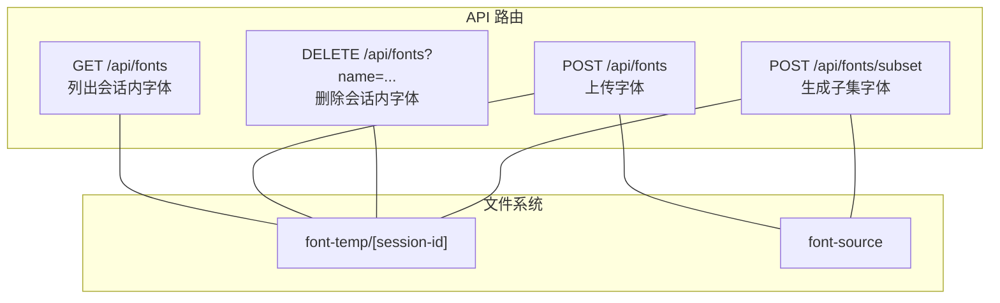
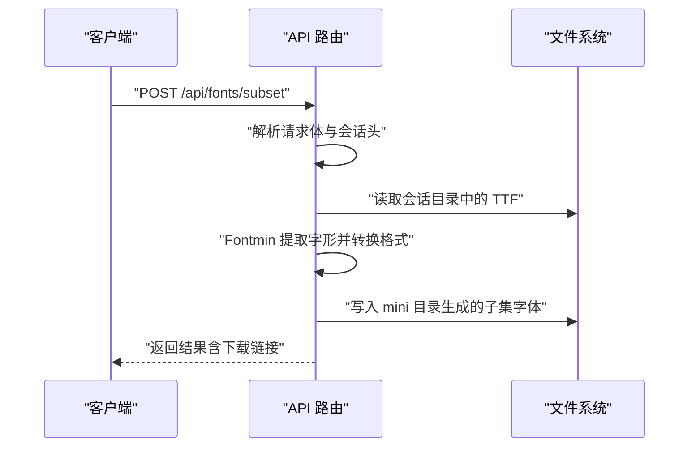
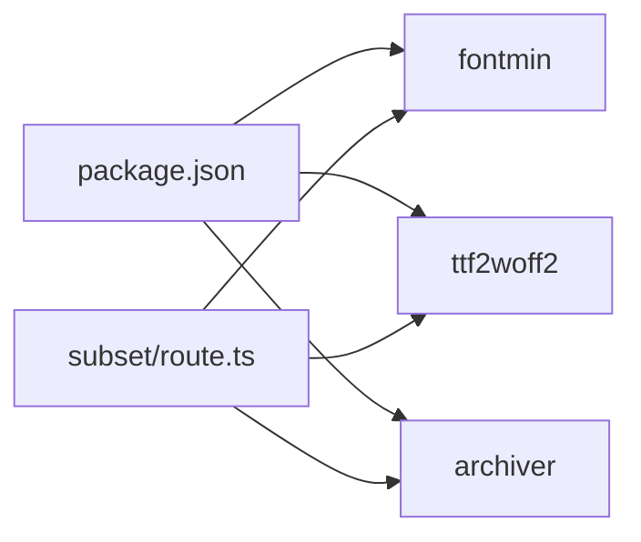

# API接口参考

<cite>
**本文引用的文件**
- [app/api/fonts/route.ts](file://app/api/fonts/route.ts)
- [app/api/fonts/subset/route.ts](file://app/api/fonts/subset/route.ts)
- [test-api.js](file://test-api.js)
- [package.json](file://package.json)
- [README.md](file://README.md)
</cite>

## 目录
1. [简介](#简介)
2. [项目结构](#项目结构)
3. [核心组件](#核心组件)
4. [架构总览](#架构总览)
5. [详细组件分析](#详细组件分析)
6. [依赖分析](#依赖分析)
7. [性能考虑](#性能考虑)
8. [故障排查指南](#故障排查指南)
9. [结论](#结论)
10. [附录](#附录)

## 简介
本文件为 FontMin 字体子集化工具的完整 API 接口文档，覆盖所有 RESTful 端点的 HTTP 方法、URL 模式、请求参数、响应格式、认证机制、错误处理与状态码、版本控制与兼容性、客户端集成与最佳实践、设计原则与性能考量，以及第三方集成的开发指导与调试方法。

## 项目结构
- API 路由采用 Next.js App Router 的约定式路由，位于 app/api/fonts 下：
  - 通用字体管理接口：app/api/fonts/route.ts
  - 字体子集化处理接口：app/api/fonts/subset/route.ts
- 会话与文件存储：
  - 临时会话目录：font-temp/[session-id]（按会话隔离）
  - 永久备份目录：font-source（所有上传字体的备份）
- 客户端测试脚本：test-api.js（演示如何调用子集化接口）

**图表来源**
- [app/api/fonts/route.ts](file://app/api/fonts/route.ts#L36-L69)
- [app/api/fonts/route.ts](file://app/api/fonts/route.ts#L71-L127)
- [app/api/fonts/route.ts](file://app/api/fonts/route.ts#L129-L167)
- [app/api/fonts/subset/route.ts](file://app/api/fonts/subset/route.ts#L164-L365)

**章节来源**
- [README.md](file://README.md#L135-L160)
- [README.md](file://README.md#L179-L211)

## 核心组件
- 会话管理与目录隔离
  - 通过请求头 x-font-session-id 获取或生成会话标识，实现用户级隔离。
  - 临时会话目录：font-temp/[session-id]；永久备份目录：font-source。
- 字体上传与列表
  - 支持多文件上传，自动过滤并保存至会话目录与永久备份目录。
  - 列表接口返回当前会话内的可用字体清单及预览链接。
- 字体子集化
  - 仅支持 TTF 输入，基于 Fontmin 提取指定文字的字形集合，并可输出为 TTF、WOFF、WOFF2、EOT、SVG。
  - 支持批量生成与打包下载。
- 下载与预览
  - 通过动态路径 /api/fonts/preview/[filename] 与 /api/fonts/download/[filename] 提供预览与下载能力（具体实现文件存在，但本文聚焦已实现的端点与流程）。

**章节来源**
- [app/api/fonts/route.ts](file://app/api/fonts/route.ts#L16-L34)
- [app/api/fonts/route.ts](file://app/api/fonts/route.ts#L36-L69)
- [app/api/fonts/route.ts](file://app/api/fonts/route.ts#L71-L127)
- [app/api/fonts/route.ts](file://app/api/fonts/route.ts#L129-L167)
- [app/api/fonts/subset/route.ts](file://app/api/fonts/subset/route.ts#L11-L23)
- [app/api/fonts/subset/route.ts](file://app/api/fonts/subset/route.ts#L25-L29)
- [app/api/fonts/subset/route.ts](file://app/api/fonts/subset/route.ts#L164-L365)

## 架构总览
- 请求入口与会话
  - 客户端通过请求头 x-font-session-id 与服务端建立会话上下文。
  - 会话目录用于存放本次会话的字体与生成结果，避免跨用户污染。
- 处理链路
  - 上传：接收多文件，写入会话目录与永久备份目录。
  - 子集化：读取会话目录中的 TTF，使用 Fontmin 提取字形，按需转换格式并落盘 mini 目录。
  - 下载：通过预览/下载接口返回结果或打包下载。
- 错误与日志
  - 统一使用 JSON 响应体携带错误信息，状态码遵循 REST 语义。
  - 关键步骤打印日志，便于定位问题。

**图表来源**
- [app/api/fonts/subset/route.ts](file://app/api/fonts/subset/route.ts#L164-L365)

## 详细组件分析

### 通用字体管理接口
- GET /api/fonts
  - 功能：列出当前会话目录下的字体文件。
  - 请求头
    - x-font-session-id: 会话标识（必填）
  - 成功响应
    - 结构：包含 fonts 数组，每项包含 id、name、path。
    - 示例：参见“请求示例”与“响应示例”。
  - 错误
    - 500：内部错误，返回 { error }。
  - 日志：记录会话与发现的字体数量。
  
  **章节来源**
  - [app/api/fonts/route.ts](file://app/api/fonts/route.ts#L36-L69)

- POST /api/fonts
  - 功能：上传一个或多个字体文件。
  - 请求头
    - Content-Type: multipart/form-data
    - x-font-session-id: 会话标识（必填）
  - 请求体字段
    - fonts: File[]（必填，至少一个）
  - 成功响应
    - 结构：{ message, fonts[] }，fonts 每项包含 id、name、path。
    - 示例：参见“请求示例”与“响应示例”。
  - 错误
    - 400：未提供文件或请求体无效。
    - 500：内部错误，返回 { error }。
  - 行为
    - 会话目录与永久备份目录均写入相同文件名。
    - 文件名清洗：仅保留字母、数字、点、连字符、下划线与中文字符。
  
  **章节来源**
  - [app/api/fonts/route.ts](file://app/api/fonts/route.ts#L71-L127)

- DELETE /api/fonts
  - 功能：删除当前会话目录中的某个字体文件（不删除永久备份）。
  - 查询参数
    - name: 字体文件名（必填）
  - 请求头
    - x-font-session-id: 会话标识（必填）
  - 成功响应
    - 结构：{ message }
  - 错误
    - 400：缺少 name。
    - 500：内部错误，返回 { error }。
  
  **章节来源**
  - [app/api/fonts/route.ts](file://app/api/fonts/route.ts#L129-L167)

### 字体子集化接口
- POST /api/fonts/subset
  - 功能：对会话内的字体进行子集化处理，支持多种输出格式。
  - 请求头
    - Content-Type: application/json
    - x-font-session-id: 会话标识（必填）
  - 请求体字段
    - fontNames: string[]（必填，至少一个）
    - text: string（必填，将被去重后用于提取字形）
    - outputFormats: string[]（可选，默认 ["ttf"]，可选值：ttf、woff、woff2、eot、svg）
    - downloadAll: boolean（可选，默认 false，true 时返回打包下载链接）
  - 成功响应
    - 结构：{ message, results[], textLength?, skippedFonts?, warnings? }
    - results 每项包含：name、originalName、format、originalSize、minifiedSize、downloadUrl
    - 若 downloadAll=true 且存在多个文件：额外返回 zipDownload
  - 错误
    - 400：缺少字体、缺少文字、会话目录不存在、无有效输出。
    - 404：会话不存在或未上传字体。
    - 500：内部错误，返回 { error, details? }。
  - 行为
    - 仅处理 TTF 格式字体；非 TTF 将被跳过并记录在 skippedFonts。
    - 输出文件名规则：原名前缀 + "_Lite" + 原扩展名（如 .ttf）。
    - WOFF2 通过先生成 TTF 再转换为 WOFF2 的方式实现。
    - 去重：对 text 去重后再提取字形。
  
  **章节来源**
  - [app/api/fonts/subset/route.ts](file://app/api/fonts/subset/route.ts#L164-L365)

### 请求与响应示例

- 通用字体管理接口示例
  - GET /api/fonts
    - 请求头：x-font-session-id: "your-session-id"
    - 响应：包含 fonts 数组，每项含 id、name、path
  - POST /api/fonts
    - 请求头：x-font-session-id: "your-session-id"
    - 请求体：multipart/form-data，字段 fonts 为文件数组
    - 响应：{ message, fonts[] }
  - DELETE /api/fonts?name=xxx.ttf
    - 请求头：x-font-session-id: "your-session-id"
    - 响应：{ message }

- 字体子集化接口示例
  - POST /api/fonts/subset
    - 请求头：Content-Type: application/json, x-font-session-id: "your-session-id"
    - 请求体：
      - fontNames: ["MyFont.ttf"]
      - text: "测试文字Test"
      - outputFormats: ["ttf", "woff", "woff2"]
      - downloadAll: false
    - 响应：
      - { message, results[], textLength, skippedFonts?, warnings? }
      - 或当 downloadAll=true 时包含 zipDownload

- 客户端测试脚本
  - 参考 test-api.js 中的 POST /api/fonts/subset 调用方式与响应处理逻辑。

**章节来源**
- [test-api.js](file://test-api.js#L1-L36)

## 依赖分析
- 外部依赖
  - fontmin：字体子集化引擎（仅支持 TTF 输入）
  - ttf2woff2：TTF 转 WOFF2
  - archiver：ZIP 打包
- 项目版本与脚本
  - 项目版本：0.1.0（package.json）
  - 启动脚本：dev/start/build（package.json）

**图表来源**
- [package.json](file://package.json#L41-L65)
- [app/api/fonts/subset/route.ts](file://app/api/fonts/subset/route.ts#L5-L7)

**章节来源**
- [package.json](file://package.json#L1-L78)

## 性能考虑
- 字体处理
  - 仅支持 TTF 输入，确保处理链路稳定；WOFF2 通过 TTF 中转，避免复杂依赖。
  - 对 text 去重减少重复计算。
- I/O 与并发
  - 逐个处理 fontNames 与 outputFormats，避免高并发下的资源竞争。
  - 生成 zip 时使用流式写入，降低内存占用。
- 存储与清理
  - 临时会话目录与永久备份分离，便于清理与审计。
  - 建议定期清理 font-temp 中过期会话目录，避免磁盘膨胀。

[本节为通用性能建议，无需特定文件引用]

## 故障排查指南
- 常见错误与处理
  - 400 缺少必要参数：检查请求体字段与查询参数是否齐全。
  - 404 会话或字体不存在：确认 x-font-session-id 是否正确传递，以及会话目录是否存在。
  - 500 内部错误：查看服务端日志，关注 Fontmin 处理阶段的错误堆栈。
- 调试建议
  - 使用 test-api.js 模板发起请求，观察响应状态与内容类型。
  - 在服务端开启详细日志，定位具体处理步骤（如读取文件、转换格式、写入结果）。
- 数据一致性
  - 删除操作仅影响会话目录，永久备份不受影响；若需彻底清理，需手动删除备份。

**章节来源**
- [app/api/fonts/route.ts](file://app/api/fonts/route.ts#L84-L89)
- [app/api/fonts/route.ts](file://app/api/fonts/route.ts#L135-L140)
- [app/api/fonts/subset/route.ts](file://app/api/fonts/subset/route.ts#L195-L204)
- [app/api/fonts/subset/route.ts](file://app/api/fonts/subset/route.ts#L306-L310)
- [test-api.js](file://test-api.js#L1-L36)

## 结论
本 API 文档覆盖了 FontMin 工具的核心接口：通用字体管理与子集化处理。通过会话隔离与双存储策略，保障了数据隐私与可维护性。建议在生产环境中配合定期清理与监控，确保性能与稳定性。

[本节为总结，无需特定文件引用]

## 附录

### 认证与会话
- 会话标识：x-font-session-id（请求头）
- 会话隔离：每个会话拥有独立的临时目录，避免跨用户访问。
- 永久备份：所有上传的字体会同步保存至 font-source 目录。

**章节来源**
- [app/api/fonts/route.ts](file://app/api/fonts/route.ts#L16-L34)
- [README.md](file://README.md#L191-L211)

### 错误处理与状态码
- 400：请求参数缺失或无效
- 404：会话或资源不存在
- 500：内部处理异常
- 响应体统一为 JSON，包含 error 与可选 details 字段。

**章节来源**
- [app/api/fonts/route.ts](file://app/api/fonts/route.ts#L64-L68)
- [app/api/fonts/route.ts](file://app/api/fonts/route.ts#L136-L140)
- [app/api/fonts/route.ts](file://app/api/fonts/route.ts#L161-L165)
- [app/api/fonts/subset/route.ts](file://app/api/fonts/subset/route.ts#L196-L204)
- [app/api/fonts/subset/route.ts](file://app/api/fonts/subset/route.ts#L357-L363)

### API 版本控制与兼容性
- 版本号：0.1.0（package.json）
- 兼容性说明：当前 API 为 v0.1，暂未引入版本路径前缀；后续升级建议通过路径版本（如 /api/v1/...）保持向后兼容。

**章节来源**
- [package.json](file://package.json#L3-L3)

### 客户端集成与最佳实践
- 会话管理：每次请求携带一致的 x-font-session-id，避免跨会话数据污染。
- 并发控制：避免同时对同一字体执行多次子集化任务，建议串行或加锁。
- 批量处理：合理设置 outputFormats 与 downloadAll，平衡网络与存储开销。
- 压缩格式：优先选择 WOFF2 以获得最佳压缩比。

**章节来源**
- [app/api/fonts/subset/route.ts](file://app/api/fonts/subset/route.ts#L184-L186)
- [README.md](file://README.md#L95-L99)

### 设计原则与性能考量
- 单一职责：每个接口专注于特定功能（上传/删除/列表/子集化）。
- 会话隔离：通过目录与会话头实现强隔离。
- 失败可见：错误信息明确，便于前端展示与用户理解。
- 性能优先：TTF 作为中间格式，简化转换链路；流式写入 ZIP 降低内存峰值。

**章节来源**
- [app/api/fonts/subset/route.ts](file://app/api/fonts/subset/route.ts#L82-L116)
- [app/api/fonts/subset/route.ts](file://app/api/fonts/subset/route.ts#L318-L332)

### 第三方集成与调试
- 使用 test-api.js 作为模板，替换目标地址与会话标识即可快速验证。
- 如需批量集成，建议封装统一的 HTTP 客户端，集中处理会话头与错误重试。
- 生产部署建议：启用日志聚合与告警，监控子集化成功率与耗时。

**章节来源**
- [test-api.js](file://test-api.js#L1-L36)