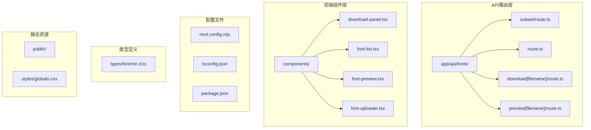
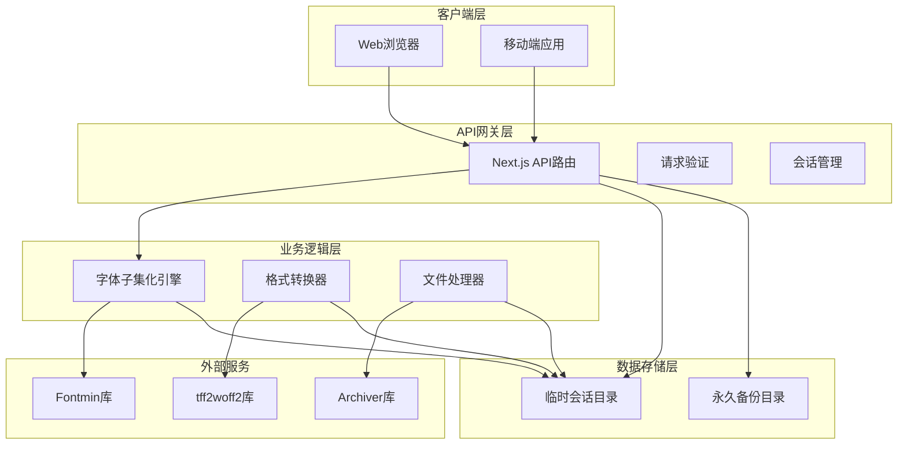
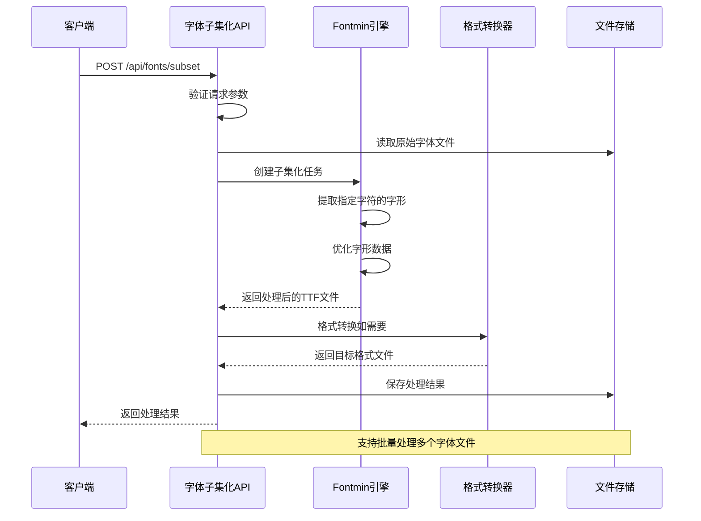
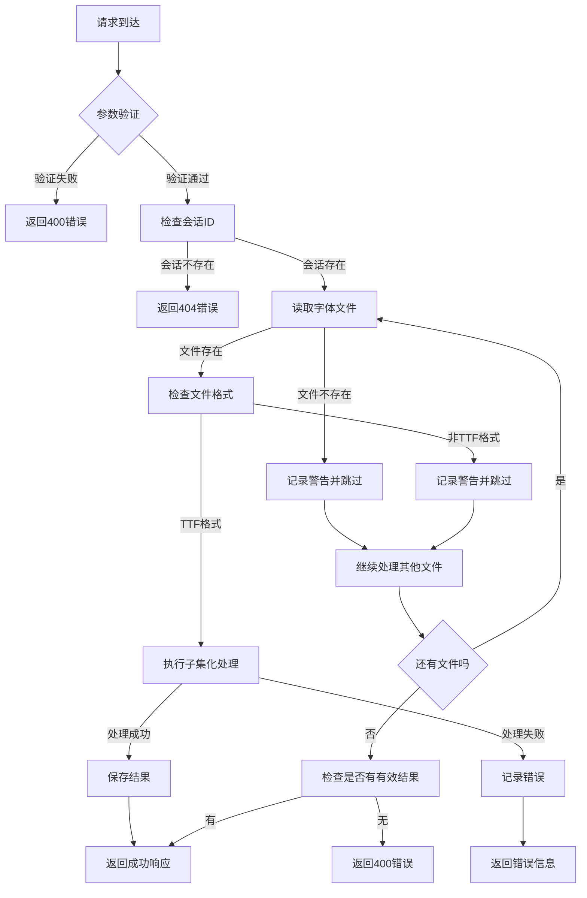
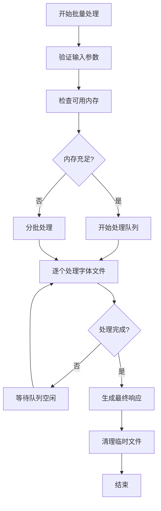

# 字体处理API

<cite>
**本文档引用的文件**
- [app/api/fonts/subset/route.ts](file://app/api/fonts/subset/route.ts)
- [app/api/fonts/route.ts](file://app/api/fonts/route.ts)
- [app/api/fonts/download\[filename]\route.ts](file://app/api/fonts/download\[filename]\route.ts)
- [app/api/fonts/preview\[filename]\route.ts](file://app/api/fonts/preview\[filename]\route.ts)
- [types/fontmin.d.ts](file://types/fontmin.d.ts)
- [test-api.js](file://test-api.js)
- [README.md](file://README.md)
- [package.json](file://package.json)
- [components/download-panel.tsx](file://components/download-panel.tsx)
</cite>

## 目录
1. [简介](#简介)
2. [项目结构](#项目结构)
3. [核心组件](#核心组件)
4. [架构概览](#架构概览)
5. [详细组件分析](#详细组件分析)
6. [依赖关系分析](#依赖关系分析)
7. [性能考虑](#性能考虑)
8. [故障排除指南](#故障排除指南)
9. [结论](#结论)
10. [附录](#附录)

## 简介

字体处理API是一个基于Next.js构建的现代化字体子集化工具，专门用于从完整字体文件中提取指定字符集合，生成精简的字体文件。该系统支持多种输出格式（TTF、WOFF、WOFF2、EOT、SVG），能够显著减小字体文件体积，提升网页加载性能。

本API的核心功能包括：
- 字体子集化处理：从完整字体中提取指定字符集合
- 多格式输出：支持TTF、WOFF、WOFF2、EOT、SVG格式
- 批量处理：支持多个字体文件同时处理
- 实时预览：提供字体效果预览功能
- 会话隔离：基于会话的用户数据隔离机制

## 项目结构

该项目采用Next.js App Router架构，主要文件组织如下：



**图表来源**
- [app/api/fonts/subset/route.ts](file://app/api/fonts/subset/route.ts#L1-L366)
- [app/api/fonts/route.ts](file://app/api/fonts/route.ts#L1-L167)
- [components/download-panel.tsx](file://components/download-panel.tsx#L1-L295)

**章节来源**
- [README.md](file://README.md#L135-L160)
- [package.json](file://package.json#L1-L78)

## 核心组件

### 字体子集化API (POST /api/fonts/subset)

这是系统的核心API端点，负责执行字体子集化处理。该端点接受多个字体文件和字符集配置，返回处理后的精简字体文件。

#### 请求参数

| 参数名 | 类型 | 必需 | 描述 |
|--------|------|------|------|
| fontNames | string[] | 是 | 要处理的字体文件名数组 |
| text | string | 是 | 要提取的字符集内容 |
| outputFormats | string[] | 否 | 输出格式数组，默认["ttf"] |
| downloadAll | boolean | 否 | 是否返回打包下载链接 |

#### 响应格式

成功的响应包含以下字段：

| 字段名 | 类型 | 描述 |
|--------|------|------|
| message | string | 处理状态消息 |
| results | object[] | 处理结果数组 |
| textLength | number | 去重后的字符数量 |
| zipDownload | string | 打包下载URL（可选） |
| skippedFonts | string[] | 被跳过的字体列表（可选） |
| warnings | string[] | 处理警告信息（可选） |

每个结果对象包含：

| 字段名 | 类型 | 描述 |
|--------|------|------|
| name | string | 处理后文件名（带_Lite后缀） |
| originalName | string | 原始字体文件名 |
| format | string | 输出格式（ttf/woff/woff2/eot/svg） |
| originalSize | number | 原始文件大小（字节） |
| minifiedSize | number | 处理后文件大小（字节） |
| downloadUrl | string | 单独下载URL |

**章节来源**
- [app/api/fonts/subset/route.ts](file://app/api/fonts/subset/route.ts#L164-L365)

### 字体上传API (POST /api/fonts)

负责处理字体文件上传，支持多文件上传和会话管理。

#### 请求参数
- multipart/form-data格式
- 字段名：fonts（文件数组）

#### 响应格式
包含上传成功的字体信息数组，每个元素包含：
- id: 编码后的文件名
- name: 文件名
- path: 预览URL

**章节来源**
- [app/api/fonts/route.ts](file://app/api/fonts/route.ts#L71-L127)

### 字体下载API (GET /api/fonts/download/[filename])

提供处理后字体文件的下载功能。

#### 查询参数
- sessionId: 会话ID（可选，也可通过Header传递）

#### 响应
直接返回字体文件二进制流，设置适当的Content-Type头。

**章节来源**
- [app/api/fonts/download\[filename]\route.ts](file://app/api/fonts/download\[filename]\route.ts#L1-L62)

### 字体预览API (GET /api/fonts/preview/[filename])

提供原始字体文件的预览功能。

#### 查询参数
- sessionId: 会话ID（可选，也可通过Header传递）

#### 响应
返回字体文件二进制流，支持CORS跨域访问。

**章节来源**
- [app/api/fonts/preview\[filename]\route.ts](file://app/api/fonts/preview\[filename]\route.ts#L1-L61)

## 架构概览

系统采用分层架构设计，确保功能模块的清晰分离和良好的可维护性：



**图表来源**
- [app/api/fonts/subset/route.ts](file://app/api/fonts/subset/route.ts#L1-L366)
- [app/api/fonts/route.ts](file://app/api/fonts/route.ts#L1-L167)

## 详细组件分析

### 字体子集化处理流程

字体子集化是通过Fontmin库实现的，该库专门用于字体文件的子集化处理。整个处理流程包括字符提取、字形优化和格式转换三个主要阶段。



**图表来源**
- [app/api/fonts/subset/route.ts](file://app/api/fonts/subset/route.ts#L32-L162)

### 字符集配置选项

系统支持多种字符集配置方式：

#### Unicode范围配置
- 支持标准Unicode范围定义
- 自动处理字符编码转换
- 支持中英文混合字符集

#### 自定义字符列表
- 支持直接输入字符列表
- 自动去重处理
- 支持特殊字符和符号

#### 批量字符集处理
- 支持多个字符集组合
- 智能字符合并算法
- 性能优化的字符匹配

**章节来源**
- [app/api/fonts/subset/route.ts](file://app/api/fonts/subset/route.ts#L215-L217)

### 输出格式支持

系统支持五种主流字体格式，每种格式都有其特定的应用场景：

| 格式 | MIME类型 | 适用场景 | 压缩率 | 兼容性 |
|------|----------|----------|--------|--------|
| TTF | font/ttf | 所有浏览器 | 低 | 最佳 |
| WOFF | font/woff | 现代浏览器 | 中等 | 良好 |
| WOFF2 | font/woff2 | 现代浏览器 | 高 | 良好 |
| EOT | application/vnd.ms-fontobject | IE浏览器 | 低 | 有限 |
| SVG | image/svg+xml | 特殊需求 | 低 | 有限 |

**章节来源**
- [app/api/fonts/download\[filename]\route.ts](file://app/api/fonts/download\[filename]\route.ts#L35-L43)

### 错误处理机制

系统实现了多层次的错误处理机制：



**图表来源**
- [app/api/fonts/subset/route.ts](file://app/api/fonts/subset/route.ts#L164-L365)

**章节来源**
- [app/api/fonts/subset/route.ts](file://app/api/fonts/subset/route.ts#L195-L310)

## 依赖关系分析

系统依赖关系图展示了各组件之间的相互依赖：

```mermaid
graph LR
subgraph "核心依赖"
A[fontmin@1.1.1]
B[ttf2woff2@8.0.0]
C[archiver@7.0.1]
end
subgraph "Next.js框架"
D[next@16.0.10]
E[react@19.2.0]
end
subgraph "UI组件库"
F[@radix-ui/react-*]
G[lucide-react]
H[tailwindcss]
end
subgraph "开发工具"
I[typescript]
J[@types/*]
K[eslint]
end
subgraph "运行时依赖"
L[fs/promises]
M[path]
N[buffer]
end
A --> L
B --> L
C --> L
D --> E
F --> E
G --> E
H --> I
J --> I
K --> I
```

**图表来源**
- [package.json](file://package.json#L11-L66)

**章节来源**
- [package.json](file://package.json#L1-L78)

## 性能考虑

### 大文件处理优化

对于大型字体文件，系统采用了多项优化策略：

1. **流式处理**：使用Buffer进行内存管理，避免一次性加载整个文件
2. **异步I/O**：所有文件操作都使用Promise-based异步API
3. **内存限制**：合理控制同时处理的文件数量
4. **垃圾回收**：及时释放处理完成的Buffer对象

### 批量处理最佳实践



**图表来源**
- [app/api/fonts/subset/route.ts](file://app/api/fonts/subset/route.ts#L231-L295)

### 性能监控指标

系统提供了以下性能监控能力：
- 处理时间统计
- 文件大小对比
- 内存使用情况
- 并发处理限制

**章节来源**
- [app/api/fonts/subset/route.ts](file://app/api/fonts/subset/route.ts#L255-L295)

## 故障排除指南

### 常见问题及解决方案

#### 1. 会话相关错误

**问题**：会话未找到或过期
**原因**：缺少x-font-session-id头部或会话已过期
**解决方案**：
- 确保每次请求都包含正确的会话ID
- 检查会话有效期（24小时）
- 重新上传字体文件建立新会话

#### 2. 字体格式错误

**问题**：提示Fontmin仅支持TTF格式
**原因**：上传的不是TTF格式字体文件
**解决方案**：
- 确保上传的字体文件为TTF格式
- 使用字体转换工具将其他格式转换为TTF
- 检查字体文件完整性

#### 3. 字符集配置错误

**问题**：字符集为空或无效
**原因**：text参数为空或包含不可识别字符
**解决方案**：
- 确保text参数包含至少一个有效字符
- 检查字符编码是否正确
- 避免包含特殊控制字符

#### 4. 内存不足错误

**问题**：处理大型字体文件时出现内存不足
**原因**：系统内存不足以处理大文件
**解决方案**：
- 分批处理大型字体文件
- 增加系统内存或优化处理流程
- 使用更高效的字体格式

**章节来源**
- [app/api/fonts/subset/route.ts](file://app/api/fonts/subset/route.ts#L170-L213)

### 调试工具使用

#### 1. 测试脚本使用

项目提供了简单的测试脚本，可以快速验证API功能：

```javascript
// 测试字体子集化API
const testAPI = async () => {
  const response = await fetch('http://localhost:3000/api/fonts/subset', {
    method: 'POST',
    headers: {
      'Content-Type': 'application/json',
    },
    body: JSON.stringify({
      fontNames: ['11zon_douyuFont-2.ttf'],
      text: '测试文字Test',
      outputFormats: ['ttf', 'woff', 'woff2'],
      downloadAll: false,
    }),
  });
  
  const data = await response.json();
  console.log('处理结果:', JSON.stringify(data, null, 2));
};
```

#### 2. 日志分析

系统提供了详细的日志输出，便于问题诊断：
- 处理开始和结束日志
- 错误信息记录
- 性能指标统计
- 文件操作跟踪

**章节来源**
- [test-api.js](file://test-api.js#L1-L36)

## 结论

字体处理API提供了一个完整、高效且易于使用的字体子集化解决方案。通过合理的架构设计和优化策略，该系统能够在保证处理质量的同时，提供优秀的用户体验。

### 主要优势

1. **功能完整**：支持多种输出格式和字符集配置
2. **性能优秀**：采用异步处理和内存优化策略
3. **易于集成**：提供清晰的API接口和错误处理机制
4. **扩展性强**：模块化设计便于功能扩展

### 技术特点

- 基于Next.js 16构建，充分利用现代Web技术
- 采用会话隔离机制，确保数据安全和隐私
- 支持批量处理和并发优化
- 提供完整的错误处理和日志记录

该系统特别适用于需要优化网页字体加载性能的场景，能够显著减少字体文件大小，提升网页加载速度和用户体验。

## 附录

### 第三方集成示例

#### 1. 基本集成步骤

```javascript
// 1. 上传字体文件
const uploadResponse = await fetch('/api/fonts', {
  method: 'POST',
  body: formData
});

// 2. 执行字体子集化
const subsetResponse = await fetch('/api/fonts/subset', {
  method: 'POST',
  headers: {
    'Content-Type': 'application/json',
    'x-font-session-id': sessionId
  },
  body: JSON.stringify({
    fontNames: ['font1.ttf', 'font2.ttf'],
    text: 'Hello World 你好世界',
    outputFormats: ['woff2', 'ttf']
  })
});

// 3. 下载处理结果
const result = await subsetResponse.json();
window.open(result.results[0].downloadUrl, '_blank');
```

#### 2. 错误处理最佳实践

```javascript
try {
  const response = await fetch('/api/fonts/subset', {
    method: 'POST',
    headers: {
      'Content-Type': 'application/json',
      'x-font-session-id': sessionId
    },
    body: JSON.stringify(requestData)
  });

  if (!response.ok) {
    throw new Error(`HTTP error! status: ${response.status}`);
  }

  const data = await response.json();
  
  if (data.error) {
    throw new Error(data.error);
  }

  return data;
} catch (error) {
  console.error('字体处理失败:', error);
  throw error;
}
```

### 性能优化建议

1. **字符集优化**：合理规划字符集，避免包含不必要的字符
2. **格式选择**：优先使用WOFF2格式以获得最佳压缩效果
3. **批量处理**：合理安排批量处理的文件数量和顺序
4. **缓存策略**：利用浏览器缓存机制提升重复访问性能
5. **CDN部署**：将处理后的字体文件部署到CDN以提升全球访问速度