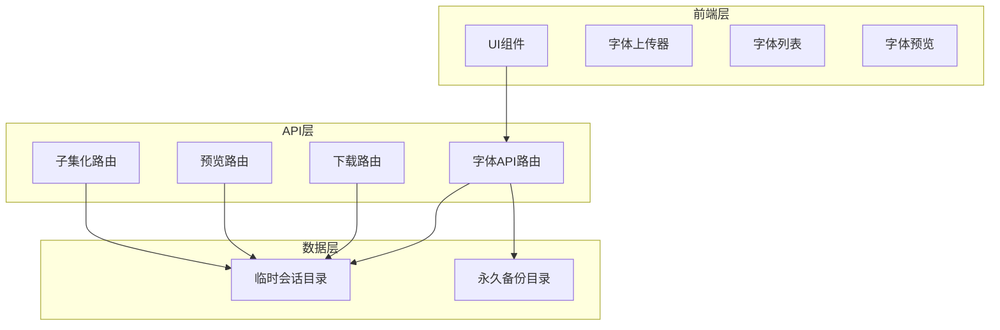
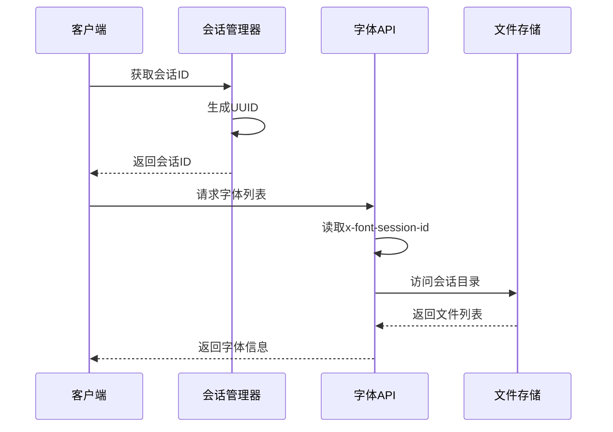
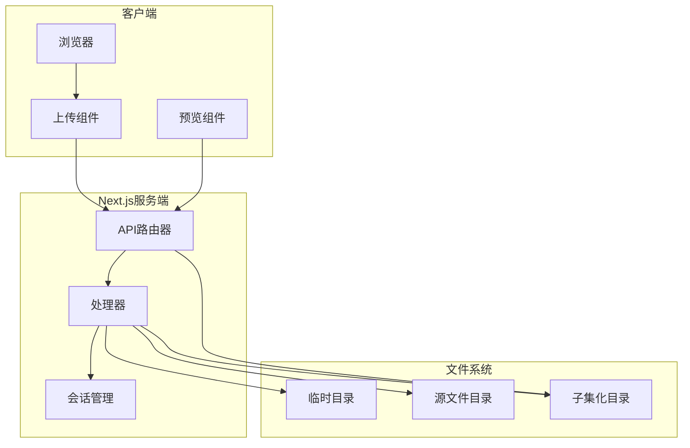
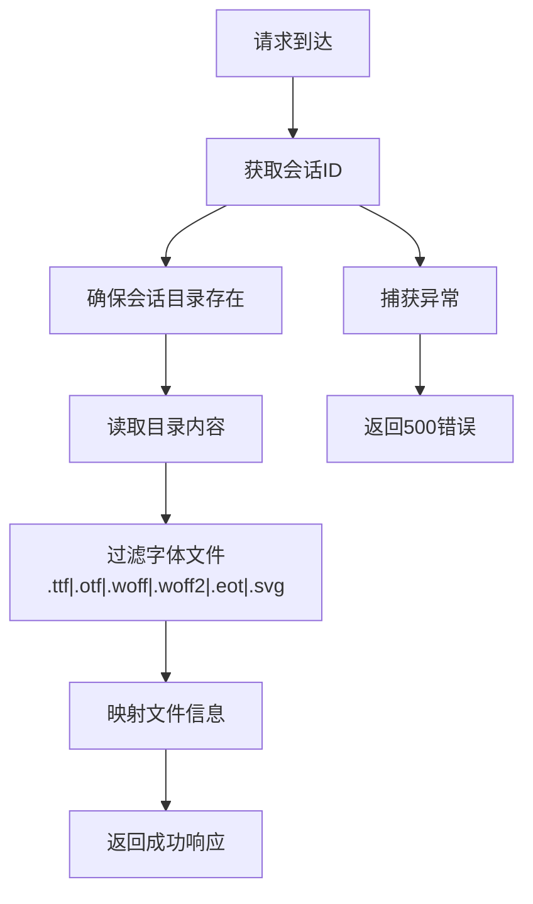
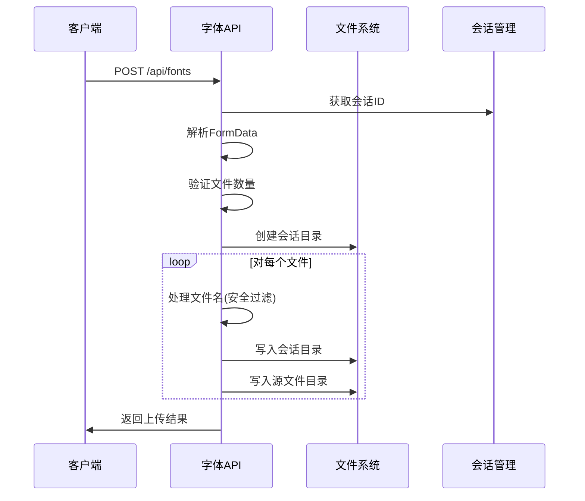
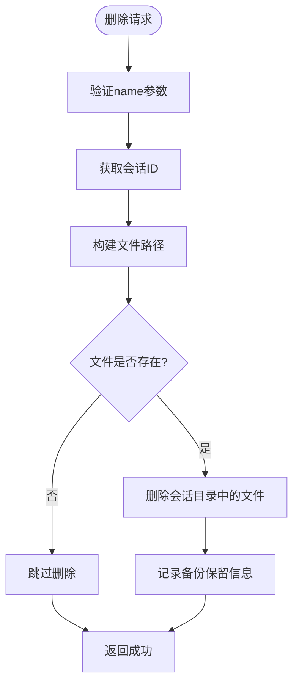
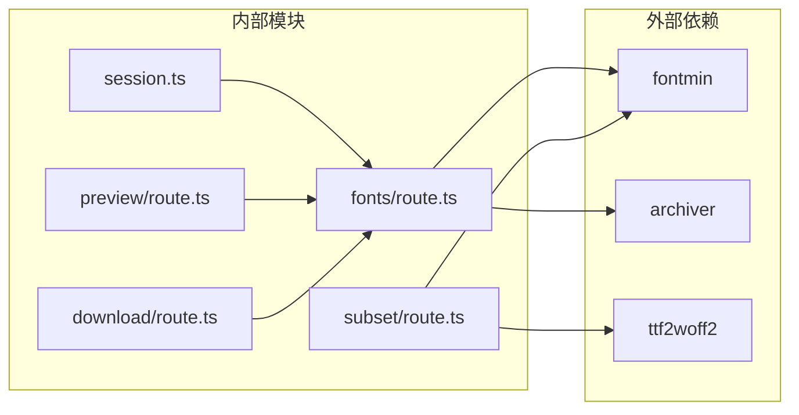

# 字体管理API

<cite>
**本文档引用的文件**
- [app/api/fonts/route.ts](file://app/api/fonts/route.ts)
- [lib/session.ts](file://lib/session.ts)
- [components/font-uploader.tsx](file://components/font-uploader.tsx)
- [components/font-list.tsx](file://components/font-list.tsx)
- [app/api/fonts/download[filename]/route.ts](file://app/api/fonts/download[filename]/route.ts)
- [app/api/fonts/preview[filename]/route.ts](file://app/api/fonts/preview[filename]/route.ts)
- [app/api/fonts/subset/route.ts](file://app/api/fonts/subset/route.ts)
- [types/fontmin.d.ts](file://types/fontmin.d.ts)
- [README.md](file://README.md)
- [package.json](file://package.json)
- [test-api.js](file://test-api.js)
</cite>

## 目录
1. [简介](#简介)
2. [项目结构](#项目结构)
3. [核心组件](#核心组件)
4. [架构概览](#架构概览)
5. [详细组件分析](#详细组件分析)
6. [依赖关系分析](#依赖关系分析)
7. [性能考虑](#性能考虑)
8. [故障排除指南](#故障排除指南)
9. [结论](#结论)

## 简介

字体管理API是一个基于Next.js构建的现代化字体子集化工具，提供完整的字体上传、管理和下载功能。该系统支持多种字体格式（TTF、OTF、WOFF、WOFF2、EOT、SVG），通过会话机制实现用户数据隔离，并提供实时预览和批量处理功能。

## 项目结构

该项目采用Next.js App Router架构，主要目录结构如下：



**图表来源**
- [app/api/fonts/route.ts](file://app/api/fonts/route.ts#L1-L167)
- [app/api/fonts/download[filename]/route.ts](file://app/api/fonts/download[filename]/route.ts#L1-L62)
- [app/api/fonts/preview[filename]/route.ts](file://app/api/fonts/preview[filename]/route.ts#L1-L61)

**章节来源**
- [README.md](file://README.md#L135-L160)

## 核心组件

### 会话管理系统

会话机制是整个系统的核心，通过`x-font-session-id`头部参数实现用户数据隔离：



**图表来源**
- [lib/session.ts](file://lib/session.ts#L1-L34)
- [app/api/fonts/route.ts](file://app/api/fonts/route.ts#L16-L34)

### 文件存储架构

系统采用双重存储策略：

| 存储类型 | 目录路径 | 用途 | 生命周期 |
|---------|----------|------|----------|
| 临时会话目录 | `font-temp/[session-id]` | 用户会话数据 | 会话过期时清空 |
| 永久备份目录 | `font-source/` | 字体备份 | 永久保存 |
| 子集化输出目录 | `font-temp/[session-id]/mini` | 处理结果 | 会话过期时清空 |

**章节来源**
- [app/api/fonts/route.ts](file://app/api/fonts/route.ts#L6-L14)
- [README.md](file://README.md#L181-L221)

## 架构概览



**图表来源**
- [app/api/fonts/route.ts](file://app/api/fonts/route.ts#L1-L167)
- [app/api/fonts/subset/route.ts](file://app/api/fonts/subset/route.ts#L1-L366)

## 详细组件分析

### GET /api/fonts - 获取字体列表

#### 接口规范

**HTTP方法**: `GET`
**URL模式**: `/api/fonts`
**请求头参数**:
- `x-font-session-id`: 会话标识符（必需）

**响应结构**:
```json
{
  "fonts": [
    {
      "id": "字符串(Base64编码)",
      "name": "字符串",
      "path": "字符串(预览URL)"
    }
  ]
}
```

**成功响应示例**:
```json
{
  "fonts": [
    {
      "id": "MTFfbG92ZV90ZXN0LnR0Zg==",
      "name": "my-font.ttf",
      "path": "/api/fonts/preview/my-font.ttf?sessionId=abc-123"
    }
  ]
}
```

**错误响应示例**:
```json
{
  "error": "Failed to list fonts"
}
```

#### 处理流程



**图表来源**
- [app/api/fonts/route.ts](file://app/api/fonts/route.ts#L36-L69)

**章节来源**
- [app/api/fonts/route.ts](file://app/api/fonts/route.ts#L36-L69)

### POST /api/fonts - 上传字体文件

#### 接口规范

**HTTP方法**: `POST`
**URL模式**: `/api/fonts`
**请求头参数**:
- `x-font-session-id`: 会话标识符（必需）
- `Content-Type`: `multipart/form-data`

**请求体格式**:
```javascript
FormData: {
  "fonts": File[] // 字体文件数组
}
```

**响应结构**:
```json
{
  "message": "字符串",
  "fonts": [
    {
      "id": "字符串(Base64编码)",
      "name": "字符串",
      "path": "字符串(预览URL)"
    }
  ]
}
```

**成功响应示例**:
```json
{
  "message": "Fonts uploaded successfully",
  "fonts": [
    {
      "id": "MTFfbG92ZV90ZXN0LnR0Zg==",
      "name": "test-font.ttf",
      "path": "/api/fonts/preview/test-font.ttf?sessionId=abc-123"
    }
  ]
}
```

**错误响应示例**:
```json
{
  "error": "No font files provided"
}
```

#### 上传处理流程



**图表来源**
- [app/api/fonts/route.ts](file://app/api/fonts/route.ts#L71-L127)

#### 文件安全处理

系统采用多重安全措施：

1. **文件名过滤**: 移除特殊字符，仅保留字母数字和基本标点
2. **文件类型验证**: 仅接受指定的字体格式
3. **路径安全**: 使用`path.join()`防止路径遍历攻击
4. **目录隔离**: 每个会话有独立的文件存储空间

**章节来源**
- [app/api/fonts/route.ts](file://app/api/fonts/route.ts#L71-L127)
- [components/font-uploader.tsx](file://components/font-uploader.tsx#L15-L59)

### DELETE /api/fonts - 删除字体文件

#### 接口规范

**HTTP方法**: `DELETE`
**URL模式**: `/api/fonts?name={字体文件名}`
**请求头参数**:
- `x-font-session-id`: 会话标识符（必需）

**查询参数**:
- `name`: 要删除的字体文件名（必需）

**响应结构**:
```json
{
  "message": "Font deleted successfully"
}
```

**成功响应示例**:
```json
{
  "message": "Font deleted successfully"
}
```

**错误响应示例**:
```json
{
  "error": "Font name is required"
}
```

#### 删除逻辑



**图表来源**
- [app/api/fonts/route.ts](file://app/api/fonts/route.ts#L129-L166)

**注意**: 删除操作仅影响会话目录中的文件，源文件目录中的备份会被保留。

**章节来源**
- [app/api/fonts/route.ts](file://app/api/fonts/route.ts#L129-L166)

### 字体预览和下载

虽然题目要求重点说明三个核心API，但为了完整性，这里也介绍相关的预览和下载功能：

#### 预览功能
- **URL**: `/api/fonts/preview/[filename]?sessionId={会话ID}`
- **用途**: 实时预览字体效果
- **响应**: 字体文件的二进制流

#### 下载功能
- **URL**: `/api/fonts/download/[filename]?sessionId={会话ID}`
- **用途**: 下载处理后的字体文件
- **响应**: 字体文件的二进制流，带适当的Content-Type头

**章节来源**
- [app/api/fonts/preview[filename]/route.ts](file://app/api/fonts/preview[filename]/route.ts#L1-L61)
- [app/api/fonts/download[filename]/route.ts](file://app/api/fonts/download[filename]/route.ts#L1-L62)

## 依赖关系分析



**图表来源**
- [package.json](file://package.json#L41-L65)
- [app/api/fonts/subset/route.ts](file://app/api/fonts/subset/route.ts#L5-L7)

**章节来源**
- [package.json](file://package.json#L41-L65)

## 性能考虑

### 会话管理优化

1. **会话ID生成**: 使用浏览器原生`crypto.randomUUID()`或兼容的降级方案
2. **内存管理**: 会话ID存储在全局变量中，避免重复生成
3. **目录结构**: 采用扁平化的会话目录结构，减少文件系统层级

### 文件处理优化

1. **异步I/O**: 所有文件操作使用Promise版本的fs模块
2. **内存效率**: 大文件处理时避免一次性加载到内存
3. **并发控制**: 合理限制同时处理的文件数量

### 缓存策略

1. **预览缓存**: 预览路由设置了`no-cache`头，确保实时更新
2. **会话隔离**: 每个用户都有独立的缓存空间

## 故障排除指南

### 常见错误场景

#### 400错误（参数错误）

**场景1**: 上传时没有提供字体文件
- **原因**: FormData中缺少"fonts"字段
- **解决方案**: 确保前端正确构建FormData对象

**场景2**: 删除时缺少name参数
- **原因**: URL查询参数缺失
- **解决方案**: 在删除请求中包含完整的文件名

**场景3**: 字体格式不支持
- **原因**: 上传了非支持的字体格式
- **解决方案**: 使用TTF、OTF、WOFF、WOFF2、EOT或SVG格式

#### 500错误（服务器错误）

**场景1**: 文件系统权限问题
- **症状**: 无法创建会话目录或写入文件
- **解决方案**: 检查font-temp和font-source目录的写权限

**场景2**: 磁盘空间不足
- **症状**: 文件写入失败
- **解决方案**: 清理磁盘空间或调整存储配置

**场景3**: 会话ID无效
- **症状**: 会话目录不存在
- **解决方案**: 重新生成会话ID或检查会话管理逻辑

### 调试技巧

1. **查看服务器日志**: 关注`console.log`输出的详细信息
2. **检查文件权限**: 确保Node.js进程有足够权限访问文件系统
3. **验证会话状态**: 确认会话ID在请求头中正确传递

**章节来源**
- [app/api/fonts/route.ts](file://app/api/fonts/route.ts#L62-L68)
- [app/api/fonts/route.ts](file://app/api/fonts/route.ts#L120-L126)
- [app/api/fonts/route.ts](file://app/api/fonts/route.ts#L159-L165)

## 结论

字体管理API提供了一个完整、安全且高效的字体处理解决方案。其核心优势包括：

1. **会话隔离**: 通过会话ID实现用户数据完全隔离
2. **多重存储**: 临时会话目录和永久备份目录的双重保障
3. **安全处理**: 多层安全过滤和验证机制
4. **灵活扩展**: 支持多种字体格式和处理需求

该系统适合需要字体子集化处理的各类应用场景，包括网页性能优化、移动应用资源管理等。