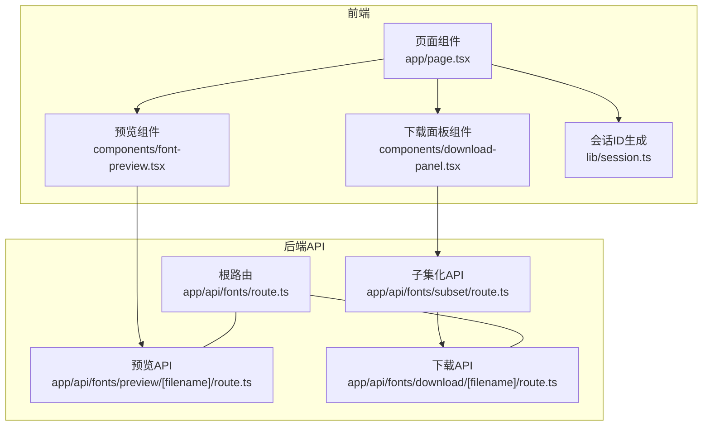
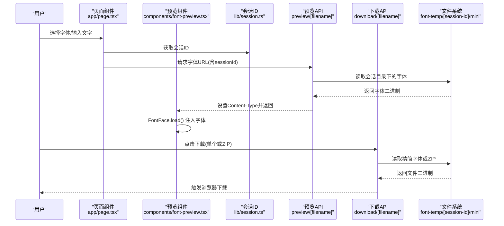
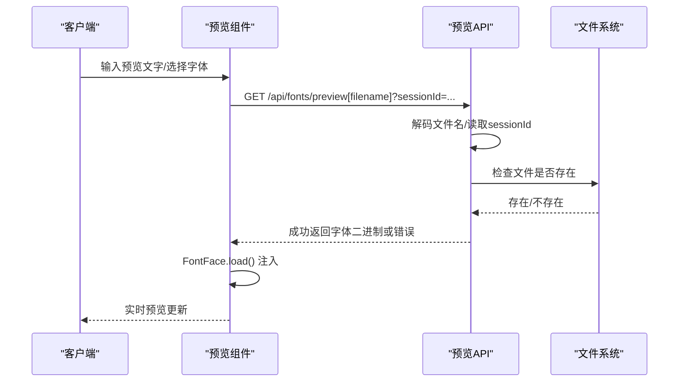
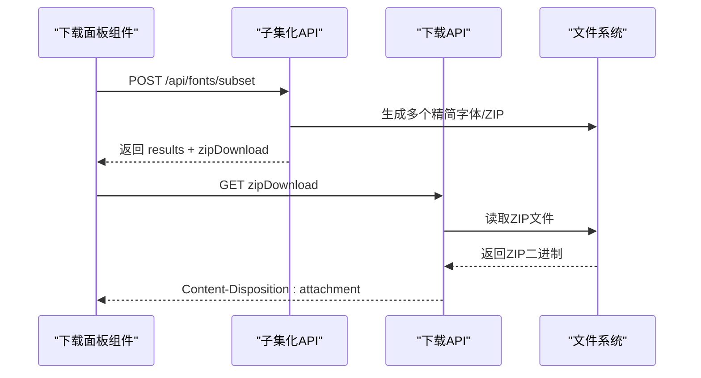
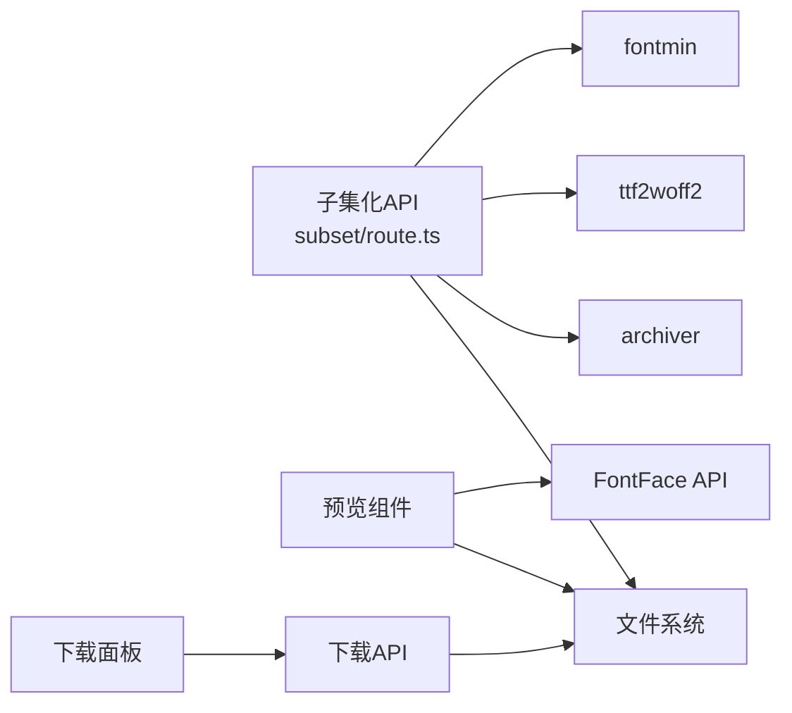

# 字体预览和下载API

<cite>
**本文档引用的文件**
- [app/api/fonts/route.ts](file://app/api/fonts/route.ts)
- [app/api/fonts/preview/[filename]/route.ts](file://app/api/fonts/preview/[filename]/route.ts)
- [app/api/fonts/download/[filename]/route.ts](file://app/api/fonts/download/[filename]/route.ts)
- [app/api/fonts/subset/route.ts](file://app/api/fonts/subset/route.ts)
- [components/font-preview.tsx](file://components/font-preview.tsx)
- [components/download-panel.tsx](file://components/download-panel.tsx)
- [lib/session.ts](file://lib/session.ts)
- [app/page.tsx](file://app/page.tsx)
- [types/fontmin.d.ts](file://types/fontmin.d.ts)
- [package.json](file://package.json)
- [README.md](file://README.md)
</cite>

## 目录
1. [简介](#简介)
2. [项目结构](#项目结构)
3. [核心组件](#核心组件)
4. [架构总览](#架构总览)
5. [详细组件分析](#详细组件分析)
6. [依赖关系分析](#依赖关系分析)
7. [性能考虑](#性能考虑)
8. [故障排除指南](#故障排除指南)
9. [结论](#结论)
10. [附录](#附录)

## 简介
本文件面向前端与后端开发者，系统性说明字体预览与下载API的设计与使用方法。重点覆盖以下两个辅助端点：
- GET /api/fonts/preview[filename]：动态字体加载与实时预览
- GET /api/fonts/download[filename]：单文件下载与批量ZIP打包下载

文档将从架构、数据流、处理逻辑、URL参数与编码、缓存与性能、文件路径解析、错误处理到客户端集成实践进行完整阐述，并提供可视化图示与最佳实践建议。

## 项目结构
该工具基于Next.js App Router组织API路由与前端组件，字体相关API位于app/api/fonts下，配套的前端组件负责上传、列表、预览与下载设置。

图表来源
- [app/page.tsx](file://app/page.tsx#L1-L279)
- [components/font-preview.tsx](file://components/font-preview.tsx#L1-L123)
- [components/download-panel.tsx](file://components/download-panel.tsx#L1-L295)
- [lib/session.ts](file://lib/session.ts#L1-L34)
- [app/api/fonts/route.ts](file://app/api/fonts/route.ts#L1-L167)
- [app/api/fonts/preview/[filename]/route.ts](file://app/api/fonts/preview/[filename]/route.ts#L1-L61)
- [app/api/fonts/download/[filename]/route.ts](file://app/api/fonts/download/[filename]/route.ts#L1-L62)
- [app/api/fonts/subset/route.ts](file://app/api/fonts/subset/route.ts#L1-L366)

章节来源
- [README.md](file://README.md#L135-L160)
- [package.json](file://package.json#L1-L78)

## 核心组件
- 会话与文件存储
  - 会话ID通过客户端生成并随请求头传递，服务端据此定位用户专属临时目录。
  - 字体文件按会话隔离存放于font-temp/[session-id]/，同时在font-source中保留永久备份。
- 预览API
  - 动态加载字体，使用FontFace API将二进制字体注入浏览器，实现“所见即所得”的实时预览。
- 下载API
  - 单文件下载：直接返回生成的精简字体文件。
  - 批量下载：当请求ZIP名称时，返回打包后的ZIP文件，便于一次性下载多个格式。

章节来源
- [lib/session.ts](file://lib/session.ts#L1-L34)
- [app/api/fonts/route.ts](file://app/api/fonts/route.ts#L6-L34)
- [app/api/fonts/preview/[filename]/route.ts](file://app/api/fonts/preview/[filename]/route.ts#L1-L61)
- [app/api/fonts/download/[filename]/route.ts](file://app/api/fonts/download/[filename]/route.ts#L1-L62)
- [app/api/fonts/subset/route.ts](file://app/api/fonts/subset/route.ts#L16-L23)

## 架构总览
下图展示了从页面到API再到文件系统的整体调用链路与数据流向。

图表来源
- [app/page.tsx](file://app/page.tsx#L113-L145)
- [components/font-preview.tsx](file://components/font-preview.tsx#L34-L48)
- [lib/session.ts](file://lib/session.ts#L1-L34)
- [app/api/fonts/preview/[filename]/route.ts](file://app/api/fonts/preview/[filename]/route.ts#L7-L60)
- [app/api/fonts/download/[filename]/route.ts](file://app/api/fonts/download/[filename]/route.ts#L7-L61)
- [app/api/fonts/subset/route.ts](file://app/api/fonts/subset/route.ts#L312-L342)

## 详细组件分析

### 预览API：GET /api/fonts/preview[filename]
- 功能概述
  - 依据会话ID定位用户目录，读取指定字体文件并返回二进制内容。
  - 设置合适的Content-Type，确保浏览器能正确识别字体格式。
  - 默认禁用缓存，保证预览效果与最新生成一致。
- 关键流程
  - 解析URL参数中的文件名并进行URL解码。
  - 从查询参数或请求头读取会话ID，若缺失则返回404。
  - 定位用户会话目录下的目标文件，若不存在返回404。
  - 根据扩展名映射Content-Type，返回二进制响应。
- 客户端集成要点
  - 使用FontFace API动态加载返回的URL，完成字体注入。
  - 预览组件会为每个字体生成唯一的familyName，避免冲突。
- 错误处理
  - 会话ID缺失、文件不存在、内部读取异常均返回JSON错误与对应状态码。

图表来源
- [components/font-preview.tsx](file://components/font-preview.tsx#L34-L48)
- [app/api/fonts/preview/[filename]/route.ts](file://app/api/fonts/preview/[filename]/route.ts#L7-L60)

章节来源
- [app/api/fonts/preview/[filename]/route.ts](file://app/api/fonts/preview/[filename]/route.ts#L1-L61)
- [components/font-preview.tsx](file://components/font-preview.tsx#L1-L123)

### 下载API：GET /api/fonts/download[filename]
- 功能概述
  - 用于下载单个精简字体或ZIP打包文件。
  - 对ZIP文件返回application/zip类型并设置Content-Disposition为附件下载。
- 关键流程
  - 解析URL参数中的文件名并进行URL解码。
  - 从查询参数或请求头读取会话ID，若缺失则返回404。
  - 定位用户会话目录下的mini子目录中的目标文件，若不存在返回404。
  - 根据扩展名映射Content-Type，设置Content-Length与Content-Disposition。
- 批量下载机制
  - 子集化API在生成多个格式后，可返回zipDownload字段，指向ZIP文件URL。
  - 客户端收到zipDownload后可直接打开新窗口触发下载。

图表来源
- [components/download-panel.tsx](file://components/download-panel.tsx#L77-L89)
- [app/api/fonts/subset/route.ts](file://app/api/fonts/subset/route.ts#L312-L342)
- [app/api/fonts/download/[filename]/route.ts](file://app/api/fonts/download/[filename]/route.ts#L7-L61)

章节来源
- [app/api/fonts/download/[filename]/route.ts](file://app/api/fonts/download/[filename]/route.ts#L1-L62)
- [components/download-panel.tsx](file://components/download-panel.tsx#L1-L295)
- [app/api/fonts/subset/route.ts](file://app/api/fonts/subset/route.ts#L312-L342)

### URL参数与编码规范
- 会话ID传递
  - 查询参数：sessionId
  - 请求头：x-font-session-id
  - 若两者都未提供，API将返回404“会话未找到”
- 文件名编码
  - 预览与下载API均对URL路径中的文件名进行decodeURIComponent解码。
  - 建议在构造URL时对文件名进行encodeURIComponent编码，以兼容特殊字符。
- 示例
  - 预览：GET /api/fonts/preview/文件名.ttf?sessionId=xxx
  - 下载：GET /api/fonts/download/文件名_Lite.woff2?sessionId=xxx
  - 批量：GET /api/fonts/download/fonts_Lite_1700000000000.zip?sessionId=xxx

章节来源
- [app/api/fonts/preview/[filename]/route.ts](file://app/api/fonts/preview/[filename]/route.ts#L15-L23)
- [app/api/fonts/download/[filename]/route.ts](file://app/api/fonts/download/[filename]/route.ts#L15-L23)
- [app/api/fonts/subset/route.ts](file://app/api/fonts/subset/route.ts#L278-L278)

### 文件路径解析与会话目录结构
- 目录结构
  - font-temp/[session-id]/：用户会话目录，存放上传的原始字体与生成的精简字体（mini子目录）。
  - font-source/：永久备份目录，所有上传字体均在此保留一份副本。
- 路径解析规则
  - 预览：从用户会话目录读取原始字体。
  - 下载：从用户会话目录的mini子目录读取精简字体或ZIP。
- 删除行为
  - 删除操作仅影响用户会话目录，font-source中的备份保留不变。

章节来源
- [app/api/fonts/route.ts](file://app/api/fonts/route.ts#L23-L34)
- [app/api/fonts/preview/[filename]/route.ts](file://app/api/fonts/preview/[filename]/route.ts#L25-L26)
- [app/api/fonts/download/[filename]/route.ts](file://app/api/fonts/download/[filename]/route.ts#L25-L26)
- [README.md](file://README.md#L179-L189)

### 客户端集成最佳实践
- 会话ID管理
  - 使用lib/session.ts生成并持久化会话ID，确保跨页面与热重载的一致性。
- 预览集成
  - 预览组件通过FontFace API动态加载字体URL，注入document.fonts后渲染预览区域。
  - 建议在首次加载时并行发起多个FontFace.load()，并在完成后统一渲染。
- 下载集成
  - 单文件下载：点击文件项触发window.open(downloadUrl)。
  - 批量下载：收到zipDownload后自动打开新窗口触发下载。
- 错误重试与体验优化
  - 对网络异常或404进行提示与重试；对大文件下载可显示进度条或分步下载。
  - 预览文字变化时延迟触发子集化，减少频繁请求。

章节来源
- [lib/session.ts](file://lib/session.ts#L1-L34)
- [components/font-preview.tsx](file://components/font-preview.tsx#L34-L48)
- [components/download-panel.tsx](file://components/download-panel.tsx#L77-L89)
- [app/page.tsx](file://app/page.tsx#L113-L145)

## 依赖关系分析
- 字体处理依赖
  - fontmin：字体子集化与格式转换（TTF→WOFF/WOFF2/EOT/SVG）。
  - ttf2woff2：TTF转WOFF2。
  - archiver：ZIP打包。
- 前端依赖
  - SWR：数据获取与缓存。
  - Radix UI + Tailwind CSS：UI组件与样式。
- 会话与文件系统
  - 会话ID决定用户专属目录；文件系统负责读写与清理。

图表来源
- [app/api/fonts/subset/route.ts](file://app/api/fonts/subset/route.ts#L5-L7)
- [types/fontmin.d.ts](file://types/fontmin.d.ts#L1-L53)
- [components/font-preview.tsx](file://components/font-preview.tsx#L34-L48)
- [components/download-panel.tsx](file://components/download-panel.tsx#L77-L89)
- [app/api/fonts/download/[filename]/route.ts](file://app/api/fonts/download/[filename]/route.ts#L32-L45)

章节来源
- [package.json](file://package.json#L41-L65)
- [types/fontmin.d.ts](file://types/fontmin.d.ts#L1-L53)

## 性能考虑
- 浏览器缓存与预览一致性
  - 预览API默认禁用缓存，确保每次预览都是最新生成的字体。
  - 若需缓存，可在客户端侧对相同内容的字体URL做本地缓存控制。
- CDN与静态资源
  - 精简字体与ZIP文件可由CDN分发，降低服务器压力。
  - 建议为ZIP与字体文件设置合理的Cache-Control策略（如immutable）。
- 并发与批处理
  - 预览阶段可并发加载多个FontFace，减少等待时间。
  - 批量下载时优先生成ZIP，避免多次HTTP往返。
- 存储与清理
  - 定期清理font-temp中的过期会话目录，避免磁盘膨胀。
  - 备份目录font-source建议定期备份与容量监控。

## 故障排除指南
- 常见错误与处理
  - 会话未找到（404）：检查请求头x-font-session-id或查询参数sessionId是否正确传递。
  - 字体未找到（404）：确认文件名已正确URL编码，且存在于用户会话目录。
  - 内部错误（500）：查看服务端日志，关注文件读取、格式转换与打包过程。
- 典型问题定位
  - 预览空白：确认FontFace.load()未抛错，且Content-Type与扩展名匹配。
  - 下载失败：确认mini目录存在目标文件，且Content-Disposition设置为附件。
  - 子集化失败：确认上传的是TTF格式，且输入文字非空。
- 日志与调试
  - 服务端API对关键步骤打印日志，便于定位问题。
  - 前端组件捕获FontFace加载异常并记录错误信息。

章节来源
- [app/api/fonts/preview/[filename]/route.ts](file://app/api/fonts/preview/[filename]/route.ts#L21-L29)
- [app/api/fonts/download/[filename]/route.ts](file://app/api/fonts/download/[filename]/route.ts#L21-L30)
- [app/api/fonts/subset/route.ts](file://app/api/fonts/subset/route.ts#L297-L310)

## 结论
本文档系统梳理了字体预览与下载API的设计与实现，明确了URL参数与编码规范、文件路径解析机制、缓存与性能优化策略、错误处理与客户端集成最佳实践。通过FontFace API与子集化技术，实现了高效、直观的字体预览与下载体验。建议在生产环境中结合CDN与定期清理策略，进一步提升稳定性与性能。

## 附录
- 使用示例（概念性说明）
  - 预览集成：在预览组件中遍历字体列表，为每个字体创建FontFace实例并加载，完成后渲染预览区域。
  - 下载集成：点击文件项触发window.open(downloadUrl)，或在批量下载时接收zipDownload并自动触发下载。
- 相关文件路径
  - 预览API：/api/fonts/preview/[filename]
  - 下载API：/api/fonts/download/[filename]
  - 子集化API：/api/fonts/subset