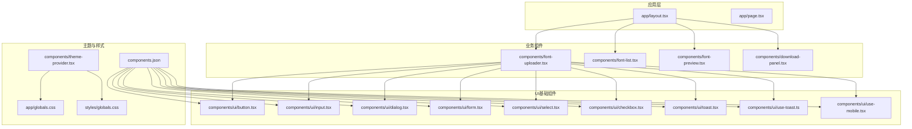
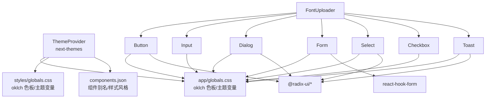
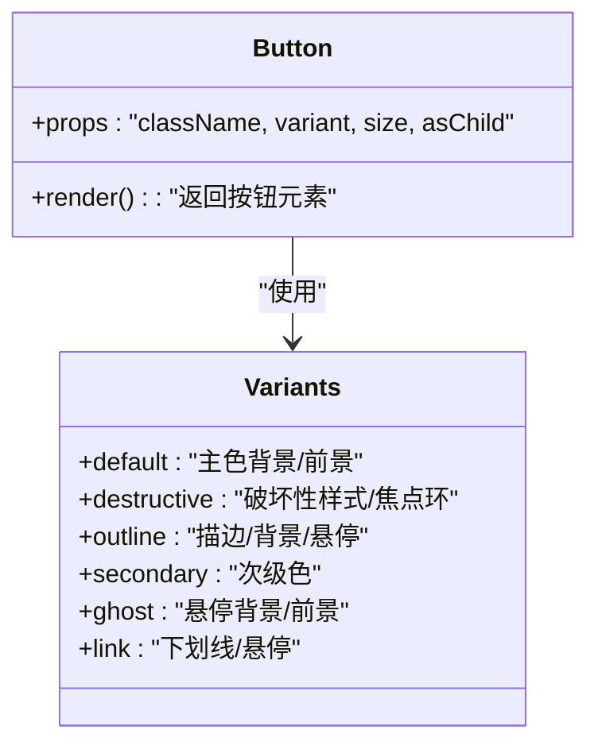
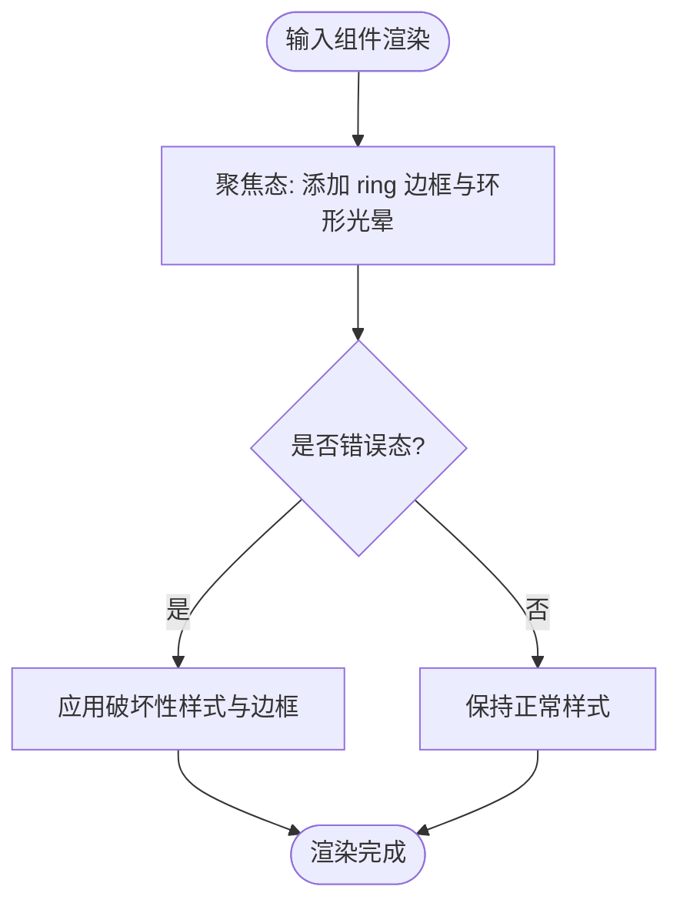
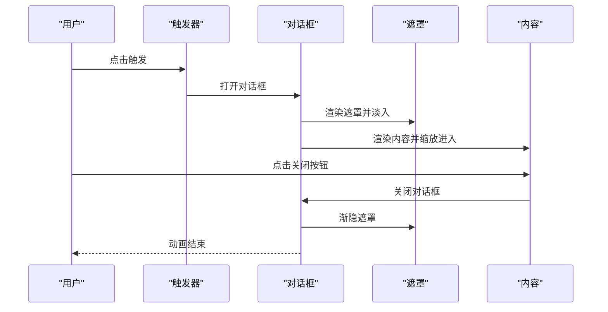
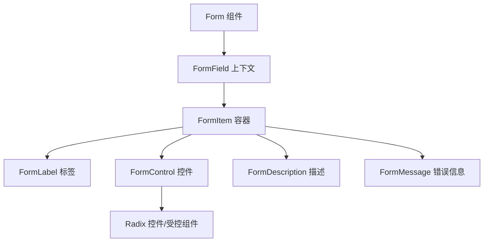
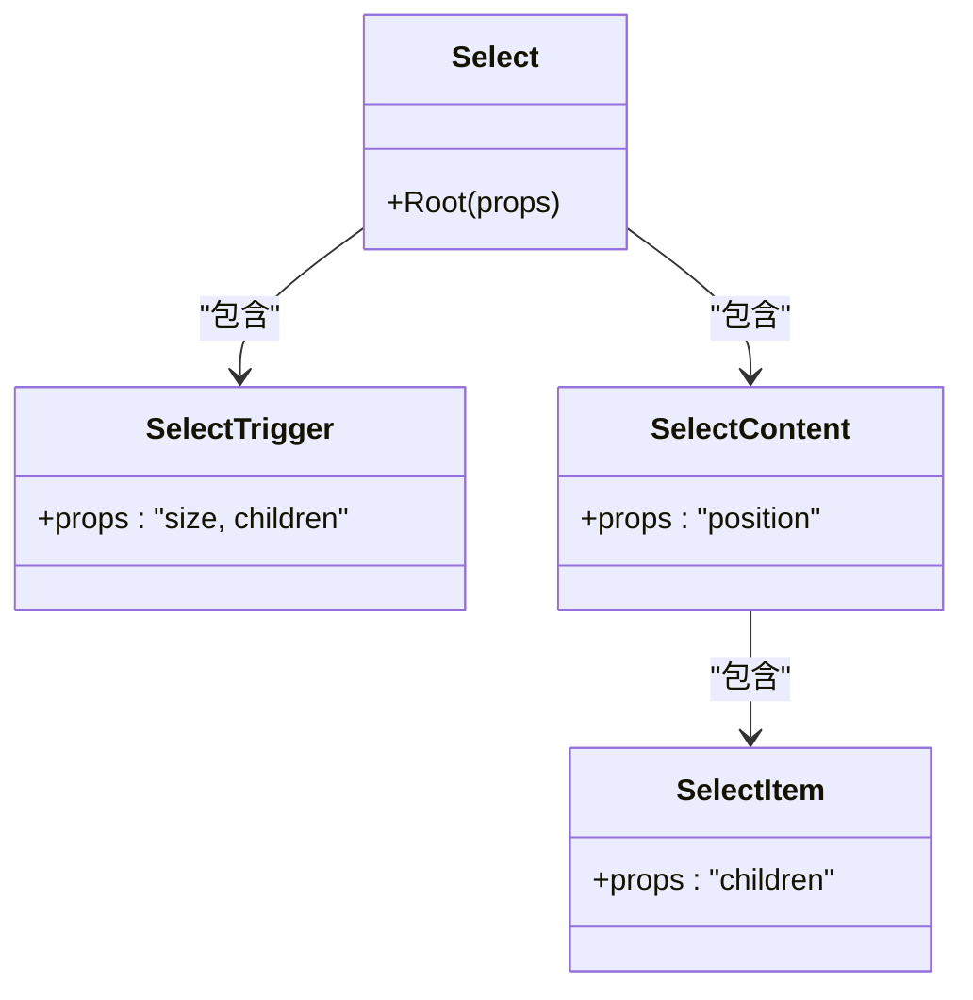
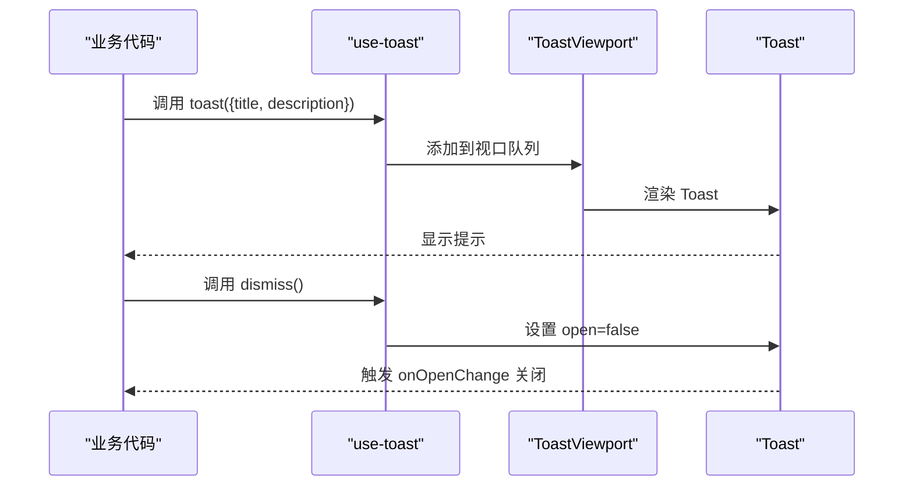
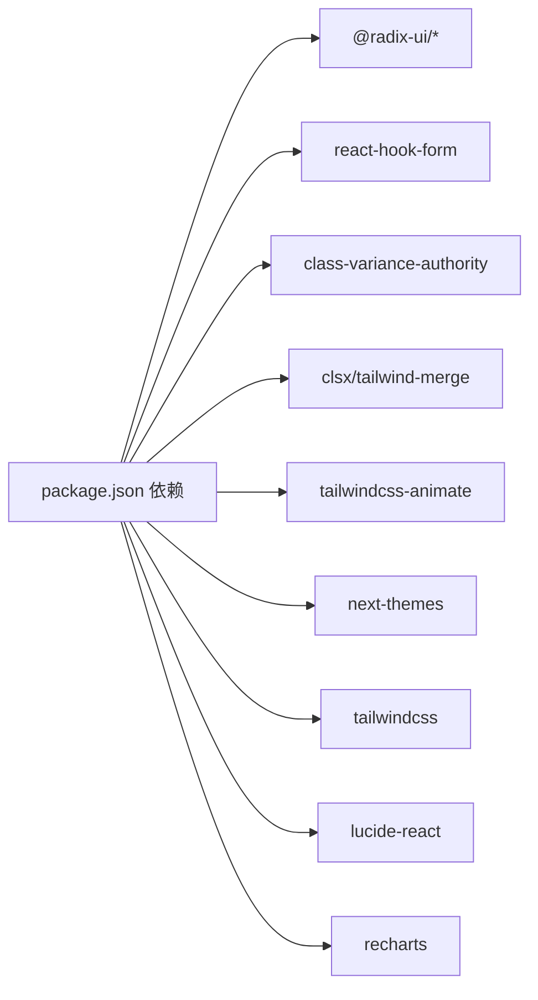

# UI组件系统

<cite>
**本文引用的文件**
- [README.md](file://README.md)
- [package.json](file://package.json)
- [components.json](file://components.json)
- [app/globals.css](file://app/globals.css)
- [styles/globals.css](file://styles/globals.css)
- [components/theme-provider.tsx](file://components/theme-provider.tsx)
- [components/ui/button.tsx](file://components/ui/button.tsx)
- [components/ui/input.tsx](file://components/ui/input.tsx)
- [components/ui/dialog.tsx](file://components/ui/dialog.tsx)
- [components/ui/form.tsx](file://components/ui/form.tsx)
- [components/ui/select.tsx](file://components/ui/select.tsx)
- [components/ui/checkbox.tsx](file://components/ui/checkbox.tsx)
- [components/ui/toast.tsx](file://components/ui/toast.tsx)
- [components/ui/use-toast.ts](file://components/ui/use-toast.ts)
- [components/ui/use-mobile.tsx](file://components/ui/use-mobile.tsx)
</cite>

## 目录
1. [简介](#简介)
2. [项目结构](#项目结构)
3. [核心组件](#核心组件)
4. [架构总览](#架构总览)
5. [详细组件分析](#详细组件分析)
6. [依赖关系分析](#依赖关系分析)
7. [性能考虑](#性能考虑)
8. [故障排查指南](#故障排查指南)
9. [结论](#结论)
10. [附录](#附录)

## 简介
本文件为 FontMin 字体子集化工具的 UI 组件系统文档，聚焦于基于 Radix UI 与 Tailwind CSS 的组件库设计与实现。内容涵盖基础 UI 组件的属性、事件与自定义选项；业务组件的使用示例与集成指南；响应式设计与无障碍功能；状态管理、动画与过渡效果；样式定制与主题支持；组件组合模式与与其他 UI 元素的集成方式；以及跨浏览器兼容性与性能优化建议。

## 项目结构
项目采用 Next.js App Router 结构，UI 组件集中于 components/ui 目录，业务组件位于 components 根目录。全局样式通过 Tailwind CSS 4 与自定义 oklch 色彩变量实现主题化，并结合 next-themes 提供深色/浅色主题切换。

图表来源
- [components/theme-provider.tsx](file://components/theme-provider.tsx#L1-L12)
- [app/globals.css](file://app/globals.css#L1-L126)
- [styles/globals.css](file://styles/globals.css#L1-L126)
- [components.json](file://components.json#L1-L22)

章节来源
- [README.md](file://README.md#L135-L160)
- [package.json](file://package.json#L1-L78)
- [components.json](file://components.json#L1-L22)

## 核心组件
本节概述基础 UI 组件的关键能力与扩展点，便于快速理解与复用。

- 按钮 Button
  - 支持多种变体与尺寸，具备焦点可见边框与环形光晕反馈
  - 支持 asChild 插槽模式，便于嵌套链接或自定义容器
  - 无障碍增强：支持 aria-invalid 与焦点环
- 输入 Input
  - 默认聚焦态具备 ring 边框与环形光晕
  - 支持 aria-invalid 错误态样式
  - 文件选择、占位符、选择高亮等原生语义保持
- 对话框 Dialog
  - 基于 Radix UI，提供 Overlay、Portal、Content、Header/Footer、Title/Description、Close 等子组件
  - 内置淡入/淡出与缩放动画，支持关闭按钮与无障碍标签
- 表单 Form
  - 基于 React Hook Form，提供 Form、FormField、FormItem、FormLabel、FormControl、FormDescription、FormMessage
  - 自动注入 aria-* 属性，错误态样式联动
- 选择器 Select
  - 支持 Trigger、Content、Item、Label、Separator、ScrollUp/DownButton
  - 触发器支持尺寸与图标，内容支持 popper 位置偏移
- 复选框 Checkbox
  - 支持选中态背景与前景色、焦点环与错误态
- 提示 Toast
  - Provider/Viewport/Toast/Title/Description/Action/Close
  - 支持滑动关闭、动画序列与破坏性样式
- 移动端检测 use-mobile
  - 基于媒体查询监听窗口宽度，返回布尔值
- 主题 Provider
  - 基于 next-themes，提供深色/浅色主题切换

章节来源
- [components/ui/button.tsx](file://components/ui/button.tsx#L1-L61)
- [components/ui/input.tsx](file://components/ui/input.tsx#L1-L22)
- [components/ui/dialog.tsx](file://components/ui/dialog.tsx#L1-L144)
- [components/ui/form.tsx](file://components/ui/form.tsx#L1-L168)
- [components/ui/select.tsx](file://components/ui/select.tsx#L1-L186)
- [components/ui/checkbox.tsx](file://components/ui/checkbox.tsx#L1-L33)
- [components/ui/toast.tsx](file://components/ui/toast.tsx#L1-L130)
- [components/ui/use-mobile.tsx](file://components/ui/use-mobile.tsx#L1-L20)
- [components/theme-provider.tsx](file://components/theme-provider.tsx#L1-L12)

## 架构总览
下图展示 UI 组件系统与主题、样式、业务组件之间的交互关系。

图表来源
- [components/theme-provider.tsx](file://components/theme-provider.tsx#L1-L12)
- [app/globals.css](file://app/globals.css#L1-L126)
- [styles/globals.css](file://styles/globals.css#L1-L126)
- [components.json](file://components.json#L1-L22)
- [components/ui/button.tsx](file://components/ui/button.tsx#L1-L61)
- [components/ui/input.tsx](file://components/ui/input.tsx#L1-L22)
- [components/ui/dialog.tsx](file://components/ui/dialog.tsx#L1-L144)
- [components/ui/form.tsx](file://components/ui/form.tsx#L1-L168)
- [components/ui/select.tsx](file://components/ui/select.tsx#L1-L186)
- [components/ui/checkbox.tsx](file://components/ui/checkbox.tsx#L1-L33)
- [components/ui/toast.tsx](file://components/ui/toast.tsx#L1-L130)
- [package.json](file://package.json#L11-L66)

## 详细组件分析

### 按钮 Button 组件
- 设计要点
  - 使用 class-variance-authority 定义变体与尺寸，统一过渡与焦点反馈
  - 支持 asChild 插槽模式，适配链接或自定义容器
  - 无障碍增强：支持 aria-invalid 与焦点环
- 关键属性
  - className: 扩展类名
  - variant: default/destructive/outline/secondary/ghost/link
  - size: default/sm/lg/icon/icon-sm/icon-lg
  - asChild: 是否渲染为插槽容器
- 事件与行为
  - 点击事件透传原生 button 行为
  - 焦点态触发 ring 边框与环形光晕
  - 禁用态禁用交互并降低透明度
- 样式定制
  - 通过 variants 与默认值覆盖主题色板
  - 支持在调用处追加 Tailwind 类名进行局部微调

图表来源
- [components/ui/button.tsx](file://components/ui/button.tsx#L7-L37)

章节来源
- [components/ui/button.tsx](file://components/ui/button.tsx#L1-L61)

### 输入 Input 组件
- 设计要点
  - 默认聚焦态具备 ring 边框与环形光晕
  - 支持 aria-invalid 错误态样式
  - 保持原生 input 的可访问性语义
- 关键属性
  - className: 扩展类名
  - type: 原生 input 类型
- 事件与行为
  - onChange/onBlur 等原生事件透传
  - 焦点态与错误态样式联动
- 样式定制
  - 可通过 Tailwind 类名覆盖默认尺寸、颜色与阴影

图表来源
- [components/ui/input.tsx](file://components/ui/input.tsx#L5-L19)

章节来源
- [components/ui/input.tsx](file://components/ui/input.tsx#L1-L22)

### 对话框 Dialog 组件
- 设计要点
  - 基于 Radix UI，提供完整的对话框生命周期与无障碍标签
  - 内置淡入/淡出与缩放动画，支持关闭按钮与无障碍标签
- 子组件
  - Root/Portal/Overlay/Content/Header/Footer/Title/Description/Trigger/Close
- 关键属性
  - Content.showCloseButton: 是否显示关闭按钮
  - Trigger/Close: 控制打开/关闭
- 动画与过渡
  - data-[state=open/closed] 触发进入/退出动画序列
- 无障碍
  - Title/Description 与关闭按钮配合 SR-only 文本

图表来源
- [components/ui/dialog.tsx](file://components/ui/dialog.tsx#L9-L81)

章节来源
- [components/ui/dialog.tsx](file://components/ui/dialog.tsx#L1-L144)

### 表单 Form 组件
- 设计要点
  - 基于 React Hook Form，提供表单项上下文与无障碍属性注入
  - 自动管理 aria-describedby、aria-invalid、错误消息 ID
- 子组件
  - Form/FormField/FormItem/FormLabel/FormControl/FormDescription/FormMessage
- 关键钩子
  - useFormField: 获取字段状态与 ID
- 无障碍
  - 自动为控件注入 aria-describedby 与 aria-invalid

图表来源
- [components/ui/form.tsx](file://components/ui/form.tsx#L21-L156)

章节来源
- [components/ui/form.tsx](file://components/ui/form.tsx#L1-L168)

### 选择器 Select 组件
- 设计要点
  - 支持 Trigger、Content、Item、Label、Separator、ScrollUp/DownButton
  - 触发器支持尺寸与图标，内容支持 popper 位置偏移
- 关键属性
  - Trigger.size: sm/default
  - Content.position: popper/above/below
- 无障碍
  - Item 支持键盘导航与指示器

图表来源
- [components/ui/select.tsx](file://components/ui/select.tsx#L9-L185)

章节来源
- [components/ui/select.tsx](file://components/ui/select.tsx#L1-L186)

### 复选框 Checkbox 组件
- 设计要点
  - 支持选中态背景与前景色、焦点环与错误态
  - 使用 Indicator 渲染内部勾选图标
- 关键属性
  - className: 扩展类名
- 无障碍
  - 保持原生 checkbox 的可访问性语义

章节来源
- [components/ui/checkbox.tsx](file://components/ui/checkbox.tsx#L1-L33)

### 提示 Toast 组件
- 设计要点
  - Provider/Viewport/Toast/Title/Description/Action/Close
  - 支持滑动关闭、动画序列与破坏性样式
- 关键属性
  - Toast.variant: default/destructive
  - Viewport 位置与尺寸约束
- 状态管理
  - use-toast 提供 toast/dismiss/reducer 状态机

图表来源
- [components/ui/toast.tsx](file://components/ui/toast.tsx#L10-L56)
- [components/ui/use-toast.ts](file://components/ui/use-toast.ts#L142-L169)

章节来源
- [components/ui/toast.tsx](file://components/ui/toast.tsx#L1-L130)
- [components/ui/use-toast.ts](file://components/ui/use-toast.ts#L1-L192)

### 移动端检测 use-mobile
- 设计要点
  - 基于媒体查询监听窗口宽度，返回布尔值
  - 初始值在客户端渲染后确定
- 关键常量
  - MOBILE_BREAKPOINT: 768px
- 适用场景
  - 条件渲染移动端布局、弹窗/抽屉替代、触摸友好交互

章节来源
- [components/ui/use-mobile.tsx](file://components/ui/use-mobile.tsx#L1-L20)

## 依赖关系分析
- 组件库依赖
  - Radix UI 生态：@radix-ui/react-* 提供无障碍基础组件
  - React Hook Form：表单上下文与状态管理
  - class-variance-authority + clsx/tailwind-merge：变体与类名合并
  - tailwindcss-animate：动画变体
- 主题与样式
  - next-themes：主题切换
  - Tailwind CSS 4：原子化样式
  - oklch 色板：全局主题变量
- 工具与图标
  - lucide-react：图标库
  - recharts：图表（业务组件中使用）

图表来源
- [package.json](file://package.json#L11-L66)

章节来源
- [package.json](file://package.json#L1-L78)

## 性能考虑
- 动画与过渡
  - 使用 tailwindcss-animate 提供轻量动画变体，避免复杂 JS 动画
  - 对话框与 Toast 使用 data-state 触发 CSS 动画，减少重排
- 样式体积
  - Tailwind CSS 4 原子化类名，按需引入，避免未使用样式
  - oklch 色板集中管理，减少重复定义
- 组件渲染
  - Button/Checkbox/Input 等基础组件保持最小 DOM 结构，减少层级
  - Select/Dialog 等复合组件通过 Portal 渲染，避免层级过深
- 主题切换
  - next-themes 通过 CSS 变量与类名切换，避免全量重绘
- 无障碍与可访问性
  - 所有交互组件遵循 ARIA 标准，减少可访问性回流导致的性能问题

## 故障排查指南
- 表单错误态不生效
  - 检查 FormField/FormControl 是否正确包裹控件
  - 确认 useFormField 返回的 error 与 formMessageId 是否存在
- 对话框无法关闭
  - 确认 DialogTrigger/DialogClose 的绑定关系
  - 检查 Portal 渲染目标是否存在
- 主题切换无效
  - 确认 ThemeProvider 包裹范围
  - 检查 app/globals.css 中 CSS 变量是否正确
- 移动端布局异常
  - 使用 useIsMobile 判断断点，确认媒体查询监听是否生效
- Toast 不显示或立即消失
  - 检查 use-toast 的 reducer 状态与定时器队列
  - 确认 TOAST_LIMIT 与 TOAST_REMOVE_DELAY 配置

章节来源
- [components/ui/form.tsx](file://components/ui/form.tsx#L45-L66)
- [components/ui/dialog.tsx](file://components/ui/dialog.tsx#L15-L31)
- [components/theme-provider.tsx](file://components/theme-provider.tsx#L9-L11)
- [components/ui/use-mobile.tsx](file://components/ui/use-mobile.tsx#L5-L18)
- [components/ui/use-toast.ts](file://components/ui/use-toast.ts#L74-L127)

## 结论
本 UI 组件系统以 Radix UI 为基础，结合 Tailwind CSS 4 与 oklch 色板，实现了高可访问性、可定制的主题化界面。通过 class-variance-authority 与变体系统，组件具备清晰的扩展路径；借助 next-themes 与 CSS 变量，主题切换自然流畅。业务组件围绕基础 UI 组件构建，形成一致的交互与视觉语言。建议在实际使用中遵循无障碍与响应式设计原则，充分利用动画与状态管理能力，持续优化性能与可维护性。

## 附录
- 组件别名与样式风格
  - 组件别名：components/@/components, utils/@/lib/utils, ui/@/components/ui
  - 样式风格：new-york
  - CSS 变量：开启
- 主题变量映射
  - 背景/前景/卡片/弹出层/主要/次要/静默/强调/破坏性/边框/输入/环/图表系列
- 动画与过渡
  - fade-in/out、zoom、slide-in-from-top/bottom/right/left、slide-out-to-right-full
- 无障碍关键词
  - aria-invalid、aria-describedby、SR-only 文本、Tab 顺序、焦点环

章节来源
- [components.json](file://components.json#L1-L22)
- [app/globals.css](file://app/globals.css#L6-L116)
- [styles/globals.css](file://styles/globals.css#L6-L116)
- [components/ui/button.tsx](file://components/ui/button.tsx#L8-L36)
- [components/ui/dialog.tsx](file://components/ui/dialog.tsx#L41-L66)
- [components/ui/toast.tsx](file://components/ui/toast.tsx#L28-L41)