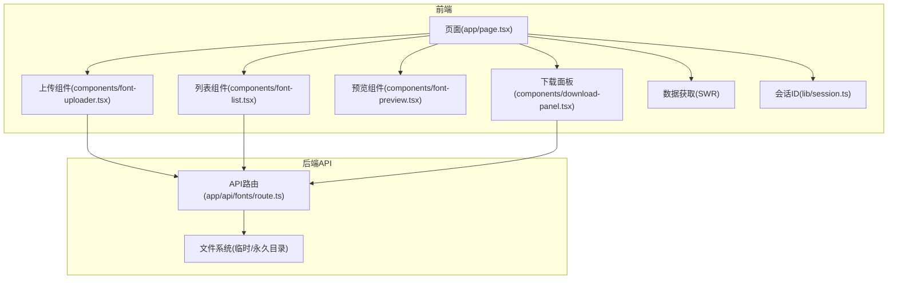
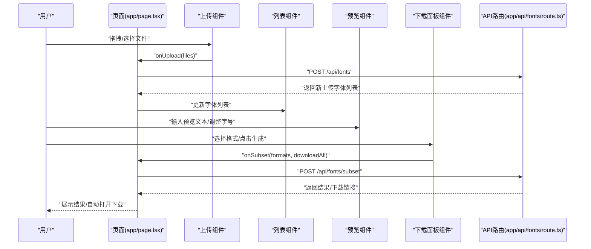
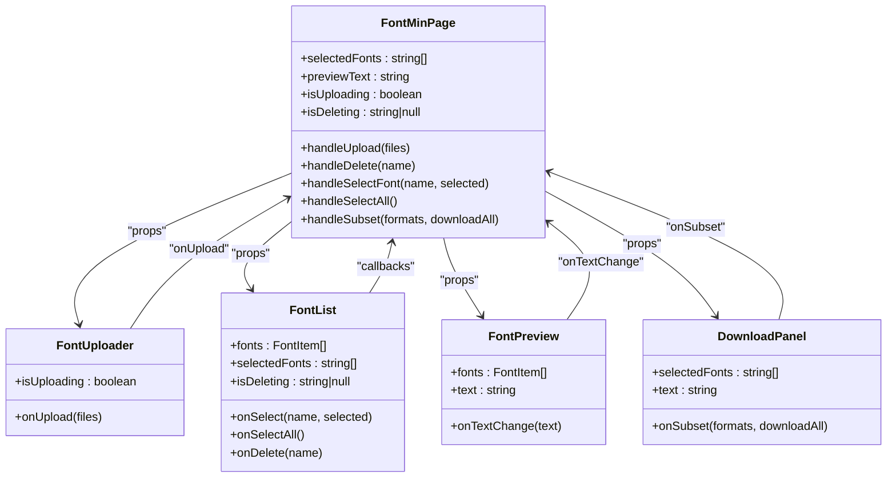
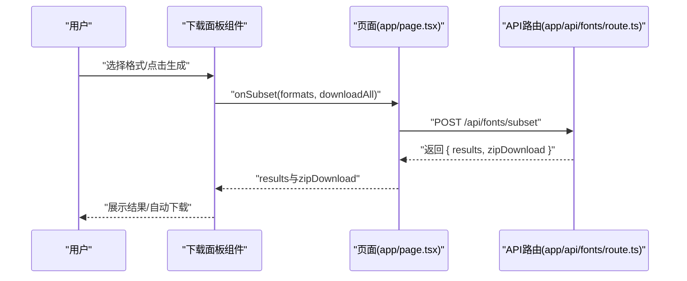

# 业务组件

<cite>
**本文引用的文件**
- [app/page.tsx](file://app/page.tsx)
- [components/font-uploader.tsx](file://components/font-uploader.tsx)
- [components/font-list.tsx](file://components/font-list.tsx)
- [components/font-preview.tsx](file://components/font-preview.tsx)
- [components/download-panel.tsx](file://components/download-panel.tsx)
- [app/api/fonts/route.ts](file://app/api/fonts/route.ts)
- [lib/session.ts](file://lib/session.ts)
- [types/fontmin.d.ts](file://types/fontmin.d.ts)
- [components/ui/button.tsx](file://components/ui/button.tsx)
- [components/ui/checkbox.tsx](file://components/ui/checkbox.tsx)
- [components/ui/slider.tsx](file://components/ui/slider.tsx)
</cite>

## 目录
1. [简介](#简介)
2. [项目结构](#项目结构)
3. [核心组件](#核心组件)
4. [架构总览](#架构总览)
5. [详细组件分析](#详细组件分析)
6. [依赖关系分析](#依赖关系分析)
7. [性能考量](#性能考量)
8. [故障排查指南](#故障排查指南)
9. [结论](#结论)
10. [附录](#附录)

## 简介
本文件面向FontMin字体子集化工具的业务组件，系统性梳理“字体上传组件”、“字体列表管理组件”、“字体预览组件”和“下载面板组件”的功能实现、用户交互流程、数据处理逻辑、配置选项、事件处理与状态管理，并说明组件间通信机制、数据传递方式、响应式设计与用户体验优化，以及与后端API的交互与错误处理机制。文档同时提供实际使用示例与集成指南，帮助开发者快速理解与扩展该工具。

## 项目结构
该工具采用Next.js App Router组织前端页面与API路由，业务组件位于components目录，页面逻辑集中在app/page.tsx中，通过SWR进行数据获取与缓存，后端API路由位于app/api/fonts下，负责会话隔离的文件读写与字体处理触发。

图表来源
- [app/page.tsx](file://app/page.tsx#L1-L279)
- [components/font-uploader.tsx](file://components/font-uploader.tsx#L1-L166)
- [components/font-list.tsx](file://components/font-list.tsx#L1-L159)
- [components/font-preview.tsx](file://components/font-preview.tsx#L1-L123)
- [components/download-panel.tsx](file://components/download-panel.tsx#L1-L295)
- [app/api/fonts/route.ts](file://app/api/fonts/route.ts#L1-L167)
- [lib/session.ts](file://lib/session.ts#L1-L34)

章节来源
- [app/page.tsx](file://app/page.tsx#L1-L279)
- [app/api/fonts/route.ts](file://app/api/fonts/route.ts#L1-L167)

## 核心组件
- 字体上传组件：支持拖拽与文件选择，过滤合法格式，展示已选文件并触发上传。
- 字体列表管理组件：展示已上传字体，支持全选/反选、逐项选择、删除确认对话框。
- 字体预览组件：动态加载字体，实时预览输入文本，支持字体大小滑条调整。
- 下载面板组件：选择输出格式，生成精简字体包，展示结果与压缩比，支持单个/打包下载。

章节来源
- [components/font-uploader.tsx](file://components/font-uploader.tsx#L1-L166)
- [components/font-list.tsx](file://components/font-list.tsx#L1-L159)
- [components/font-preview.tsx](file://components/font-preview.tsx#L1-L123)
- [components/download-panel.tsx](file://components/download-panel.tsx#L1-L295)

## 架构总览
页面组件负责状态管理与API调用，业务组件通过props接收回调与数据，完成用户交互与数据流转；后端API路由基于会话ID隔离用户数据，提供上传、列出与删除能力；字体子集化由后端触发（在本仓库中体现为调用API），返回结果与下载链接。

图表来源
- [app/page.tsx](file://app/page.tsx#L33-L145)
- [components/font-uploader.tsx](file://components/font-uploader.tsx#L65-L70)
- [components/font-list.tsx](file://components/font-list.tsx#L45-L58)
- [components/font-preview.tsx](file://components/font-preview.tsx#L17-L21)
- [components/download-panel.tsx](file://components/download-panel.tsx#L68-L89)
- [app/api/fonts/route.ts](file://app/api/fonts/route.ts#L72-L127)

## 详细组件分析

### 字体上传组件（FontUploader）
- 核心功能
  - 支持拖拽进入高亮反馈与文件释放上传。
  - 支持点击选择文件，过滤合法格式（.ttf/.otf/.woff/.woff2/.eot/.svg）。
  - 展示已选文件清单，支持逐项移除。
  - 触发上传回调，上传完成后清空已选列表。
- 用户交互流程
  - 拖拽覆盖/离开切换高亮状态。
  - 释放文件时过滤并追加到已选列表。
  - 点击“开始上传”触发onUpload回调，禁用按钮直至完成。
- 数据处理逻辑
  - 使用accept属性限制文件类型，确保仅接受受支持格式。
  - 通过FileReader读取文件名与大小，计算KB值。
  - 上传时构造FormData，携带会话ID头信息。
- 配置选项与事件
  - onUpload(files: File[]): Promise<void> - 上传回调。
  - isUploading: boolean - 上传状态控制按钮禁用。
- 状态管理
  - isDragging: boolean - 控制拖拽高亮样式。
  - selectedFiles: File[] - 已选文件集合。
- 错误处理
  - 上传失败时捕获异常并提示用户。
- 响应式设计与体验
  - 拖拽高亮与悬停态提供即时反馈。
  - 已选文件列表滚动容器，避免溢出。
  - 禁用状态下按钮不可点击，避免重复提交。

章节来源
- [components/font-uploader.tsx](file://components/font-uploader.tsx#L10-L166)
- [app/page.tsx](file://app/page.tsx#L33-L65)

### 字体列表管理组件（FontList）
- 核心功能
  - 展示字体列表，支持全选/反选与单项选择。
  - 删除字体时弹出确认对话框，避免误删。
  - 当无字体时显示占位提示。
- 用户交互流程
  - 点击全选复选框切换所有字体选择状态。
  - 点击单项复选框触发父级onSelect回调。
  - 点击删除按钮打开确认对话框，确认后触发onDelete回调。
- 数据处理逻辑
  - 根据selectedFonts与fonts长度计算全选状态。
  - 通过isDeleting标识当前正在删除的字体，禁用对应删除按钮。
- 配置选项与事件
  - fonts: FontItem[] - 字体列表。
  - selectedFonts: string[] - 已选字体名称集合。
  - onSelect(name, selected): void - 单项选择回调。
  - onSelectAll(): void - 全选/反选回调。
  - onDelete(name): void - 删除回调。
  - isDeleting: string | null - 正在删除的字体名。
- 状态管理
  - fontToDelete: string | null - 待确认删除的字体名。
  - allSelected: boolean - 全选状态。
- 错误处理
  - 删除失败时捕获异常并提示用户。
- 响应式设计与体验
  - 选中态高亮与悬停态区分，增强可读性。
  - 固定高度的滚动容器，避免布局抖动。

章节来源
- [components/font-list.tsx](file://components/font-list.tsx#L19-L159)
- [app/page.tsx](file://app/page.tsx#L67-L92)

### 字体预览组件（FontPreview）
- 核心功能
  - 动态加载字体，使用FontFace API注入CSS字体。
  - 实时预览输入文本，支持滑条调节字号。
  - 为每个字体生成唯一的familyName，避免冲突。
- 用户交互流程
  - 文本域输入/修改触发onTextChange回调。
  - 滑条拖动更新fontSize状态。
  - 字体加载状态显示“加载中/已加载”。
- 数据处理逻辑
  - 使用useMemo为每个字体生成familyName。
  - useEffect监听fontStyles变化，逐个加载字体并加入document.fonts。
  - 显示默认示例文本，支持中英文与数字混合。
- 配置选项与事件
  - fonts: FontItem[] - 字体列表。
  - text: string - 预览文本。
  - onTextChange(text: string): void - 文本变更回调。
- 状态管理
  - fontSize: number - 当前字号。
  - loadedFonts: Set<string> - 已加载字体familyName集合。
- 错误处理
  - 字体加载失败时记录错误日志。
- 响应式设计与体验
  - 固定高度的预览区域，支持滚动查看多字体效果。
  - 加载状态可视化提示，提升感知。

章节来源
- [components/font-preview.tsx](file://components/font-preview.tsx#L9-L123)
- [types/fontmin.d.ts](file://types/fontmin.d.ts#L1-L53)

### 下载面板组件（DownloadPanel）
- 核心功能
  - 选择输出格式（TTF/WOFF/WOFF2/EOT/SVG），支持全选/反选。
  - 生成精简字体包，展示结果卡片与压缩比。
  - 支持单个下载与打包下载全部。
- 用户交互流程
  - 点击格式按钮切换选中状态。
  - 点击“生成精简字体包”触发onSubset回调。
  - 成功后显示结果卡片与批量下载按钮。
- 数据处理逻辑
  - canProcess根据已选字体、输入文本与格式选择判断是否可处理。
  - 统计唯一字符数，用于信息栏展示。
  - 结果按原始字体名分组，计算压缩百分比。
  - 自动触发ZIP下载（当后端返回zipDownload时）。
- 配置选项与事件
  - selectedFonts: string[] - 已选字体名称集合。
  - text: string - 需要提取的文字。
  - onSubset(formats: string[], downloadAll: boolean): Promise<SubsetResponse> - 处理回调。
- 状态管理
  - selectedFormats: string[] - 已选格式集合。
  - isProcessing: boolean - 处理中状态。
  - results: SubsetResult[] - 处理结果列表。
  - zipDownloadUrl: string | null - ZIP下载链接。
  - error: string | null - 错误信息。
- 错误处理
  - 捕获onSubset抛出的错误，显示错误提示。
- 响应式设计与体验
  - 信息栏紧凑展示，格式选择内联紧凑排列。
  - 成功横幅突出显示，操作按钮清晰可见。
  - 结果卡片支持滚动，避免布局溢出。

章节来源
- [components/download-panel.tsx](file://components/download-panel.tsx#L24-L295)

## 依赖关系分析
- 页面与组件
  - app/page.tsx是根组件，持有全局状态（selectedFonts、previewText、isUploading、isDeleting），并向下传递给各业务组件。
  - 通过SWR获取字体列表，使用mutate刷新数据。
- 组件间通信
  - 上传组件 -> 页面：onUpload回调触发上传。
  - 列表组件 -> 页面：onSelect/onSelectAll/onDelete回调更新状态。
  - 预览组件 -> 页面：onTextChange更新预览文本。
  - 下载面板组件 -> 页面：onSubset触发子集化处理。
- 后端API
  - 上传/列出/删除：app/api/fonts/route.ts
  - 子集化：页面发起POST请求至/api/fonts/subset，返回结果与下载链接。
- 会话隔离
  - lib/session.ts生成会话ID，通过请求头x-font-session-id传递，API路由据此定位用户会话目录。

图表来源
- [app/page.tsx](file://app/page.tsx#L21-L145)
- [components/font-uploader.tsx](file://components/font-uploader.tsx#L10-L13)
- [components/font-list.tsx](file://components/font-list.tsx#L25-L32)
- [components/font-preview.tsx](file://components/font-preview.tsx#L9-L13)
- [components/download-panel.tsx](file://components/download-panel.tsx#L24-L28)

章节来源
- [app/page.tsx](file://app/page.tsx#L21-L145)

## 性能考量
- 字体加载
  - 使用FontFace API异步加载，避免阻塞主线程；已加载集合去重，避免重复加载。
- 预览渲染
  - 预览区域固定最大高度并启用滚动，减少DOM尺寸波动。
- 上传与删除
  - 上传与删除期间禁用相关按钮，避免重复请求。
- 数据获取
  - 使用SWR缓存字体列表，减少网络请求；手动mutate刷新。
- 下载处理
  - 成功后自动触发ZIP下载，减少用户操作步骤；顺序下载时增加延迟避免频繁弹窗。

[本节为通用性能建议，不直接分析具体文件]

## 故障排查指南
- 上传失败
  - 检查文件格式是否在允许范围内（.ttf/.otf/.woff/.woff2/.eot/.svg）。
  - 确认会话ID头是否正确传递（x-font-session-id）。
  - 查看后端日志与网络面板，确认请求与响应状态码。
- 删除失败
  - 确认字体名称参数是否传入，检查会话目录是否存在。
- 预览字体不生效
  - 检查字体路径与会话ID拼接是否正确。
  - 确认FontFace加载是否抛错，浏览器控制台是否有跨域或路径错误。
- 下载面板无结果
  - 确认已选字体与输入文本非空且格式选择至少一项。
  - 检查后端返回的results与zipDownload字段。
- 会话隔离问题
  - 确认会话ID生成逻辑与请求头一致，避免跨会话数据污染。

章节来源
- [app/page.tsx](file://app/page.tsx#L33-L65)
- [app/page.tsx](file://app/page.tsx#L67-L92)
- [app/page.tsx](file://app/page.tsx#L113-L145)
- [app/api/fonts/route.ts](file://app/api/fonts/route.ts#L72-L127)
- [lib/session.ts](file://lib/session.ts#L1-L34)

## 结论
本工具通过四个核心业务组件实现了完整的字体子集化工作流：上传、管理、预览与下载。页面组件统一管理状态与API交互，组件间通过明确的props与回调进行通信，后端API基于会话ID实现用户数据隔离。整体设计注重用户体验与可维护性，具备良好的扩展性与稳定性。

[本节为总结性内容，不直接分析具体文件]

## 附录

### 组件间数据流与事件序列图（子集化处理）

图表来源
- [components/download-panel.tsx](file://components/download-panel.tsx#L68-L89)
- [app/page.tsx](file://app/page.tsx#L113-L145)
- [app/api/fonts/route.ts](file://app/api/fonts/route.ts#L1-L167)

### 实际使用示例与集成指南
- 集成步骤
  - 在页面中引入四个业务组件并传递必要的props与回调。
  - 使用SWR获取字体列表并在页面初始化时加载。
  - 通过handleUpload/handleDelete/handleSelectFont/handleSubset等回调处理用户操作。
- 示例要点
  - 上传：将File[]传入onUpload，等待mutate刷新列表。
  - 预览：将text与onTextChange传入FontPreview。
  - 下载：将selectedFonts与text传入DownloadPanel，onSubset返回结果后展示。
- 注意事项
  - 确保会话ID头正确传递，避免跨会话数据访问。
  - 合理处理错误与加载状态，提升用户体验。

章节来源
- [app/page.tsx](file://app/page.tsx#L147-L279)
- [components/font-uploader.tsx](file://components/font-uploader.tsx#L17-L70)
- [components/font-list.tsx](file://components/font-list.tsx#L34-L58)
- [components/font-preview.tsx](file://components/font-preview.tsx#L17-L21)
- [components/download-panel.tsx](file://components/download-panel.tsx#L44-L89)