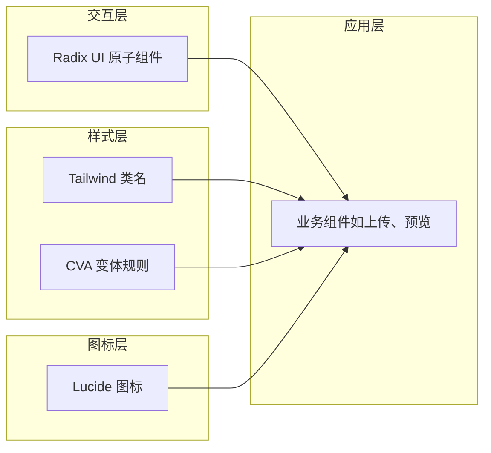
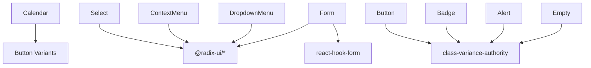

# 基础UI组件库

<cite>
**本文引用的文件**
- [components/ui/button.tsx](file://components/ui/button.tsx)
- [components/ui/input.tsx](file://components/ui/input.tsx)
- [components/ui/dialog.tsx](file://components/ui/dialog.tsx)
- [components/ui/card.tsx](file://components/ui/card.tsx)
- [components/ui/form.tsx](file://components/ui/form.tsx)
- [components/ui/select.tsx](file://components/ui/select.tsx)
- [components/ui/tabs.tsx](file://components/ui/tabs.tsx)
- [components/ui/badge.tsx](file://components/ui/badge.tsx)
- [components/ui/alert.tsx](file://components/ui/alert.tsx)
- [components/ui/avatar.tsx](file://components/ui/avatar.tsx)
- [components/ui/breadcrumb.tsx](file://components/ui/breadcrumb.tsx)
- [components/ui/calendar.tsx](file://components/ui/calendar.tsx)
- [components/ui/checkbox.tsx](file://components/ui/checkbox.tsx)
- [components/ui/context-menu.tsx](file://components/ui/context-menu.tsx)
- [components/ui/dropdown-menu.tsx](file://components/ui/dropdown-menu.tsx)
- [components/ui/empty.tsx](file://components/ui/empty.tsx)
</cite>

## 目录
1. [简介](#简介)
2. [项目结构](#项目结构)
3. [核心组件](#核心组件)
4. [架构总览](#架构总览)
5. [组件详解](#组件详解)
6. [依赖关系分析](#依赖关系分析)
7. [性能与可访问性](#性能与可访问性)
8. [故障排查指南](#故障排查指南)
9. [结论](#结论)
10. [附录：属性与变体速查](#附录属性与变体速查)

## 简介
本文件为 FontMin 字体子集化工具的基础 UI 组件库文档，聚焦于基于 Radix UI 与 Tailwind CSS 的组件体系。内容涵盖组件的职责边界、属性与变体、尺寸选项、状态管理、事件处理、无障碍实现、响应式设计与跨浏览器兼容性、样式定制与主题支持、动画效果以及组件组合与集成方式。目标是帮助开发者快速理解并正确使用这些基础组件。

## 项目结构
组件库位于 components/ui 目录下，采用“按功能分层”的组织方式，每个组件独立封装，统一通过 cn 工具函数合并类名，并以 data-slot 标记用于调试与测试。Radix UI 提供语义化与可访问性的基础交互，Tailwind CSS 提供一致的视觉与布局能力。

```mermaid
graph TB
subgraph "组件层"
btn["按钮 Button"]
inp["输入框 Input"]
dlg["对话框 Dialog"]
card["卡片 Card"]
form["表单 Form"]
sel["选择器 Select"]
tab["标签页 Tabs"]
bge["徽章 Badge"]
alt["警示 Alert"]
av["头像 Avatar"]
brc["面包屑 Breadcrumb"]
cal["日历 Calendar"]
cbx["复选框 Checkbox"]
ctx["上下文菜单 ContextMenu"]
ddm["下拉菜单 DropdownMenu"]
emp["空态 Empty"]
end
subgraph "基础库"
radix["Radix UI"]
tw["Tailwind CSS"]
cva["class-variance-authority"]
lucide["Lucide 图标"]
end
btn --> radix
inp --> radix
dlg --> radix
card --> radix
form --> radix
sel --> radix
tab --> radix
bge --> radix
alt --> radix
av --> radix
brc --> radix
cal --> radix
cbx --> radix
ctx --> radix
ddm --> radix
emp --> radix
btn --> tw
inp --> tw
dlg --> tw
card --> tw
form --> tw
sel --> tw
tab --> tw
bge --> tw
alt --> tw
av --> tw
brc --> tw
cal --> tw
cbx --> tw
ctx --> tw
ddm --> tw
emp --> tw
btn --> cva
bge --> cva
alt --> cva
emp --> cva
sel --> lucide
dlg --> lucide
tab --> lucide
ctx --> lucide
ddm --> lucide
cal --> lucide
cbx --> lucide
```

图表来源
- [components/ui/button.tsx](file://components/ui/button.tsx#L1-L61)
- [components/ui/dialog.tsx](file://components/ui/dialog.tsx#L1-L144)
- [components/ui/card.tsx](file://components/ui/card.tsx#L1-L93)
- [components/ui/form.tsx](file://components/ui/form.tsx#L1-L168)
- [components/ui/select.tsx](file://components/ui/select.tsx#L1-L186)
- [components/ui/tabs.tsx](file://components/ui/tabs.tsx#L1-L67)
- [components/ui/badge.tsx](file://components/ui/badge.tsx#L1-L47)
- [components/ui/alert.tsx](file://components/ui/alert.tsx#L1-L67)
- [components/ui/avatar.tsx](file://components/ui/avatar.tsx#L1-L54)
- [components/ui/breadcrumb.tsx](file://components/ui/breadcrumb.tsx#L1-L110)
- [components/ui/calendar.tsx](file://components/ui/calendar.tsx#L1-L214)
- [components/ui/checkbox.tsx](file://components/ui/checkbox.tsx#L1-L33)
- [components/ui/context-menu.tsx](file://components/ui/context-menu.tsx#L1-L253)
- [components/ui/dropdown-menu.tsx](file://components/ui/dropdown-menu.tsx#L1-L258)
- [components/ui/empty.tsx](file://components/ui/empty.tsx#L1-L105)

章节来源
- [components/ui/button.tsx](file://components/ui/button.tsx#L1-L61)
- [components/ui/dialog.tsx](file://components/ui/dialog.tsx#L1-L144)
- [components/ui/card.tsx](file://components/ui/card.tsx#L1-L93)
- [components/ui/form.tsx](file://components/ui/form.tsx#L1-L168)
- [components/ui/select.tsx](file://components/ui/select.tsx#L1-L186)
- [components/ui/tabs.tsx](file://components/ui/tabs.tsx#L1-L67)
- [components/ui/badge.tsx](file://components/ui/badge.tsx#L1-L47)
- [components/ui/alert.tsx](file://components/ui/alert.tsx#L1-L67)
- [components/ui/avatar.tsx](file://components/ui/avatar.tsx#L1-L54)
- [components/ui/breadcrumb.tsx](file://components/ui/breadcrumb.tsx#L1-L110)
- [components/ui/calendar.tsx](file://components/ui/calendar.tsx#L1-L214)
- [components/ui/checkbox.tsx](file://components/ui/checkbox.tsx#L1-L33)
- [components/ui/context-menu.tsx](file://components/ui/context-menu.tsx#L1-L253)
- [components/ui/dropdown-menu.tsx](file://components/ui/dropdown-menu.tsx#L1-L258)
- [components/ui/empty.tsx](file://components/ui/empty.tsx#L1-L105)

## 核心组件
- 按钮 Button：支持多种变体与尺寸，具备可插槽渲染与无障碍焦点环。
- 输入 Input：统一的输入样式与聚焦/无效态视觉反馈。
- 对话框 Dialog：基于 Radix Dialog 的完整容器与子组件集合。
- 卡片 Card：结构化的内容容器，支持头部、标题、描述、操作区、内容与底部。
- 表单 Form：与 react-hook-form 集成的表单上下文与无障碍关联。
- 选择器 Select：触发器、内容、项、滚动控制等子组件。
- 标签页 Tabs：列表、触发器、内容区域。
- 徽章 Badge：强调性标签，支持变体。
- 警示 Alert：默认与破坏性两类。
- 头像 Avatar：头像根、图片与占位。
- 面包屑 Breadcrumb：导航层级指示。
- 日历 Calendar：与 react-day-picker 集成的日历，支持按钮变体注入。
- 复选框 Checkbox：原生可访问性与选中态。
- 上下文菜单 ContextMenu：多级菜单与项变体。
- 下拉菜单 DropdownMenu：常用菜单场景。
- 空态 Empty：默认与图标两种媒体变体。

章节来源
- [components/ui/button.tsx](file://components/ui/button.tsx#L1-L61)
- [components/ui/input.tsx](file://components/ui/input.tsx#L1-L22)
- [components/ui/dialog.tsx](file://components/ui/dialog.tsx#L1-L144)
- [components/ui/card.tsx](file://components/ui/card.tsx#L1-L93)
- [components/ui/form.tsx](file://components/ui/form.tsx#L1-L168)
- [components/ui/select.tsx](file://components/ui/select.tsx#L1-L186)
- [components/ui/tabs.tsx](file://components/ui/tabs.tsx#L1-L67)
- [components/ui/badge.tsx](file://components/ui/badge.tsx#L1-L47)
- [components/ui/alert.tsx](file://components/ui/alert.tsx#L1-L67)
- [components/ui/avatar.tsx](file://components/ui/avatar.tsx#L1-L54)
- [components/ui/breadcrumb.tsx](file://components/ui/breadcrumb.tsx#L1-L110)
- [components/ui/calendar.tsx](file://components/ui/calendar.tsx#L1-L214)
- [components/ui/checkbox.tsx](file://components/ui/checkbox.tsx#L1-L33)
- [components/ui/context-menu.tsx](file://components/ui/context-menu.tsx#L1-L253)
- [components/ui/dropdown-menu.tsx](file://components/ui/dropdown-menu.tsx#L1-L258)
- [components/ui/empty.tsx](file://components/ui/empty.tsx#L1-L105)

## 架构总览
组件库遵循“最小公共父集”原则：所有组件均通过 cn 合并类名，统一使用 data-slot 标记；交互由 Radix UI 提供，视觉由 Tailwind CSS 提供；部分组件引入 class-variance-authority 实现变体与尺寸组合；图标来自 Lucide React。

图表来源
- [components/ui/button.tsx](file://components/ui/button.tsx#L7-L37)
- [components/ui/dialog.tsx](file://components/ui/dialog.tsx#L33-L47)
- [components/ui/select.tsx](file://components/ui/select.tsx#L27-L51)
- [components/ui/tabs.tsx](file://components/ui/tabs.tsx#L21-L51)
- [components/ui/calendar.tsx](file://components/ui/calendar.tsx#L12-L126)
- [components/ui/context-menu.tsx](file://components/ui/context-menu.tsx#L96-L112)
- [components/ui/dropdown-menu.tsx](file://components/ui/dropdown-menu.tsx#L34-L52)

## 组件详解

### 按钮 Button
- 属性
  - className：扩展类名
  - variant：变体（default、destructive、outline、secondary、ghost、link）
  - size：尺寸（default、sm、lg、icon、icon-sm、icon-lg）
  - asChild：是否以子节点渲染（借助 @radix-ui/react-slot）
  - 其余继承自原生 button
- 关键特性
  - 使用 class-variance-authority 定义变体与尺寸组合
  - 支持内嵌 svg 自适应尺寸与指针事件
  - 聚焦态提供 ring 边框与可见焦点环
  - 无效态与 aria-invalid 绑定
- 最佳实践
  - 优先使用变体表达语义，避免直接覆盖颜色
  - 图标按钮建议使用 icon/icon-sm 尺寸
  - 需要包裹时使用 asChild 保持语义与可访问性

章节来源
- [components/ui/button.tsx](file://components/ui/button.tsx#L1-L61)

### 输入 Input
- 属性
  - className：扩展类名
  - type：原生 input 类型
  - 其余继承自原生 input
- 关键特性
  - 统一圆角、边框、阴影与过渡
  - 聚焦态提供 ring 边框与可见焦点环
  - 无效态与 aria-invalid 绑定
  - placeholder 文本与文件选择文本颜色区分
- 最佳实践
  - 与 FormLabel/FormControl 配合使用以获得无障碍关联
  - 需要图标或后缀时，建议使用 Input Group 或 Button 组合

章节来源
- [components/ui/input.tsx](file://components/ui/input.tsx#L1-L22)

### 对话框 Dialog
- 子组件
  - Dialog、DialogTrigger、DialogPortal、DialogClose、DialogOverlay、DialogContent、DialogHeader、DialogFooter、DialogTitle、DialogDescription
- 属性要点
  - DialogOverlay：开启动画淡入/淡出
  - DialogContent：居中网格布局，支持关闭按钮开关
  - 关闭按钮：带 sr-only 文本，确保可访问性
- 最佳实践
  - 内容区建议使用 DialogHeader/DialogFooter 组织标题与操作
  - 需要外部关闭时使用 DialogTrigger/DialogClose

章节来源
- [components/ui/dialog.tsx](file://components/ui/dialog.tsx#L1-L144)

### 卡片 Card
- 子组件
  - Card、CardHeader、CardTitle、CardDescription、CardAction、CardContent、CardFooter
- 特点
  - CardHeader 支持 action 区域自动栅格布局
  - 通过 data-slot 标记便于调试与测试
- 最佳实践
  - 将标题与描述置于 CardHeader，操作按钮放入 CardAction
  - 内容与脚注分别使用 CardContent/CardFooter

章节来源
- [components/ui/card.tsx](file://components/ui/card.tsx#L1-L93)

### 表单 Form
- 子组件
  - Form、FormField、FormItem、FormLabel、FormControl、FormDescription、FormMessage
- 关键机制
  - useFormField：读取字段状态并与无障碍 ID 关联
  - FormControl：自动注入 aria-describedby 与 aria-invalid
  - FormLabel：根据错误状态切换文本色
- 最佳实践
  - 所有表单项必须包裹在 FormItem 中
  - 使用 FormField 将 Controller 与上下文绑定
  - 错误信息通过 FormMessage 渲染

章节来源
- [components/ui/form.tsx](file://components/ui/form.tsx#L1-L168)

### 选择器 Select
- 子组件
  - Select、SelectGroup、SelectValue、SelectTrigger、SelectContent、SelectLabel、SelectItem、SelectSeparator、SelectScrollUpButton、SelectScrollDownButton
- 属性要点
  - SelectTrigger 支持 size（sm/default）
  - SelectContent 支持 position（popper 等）
  - 项支持内嵌图标与指示器
- 最佳实践
  - 触发器高度与项对齐，使用 data-size 控制尺寸
  - 长列表配合滚动按钮提升可用性

章节来源
- [components/ui/select.tsx](file://components/ui/select.tsx#L1-L186)

### 标签页 Tabs
- 子组件
  - Tabs、TabsList、TabsTrigger、TabsContent
- 特点
  - TabsList 采用背景色与圆角容器
  - TabsTrigger 在激活态显示阴影与边框
- 最佳实践
  - 触发器数量较多时，使用 flex-wrap 与合适的 gap
  - 内容区使用 TabsContent 承载复杂视图

章节来源
- [components/ui/tabs.tsx](file://components/ui/tabs.tsx#L1-L67)

### 徽章 Badge
- 属性
  - variant：变体（default、secondary、destructive、outline）
  - asChild：可作为子节点渲染
- 特点
  - 支持内嵌 svg，自动缩放与指针事件处理
  - 无效态与焦点环联动
- 最佳实践
  - 用于状态提示与标签分类
  - 与链接组合时注意 hover 行为的一致性

章节来源
- [components/ui/badge.tsx](file://components/ui/badge.tsx#L1-L47)

### 警示 Alert
- 属性
  - variant：default、destructive
- 特点
  - 默认与破坏性两类，破坏性会同步影响描述文本色
  - 支持内嵌图标，自动网格布局
- 最佳实践
  - 错误信息使用 destructive 变体
  - 标题与描述分离，便于阅读

章节来源
- [components/ui/alert.tsx](file://components/ui/alert.tsx#L1-L67)

### 头像 Avatar
- 子组件
  - Avatar、AvatarImage、AvatarFallback
- 特点
  - 根据数据槽标记，便于测试与调试
  - 占位 fallback 提供默认样式
- 最佳实践
  - 与用户信息、评论等场景结合
  - 注意图片加载失败时的 fallback 显示

章节来源
- [components/ui/avatar.tsx](file://components/ui/avatar.tsx#L1-L54)

### 面包屑 Breadcrumb
- 子组件
  - Breadcrumb、BreadcrumbList、BreadcrumbItem、BreadcrumbLink、BreadcrumbPage、BreadcrumbSeparator、BreadcrumbEllipsis
- 特点
  - 支持 asChild 渲染链接
  - 分隔符与省略号图标可定制
- 最佳实践
  - 页面层级较深时使用 BreadcrumbEllipsis
  - 当前页面使用 BreadcrumbPage 并设置 aria-current

章节来源
- [components/ui/breadcrumb.tsx](file://components/ui/breadcrumb.tsx#L1-L110)

### 日历 Calendar
- 属性
  - buttonVariant：注入到左右导航按钮的变体
  - showOutsideDays、captionLayout、formatters、components 等透传给 react-day-picker
- 特点
  - 与 Button 的变体系统无缝衔接
  - 支持 RTL 翻转方向图标
  - 通过 data-day 标记日期单元
- 最佳实践
  - 与表单结合时，使用 FormControl 包裹
  - 自定义组件时，优先复用 Button 的尺寸与变体

章节来源
- [components/ui/calendar.tsx](file://components/ui/calendar.tsx#L1-L214)

### 复选框 Checkbox
- 属性
  - className：扩展类名
  - 其余继承自原生 checkbox
- 特点
  - 选中态自动切换背景色与文本色
  - 聚焦态提供 ring 边框与可见焦点环
  - 无效态与 aria-invalid 绑定
- 最佳实践
  - 与 FormLabel 关联，确保可访问性
  - 大面积选择场景建议使用 Switch 或 Radio Group

章节来源
- [components/ui/checkbox.tsx](file://components/ui/checkbox.tsx#L1-L33)

### 上下文菜单 ContextMenu
- 子组件
  - ContextMenu、ContextMenuTrigger、ContextMenuPortal、ContextMenuSub、ContextMenuSubTrigger、ContextMenuSubContent、ContextMenuContent、ContextMenuItem、ContextMenuCheckboxItem、ContextMenuRadioItem、ContextMenuLabel、ContextMenuSeparator、ContextMenuShortcut、ContextMenuGroup、ContextMenuPortal、ContextMenuRadioGroup
- 特点
  - 支持多级子菜单
  - 项支持 destructive 变体与快捷键展示
- 最佳实践
  - 与右键触发结合，避免键盘不可达
  - 大量项时使用滚动区域

章节来源
- [components/ui/context-menu.tsx](file://components/ui/context-menu.tsx#L1-L253)

### 下拉菜单 DropdownMenu
- 子组件
  - DropdownMenu、DropdownMenuPortal、DropdownMenuTrigger、DropdownMenuContent、DropdownMenuGroup、DropdownMenuLabel、DropdownMenuItem、DropdownMenuCheckboxItem、DropdownMenuRadioGroup、DropdownMenuRadioItem、DropdownMenuSeparator、DropdownMenuShortcut、DropdownMenuSub、DropdownMenuSubTrigger、DropdownMenuSubContent
- 特点
  - 与 ContextMenu 类似的子组件体系
  - 支持 inset 缩进与 destructive 变体
- 最佳实践
  - 顶部/右侧弹出时调整 sideOffset
  - 与按钮组合时确保触发器可聚焦

章节来源
- [components/ui/dropdown-menu.tsx](file://components/ui/dropdown-menu.tsx#L1-L258)

### 空态 Empty
- 子组件
  - Empty、EmptyHeader、EmptyTitle、EmptyDescription、EmptyContent、EmptyMedia（含 variant：default、icon）
- 特点
  - 默认与图标两种媒体变体
  - 描述文本支持链接与下划线
- 最佳实践
  - 列表为空时使用 Empty
  - 图标变体适合强调提示

章节来源
- [components/ui/empty.tsx](file://components/ui/empty.tsx#L1-L105)

## 依赖关系分析
- 组件间耦合
  - Calendar 依赖 Button 的变体系统
  - Select/ContextMenu/DropdownMenu 共享相似的 Item/Sub/Content 结构
  - Form 与 Label/Slot 深度集成
- 外部依赖
  - Radix UI：提供可访问性与状态管理
  - Tailwind CSS：提供原子化样式
  - class-variance-authority：提供变体与尺寸组合
  - Lucide：提供图标
- 潜在循环依赖
  - 组件库内部无循环导入，均为单向依赖

图表来源
- [components/ui/calendar.tsx](file://components/ui/calendar.tsx#L12-L126)
- [components/ui/select.tsx](file://components/ui/select.tsx#L1-L186)
- [components/ui/context-menu.tsx](file://components/ui/context-menu.tsx#L1-L253)
- [components/ui/dropdown-menu.tsx](file://components/ui/dropdown-menu.tsx#L1-L258)
- [components/ui/form.tsx](file://components/ui/form.tsx#L1-L168)
- [components/ui/button.tsx](file://components/ui/button.tsx#L7-L37)
- [components/ui/badge.tsx](file://components/ui/badge.tsx#L7-L26)
- [components/ui/alert.tsx](file://components/ui/alert.tsx#L6-L20)
- [components/ui/empty.tsx](file://components/ui/empty.tsx#L31-L44)

章节来源
- [components/ui/calendar.tsx](file://components/ui/calendar.tsx#L1-L214)
- [components/ui/select.tsx](file://components/ui/select.tsx#L1-L186)
- [components/ui/context-menu.tsx](file://components/ui/context-menu.tsx#L1-L253)
- [components/ui/dropdown-menu.tsx](file://components/ui/dropdown-menu.tsx#L1-L258)
- [components/ui/form.tsx](file://components/ui/form.tsx#L1-L168)
- [components/ui/button.tsx](file://components/ui/button.tsx#L1-L61)
- [components/ui/badge.tsx](file://components/ui/badge.tsx#L1-L47)
- [components/ui/alert.tsx](file://components/ui/alert.tsx#L1-L67)
- [components/ui/empty.tsx](file://components/ui/empty.tsx#L1-L105)

## 性能与可访问性
- 性能
  - 组件普遍采用轻量渲染与最小状态更新（如 Dialog、Select、Tabs）
  - 动画通过 data-state 开关，避免不必要的重排
- 可访问性
  - 所有交互组件均提供焦点可见性与键盘可达性
  - 表单组件通过 aria-describedby 与 aria-invalid 关联错误信息
  - Dialog/ContextMenu/Select 等提供 Portal 渲染，避免层级遮挡
- 响应式与跨浏览器
  - Tailwind 断点与 Flex/Grid 布局适配移动端
  - Radix UI 在各浏览器提供一致的可访问行为
- 主题与动画
  - 深色模式通过 dark: 前缀类名适配
  - 动画通过 data-state 与透明度/缩放过渡实现

[本节为通用指导，不直接分析具体文件]

## 故障排查指南
- 表单错误未显示
  - 检查是否在 FormItem 中使用了 FormMessage
  - 确认 FormControl 是否正确注入 aria-describedby 与 aria-invalid
- 对话框无法关闭
  - 确认 DialogContent 是否包裹 DialogPortal/Overlay
  - 检查关闭按钮是否使用 DialogClose
- 选择器项无法选中
  - 确认 SelectItem 是否在 SelectContent 内
  - 检查是否正确使用 SelectValue
- 日历导航按钮样式异常
  - 确认 buttonVariant 是否传入且与 Button 变体一致
- 复选框状态不同步
  - 确认受控/非受控模式与原生属性一致

章节来源
- [components/ui/form.tsx](file://components/ui/form.tsx#L107-L123)
- [components/ui/dialog.tsx](file://components/ui/dialog.tsx#L56-L81)
- [components/ui/select.tsx](file://components/ui/select.tsx#L101-L123)
- [components/ui/calendar.tsx](file://components/ui/calendar.tsx#L54-L63)
- [components/ui/checkbox.tsx](file://components/ui/checkbox.tsx#L14-L29)

## 结论
该组件库以 Radix UI 为核心提供可访问性与状态管理，以 Tailwind CSS 提供一致的视觉语言，并通过 class-variance-authority 实现灵活的变体与尺寸组合。组件结构清晰、职责明确，易于扩展与维护。建议在实际项目中遵循本文档的属性与最佳实践，确保一致的用户体验与无障碍体验。

[本节为总结性内容，不直接分析具体文件]

## 附录：属性与变体速查
- Button
  - 变体：default、destructive、outline、secondary、ghost、link
  - 尺寸：default、sm、lg、icon、icon-sm、icon-lg
- Badge
  - 变体：default、secondary、destructive、outline
- Alert
  - 变体：default、destructive
- SelectTrigger
  - size：sm、default
- ContextMenuItem / DropdownMenuItem
  - variant：default、destructive
- Empty
  - EmptyMedia variant：default、icon

章节来源
- [components/ui/button.tsx](file://components/ui/button.tsx#L10-L30)
- [components/ui/badge.tsx](file://components/ui/badge.tsx#L10-L21)
- [components/ui/alert.tsx](file://components/ui/alert.tsx#L9-L18)
- [components/ui/select.tsx](file://components/ui/select.tsx#L29-L34)
- [components/ui/context-menu.tsx](file://components/ui/context-menu.tsx#L117-L131)
- [components/ui/dropdown-menu.tsx](file://components/ui/dropdown-menu.tsx#L65-L70)
- [components/ui/empty.tsx](file://components/ui/empty.tsx#L34-L43)