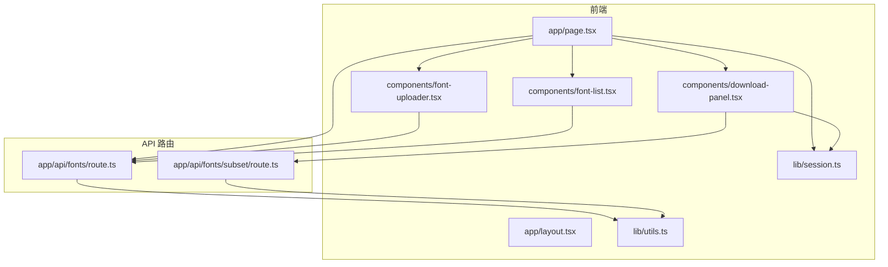
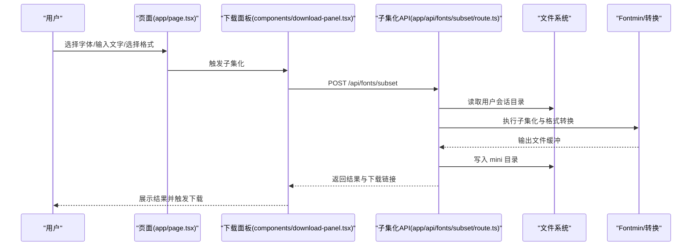
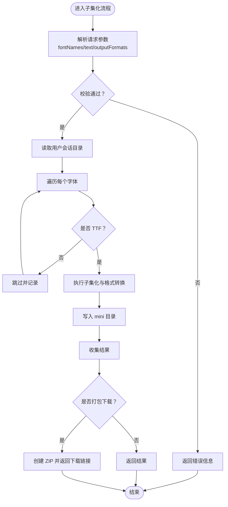
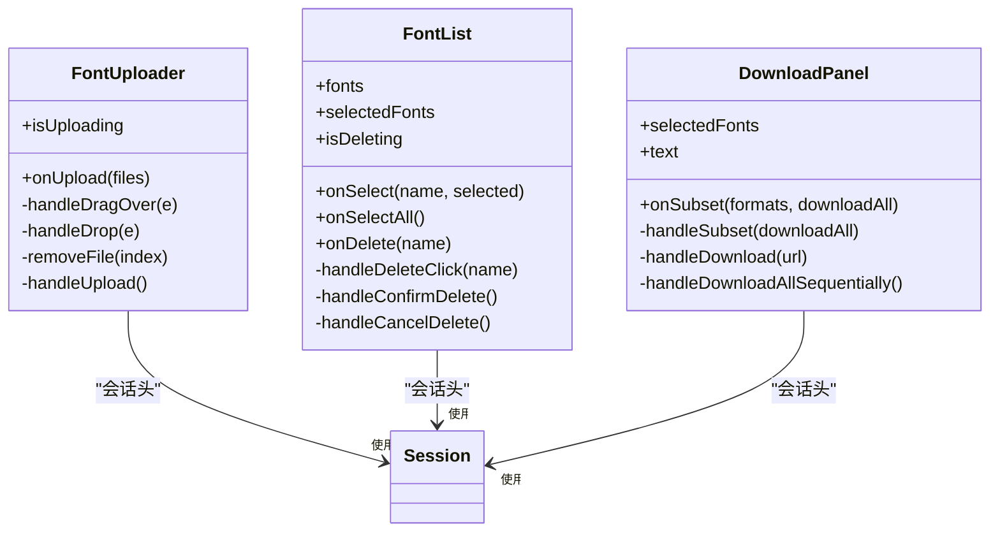
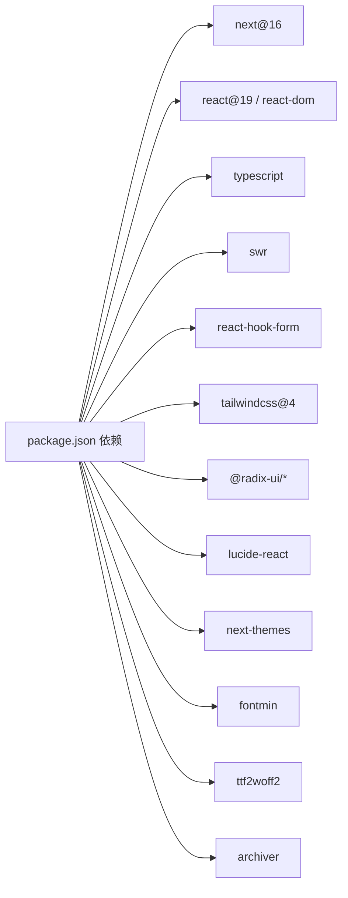

# 代码规范与测试

<cite>
**本文引用的文件**
- [README.md](file://README.md)
- [package.json](file://package.json)
- [tsconfig.json](file://tsconfig.json)
- [test-api.js](file://test-api.js)
- [types/fontmin.d.ts](file://types/fontmin.d.ts)
- [app/page.tsx](file://app/page.tsx)
- [app/layout.tsx](file://app/layout.tsx)
- [components/font-uploader.tsx](file://components/font-uploader.tsx)
- [components/font-list.tsx](file://components/font-list.tsx)
- [components/download-panel.tsx](file://components/download-panel.tsx)
- [app/api/fonts/route.ts](file://app/api/fonts/route.ts)
- [app/api/fonts/subset/route.ts](file://app/api/fonts/subset/route.ts)
- [lib/utils.ts](file://lib/utils.ts)
- [lib/session.ts](file://lib/session.ts)
</cite>

## 目录
1. [引言](#引言)
2. [项目结构](#项目结构)
3. [核心组件](#核心组件)
4. [架构总览](#架构总览)
5. [详细组件分析](#详细组件分析)
6. [依赖分析](#依赖分析)
7. [性能考虑](#性能考虑)
8. [故障排查指南](#故障排查指南)
9. [结论](#结论)
10. [附录](#附录)

## 引言
本指南面向 FontMin 字体子集化工具的开发与测试团队，提供统一的 TypeScript 编码规范、React 组件开发规范、代码格式化工具配置、单元与集成测试策略、代码审查清单与质量保证流程，以及性能测试与内存泄漏检测方法。目标是提升代码一致性、可维护性与稳定性，并为团队协作提供明确的工作标准。

## 项目结构
项目采用 Next.js App Router 结构，前端组件位于 components 与 app 目录，API 路由位于 app/api 下，类型声明位于 types，通用工具与会话逻辑位于 lib。整体组织清晰，职责分离明确。

图表来源
- [app/page.tsx](file://app/page.tsx#L1-L279)
- [app/layout.tsx](file://app/layout.tsx#L1-L44)
- [components/font-uploader.tsx](file://components/font-uploader.tsx#L1-L166)
- [components/font-list.tsx](file://components/font-list.tsx#L1-L159)
- [components/download-panel.tsx](file://components/download-panel.tsx#L1-L295)
- [app/api/fonts/route.ts](file://app/api/fonts/route.ts#L1-L167)
- [app/api/fonts/subset/route.ts](file://app/api/fonts/subset/route.ts#L1-L366)
- [lib/utils.ts](file://lib/utils.ts#L1-L7)
- [lib/session.ts](file://lib/session.ts#L1-L34)

章节来源
- [README.md](file://README.md#L135-L160)
- [package.json](file://package.json#L1-L78)

## 核心组件
- 页面容器与状态管理：根页面负责会话头注入、字体列表拉取与子集化请求，使用 SWR 进行数据获取与缓存更新。
- 上传组件：支持拖拽与文件选择，过滤不支持格式，调用上传 API 并回显进度。
- 字体列表：展示已上传字体、全选/反选、删除确认对话框与删除状态反馈。
- 下载面板：选择输出格式、触发子集化、展示结果与下载链接，支持单个与打包下载。
- API 路由：提供字体上传、列出、删除与子集化处理，包含会话隔离与 TTF 转换链路。
- 工具与会话：通用类名合并工具与客户端会话 ID 生成。

章节来源
- [app/page.tsx](file://app/page.tsx#L1-L279)
- [components/font-uploader.tsx](file://components/font-uploader.tsx#L1-L166)
- [components/font-list.tsx](file://components/font-list.tsx#L1-L159)
- [components/download-panel.tsx](file://components/download-panel.tsx#L1-L295)
- [app/api/fonts/route.ts](file://app/api/fonts/route.ts#L1-L167)
- [app/api/fonts/subset/route.ts](file://app/api/fonts/subset/route.ts#L1-L366)
- [lib/utils.ts](file://lib/utils.ts#L1-L7)
- [lib/session.ts](file://lib/session.ts#L1-L34)

## 架构总览
系统采用前后端同构架构，前端通过 Next.js App Router 组织页面与 API 路由，API 路由基于 Next.js Server 端能力读写本地文件系统，结合 Fontmin 与 ttf2woff2 实现字体子集化与格式转换。

图表来源
- [app/page.tsx](file://app/page.tsx#L113-L145)
- [components/download-panel.tsx](file://components/download-panel.tsx#L68-L89)
- [app/api/fonts/subset/route.ts](file://app/api/fonts/subset/route.ts#L164-L366)

## 详细组件分析

### TypeScript 编码规范
- 严格类型检查
  - 启用严格模式与 noEmit，确保类型安全与编译期错误尽早暴露。
  - 使用路径别名 @/*，便于模块导入与路径迁移。
- 接口与类型定义
  - 明确 props 接口命名，如 FontUploaderProps、FontListProps、DownloadPanelProps。
  - 对外暴露的类型使用 export，避免内部实现泄露。
- 类型声明文件
  - 为第三方库（如 fontmin）提供模块声明，确保 IDE 与 TS 编译器正确识别插件签名与文件结构。
- 命名约定
  - 组件导出使用 PascalCase；变量与函数使用 camelCase；常量使用 UPPER_SNAKE_CASE。
  - 文件名与组件名一致，便于查找与引用。

章节来源
- [tsconfig.json](file://tsconfig.json#L1-L42)
- [components/font-uploader.tsx](file://components/font-uploader.tsx#L10-L13)
- [components/font-list.tsx](file://components/font-list.tsx#L25-L32)
- [components/download-panel.tsx](file://components/download-panel.tsx#L24-L28)
- [types/fontmin.d.ts](file://types/fontmin.d.ts#L1-L53)

### React 组件开发规范
- 函数组件与 Hooks
  - 使用函数组件与受控组件模式，避免类组件。
  - 合理拆分状态与副作用，将网络请求与 UI 逻辑分离。
  - 使用 useCallback 包裹事件处理器，减少子组件重渲染。
- 性能优化
  - 使用 React.memo 或稳定引用避免不必要的重渲染。
  - 控制列表渲染高度与滚动容器，限制长列表渲染范围。
  - 使用 Suspense 与懒加载（按需引入）优化首屏。
- 可访问性与样式
  - 使用语义化标签与 aria 属性，确保键盘可达与屏幕阅读器友好。
  - 通过 cn(...) 合并条件样式，保持样式一致性。

章节来源
- [app/page.tsx](file://app/page.tsx#L3-L103)
- [components/font-uploader.tsx](file://components/font-uploader.tsx#L17-L70)
- [components/font-list.tsx](file://components/font-list.tsx#L34-L58)
- [components/download-panel.tsx](file://components/download-panel.tsx#L44-L89)
- [lib/utils.ts](file://lib/utils.ts#L4-L6)

### API 路由与数据流
- 会话隔离
  - 通过请求头 x-font-session-id 识别用户会话，确保目录级隔离与数据互不可见。
- 上传与备份
  - 上传同时写入用户会话目录与永久备份目录，删除仅影响会话目录。
- 子集化处理
  - 仅支持 TTF 输入，其余格式通过转换链路生成；支持 WOFF/WOFF2/EOT/SVG 输出。
  - 支持批量处理与打包下载，返回每个文件的压缩比与下载链接。

图表来源
- [app/api/fonts/subset/route.ts](file://app/api/fonts/subset/route.ts#L164-L366)
- [app/api/fonts/route.ts](file://app/api/fonts/route.ts#L72-L127)

章节来源
- [app/api/fonts/route.ts](file://app/api/fonts/route.ts#L16-L34)
- [app/api/fonts/route.ts](file://app/api/fonts/route.ts#L36-L69)
- [app/api/fonts/route.ts](file://app/api/fonts/route.ts#L71-L127)
- [app/api/fonts/route.ts](file://app/api/fonts/route.ts#L129-L167)
- [app/api/fonts/subset/route.ts](file://app/api/fonts/subset/route.ts#L25-L29)
- [app/api/fonts/subset/route.ts](file://app/api/fonts/subset/route.ts#L31-L162)
- [app/api/fonts/subset/route.ts](file://app/api/fonts/subset/route.ts#L164-L366)

### 组件类图（代码级）

图表来源
- [components/font-uploader.tsx](file://components/font-uploader.tsx#L17-L70)
- [components/font-list.tsx](file://components/font-list.tsx#L34-L58)
- [components/download-panel.tsx](file://components/download-panel.tsx#L44-L89)
- [lib/session.ts](file://lib/session.ts#L1-L34)

章节来源
- [components/font-uploader.tsx](file://components/font-uploader.tsx#L1-L166)
- [components/font-list.tsx](file://components/font-list.tsx#L1-L159)
- [components/download-panel.tsx](file://components/download-panel.tsx#L1-L295)
- [lib/session.ts](file://lib/session.ts#L1-L34)

## 依赖分析
- 前端依赖
  - Next.js 16、React 19、TypeScript、SWR、React Hook Form、Tailwind CSS 4、Radix UI、Lucide React、next-themes 等。
- 字体处理依赖
  - fontmin、ttf2woff2、archiver。
- 开发依赖
  - TypeScript、Tailwind PostCSS 插件、ESLint（脚本中定义 lint）。

图表来源
- [package.json](file://package.json#L11-L66)

章节来源
- [package.json](file://package.json#L1-L78)

## 性能考虑
- 前端性能
  - 使用 SWR 缓存与增量更新，避免重复请求。
  - 列表滚动容器限制高度，减少 DOM 节点数量。
  - 仅在必要时触发重渲染，使用稳定回调与条件渲染。
- 后端性能
  - 子集化与转换为 CPU 密集型任务，建议限制并发与超时。
  - 使用流式写入与压缩级别优化，降低 I/O 压力。
- 资源与内存
  - 大文件处理时注意内存峰值，及时释放中间缓冲。
  - 定期清理临时目录，避免磁盘与 inode 占满。

## 故障排查指南
- 常见问题定位
  - 会话缺失：检查请求头 x-font-session-id 是否正确传递。
  - 字体格式不支持：确认上传为 TTF，否则会被跳过并返回提示。
  - 文件不存在：确认用户会话目录存在且包含目标文件。
- 日志与错误响应
  - API 路由包含详细的 console 日志与结构化错误响应，便于定位。
  - 前端对非 JSON 响应进行降级处理，打印前 500 字符辅助诊断。

章节来源
- [app/api/fonts/route.ts](file://app/api/fonts/route.ts#L16-L20)
- [app/api/fonts/route.ts](file://app/api/fonts/route.ts#L129-L167)
- [app/api/fonts/subset/route.ts](file://app/api/fonts/subset/route.ts#L164-L366)
- [test-api.js](file://test-api.js#L1-L36)

## 结论
本指南提供了从编码风格、组件开发、API 设计到测试与性能保障的完整标准。遵循这些规范与流程，可显著提升代码质量、开发效率与系统稳定性，为 FontMin 的持续演进奠定坚实基础。

## 附录

### TypeScript 编码规范要点
- 严格模式与 noEmit
- 路径别名 @/*
- Props 接口命名与类型导出
- 第三方库模块声明与类型补全

章节来源
- [tsconfig.json](file://tsconfig.json#L20-L29)
- [types/fontmin.d.ts](file://types/fontmin.d.ts#L1-L53)

### React 组件开发规范要点
- 函数组件与受控组件
- useCallback 与状态拆分
- 性能优化与可访问性
- cn(...) 样式合并

章节来源
- [app/page.tsx](file://app/page.tsx#L3-L103)
- [lib/utils.ts](file://lib/utils.ts#L4-L6)

### 代码格式化与质量工具
- ESLint：脚本中已定义 lint 命令，建议配合 Prettier 与编辑器钩子统一格式。
- TypeScript：严格模式与 noEmit 确保类型安全。
- PostCSS/Tailwind：按需引入与原子化样式，减少冗余。

章节来源
- [package.json](file://package.json#L5-L9)
- [tsconfig.json](file://tsconfig.json#L11-L12)

### 单元测试与集成测试指南
- 单元测试
  - 针对纯函数与工具函数（如格式化、会话 ID 生成、文件大小格式化）编写断言。
  - 使用 Jest 或 Vitest，模拟外部依赖（如文件系统、网络请求）。
- 集成测试
  - 使用 test-api.js 作为参考，构造真实请求场景，验证 API 行为与响应结构。
  - 关注边界条件：空输入、无效会话、不支持格式、大文本与多字体批量处理。
  - 自动化：将测试脚本纳入 CI，确保每次提交均执行。

章节来源
- [test-api.js](file://test-api.js#L1-L36)
- [app/api/fonts/subset/route.ts](file://app/api/fonts/subset/route.ts#L164-L366)

### 代码审查清单
- 类型安全：接口定义完整，未使用 any/unknown。
- 组件健壮性：边界值处理、错误分支、空状态与加载状态。
- 性能：避免不必要的重渲染，控制副作用与资源占用。
- 安全：输入校验、路径拼接安全、会话隔离有效。
- 文档与注释：关键流程与复杂逻辑具备说明。

### 质量保证流程
- 提交前检查：格式化、类型检查、单元测试通过。
- 合并与部署：CI 自动化测试与构建，部署后回归验证。
- 监控与日志：API 错误日志、性能指标与告警阈值。

### 性能测试与内存泄漏检测
- 性能测试
  - 使用 Lighthouse 或 Web Vitals 工具评估首屏与交互性能。
  - 对子集化 API 进行压力测试，记录吞吐量与延迟。
- 内存泄漏检测
  - 使用浏览器开发者工具的内存面板，观察长时间使用后的堆增长。
  - 关注事件监听器、定时器与闭包引用，确保在组件卸载时清理。