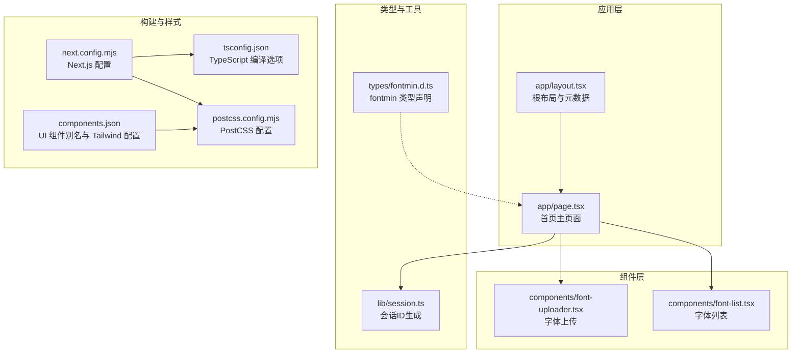
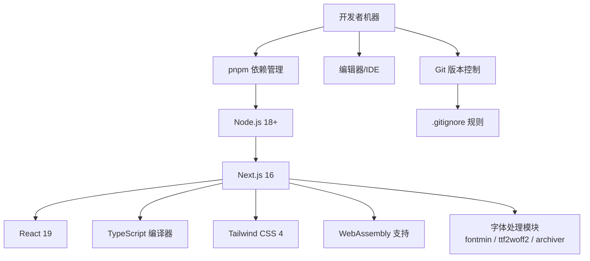
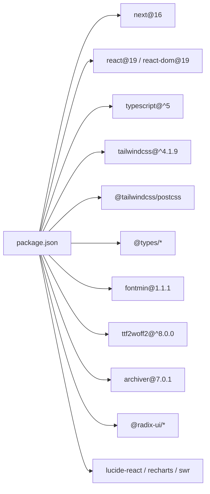

# 开发环境搭建

<cite>
**本文引用的文件**
- [package.json](file://package.json)
- [next.config.mjs](file://next.config.mjs)
- [tsconfig.json](file://tsconfig.json)
- [postcss.config.mjs](file://postcss.config.mjs)
- [components.json](file://components.json)
- [.gitignore](file://.gitignore)
- [README.md](file://README.md)
- [app/layout.tsx](file://app/layout.tsx)
- [app/page.tsx](file://app/page.tsx)
- [types/fontmin.d.ts](file://types/fontmin.d.ts)
- [components/font-uploader.tsx](file://components/font-uploader.tsx)
- [components/font-list.tsx](file://components/font-list.tsx)
- [lib/session.ts](file://lib/session.ts)
</cite>

## 目录
1. [简介](#简介)
2. [项目结构](#项目结构)
3. [核心组件](#核心组件)
4. [架构总览](#架构总览)
5. [详细组件分析](#详细组件分析)
6. [依赖关系分析](#依赖关系分析)
7. [性能考虑](#性能考虑)
8. [故障排除指南](#故障排除指南)
9. [结论](#结论)
10. [附录](#附录)

## 简介
本指南面向 FontMin 字体子集化工具的开发环境搭建，覆盖以下要点：
- Node.js 版本要求与依赖管理工具选择（pnpm）
- Next.js 16 与 React 19 的初始化配置
- TypeScript 配置文件的含义与自定义选项
- Tailwind CSS 4 的配置与样式系统使用
- WebAssembly 支持的配置方法
- 本地开发服务器启动与热重载
- Git 忽略文件配置
- 面向初学者的逐步安装与面向有经验开发者的快速配置

## 项目结构
该项目采用 Next.js App Router 结构，前端基于 React 19 与 TypeScript，UI 使用 Radix UI 与 Tailwind CSS 4，字体处理依赖 fontmin、ttf2woff2、archiver 等模块。

图表来源
- [app/layout.tsx](file://app/layout.tsx#L1-L44)
- [app/page.tsx](file://app/page.tsx#L1-L279)
- [components/font-uploader.tsx](file://components/font-uploader.tsx#L1-L166)
- [components/font-list.tsx](file://components/font-list.tsx#L1-L159)
- [types/fontmin.d.ts](file://types/fontmin.d.ts#L1-L53)
- [lib/session.ts](file://lib/session.ts#L1-L34)
- [next.config.mjs](file://next.config.mjs#L1-L44)
- [tsconfig.json](file://tsconfig.json#L1-L42)
- [postcss.config.mjs](file://postcss.config.mjs#L1-L9)
- [components.json](file://components.json#L1-L22)

章节来源
- [README.md](file://README.md#L135-L161)

## 核心组件
- Next.js 16 与 React 19：通过依赖声明与 TypeScript 配置体现，确保现代 React 生态与 App Router 支持。
- TypeScript：严格类型检查、增量编译、路径映射与插件集成。
- Tailwind CSS 4：通过 PostCSS 插件与组件别名配置启用原子化样式系统。
- WebAssembly 支持：通过 Next.js 自定义 Webpack 配置启用 asyncWebAssembly 并处理 .wasm 文件。
- 字体处理：fontmin、ttf2woff2、archiver 等模块配合服务端外部化策略。
- 会话隔离：基于客户端随机 ID 与服务端会话头传递，保障用户数据隔离。

章节来源
- [package.json](file://package.json#L51-L55)
- [tsconfig.json](file://tsconfig.json#L1-L42)
- [postcss.config.mjs](file://postcss.config.mjs#L1-L9)
- [components.json](file://components.json#L1-L22)
- [next.config.mjs](file://next.config.mjs#L14-L39)
- [lib/session.ts](file://lib/session.ts#L1-L34)

## 架构总览
下图展示开发环境的关键配置与交互：

图表来源
- [package.json](file://package.json#L46-L47)
- [next.config.mjs](file://next.config.mjs#L14-L39)
- [tsconfig.json](file://tsconfig.json#L1-L42)
- [postcss.config.mjs](file://postcss.config.mjs#L1-L9)
- [.gitignore](file://.gitignore#L1-L30)

## 详细组件分析

### Node.js 与依赖管理
- Node.js 版本要求：满足“18.0 或更高版本”。
- 依赖管理工具：推荐使用 pnpm 8.0 或更高版本，以获得更快的安装与更小的磁盘占用。
- 安装命令：使用 pnpm install 安装项目依赖。

章节来源
- [README.md](file://README.md#L46-L47)
- [README.md](file://README.md#L58-L60)
- [package.json](file://package.json#L1-L78)

### Next.js 初始化与配置
- Next.js 16 与 React 19：在依赖中明确指定版本，确保框架与运行时一致。
- 开发脚本：dev 脚本启用 Webpack 模式并监听端口 6739；start 脚本启动生产服务器。
- Webpack 配置：启用 asyncWebAssembly、layers；处理 .wasm 文件；服务端外部化 fontmin、ttf2woff2、archiver。
- TypeScript 配置：允许 JS、严格模式、ESNext 目标、Bundler 模块解析、TSX、路径映射等。
- PostCSS 配置：使用 @tailwindcss/postcss 插件。
- 组件别名：components.json 中配置 tailwind.css、基础颜色、前缀与 aliases。

章节来源
- [package.json](file://package.json#L51-L55)
- [package.json](file://package.json#L5-L10)
- [next.config.mjs](file://next.config.mjs#L14-L39)
- [tsconfig.json](file://tsconfig.json#L1-L42)
- [postcss.config.mjs](file://postcss.config.mjs#L1-L9)
- [components.json](file://components.json#L1-L22)

### TypeScript 配置详解
- lib：包含 dom、dom.iterable、esnext，确保 DOM 与 ES 能力可用。
- allowJs：允许混合 JavaScript 与 TypeScript。
- target：ES6，便于现代浏览器与打包器处理。
- skipLibCheck：跳过第三方库类型检查，提升构建速度。
- strict：开启严格模式，提高类型安全性。
- noEmit：不输出 JS，交由 Next.js/Bundler 处理。
- esModuleInterop：兼容 ESM 与 CommonJS。
- module/moduleResolution：esnext 与 bundler，适配现代打包器。
- resolveJsonModule：支持 JSON 模块导入。
- isolatedModules：与增量编译配合，提升开发体验。
- jsx：react-jsx，启用 React 18+ JSX 运行时。
- incremental：增量编译，减少重复类型检查。
- plugins：集成 Next.js TS 插件。
- paths：@/* 映射到项目根目录，统一相对路径。

章节来源
- [tsconfig.json](file://tsconfig.json#L2-L29)

### Tailwind CSS 4 配置与样式系统
- PostCSS 插件：通过 @tailwindcss/postcss 启用 Tailwind 功能。
- 组件别名：components.json 中配置 tailwind.css、基础色、CSS 变量开关与 aliases，便于全局样式与组件库统一管理。
- 样式入口：app/globals.css 作为全局样式入口，配合 Tailwind 指令使用。

章节来源
- [postcss.config.mjs](file://postcss.config.mjs#L1-L9)
- [components.json](file://components.json#L6-L12)
- [app/layout.tsx](file://app/layout.tsx#L5-L8)

### WebAssembly 支持配置
- Next.js 自定义 Webpack：启用 experiments.asyncWebAssembly 与 layers。
- .wasm 文件处理：将 type 设置为 asset/resource，确保正确打包与加载。
- 服务端外部化：对 fontmin、ttf2woff2、archiver 进行 externals 处理，避免在客户端打包这些原生/二进制依赖。

章节来源
- [next.config.mjs](file://next.config.mjs#L14-L39)
- [types/fontmin.d.ts](file://types/fontmin.d.ts#L1-L53)

### 本地开发服务器启动与热重载
- 启动开发服务器：使用 pnpm dev，默认监听端口 6739。
- 热重载：Next.js 内置 React Fast Refresh，修改组件与页面后自动更新。
- 端口与参数：dev 脚本包含 --webpack 与 -p 6739 参数，确保 Webpack 模式与指定端口。

章节来源
- [package.json](file://package.json#L7-L9)
- [README.md](file://README.md#L62-L69)

### Git 忽略文件配置
- 忽略目录与文件：node_modules、.next、out、build、调试日志、.env*、.vercel、TypeScript 构建信息、font-temp 等。
- 临时字体会话目录：/font-temp/ 用于用户会话数据，按需清理。

章节来源
- [.gitignore](file://.gitignore#L1-L30)

### 会话隔离与请求头
- 会话 ID 生成：lib/session.ts 在浏览器端生成随机 UUID，作为会话标识。
- 请求头传递：页面通过 x-font-session-id 头将会话 ID 传给 API 路由，实现用户数据隔离。

章节来源
- [lib/session.ts](file://lib/session.ts#L1-L34)
- [app/page.tsx](file://app/page.tsx#L14-L19)
- [app/page.tsx](file://app/page.tsx#L39-L44)
- [app/page.tsx](file://app/page.tsx#L70-L77)
- [app/page.tsx](file://app/page.tsx#L115-L126)

## 依赖关系分析

图表来源
- [package.json](file://package.json#L11-L66)

章节来源
- [package.json](file://package.json#L1-L78)

## 性能考虑
- 使用 pnpm 降低磁盘占用与安装时间。
- TypeScript 增量编译与严格模式平衡质量与速度。
- Next.js 16 默认使用 Webpack 模式以支持 WASM，有利于字体处理模块的稳定加载。
- Tailwind CSS 4 与 PostCSS 插件配合，按需生成样式，减少运行时开销。
- 会话隔离与静态资源分离，降低服务端压力。

## 故障排除指南
- Node.js 版本过低：升级至 18.0 或更高版本。
- pnpm 安装失败：检查网络与镜像源，或更换依赖管理工具。
- WASM 加载错误：确认 next.config.mjs 中已启用 asyncWebAssembly 并正确处理 .wasm 文件。
- 字体处理报错：检查 fontmin、ttf2woff2、archiver 是否正确安装且服务端已外部化。
- 端口冲突：修改 package.json 中的端口参数或关闭占用端口的进程。
- 样式不生效：确认 Tailwind CSS 4 插件与组件别名配置正确，重新构建项目。

章节来源
- [README.md](file://README.md#L46-L47)
- [next.config.mjs](file://next.config.mjs#L14-L39)
- [postcss.config.mjs](file://postcss.config.mjs#L1-L9)
- [components.json](file://components.json#L1-L22)
- [package.json](file://package.json#L5-L10)

## 结论
本指南提供了从零开始搭建 FontMin 开发环境的完整路径，涵盖 Node.js 与 pnpm、Next.js 16 与 React 19、TypeScript、Tailwind CSS 4、WebAssembly 支持、开发服务器与热重载、以及 Git 忽略规则。按照步骤操作，即可快速启动并高效开发字体子集化工具。

## 附录

### 初学者逐步安装
- 环境要求：安装 Node.js 18+ 与 pnpm 8+
- 克隆仓库并进入目录
- 安装依赖：pnpm install
- 启动开发：pnpm dev（默认端口 6739）
- 访问 http://localhost:6739

章节来源
- [README.md](file://README.md#L46-L47)
- [README.md](file://README.md#L51-L69)

### 有经验开发者快速配置
- 确认 Node.js 与 pnpm 版本满足要求
- 使用 pnpm install 安装依赖
- 直接运行 pnpm dev 启动 Webpack 模式
- 如需自定义端口，修改 package.json 中的 scripts.dev
- 若需调整 TypeScript 或 Tailwind 配置，参考 tsconfig.json 与 components.json

章节来源
- [package.json](file://package.json#L5-L10)
- [tsconfig.json](file://tsconfig.json#L1-L42)
- [components.json](file://components.json#L1-L22)