# 开发者指南

<cite>
**本文引用的文件**
- [README.md](file://README.md)
- [package.json](file://package.json)
- [tsconfig.json](file://tsconfig.json)
- [types/fontmin.d.ts](file://types/fontmin.d.ts)
- [hooks/use-toast.ts](file://hooks/use-toast.ts)
- [hooks/use-mobile.ts](file://hooks/use-mobile.ts)
- [app/layout.tsx](file://app/layout.tsx)
- [app/page.tsx](file://app/page.tsx)
- [components/theme-provider.tsx](file://components/theme-provider.tsx)
- [components/font-uploader.tsx](file://components/font-uploader.tsx)
- [components/font-list.tsx](file://components/font-list.tsx)
- [components/font-preview.tsx](file://components/font-preview.tsx)
- [components/download-panel.tsx](file://components/download-panel.tsx)
- [app/api/fonts/route.ts](file://app/api/fonts/route.ts)
- [app/api/fonts/subset/route.ts](file://app/api/fonts/subset/route.ts)
- [lib/session.ts](file://lib/session.ts)
- [lib/utils.ts](file://lib/utils.ts)
</cite>

## 目录
1. [简介](#简介)
2. [项目结构](#项目结构)
3. [核心组件](#核心组件)
4. [架构总览](#架构总览)
5. [详细组件分析](#详细组件分析)
6. [依赖关系分析](#依赖关系分析)
7. [性能考虑](#性能考虑)
8. [故障排查指南](#故障排查指南)
9. [结论](#结论)
10. [附录](#附录)

## 简介
本指南面向贡献者与维护者，系统讲解 FontMin 字体子集化工具的开发环境搭建、本地配置、调试工具、代码规范、新功能开发流程、自定义 Hook 使用与扩展机制、TypeScript 类型定义维护、组件开发标准流程与设计原则、测试策略与质量保障、性能优化技巧与重构建议，以及 Pull Request 流程与代码审查标准。

## 项目结构
项目采用 Next.js App Router 结构，前端组件位于 components 与 app 目录，API 路由位于 app/api，类型定义位于 types，会话与工具函数位于 lib，UI 基础组件基于 Radix UI 与 Tailwind CSS。

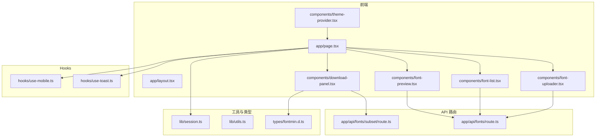

**图表来源**
- [app/layout.tsx](file://app/layout.tsx#L1-L44)
- [app/page.tsx](file://app/page.tsx#L1-L279)
- [components/theme-provider.tsx](file://components/theme-provider.tsx#L1-L12)
- [components/font-uploader.tsx](file://components/font-uploader.tsx#L1-L166)
- [components/font-list.tsx](file://components/font-list.tsx#L1-L159)
- [components/font-preview.tsx](file://components/font-preview.tsx#L1-L123)
- [components/download-panel.tsx](file://components/download-panel.tsx#L1-L295)
- [app/api/fonts/route.ts](file://app/api/fonts/route.ts#L1-L167)
- [app/api/fonts/subset/route.ts](file://app/api/fonts/subset/route.ts#L1-L366)
- [lib/session.ts](file://lib/session.ts#L1-L34)
- [lib/utils.ts](file://lib/utils.ts#L1-L7)
- [types/fontmin.d.ts](file://types/fontmin.d.ts#L1-L53)
- [hooks/use-toast.ts](file://hooks/use-toast.ts#L1-L192)
- [hooks/use-mobile.ts](file://hooks/use-mobile.ts#L1-L20)

**章节来源**
- [README.md](file://README.md#L135-L160)
- [package.json](file://package.json#L1-L78)

## 核心组件
- 页面与布局：根布局负责站点元信息与全局样式注入；首页页面整合上传、列表、预览与下载设置四大区域，并通过 SWR 获取与刷新字体列表。
- 字体上传组件：支持拖拽与文件选择，过滤合法格式，展示待上传文件列表，触发上传。
- 字体列表组件：展示当前会话字体，支持全选、逐项选择与删除确认对话框。
- 字体预览组件：动态加载字体，按字号渲染示例文本，支持多字体并列预览。
- 下载面板组件：选择输出格式、触发子集化处理、展示结果与压缩比、支持单个/打包下载。
- API 路由：提供字体上传、列出、删除与子集化处理接口，结合会话隔离与备份目录。
- 会话与工具：客户端会话 ID 生成与持久化策略；通用类名合并工具。
- 自定义 Hook：Toast 通知与移动端断点检测。

**章节来源**
- [app/layout.tsx](file://app/layout.tsx#L1-L44)
- [app/page.tsx](file://app/page.tsx#L1-L279)
- [components/font-uploader.tsx](file://components/font-uploader.tsx#L1-L166)
- [components/font-list.tsx](file://components/font-list.tsx#L1-L159)
- [components/font-preview.tsx](file://components/font-preview.tsx#L1-L123)
- [components/download-panel.tsx](file://components/download-panel.tsx#L1-L295)
- [app/api/fonts/route.ts](file://app/api/fonts/route.ts#L1-L167)
- [app/api/fonts/subset/route.ts](file://app/api/fonts/subset/route.ts#L1-L366)
- [lib/session.ts](file://lib/session.ts#L1-L34)
- [lib/utils.ts](file://lib/utils.ts#L1-L7)
- [hooks/use-toast.ts](file://hooks/use-toast.ts#L1-L192)
- [hooks/use-mobile.ts](file://hooks/use-mobile.ts#L1-L20)

## 架构总览
系统采用前后端分离的 API 路由模式，前端通过 Next.js App Router 管理页面与路由，API 路由位于 app/api 下，使用 Node.js 文件系统进行会话隔离与备份存储。字体处理依赖 fontmin 引擎与 ttf2woff2 转换器，结果以文件形式写入用户会话目录，支持单文件下载与打包下载。

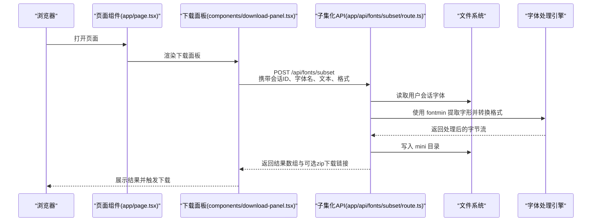

**图表来源**
- [app/page.tsx](file://app/page.tsx#L113-L145)
- [components/download-panel.tsx](file://components/download-panel.tsx#L68-L89)
- [app/api/fonts/subset/route.ts](file://app/api/fonts/subset/route.ts#L164-L366)

**章节来源**
- [app/page.tsx](file://app/page.tsx#L113-L145)
- [components/download-panel.tsx](file://components/download-panel.tsx#L68-L89)
- [app/api/fonts/subset/route.ts](file://app/api/fonts/subset/route.ts#L164-L366)

## 详细组件分析

### 页面与布局
- 根布局负责站点元信息与图标配置，注入全局样式。
- 首页页面通过 SWR 获取字体列表，封装上传、删除、子集化处理逻辑，统一通过会话头传递用户上下文。

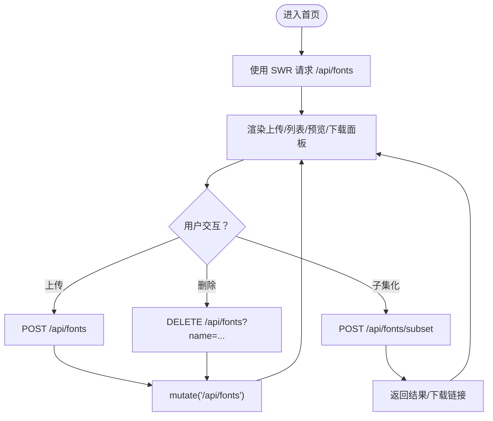

**图表来源**
- [app/layout.tsx](file://app/layout.tsx#L10-L31)
- [app/page.tsx](file://app/page.tsx#L27-L145)

**章节来源**
- [app/layout.tsx](file://app/layout.tsx#L10-L31)
- [app/page.tsx](file://app/page.tsx#L27-L145)

### 字体上传组件
- 支持拖拽与文件选择，过滤合法格式，展示文件列表与大小，触发上传回调。
- 上传前对文件名进行清洗，避免非法字符。

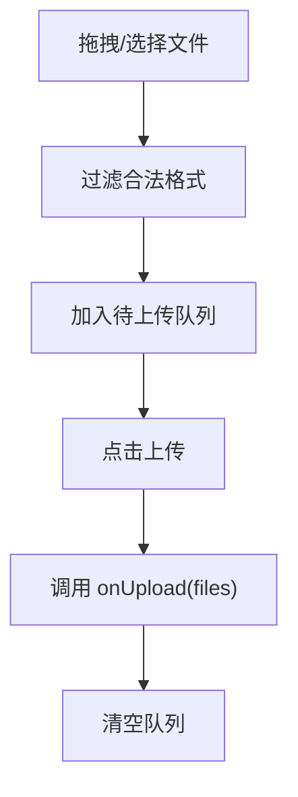

**图表来源**
- [components/font-uploader.tsx](file://components/font-uploader.tsx#L33-L70)

**章节来源**
- [components/font-uploader.tsx](file://components/font-uploader.tsx#L1-L166)

### 字体列表组件
- 展示当前会话字体，支持全选与逐项选择，删除采用确认对话框，避免误删。
- 与父组件通信，传递选中状态与删除动作。

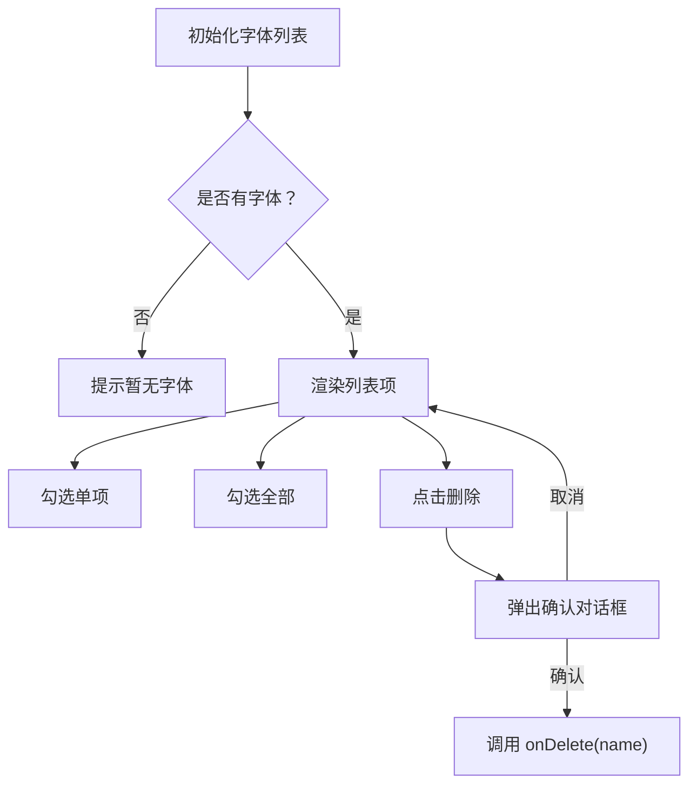

**图表来源**
- [components/font-list.tsx](file://components/font-list.tsx#L42-L58)

**章节来源**
- [components/font-list.tsx](file://components/font-list.tsx#L1-L159)

### 字体预览组件
- 动态加载字体，生成唯一的字体族名，按字号渲染示例文本，支持多字体并列预览。
- 使用 FontFace API 加载字体，捕获加载错误并提示。

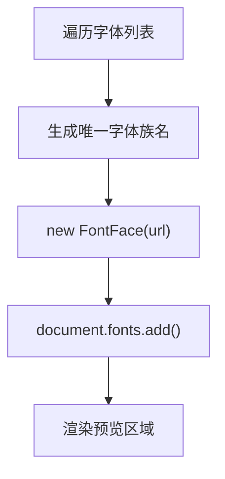

**图表来源**
- [components/font-preview.tsx](file://components/font-preview.tsx#L34-L48)

**章节来源**
- [components/font-preview.tsx](file://components/font-preview.tsx#L1-L123)

### 下载面板组件
- 选择输出格式（TTF/WOFF/woff2/EOT/SVG），触发子集化处理，展示结果卡片与压缩比，支持单个与打包下载。
- 对多字体结果按原字体名分组，便于查看与下载。

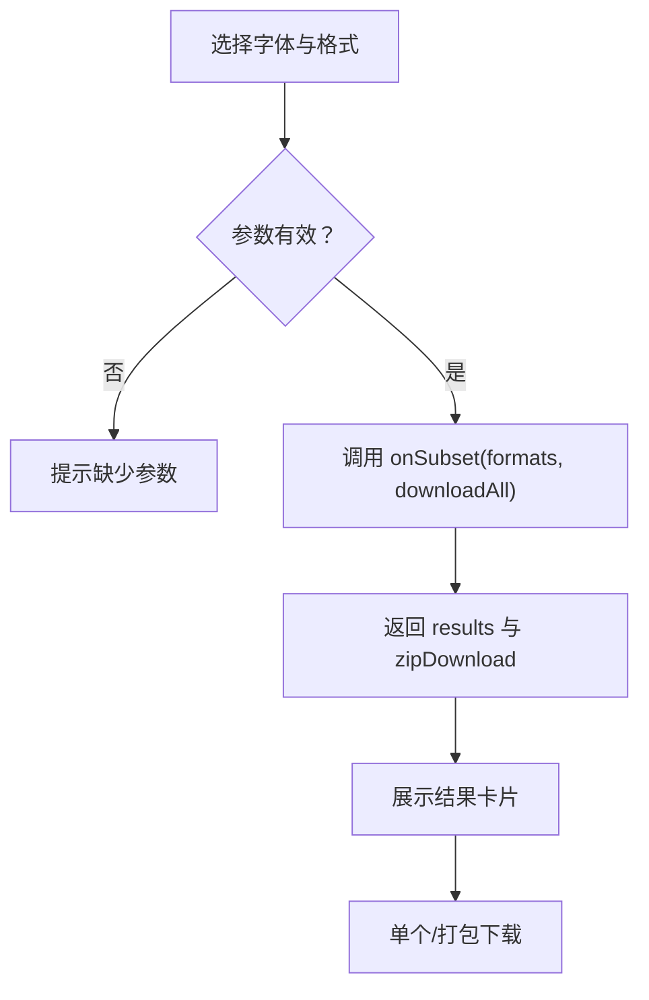

**图表来源**
- [components/download-panel.tsx](file://components/download-panel.tsx#L68-L89)
- [components/download-panel.tsx](file://components/download-panel.tsx#L104-L114)

**章节来源**
- [components/download-panel.tsx](file://components/download-panel.tsx#L1-L295)

### API 路由与字体处理
- 字体上传/列出/删除：基于会话 ID 创建用户专属目录，备份至永久目录，删除仅影响会话目录。
- 字体子集化：使用 fontmin 提取字形，按需转换为目标格式；WOFF2 通过 ttf2woff2 转换；支持打包下载。

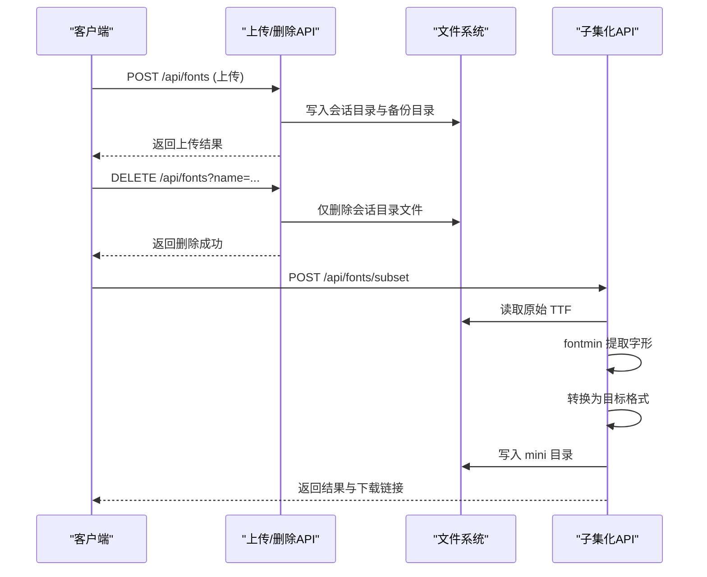

**图表来源**
- [app/api/fonts/route.ts](file://app/api/fonts/route.ts#L72-L127)
- [app/api/fonts/route.ts](file://app/api/fonts/route.ts#L129-L166)
- [app/api/fonts/subset/route.ts](file://app/api/fonts/subset/route.ts#L25-L162)

**章节来源**
- [app/api/fonts/route.ts](file://app/api/fonts/route.ts#L1-L167)
- [app/api/fonts/subset/route.ts](file://app/api/fonts/subset/route.ts#L1-L366)

### 自定义 Hook 使用与扩展机制
- use-toast：实现轻量级通知系统，支持限制同时显示数量、定时关闭、更新与 dismiss。
- use-mobile：基于媒体查询判断移动端断点，便于响应式 UI 控制。

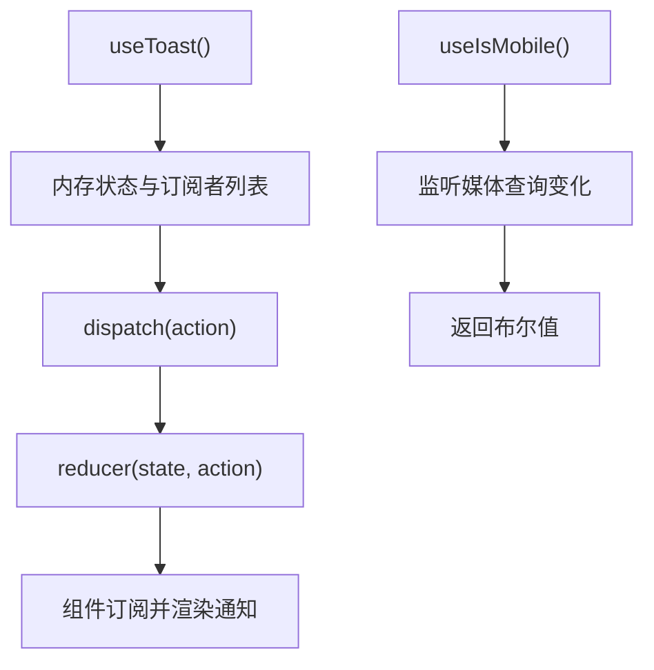

**图表来源**
- [hooks/use-toast.ts](file://hooks/use-toast.ts#L74-L127)
- [hooks/use-mobile.ts](file://hooks/use-mobile.ts#L5-L18)

**章节来源**
- [hooks/use-toast.ts](file://hooks/use-toast.ts#L1-L192)
- [hooks/use-mobile.ts](file://hooks/use-mobile.ts#L1-L20)

### TypeScript 类型定义维护与更新
- fontmin 类型声明：定义 FontminFile、GlyphOptions、FontminPlugin 与 Fontmin 类型，覆盖 glyph、ttf2woff、ttf2woff2、ttf2eot、ttf2svg、otf2ttf、svgs2ttf、css 等插件方法签名。
- 更新建议：当 fontmin 升级或新增插件时，同步更新 types/fontmin.d.ts 中的接口与方法签名，确保编译期类型安全。

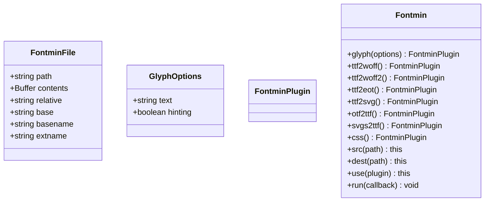

**图表来源**
- [types/fontmin.d.ts](file://types/fontmin.d.ts#L1-L53)

**章节来源**
- [types/fontmin.d.ts](file://types/fontmin.d.ts#L1-L53)

## 依赖关系分析
- 前端依赖：Next.js、React、Radix UI、Tailwind CSS、Lucide React、SWR、React Hook Form、Zod 等。
- 字体处理：fontmin、ttf2woff2、archiver。
- 类型与工具：@types/*、clsx、tailwind-merge。

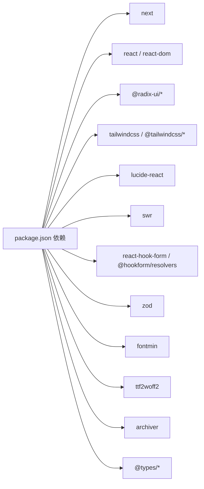

**图表来源**
- [package.json](file://package.json#L11-L66)

**章节来源**
- [package.json](file://package.json#L1-L78)

## 性能考虑
- 字体加载：预览区域按需加载字体，避免一次性加载过多字体导致阻塞；使用 FontFace API 并捕获错误。
- 处理流程：子集化前对文本去重，减少重复字形提取；WOFF2 转换在内存中完成，注意大字体的内存占用。
- UI 响应：列表与预览区域使用滚动容器，避免长列表渲染卡顿；下载面板使用分组展示，提升可读性。
- 会话隔离：会话目录按用户隔离，避免跨用户竞争 IO；定期清理临时目录，控制磁盘占用。

[本节为通用性能建议，无需特定文件引用]

## 故障排查指南
- 上传失败：检查会话头是否正确传递，确认用户会话目录存在且可写；查看服务端日志定位错误。
- 删除无效：确认传入的字体名与会话一致，仅会话目录文件会被删除，备份目录不受影响。
- 子集化失败：确认上传字体为 TTF 格式；检查文本是否为空；查看服务端错误堆栈与返回消息。
- 下载空白：确认 mini 目录下已生成对应文件；检查下载链接是否包含正确的会话参数。

**章节来源**
- [app/api/fonts/route.ts](file://app/api/fonts/route.ts#L129-L166)
- [app/api/fonts/subset/route.ts](file://app/api/fonts/subset/route.ts#L195-L213)
- [app/api/fonts/subset/route.ts](file://app/api/fonts/subset/route.ts#L297-L310)

## 结论
本指南提供了从开发环境到组件实现、API 路由、类型定义、Hook 扩展、性能优化与质量保障的完整路径。遵循本文档可高效开展新功能开发与维护工作，确保代码一致性与可维护性。

[本节为总结性内容，无需特定文件引用]

## 附录

### 开发环境搭建与本地配置
- 环境要求：Node.js 18+，pnpm 8+。
- 安装依赖：使用 pnpm install。
- 启动开发：pnpm dev，默认端口可在脚本中调整。
- 构建与启动：pnpm build 与 pnpm start。

**章节来源**
- [README.md](file://README.md#L44-L79)
- [package.json](file://package.json#L5-L9)

### 新功能开发流程与最佳实践
- 设计阶段：明确需求与边界，评估对现有组件的影响。
- 组件开发：遵循现有组件风格（使用 Radix UI、Tailwind 类名、受控组件模式），拆分职责清晰。
- API 扩展：在 app/api 下新增路由，保持幂等与错误处理完备。
- 类型更新：同步更新 types 下的类型定义，确保编译期校验。
- Hook 扩展：在 hooks 目录新增 Hook，遵循单一职责与可复用性。
- 会话与数据：严格使用会话头与会话目录，避免跨用户数据泄露。
- 文档与注释：为公共 API 与复杂逻辑补充注释与使用说明。

[本节为通用流程建议，无需特定文件引用]

### 组件开发标准流程与设计原则
- 命名与结构：组件文件命名采用驼峰，导出函数组件；共享样式使用 cn 工具合并。
- 受控组件：表单与交互尽量使用受控组件，避免内部状态与外部状态冲突。
- 错误边界：在组件内捕获并展示错误，必要时回退到默认状态。
- 可访问性：使用语义化标签与 aria 属性，确保键盘可达与屏幕阅读器友好。
- 响应式：根据 use-mobile Hook 的断点适配移动端布局。

**章节来源**
- [lib/utils.ts](file://lib/utils.ts#L1-L7)
- [hooks/use-mobile.ts](file://hooks/use-mobile.ts#L1-L20)

### 测试策略与质量保证
- 单元测试：针对纯函数与 Hook 的逻辑编写测试，覆盖正常与异常分支。
- 集成测试：模拟 API 路由行为，验证上传、删除、子集化流程。
- 端到端测试：使用自动化工具验证用户操作链路（上传→预览→子集化→下载）。
- 代码质量：启用 ESLint 与 TypeScript 编译检查，保持严格模式与类型安全。
- 代码审查：PR 审查关注可读性、性能、安全性与可维护性。

**章节来源**
- [package.json](file://package.json#L8-L8)

### 性能优化技巧与代码重构建议
- 字体加载：延迟加载非当前预览字体；使用 FontFace.load 成功后再渲染。
- 处理流程：在服务端对文本去重，减少字形提取次数；合理选择输出格式。
- UI 渲染：使用虚拟滚动与分页，避免超长列表一次性渲染。
- 会话清理：定期清理 font-temp 下的过期会话目录，避免磁盘膨胀。
- 依赖升级：定期评估依赖版本，优先修复安全漏洞与性能问题。

**章节来源**
- [README.md](file://README.md#L222-L241)

### Pull Request 流程与代码审查标准
- 分支策略：从 develop 分支创建功能分支，命名清晰描述变更。
- 提交信息：使用动词开头的简短标题，必要时补充背景与影响范围。
- PR 描述：说明变更目的、实现方式、测试覆盖与潜在风险。
- 代码审查：至少一名维护者审查，关注类型安全、性能、可维护性与安全性。
- 合并策略：通过 CI 与审查后方可合并，保持提交历史整洁。

[本节为通用流程建议，无需特定文件引用]