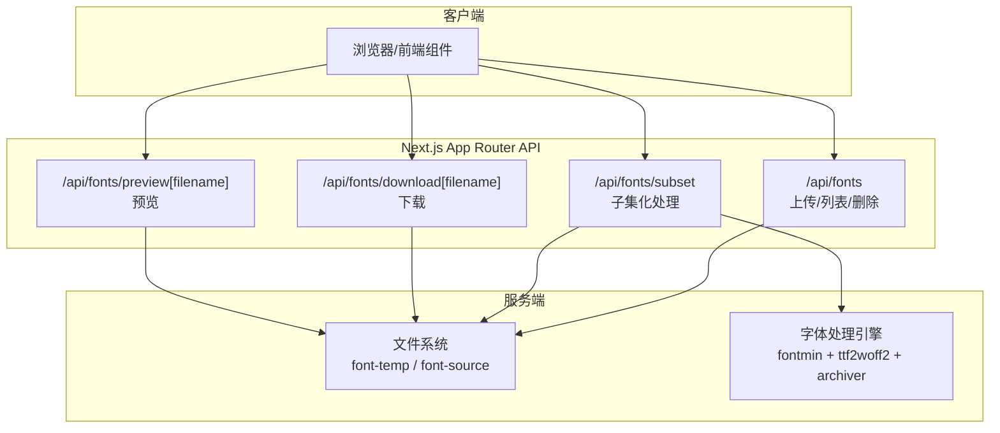
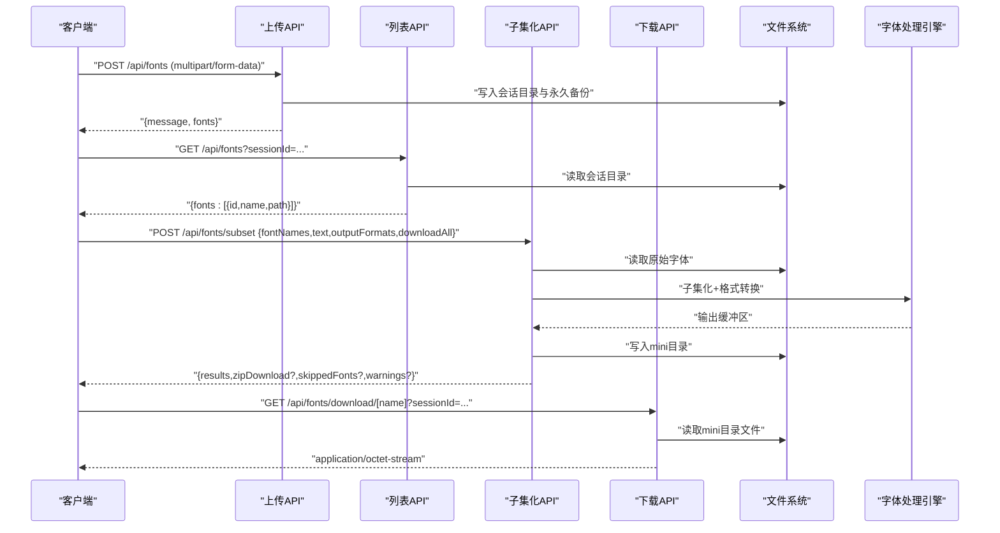
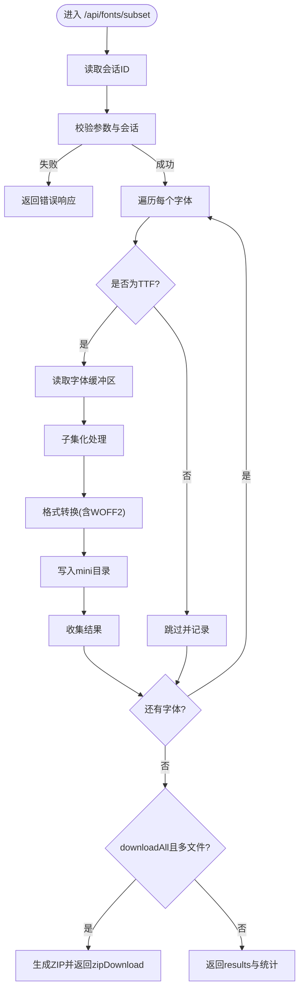
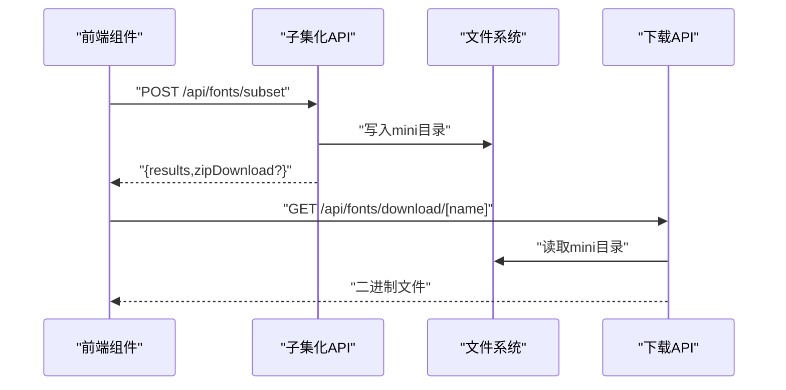
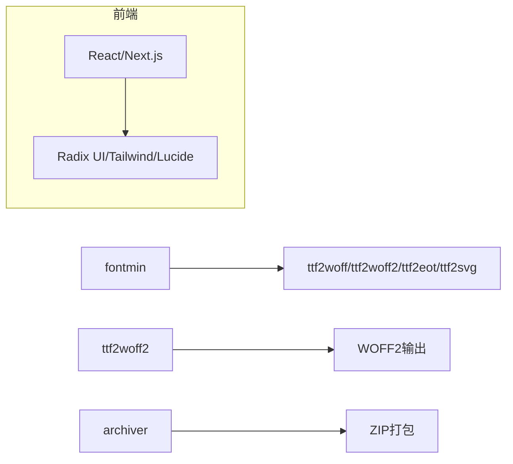

# API扩展方法

<cite>
**本文引用的文件**
- [app/api/fonts/route.ts](file://app/api/fonts/route.ts)
- [app/api/fonts/subset/route.ts](file://app/api/fonts/subset/route.ts)
- [app/api/fonts/download\[filename]/route.ts](file://app/api/fonts/download\[filename]/route.ts)
- [app/api/fonts/preview\[filename]/route.ts](file://app/api/fonts/preview\[filename]/route.ts)
- [components/font-uploader.tsx](file://components/font-uploader.tsx)
- [components/download-panel.tsx](file://components/download-panel.tsx)
- [types/fontmin.d.ts](file://types/fontmin.d.ts)
- [package.json](file://package.json)
- [README.md](file://README.md)
</cite>

## 目录
1. [简介](#简介)
2. [项目结构](#项目结构)
3. [核心组件](#核心组件)
4. [架构总览](#架构总览)
5. [详细组件分析](#详细组件分析)
6. [依赖关系分析](#依赖关系分析)
7. [性能考量](#性能考量)
8. [故障排查指南](#故障排查指南)
9. [结论](#结论)
10. [附录](#附录)

## 简介
本指南面向在Next.js App Router架构下为FontMin字体子集化工具扩展API的开发者，目标是帮助你在现有API基础上新增路由、完善请求处理与响应格式、增强安全性与健壮性，并实现与前端组件的顺畅集成。文档覆盖从基础的GET/POST接口到复杂文件处理流程的完整开发路径，包含路由命名规范、批量操作、格式转换、文件上传与流式响应、错误处理、版本控制与向后兼容的最佳实践。

## 项目结构
- API层位于 app/api/fonts 下，采用App Router约定式路由，每个子路径对应一个API端点：
  - 上传/列表/删除：app/api/fonts/route.ts
  - 子集化处理：app/api/fonts/subset/route.ts
  - 单文件下载：app/api/fonts/download[filename]/route.ts
  - 预览：app/api/fonts/preview[filename]/route.ts
- 前端组件通过HTTP调用这些API完成上传、处理、下载与预览。
- 类型声明位于 types/fontmin.d.ts，确保对fontmin插件链的类型安全。

图表来源
- [app/api/fonts/route.ts](file://app/api/fonts/route.ts#L36-L127)
- [app/api/fonts/subset/route.ts](file://app/api/fonts/subset/route.ts#L164-L365)
- [app/api/fonts/download\[filename]/route.ts](file://app/api/fonts/download\[filename]/route.ts)
- [app/api/fonts/preview\[filename]/route.ts](file://app/api/fonts/preview\[filename]/route.ts)

章节来源
- [README.md](file://README.md#L135-L160)
- [package.json](file://package.json#L11-L77)

## 核心组件
- 上传/列表/删除API：负责接收表单数据、校验文件类型、持久化到会话目录与永久备份目录，并返回标准化JSON响应。
- 子集化处理API：接收选定字体、目标文字与输出格式，调用fontmin进行子集化与格式转换，必要时生成ZIP包并返回下载链接。
- 下载API：根据会话ID与文件名从会话目录读取文件并返回二进制内容。
- 预览API：返回字体文件的二进制内容以供前端预览。
- 前端组件：FontUploader负责文件选择与上传；DownloadPanel负责格式选择、触发处理与下载。

章节来源
- [app/api/fonts/route.ts](file://app/api/fonts/route.ts#L36-L127)
- [app/api/fonts/subset/route.ts](file://app/api/fonts/subset/route.ts#L164-L365)
- [components/font-uploader.tsx](file://components/font-uploader.tsx#L17-L70)
- [components/download-panel.tsx](file://components/download-panel.tsx#L44-L89)

## 架构总览
下图展示了从前端到API再到文件系统的整体流程，以及字体处理引擎的参与。

图表来源
- [app/api/fonts/route.ts](file://app/api/fonts/route.ts#L71-L127)
- [app/api/fonts/subset/route.ts](file://app/api/fonts/subset/route.ts#L164-L365)
- [app/api/fonts/download\[filename]/route.ts](file://app/api/fonts/download\[filename]/route.ts)

## 详细组件分析

### 上传/列表/删除API（/api/fonts）
- 请求处理模式
  - GET：按会话ID读取用户目录中的字体文件，过滤支持的字体扩展名，返回包含预览路径的列表。
  - POST：解析multipart/form-data，逐个文件写入会话目录与永久备份目录，返回上传成功信息与文件元数据。
  - DELETE：根据查询参数name删除会话目录中的文件，保留永久备份。
- 响应格式
  - 成功：JSON对象，包含消息与数据字段。
  - 错误：JSON对象，包含错误信息与HTTP状态码。
- 安全与验证
  - 文件类型白名单过滤，避免恶意文件。
  - 会话隔离：基于请求头中的会话ID组织目录，确保数据隔离。
- 性能与可靠性
  - 异步文件I/O，避免阻塞事件循环。
  - 目录不存在时自动创建，减少前置检查成本。

章节来源
- [app/api/fonts/route.ts](file://app/api/fonts/route.ts#L36-L127)

### 子集化处理API（/api/fonts/subset）
- 功能概述
  - 接收字体名称数组、目标文字、输出格式数组与是否打包下载标志。
  - 对每个字体执行子集化与格式转换，生成精简字体并保存至mini目录。
  - 若启用打包下载且存在多个文件，则生成ZIP并返回打包下载链接。
- 请求处理模式
  - 从请求头读取会话ID，定位用户目录。
  - 校验输入参数与会话有效性。
  - 逐个字体执行处理，收集结果与错误。
- 响应格式
  - 成功：包含处理结果数组、字符数统计、可选的ZIP下载链接、跳过的字体与警告信息。
  - 失败：包含错误信息与详情。
- 安全与验证
  - 严格校验字体格式（仅TTF输入），非TTF跳过并记录。
  - 文本去重，避免重复计算。
- 错误处理
  - 捕获并分类错误：输入缺失、会话无效、字体不存在、处理失败等。
  - 返回结构化的错误对象，便于前端展示。

图表来源
- [app/api/fonts/subset/route.ts](file://app/api/fonts/subset/route.ts#L164-L365)

章节来源
- [app/api/fonts/subset/route.ts](file://app/api/fonts/subset/route.ts#L164-L365)

### 下载API（/api/fonts/download[filename]）
- 功能概述
  - 根据会话ID与文件名从mini目录读取文件并返回二进制内容。
- 请求处理模式
  - 解析URL参数，拼接用户mini目录路径。
  - 校验文件存在性，读取并返回文件内容。
- 响应格式
  - 成功：application/octet-stream，附带合适的Content-Disposition。
  - 失败：JSON错误对象与HTTP状态码。

章节来源
- [app/api/fonts/download\[filename]/route.ts](file://app/api/fonts/download\[filename]/route.ts)

### 预览API（/api/fonts/preview[filename]）
- 功能概述
  - 返回字体文件的二进制内容，供前端在线预览。
- 请求处理模式
  - 读取用户会话目录中的字体文件并返回。
- 响应格式
  - 成功：对应字体MIME类型或application/octet-stream。
  - 失败：JSON错误对象与HTTP状态码。

章节来源
- [app/api/fonts/preview\[filename]/route.ts](file://app/api/fonts/preview\[filename]/route.ts)

### 前端组件集成
- 字体上传组件（FontUploader）
  - 支持拖拽与文件选择，过滤合法扩展名，展示文件列表与大小，触发上传回调。
- 下载面板组件（DownloadPanel）
  - 选择输出格式、输入文字、触发子集化处理，展示处理结果与下载链接，支持单个与批量下载。

图表来源
- [components/font-uploader.tsx](file://components/font-uploader.tsx#L17-L70)
- [components/download-panel.tsx](file://components/download-panel.tsx#L44-L89)
- [app/api/fonts/subset/route.ts](file://app/api/fonts/subset/route.ts#L272-L283)
- [app/api/fonts/download\[filename]/route.ts](file://app/api/fonts/download\[filename]/route.ts)

章节来源
- [components/font-uploader.tsx](file://components/font-uploader.tsx#L17-L70)
- [components/download-panel.tsx](file://components/download-panel.tsx#L44-L89)

## 依赖关系分析
- 字体处理依赖
  - fontmin：提供glyph、ttf2woff、ttf2woff2、ttf2eot、ttf2svg等插件链。
  - ttf2woff2：将TTF转换为WOFF2。
  - archiver：将多个文件打包为ZIP。
- 前端依赖
  - React、Next.js、Radix UI、Tailwind CSS、Lucide React等。
- 类型定义
  - types/fontmin.d.ts：为fontmin插件链提供类型声明，确保编译期安全。

图表来源
- [types/fontmin.d.ts](file://types/fontmin.d.ts#L1-L53)
- [package.json](file://package.json#L41-L65)

章节来源
- [types/fontmin.d.ts](file://types/fontmin.d.ts#L1-L53)
- [package.json](file://package.json#L41-L65)

## 性能考量
- I/O优化
  - 使用异步文件I/O，避免阻塞主线程。
  - 批量处理时尽量减少重复读取，复用已加载的Buffer。
- 内存与CPU
  - 子集化与格式转换可能占用较多内存与CPU，建议限制并发与单次处理的字体数量。
  - 对大文件生成ZIP时，注意内存峰值，必要时采用流式写入。
- 缓存与复用
  - 对相同输入的处理结果可考虑缓存，避免重复计算。
- 并发与超时
  - 为长耗时任务设置合理超时，防止资源泄漏。
- 压缩级别
  - ZIP压缩级别可在保证性能的前提下平衡体积与时间。

## 故障排查指南
- 常见错误与定位
  - 会话缺失：检查请求头中会话ID是否存在。
  - 字体不存在：确认会话目录与文件名正确。
  - 非TTF输入：Fontmin仅支持TTF作为输入，需提示用户转换为TTF。
  - 处理失败：查看API返回的错误详情与堆栈信息。
- 日志与调试
  - API内部使用console输出关键步骤日志，便于定位问题。
  - 前端组件在处理失败时展示错误信息，便于用户反馈。
- 错误响应格式
  - 统一返回包含error与details的对象，便于前端统一处理。

章节来源
- [app/api/fonts/route.ts](file://app/api/fonts/route.ts#L62-L68)
- [app/api/fonts/subset/route.ts](file://app/api/fonts/subset/route.ts#L297-L310)
- [app/api/fonts/subset/route.ts](file://app/api/fonts/subset/route.ts#L351-L364)

## 结论
通过遵循本文档的路由命名规范、请求处理模式与响应格式约定，结合现有API的安全与错误处理实践，你可以高效地在Next.js App Router架构下扩展FontMin的API能力。建议优先实现基础的批量操作与格式转换选项，再逐步引入更复杂的特性（如增量处理、进度上报、流式下载等）。始终以类型安全、错误处理与用户体验为核心，确保扩展功能与现有系统保持一致的稳定性与可维护性。

## 附录

### API扩展开发清单
- 路由命名规范
  - 使用名词短语，如 /api/fonts/upload、/api/fonts/batch-process。
  - 参数使用方括号包裹，如 /api/fonts/download[filename]。
- 请求处理模式
  - 明确HTTP方法与职责边界（GET/POST/DELETE/PUT）。
  - 严格校验请求头与请求体，拒绝非法输入。
- 响应格式
  - 成功：包含message与data字段或具体业务数据。
  - 失败：包含error与details字段。
- 安全考虑
  - 身份验证：使用会话ID或令牌，确保跨请求一致性。
  - 授权：基于会话目录隔离，禁止越权访问。
  - 输入验证：白名单过滤、长度限制、字符集限制。
- 文件上传
  - 使用multipart/form-data，限制文件大小与类型。
  - 上传后同时写入会话目录与永久备份目录。
- 流式响应
  - 对大文件下载采用流式传输，避免内存峰值。
- 错误处理
  - 分类错误并返回结构化错误对象。
  - 记录日志以便追踪问题。
- 版本控制与向后兼容
  - 使用路径前缀版本（如 /api/v1/fonts/...）。
  - 保持旧接口一段时间，提供迁移指引与降级策略。
- 与前端集成
  - 统一数据契约，前后端共同维护接口文档。
  - 前端组件负责UI交互与错误提示，后端负责业务逻辑与数据安全。