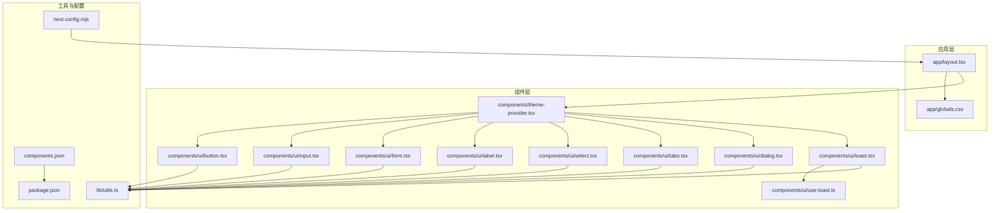
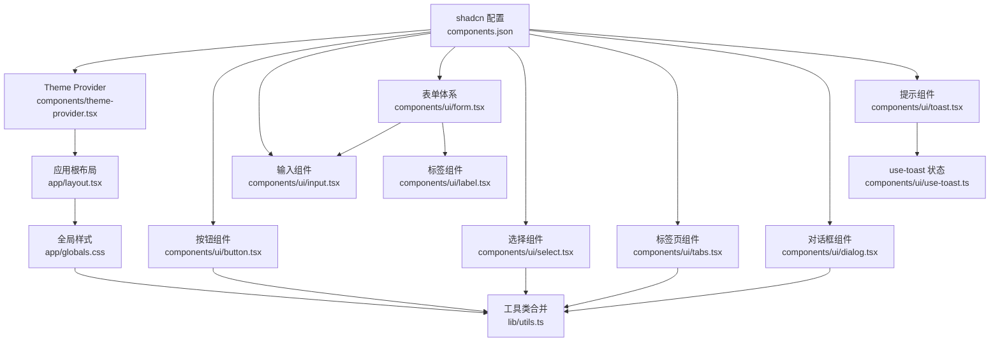
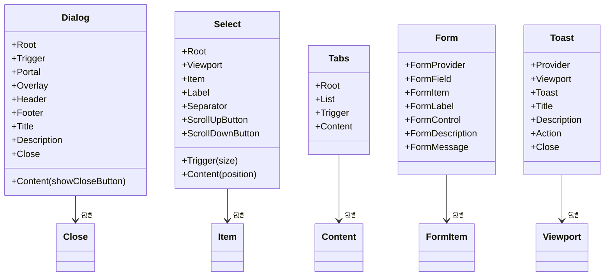
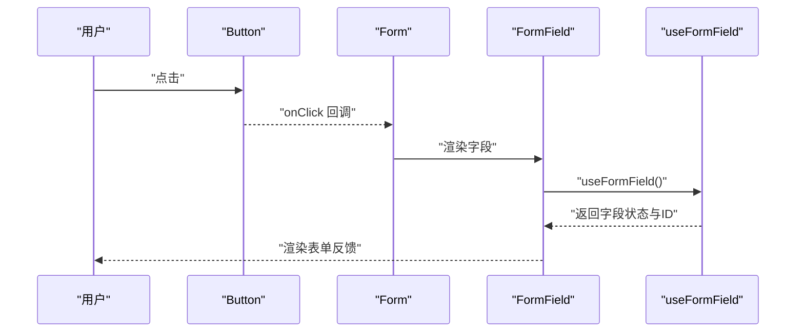
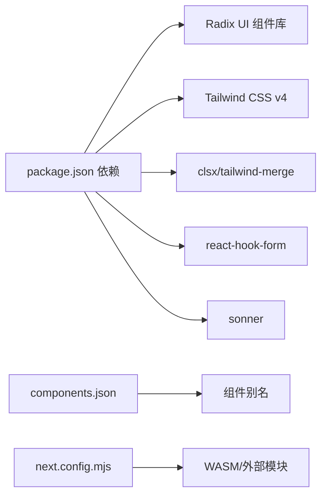

# UI组件扩展

<cite>
**本文引用的文件**
- [components.json](file://components.json)
- [package.json](file://package.json)
- [next.config.mjs](file://next.config.mjs)
- [app/globals.css](file://app/globals.css)
- [lib/utils.ts](file://lib/utils.ts)
- [components/theme-provider.tsx](file://components/theme-provider.tsx)
- [app/layout.tsx](file://app/layout.tsx)
- [components/ui/button.tsx](file://components/ui/button.tsx)
- [components/ui/input.tsx](file://components/ui/input.tsx)
- [components/ui/form.tsx](file://components/ui/form.tsx)
- [components/ui/label.tsx](file://components/ui/label.tsx)
- [components/ui/select.tsx](file://components/ui/select.tsx)
- [components/ui/tabs.tsx](file://components/ui/tabs.tsx)
- [components/ui/dialog.tsx](file://components/ui/dialog.tsx)
- [components/ui/toast.tsx](file://components/ui/toast.tsx)
- [components/ui/use-toast.ts](file://components/ui/use-toast.ts)
</cite>

## 目录
1. [简介](#简介)
2. [项目结构](#项目结构)
3. [核心组件](#核心组件)
4. [架构总览](#架构总览)
5. [详细组件分析](#详细组件分析)
6. [依赖分析](#依赖分析)
7. [性能考量](#性能考量)
8. [故障排查指南](#故障排查指南)
9. [结论](#结论)
10. [附录](#附录)

## 简介
本指南面向在 FontMin 字体子集化工具中扩展 UI 组件的开发者，基于现有的 Radix UI 与 Tailwind CSS 架构，系统讲解如何新增组件、遵循命名规范、继承样式与主题定制、集成 shadcn/ui、实现可访问性（无障碍）、设计 Props、事件与状态管理、复合与容器组件的构建及组件间通信模式。文档以仓库中的现有组件为范例，提供从简单按钮到复杂表单组件的完整开发流程。

## 项目结构
项目采用按功能分层的组织方式：页面位于 app 目录，通用 UI 组件集中在 components/ui 下，工具函数与主题提供者分别位于 lib 与 components 目录，样式通过 app/globals.css 引入并使用 Tailwind v4 主题变量与动画能力。

图表来源
- [app/layout.tsx](file://app/layout.tsx#L33-L43)
- [app/globals.css](file://app/globals.css#L1-L126)
- [components/theme-provider.tsx](file://components/theme-provider.tsx#L9-L11)
- [components/ui/button.tsx](file://components/ui/button.tsx#L1-L61)
- [components/ui/input.tsx](file://components/ui/input.tsx#L1-L22)
- [components/ui/form.tsx](file://components/ui/form.tsx#L1-L168)
- [components/ui/label.tsx](file://components/ui/label.tsx#L1-L25)
- [components/ui/select.tsx](file://components/ui/select.tsx#L1-L186)
- [components/ui/tabs.tsx](file://components/ui/tabs.tsx#L1-L67)
- [components/ui/dialog.tsx](file://components/ui/dialog.tsx#L1-L144)
- [components/ui/toast.tsx](file://components/ui/toast.tsx#L1-L130)
- [components/ui/use-toast.ts](file://components/ui/use-toast.ts#L1-L192)
- [lib/utils.ts](file://lib/utils.ts#L1-L7)
- [components.json](file://components.json#L1-L22)
- [package.json](file://package.json#L1-L78)
- [next.config.mjs](file://next.config.mjs#L1-L44)

章节来源
- [app/layout.tsx](file://app/layout.tsx#L33-L43)
- [app/globals.css](file://app/globals.css#L1-L126)
- [components/theme-provider.tsx](file://components/theme-provider.tsx#L9-L11)
- [lib/utils.ts](file://lib/utils.ts#L1-L7)
- [components.json](file://components.json#L1-L22)
- [package.json](file://package.json#L1-L78)
- [next.config.mjs](file://next.config.mjs#L1-L44)

## 核心组件
本节梳理现有核心组件及其职责，作为新增组件的参考模型：

- 按钮 Button：使用 class-variance-authority 定义变体与尺寸，结合 Radix Slot 支持语义标签或自定义渲染。
- 输入 Input：统一输入框样式、焦点态与错误态的 ARIA 属性绑定。
- 表单 Form：基于 react-hook-form 的上下文封装，提供 FormField、FormLabel、FormControl、FormDescription、FormMessage。
- 标签 Label：与表单字段联动，支持禁用态与错误态。
- 选择 Select：组合 Trigger、Content、Item、ScrollUp/DownButton 等子组件，支持滚动与占位符。
- 标签页 Tabs：列表与触发器、内容区的组合。
- 对话框 Dialog：Root、Trigger、Portal、Overlay、Content、Header/Footer、Title/Description、Close。
- 提示 Toast：Provider、Viewport、Toast、Title/Description、Action、Close 及 use-toast 状态管理。

章节来源
- [components/ui/button.tsx](file://components/ui/button.tsx#L1-L61)
- [components/ui/input.tsx](file://components/ui/input.tsx#L1-L22)
- [components/ui/form.tsx](file://components/ui/form.tsx#L1-L168)
- [components/ui/label.tsx](file://components/ui/label.tsx#L1-L25)
- [components/ui/select.tsx](file://components/ui/select.tsx#L1-L186)
- [components/ui/tabs.tsx](file://components/ui/tabs.tsx#L1-L67)
- [components/ui/dialog.tsx](file://components/ui/dialog.tsx#L1-L144)
- [components/ui/toast.tsx](file://components/ui/toast.tsx#L1-L130)
- [components/ui/use-toast.ts](file://components/ui/use-toast.ts#L1-L192)

## 架构总览
下图展示了 UI 组件与主题、样式、表单库之间的关系，以及数据流与可访问性属性的传递路径。

图表来源
- [components/theme-provider.tsx](file://components/theme-provider.tsx#L9-L11)
- [app/layout.tsx](file://app/layout.tsx#L33-L43)
- [app/globals.css](file://app/globals.css#L1-L126)
- [lib/utils.ts](file://lib/utils.ts#L1-L7)
- [components/ui/form.tsx](file://components/ui/form.tsx#L1-L168)
- [components/ui/input.tsx](file://components/ui/input.tsx#L1-L22)
- [components/ui/label.tsx](file://components/ui/label.tsx#L1-L25)
- [components/ui/button.tsx](file://components/ui/button.tsx#L1-L61)
- [components/ui/select.tsx](file://components/ui/select.tsx#L1-L186)
- [components/ui/tabs.tsx](file://components/ui/tabs.tsx#L1-L67)
- [components/ui/dialog.tsx](file://components/ui/dialog.tsx#L1-L144)
- [components/ui/toast.tsx](file://components/ui/toast.tsx#L1-L130)
- [components/ui/use-toast.ts](file://components/ui/use-toast.ts#L1-L192)
- [components.json](file://components.json#L1-L22)

## 详细组件分析

### 组件命名规范与样式继承
- 命名规范
  - 文件名：小写短横线命名，如 button.tsx、input.tsx、form.tsx。
  - 组件导出：默认导出组件本身，同时导出用于变体/样式计算的常量（如 buttonVariants）。
  - 数据槽：所有组件统一设置 data-slot 属性，便于调试与测试。
- 样式继承
  - 使用 class-variance-authority 定义变体与尺寸，集中管理不同状态下的类名组合。
  - 通过 lib/utils.ts 的 cn 合并工具，确保 Tailwind 与第三方类名冲突时正确合并。
  - 全局样式通过 app/globals.css 定义 CSS 变量与主题变量，组件通过变量继承颜色、圆角等视觉属性。
- 主题定制
  - components.json 中 tailwind.css 指向 app/globals.css，确保样式入口一致。
  - next.config.mjs 配置了 WebAssembly 加载与外部模块，保障字体处理相关依赖在服务端可用。

章节来源
- [components/ui/button.tsx](file://components/ui/button.tsx#L7-L37)
- [lib/utils.ts](file://lib/utils.ts#L1-L7)
- [app/globals.css](file://app/globals.css#L6-L116)
- [components.json](file://components.json#L6-L12)
- [next.config.mjs](file://next.config.mjs#L14-L39)

### shadcn/ui 集成与配置
- 配置项
  - style: "new-york"（风格）
  - rsc: true（支持 RSC）
  - tsx: true（TSX）
  - tailwind: css 变量启用、基础色、CSS 变量开关、前缀为空
  - aliases: 组件别名映射至 @/components、@/lib/utils、@/components/ui、@/lib、@/hooks
  - iconLibrary: lucide
- 集成要点
  - 所有组件均以 Radix UI 为基础，配合 Tailwind 类名与 class-variance-authority 实现一致的外观与行为。
  - 通过 data-slot 与 aria-* 属性实现可访问性与可测试性。

章节来源
- [components.json](file://components.json#L1-L22)

### 可访问性设计原则
- 键盘导航
  - 使用 @radix-ui/react-* 提供的键盘交互（如 Dialog、Select、Tabs）。
  - 焦点管理：通过 focus-visible 边框与 ring 效果明确当前焦点。
- 屏幕阅读器支持
  - 表单组件通过 aria-describedby、aria-invalid、htmlFor 等属性与 Label 关联。
  - Dialog 的关闭按钮包含 sr-only 文本，确保读屏器可识别。
- ARIA 属性
  - 表单字段在错误态时设置 aria-invalid，输入框在无效时添加对应 ring 样式。
  - Select、Tabs、Dialog 等组件内部使用原生 ARIA 角色与状态。

章节来源
- [components/ui/form.tsx](file://components/ui/form.tsx#L90-L123)
- [components/ui/input.tsx](file://components/ui/input.tsx#L5-L18)
- [components/ui/dialog.tsx](file://components/ui/dialog.tsx#L69-L78)

### Props 设计、事件处理与状态管理
- Props 设计
  - 优先使用语义化类型（如 size、variant），并在组件顶部导出对应的 Variants 类型。
  - 将透传属性（如 onClick、onChange）直接透传给底层元素或 Slot。
- 事件处理
  - 表单组件通过 react-hook-form 的 Controller/Control 机制与外部表单状态解耦。
  - Toast 通过 use-toast 管理全局状态，提供 toast、dismiss、update 等方法。
- 状态管理
  - 复合组件内部状态（如 Dialog 的 open/closed）由 Radix UI 管理；对外暴露受控/非受控两种模式。
  - 全局提示状态通过 useToast 的 reducer 与订阅机制维护。

章节来源
- [components/ui/form.tsx](file://components/ui/form.tsx#L32-L66)
- [components/ui/toast.tsx](file://components/ui/toast.tsx#L43-L56)
- [components/ui/use-toast.ts](file://components/ui/use-toast.ts#L74-L127)

### 复合组件与容器组件
- 复合组件
  - Dialog：由 Root、Trigger、Portal、Overlay、Content、Header/Footer、Title/Description、Close 组成，Content 内部可选是否显示关闭按钮。
  - Select：由 Root、Trigger、Content、Viewport、Item、Label、Separator、ScrollUp/DownButton 等组成，支持滚动与占位符。
  - Tabs：由 Root、List、Trigger、Content 组成，支持多标签切换。
- 容器组件
  - Form：FormProvider 包裹，内部通过 useFormField 获取字段上下文，形成容器与子字段的通信。
  - Toast：Provider + Viewport + 多个 Toast 组成的容器，use-toast 负责状态分发。

图表来源
- [components/ui/dialog.tsx](file://components/ui/dialog.tsx#L9-L143)
- [components/ui/select.tsx](file://components/ui/select.tsx#L9-L185)
- [components/ui/tabs.tsx](file://components/ui/tabs.tsx#L8-L66)
- [components/ui/form.tsx](file://components/ui/form.tsx#L19-L167)
- [components/ui/toast.tsx](file://components/ui/toast.tsx#L10-L129)

### 组件间通信模式
- 上下文通信
  - FormField 通过 React Context 将字段名注入，useFormField 在任意子组件内读取字段状态与 ID。
- 事件冒泡与回调
  - Button/Select/Tabs 等组件将用户交互事件透传给上层调用方，保持最小封装。
- 全局通知
  - use-toast 通过订阅机制向 ToastProvider 广播状态变化，实现跨组件的通知展示。

图表来源
- [components/ui/button.tsx](file://components/ui/button.tsx#L39-L58)
- [components/ui/form.tsx](file://components/ui/form.tsx#L32-L66)

### 从简单按钮到复杂表单的开发流程
- 步骤一：确定组件类型与职责
  - 简单按钮：仅负责渲染与事件透传。
  - 复杂表单：需要上下文、验证、错误提示与可访问性属性。
- 步骤二：定义变体与尺寸
  - 使用 class-variance-authority 定义 variant/size，并在组件中合并到最终类名。
- 步骤三：接入 Radix UI 与 Tailwind
  - 使用 @radix-ui/react-* 保证可访问性；使用 cn 合并类名。
- 步骤四：实现可访问性
  - 为表单组件设置 aria-invalid、aria-describedby；为对话框设置 sr-only 文本。
- 步骤五：封装复合组件
  - 将多个子组件组合为一个功能单元（如 Dialog、Select、Tabs）。
- 步骤六：状态管理与事件
  - 表单使用 react-hook-form；全局提示使用 use-toast；内部状态由 Radix 管理。

章节来源
- [components/ui/button.tsx](file://components/ui/button.tsx#L7-L37)
- [components/ui/form.tsx](file://components/ui/form.tsx#L19-L66)
- [components/ui/dialog.tsx](file://components/ui/dialog.tsx#L49-L81)
- [components/ui/select.tsx](file://components/ui/select.tsx#L27-L51)
- [components/ui/tabs.tsx](file://components/ui/tabs.tsx#L21-L51)
- [components/ui/toast.tsx](file://components/ui/toast.tsx#L12-L25)
- [components/ui/use-toast.ts](file://components/ui/use-toast.ts#L74-L127)

## 依赖分析
- 组件依赖 Radix UI 原子能力，确保可访问性与跨平台一致性。
- Tailwind v4 通过 CSS 变量与 @theme 指令提供主题能力，cn 工具负责类名合并。
- shadcn 配置集中于 components.json，统一 alias 与 icon 库。
- next.config.mjs 配置 WebAssembly 与外部模块，保障字体处理相关依赖在服务端可用。

图表来源
- [package.json](file://package.json#L11-L66)
- [components.json](file://components.json#L13-L19)
- [next.config.mjs](file://next.config.mjs#L14-L39)

章节来源
- [package.json](file://package.json#L11-L66)
- [components.json](file://components.json#L1-L22)
- [next.config.mjs](file://next.config.mjs#L1-L44)

## 性能考量
- 类名合并优化：使用 twMerge 与 clsx 合并类名，避免重复与冲突，减少运行时样式抖动。
- 动画与过渡：Tailwind animate 与 tw-animate-css 提供轻量动画，建议按需引入，避免不必要的重绘。
- 服务端打包：next.config.mjs 配置外部模块与 WASM，减少客户端包体积与加载时间。
- 表单渲染：react-hook-form 的惰性更新与受控组件结合，降低不必要重渲染。

## 故障排查指南
- 样式不生效
  - 检查 app/globals.css 是否被正确引入与编译。
  - 确认 components.json 中 tailwind.css 路径与 alias 设置。
- 可访问性问题
  - 表单字段未关联 Label：检查 htmlFor 与 data-slot="form-label"。
  - 错误提示未显示：确认 aria-invalid 与错误消息节点 ID。
- 对话框无法关闭
  - 确认 Dialog 的 Portal 与 Overlay 渲染层级，关闭按钮包含 sr-only 文本。
- 全局提示不出现
  - 检查 ToastProvider 是否包裹应用根节点，use-toast 订阅是否生效。

章节来源
- [app/globals.css](file://app/globals.css#L1-L126)
- [components.json](file://components.json#L6-L12)
- [components/ui/form.tsx](file://components/ui/form.tsx#L90-L123)
- [components/ui/dialog.tsx](file://components/ui/dialog.tsx#L69-L78)
- [components/ui/toast.tsx](file://components/ui/toast.tsx#L12-L25)
- [components/ui/use-toast.ts](file://components/ui/use-toast.ts#L171-L189)

## 结论
通过在现有 Radix UI 与 Tailwind CSS 基础上，遵循组件命名、样式继承与主题定制规范，结合 shadcn 配置与可访问性最佳实践，可以高效地扩展 FontMin 的 UI 组件体系。从简单按钮到复杂表单与提示系统，组件应以最小职责、清晰的 Props 设计、完善的事件与状态管理为核心，确保一致的用户体验与可维护性。

## 附录
- 新增组件建议流程
  - 明确组件类型与职责边界
  - 定义变体与尺寸，使用 class-variance-authority
  - 引入 Radix UI 与 cn 合并类名
  - 添加 data-slot 与 ARIA 属性
  - 如为复合组件，拆分子组件并建立清晰的组合关系
  - 如为表单相关，接入 react-hook-form 上下文
  - 如为全局通知，接入 use-toast 与 Provider
  - 在 components.json 中统一 alias，确保一致性