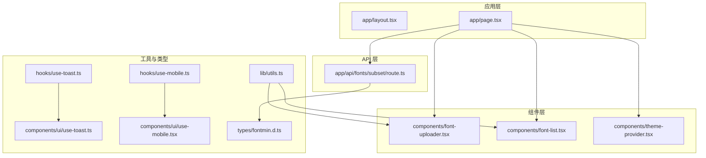
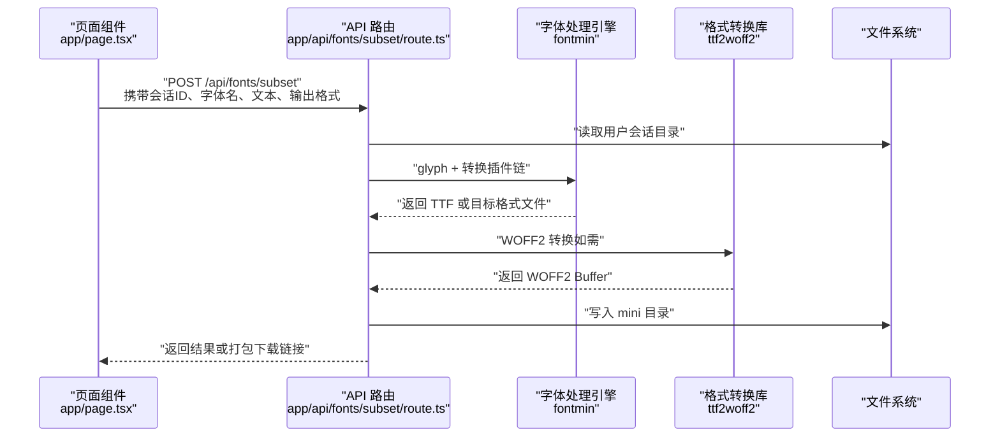
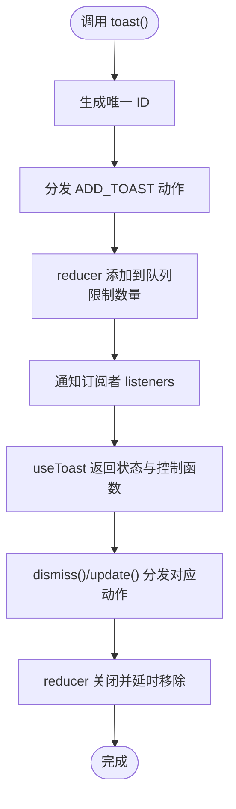
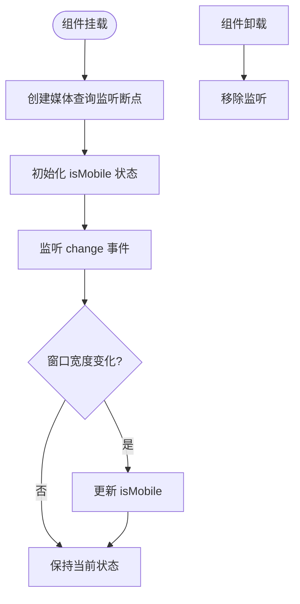
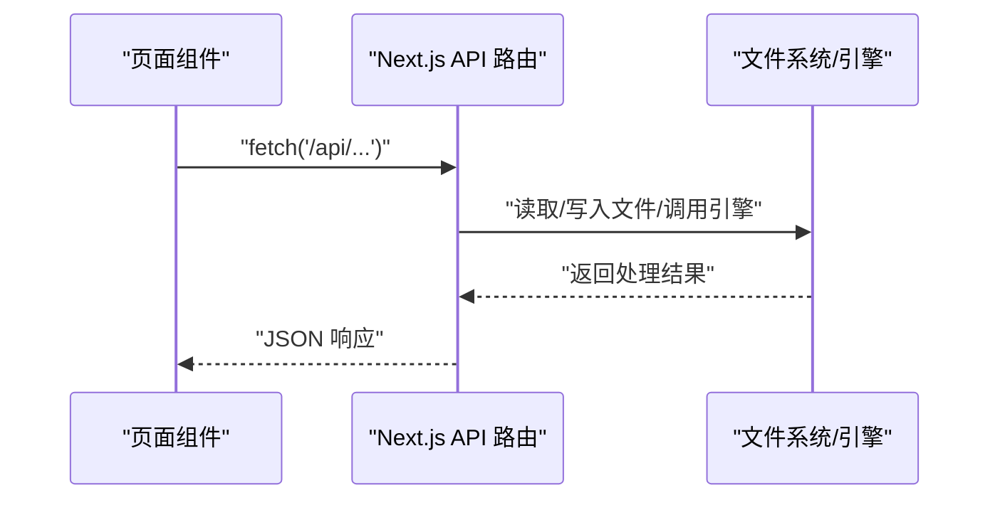
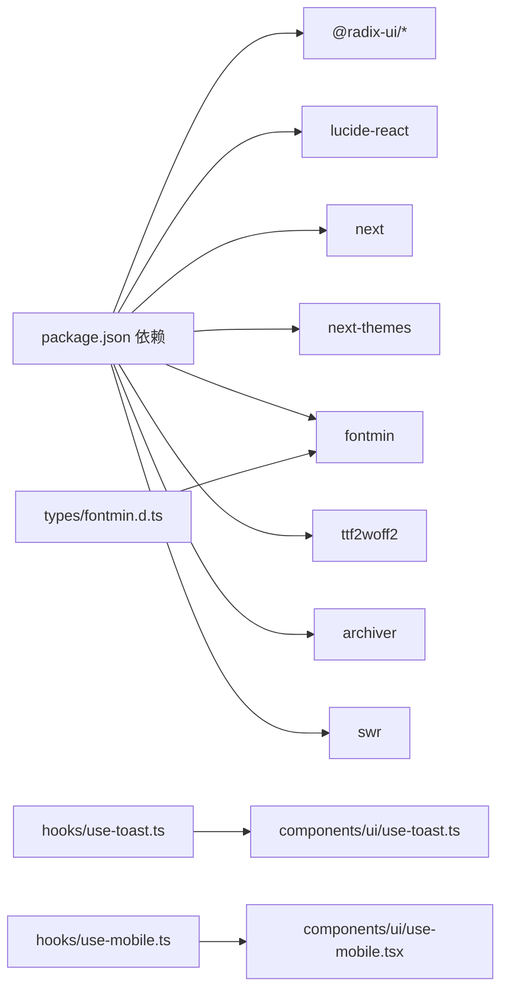

# 扩展开发

<cite>
**本文引用的文件**
- [README.md](file://README.md)
- [package.json](file://package.json)
- [components.json](file://components.json)
- [tsconfig.json](file://tsconfig.json)
- [types/fontmin.d.ts](file://types/fontmin.d.ts)
- [hooks/use-toast.ts](file://hooks/use-toast.ts)
- [hooks/use-mobile.ts](file://hooks/use-mobile.ts)
- [components/ui/use-toast.ts](file://components/ui/use-toast.ts)
- [components/ui/use-mobile.tsx](file://components/ui/use-mobile.tsx)
- [lib/utils.ts](file://lib/utils.ts)
- [components/theme-provider.tsx](file://components/theme-provider.tsx)
- [app/layout.tsx](file://app/layout.tsx)
- [app/page.tsx](file://app/page.tsx)
- [app/api/fonts/subset/route.ts](file://app/api/fonts/subset/route.ts)
- [components/font-uploader.tsx](file://components/font-uploader.tsx)
- [components/font-list.tsx](file://components/font-list.tsx)
</cite>

## 目录
1. [简介](#简介)
2. [项目结构](#项目结构)
3. [核心组件](#核心组件)
4. [架构总览](#架构总览)
5. [详细组件分析](#详细组件分析)
6. [依赖关系分析](#依赖关系分析)
7. [性能考量](#性能考量)
8. [故障排查指南](#故障排查指南)
9. [结论](#结论)
10. [附录](#附录)

## 简介
本指南面向希望为 FontMin 字体子集化工具进行扩展开发的贡献者，覆盖以下主题：
- 新 UI 组件的设计原则、样式规范与可访问性要求
- 自定义 Hook 的开发流程（以 use-toast、use-mobile 为例）
- 扩展字体处理能力（新增算法与格式支持）
- TypeScript 类型定义的维护与更新
- 组件库集成最佳实践（基于 shadcn/ui 的使用与定制）
- API 扩展与新路由创建流程
- 代码规范与提交指南

## 项目结构
项目采用 Next.js App Router 结构，前端组件位于 components 目录，API 路由位于 app/api 下，类型定义位于 types 目录，状态与工具函数分别位于 hooks 与 lib 目录。

图表来源
- [app/layout.tsx](file://app/layout.tsx#L1-L44)
- [app/page.tsx](file://app/page.tsx#L1-L279)
- [components/font-uploader.tsx](file://components/font-uploader.tsx#L1-L166)
- [components/font-list.tsx](file://components/font-list.tsx#L1-L159)
- [hooks/use-toast.ts](file://hooks/use-toast.ts#L1-L192)
- [hooks/use-mobile.ts](file://hooks/use-mobile.ts#L1-L20)
- [components/ui/use-toast.ts](file://components/ui/use-toast.ts#L1-L192)
- [components/ui/use-mobile.tsx](file://components/ui/use-mobile.tsx#L1-L20)
- [lib/utils.ts](file://lib/utils.ts#L1-L7)
- [types/fontmin.d.ts](file://types/fontmin.d.ts#L1-L53)
- [app/api/fonts/subset/route.ts](file://app/api/fonts/subset/route.ts#L1-L366)

章节来源
- [README.md](file://README.md#L135-L160)
- [package.json](file://package.json#L1-L78)

## 核心组件
- 页面与布局：根布局与首页负责组织上传、字体列表、预览与下载设置区域，并通过 SWR 获取会话内字体列表。
- 字体上传组件：支持拖拽与文件选择，过滤并展示已选文件，调用父级上传回调。
- 字体列表组件：提供全选、逐项选择与删除确认对话框。
- 主题提供器：基于 next-themes 提供明暗主题切换。
- 工具函数：cn 统一类名合并，简化 Tailwind 与 clsx 的组合。
- 类型定义：对 fontmin 的插件接口与静态方法进行声明，便于在处理流程中获得类型提示。

章节来源
- [app/layout.tsx](file://app/layout.tsx#L1-L44)
- [app/page.tsx](file://app/page.tsx#L1-L279)
- [components/font-uploader.tsx](file://components/font-uploader.tsx#L1-L166)
- [components/font-list.tsx](file://components/font-list.tsx#L1-L159)
- [components/theme-provider.tsx](file://components/theme-provider.tsx#L1-L12)
- [lib/utils.ts](file://lib/utils.ts#L1-L7)
- [types/fontmin.d.ts](file://types/fontmin.d.ts#L1-L53)

## 架构总览
系统从前端页面发起请求，经由 Next.js API 路由处理，调用字体处理引擎与格式转换库，最终生成子集化字体并提供下载或打包下载。

图表来源
- [app/page.tsx](file://app/page.tsx#L113-L145)
- [app/api/fonts/subset/route.ts](file://app/api/fonts/subset/route.ts#L164-L366)

章节来源
- [app/page.tsx](file://app/page.tsx#L113-L145)
- [app/api/fonts/subset/route.ts](file://app/api/fonts/subset/route.ts#L1-L366)

## 详细组件分析

### UI 组件设计原则与样式规范
- 设计原则
  - 一致性：统一使用 Radix UI 组件与 Tailwind 原子类，保证交互与视觉一致。
  - 可访问性：使用语义化标签与键盘可达性；组件库提供无障碍基础。
  - 响应式：移动端断点以 768px 为准，配合 use-mobile Hook 判断。
- 样式规范
  - 使用 cn 工具函数合并类名，避免冲突与重复。
  - 卡片、表单、按钮等采用组件库提供的变体与尺寸。
- 可访问性要求
  - 为交互元素提供明确的焦点指示与键盘操作路径。
  - 对话框、警告等反馈信息具备可读的标题与描述。

章节来源
- [lib/utils.ts](file://lib/utils.ts#L1-L7)
- [components/ui/use-mobile.tsx](file://components/ui/use-mobile.tsx#L1-L20)
- [components/font-uploader.tsx](file://components/font-uploader.tsx#L1-L166)
- [components/font-list.tsx](file://components/font-list.tsx#L1-L159)

### 自定义 Hook 开发流程（use-toast 与 use-mobile）

#### use-toast Hook 设计模式
- 状态模型
  - 内部内存状态 memoryState 与订阅者列表 listeners，实现全局状态广播。
  - reducer 处理 ADD/UPDATE/DISMISS/REMOVE 四类动作，限制 toast 数量。
- 生命周期与副作用
  - useToast 返回当前状态与 toast 工厂函数，内部通过订阅 listeners 更新 UI。
  - dismiss 与 update 通过分发动作实现状态变更。
- 与组件库集成
  - 组件库中的 use-toast.ts 与 hooks/use-toast.ts 结构一致，可按需替换或复用。

图表来源
- [hooks/use-toast.ts](file://hooks/use-toast.ts#L1-L192)
- [components/ui/use-toast.ts](file://components/ui/use-toast.ts#L1-L192)

章节来源
- [hooks/use-toast.ts](file://hooks/use-toast.ts#L1-L192)
- [components/ui/use-toast.ts](file://components/ui/use-toast.ts#L1-L192)

#### use-mobile Hook 设计模式
- 逻辑要点
  - 使用 window.matchMedia 监听断点变化，结合 useEffect 初始化与清理。
  - 返回布尔值表示是否处于移动端宽度。
- 与组件库差异
  - 组件库版本为 TSX 文件，与 hooks/use-mobile.ts 功能一致，可按项目风格选择。

图表来源
- [hooks/use-mobile.ts](file://hooks/use-mobile.ts#L1-L20)
- [components/ui/use-mobile.tsx](file://components/ui/use-mobile.tsx#L1-L20)

章节来源
- [hooks/use-mobile.ts](file://hooks/use-mobile.ts#L1-L20)
- [components/ui/use-mobile.tsx](file://components/ui/use-mobile.tsx#L1-L20)

### 扩展现有字体处理功能

#### 新增处理算法
- 在 API 路由中扩展插件链：在 glyph 插件之后插入新的 Fontmin 插件，或调整现有插件顺序以改变处理流程。
- 注意：当前路由仅支持 TTF 作为输入，若需支持其他输入格式，需在路由入口处增加格式检测与转换步骤。

章节来源
- [app/api/fonts/subset/route.ts](file://app/api/fonts/subset/route.ts#L31-L162)

#### 新增格式支持
- 在路由中新增格式分支，调用对应的 Fontmin 插件或外部转换库（如 ttf2woff2）。
- 输出文件命名与保存路径需与前端下载链接保持一致。

章节来源
- [app/api/fonts/subset/route.ts](file://app/api/fonts/subset/route.ts#L53-L162)

#### 类型定义维护与更新
- 当新增插件或修改参数时，同步更新 types/fontmin.d.ts 中的接口与方法签名，确保编译期类型安全。
- 若引入新的第三方库，补充相应模块声明与类型导出。

章节来源
- [types/fontmin.d.ts](file://types/fontmin.d.ts#L1-L53)

### 组件库集成最佳实践（shadcn/ui）

- 配置映射
  - components.json 中配置了组件别名与工具函数路径，确保在项目中以 @/components、@/lib 等别名导入。
- 使用方式
  - 在组件中直接从 @/components/ui 引入基础组件，遵循组件库的变体与尺寸约定。
- 定制化
  - 如需定制主题色或变量，可在 tailwind 配置中调整基础色与变量开关。

章节来源
- [components.json](file://components.json#L1-L22)
- [lib/utils.ts](file://lib/utils.ts#L1-L7)

### API 扩展与新路由创建流程

- 新增路由
  - 在 app/api/fonts 下创建新的路由文件（例如 route.ts），定义请求方法与处理器。
  - 在处理器中读取请求头（如会话 ID）、解析请求体、执行业务逻辑并返回响应。
- 与前端交互
  - 在页面组件中发起 fetch 请求，传递必要的头部与参数。
  - 使用 SWR 管理数据获取与缓存，必要时手动触发 mutate 刷新列表。

图表来源
- [app/page.tsx](file://app/page.tsx#L14-L29)
- [app/api/fonts/subset/route.ts](file://app/api/fonts/subset/route.ts#L164-L366)

章节来源
- [app/page.tsx](file://app/page.tsx#L14-L29)
- [app/api/fonts/subset/route.ts](file://app/api/fonts/subset/route.ts#L164-L366)

## 依赖关系分析

图表来源
- [package.json](file://package.json#L11-L66)
- [types/fontmin.d.ts](file://types/fontmin.d.ts#L1-L53)
- [hooks/use-toast.ts](file://hooks/use-toast.ts#L1-L192)
- [components/ui/use-toast.ts](file://components/ui/use-toast.ts#L1-L192)
- [hooks/use-mobile.ts](file://hooks/use-mobile.ts#L1-L20)
- [components/ui/use-mobile.tsx](file://components/ui/use-mobile.tsx#L1-L20)

章节来源
- [package.json](file://package.json#L11-L66)

## 性能考量
- 字体处理
  - 仅对 TTF 进行子集化，避免不必要的格式转换。
  - 对大文件进行分步处理与及时释放内存，减少峰值占用。
- 前端渲染
  - 使用 SWR 缓存列表数据，减少重复请求。
  - 列表滚动容器设置最大高度与虚拟化策略，降低 DOM 负担。
- 网络与并发
  - 并发处理多个字体时，合理控制并发数，避免阻塞。
  - 对打包下载使用流式写入，避免一次性加载至内存。

## 故障排查指南
- 会话与权限
  - 确保请求头包含正确的会话 ID；若缺失或无效，API 将返回 404/400 错误。
- 输入校验
  - 文本为空或字体名为空会导致 400 错误；检查前端传参与路由校验逻辑。
- 格式支持
  - 当前仅支持 TTF 作为输入；非 TTF 文件会被跳过并返回相应提示。
- 错误捕获
  - API 路由对异常进行统一捕获并返回详细错误信息；根据日志定位具体环节。

章节来源
- [app/api/fonts/subset/route.ts](file://app/api/fonts/subset/route.ts#L164-L366)
- [app/page.tsx](file://app/page.tsx#L33-L92)

## 结论
通过遵循本文的设计原则、Hook 模式与 API 扩展流程，开发者可以稳定地为 FontMin 添加新的 UI 组件、自定义 Hook、处理算法与格式支持，同时保持类型安全与组件库的一致性。建议在每次改动后进行端到端测试与性能评估，确保用户体验与系统稳定性。

## 附录

### 代码规范与提交指南
- 提交信息
  - 使用清晰的类型前缀：feat、fix、chore、docs、refactor 等。
  - 简洁描述变更内容，并在必要时补充影响范围与风险说明。
- 分支策略
  - 基于主分支创建功能分支，完成后发起 Pull Request 并进行代码审查。
- 测试与验证
  - 新增组件与 Hook 需补充基本行为测试；API 变更需编写集成测试。
- 文档更新
  - 修改类型定义、组件 API 或路由时，同步更新 README 或新增文档片段。

章节来源
- [README.md](file://README.md#L251-L258)