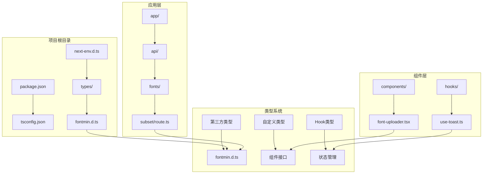
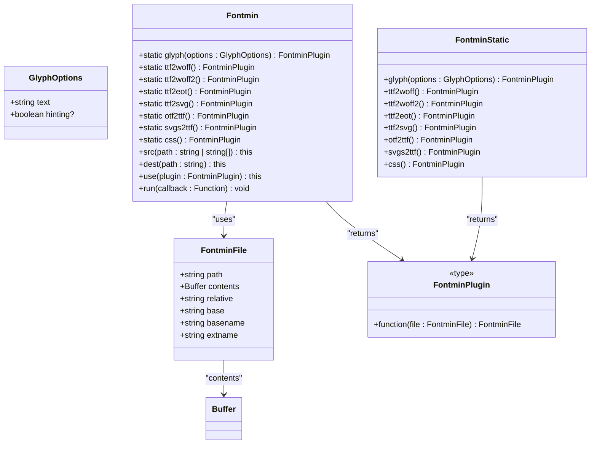
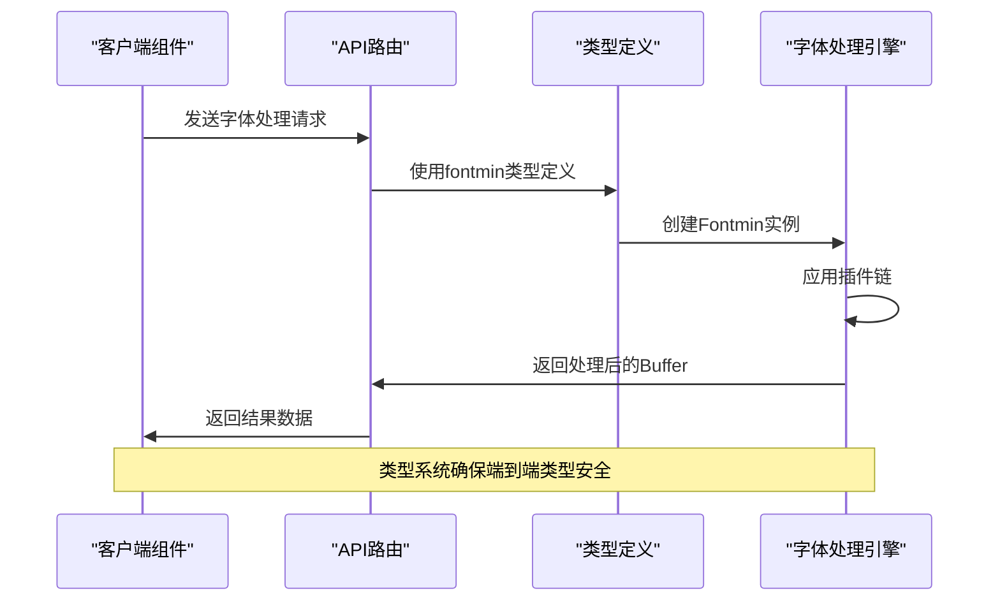
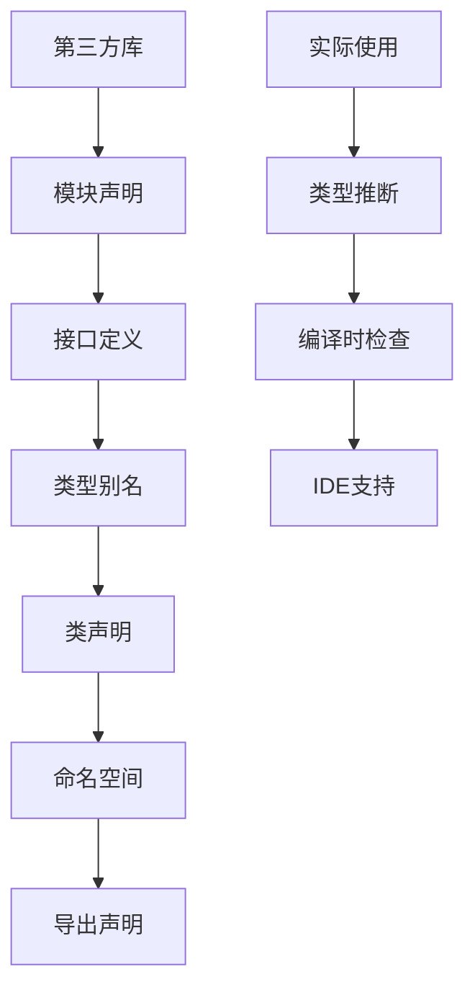
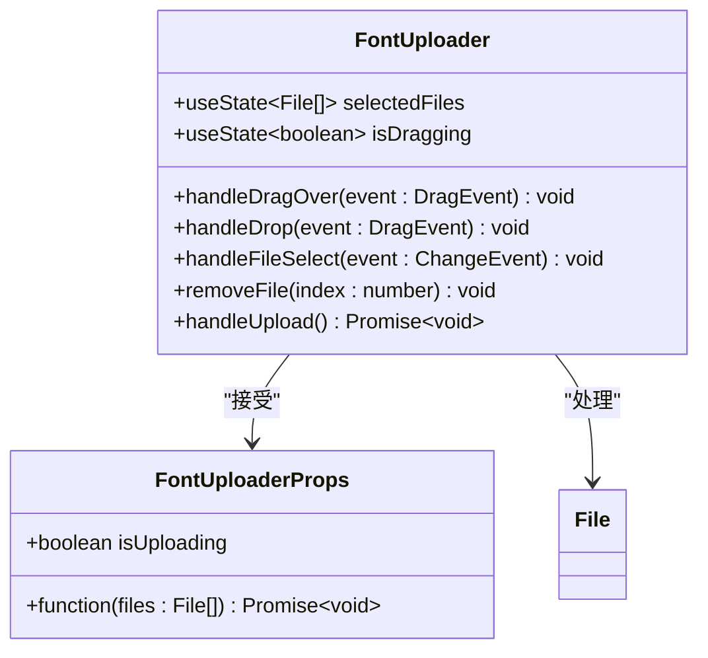
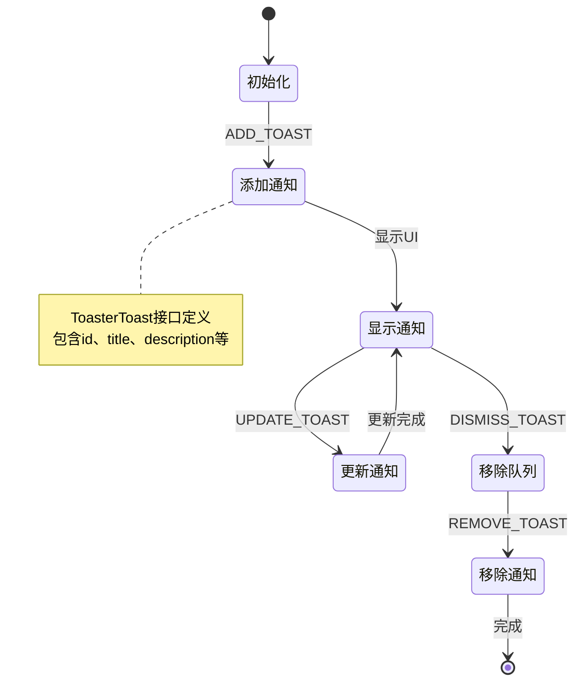
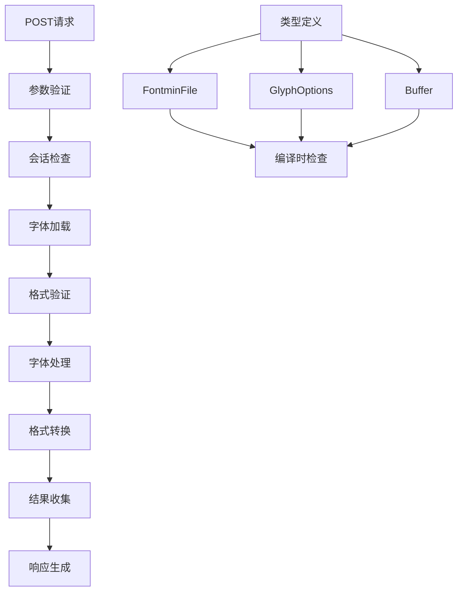
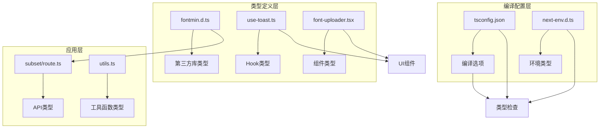

# 类型定义维护

<cite>
**本文档引用的文件**
- [types/fontmin.d.ts](file://types/fontmin.d.ts)
- [package.json](file://package.json)
- [tsconfig.json](file://tsconfig.json)
- [next-env.d.ts](file://next-env.d.ts)
- [app/api/fonts/subset/route.ts](file://app/api/fonts/subset/route.ts)
- [components/font-uploader.tsx](file://components/font-uploader.tsx)
- [hooks/use-toast.ts](file://hooks/use-toast.ts)
- [components/ui/use-toast.ts](file://components/ui/use-toast.ts)
- [lib/utils.ts](file://lib/utils.ts)
</cite>

## 目录
1. [简介](#简介)
2. [项目结构](#项目结构)
3. [核心组件](#核心组件)
4. [架构概览](#架构概览)
5. [详细组件分析](#详细组件分析)
6. [依赖关系分析](#依赖关系分析)
7. [性能考虑](#性能考虑)
8. [故障排除指南](#故障排除指南)
9. [结论](#结论)
10. [附录](#附录)

## 简介

本指南专注于FontMin字体子集化工具的TypeScript类型定义维护策略。该工具是一个基于Next.js 16构建的现代化字体处理应用，专门用于提取字体中的特定字符，生成精简的字体包。项目采用TypeScript提供完整的类型安全保障，特别是在处理第三方库如fontmin的类型定义方面具有典型意义。

FontMin项目通过精心设计的类型系统确保了：
- 第三方库的完整类型支持
- 自定义组件和Hook的类型安全
- 复杂异步流程的类型推断
- 编译时的错误检测和IDE智能提示

## 项目结构

该项目采用标准的Next.js应用结构，其中类型定义位于专门的`types`目录中：

**图表来源**
- [types/fontmin.d.ts](file://types/fontmin.d.ts#L1-L53)
- [package.json](file://package.json#L1-L78)
- [tsconfig.json](file://tsconfig.json#L1-L42)

**章节来源**
- [package.json](file://package.json#L1-L78)
- [tsconfig.json](file://tsconfig.json#L1-L42)

## 核心组件

### 字体处理引擎类型定义

FontMin项目的核心类型定义位于`types/fontmin.d.ts`文件中，这是一个典型的第三方库类型声明文件。该文件为fontmin库提供了完整的TypeScript支持：

**图表来源**
- [types/fontmin.d.ts](file://types/fontmin.d.ts#L1-L53)

### 编译配置与类型系统集成

项目的TypeScript配置确保了类型系统的有效运行：

| 配置项 | 设置值 | 作用 |
|--------|--------|------|
| `strict` | `true` | 启用严格类型检查 |
| `noEmit` | `true` | 仅进行类型检查，不生成JavaScript |
| `moduleResolution` | `"bundler"` | 支持现代模块解析 |
| `jsx` | `"react-jsx"` | React JSX语法支持 |
| `skipLibCheck` | `true` | 跳过库文件的类型检查 |

**章节来源**
- [tsconfig.json](file://tsconfig.json#L1-L42)
- [next-env.d.ts](file://next-env.d.ts#L1-L7)

## 架构概览

FontMin的类型系统架构体现了现代前端开发的最佳实践：

**图表来源**
- [app/api/fonts/subset/route.ts](file://app/api/fonts/subset/route.ts#L1-L366)
- [types/fontmin.d.ts](file://types/fontmin.d.ts#L1-L53)

## 详细组件分析

### 第三方库类型定义维护

#### Fontmin库类型定义策略

Fontmin的类型定义采用了模块声明的方式，这是处理第三方库的标准做法：

**图表来源**
- [types/fontmin.d.ts](file://types/fontmin.d.ts#L1-L53)

#### 类型定义的关键要素

1. **接口设计**：`FontminFile`接口提供了完整的文件信息结构
2. **类型别名**：`FontminPlugin`简化了插件函数的类型表示
3. **静态方法**：`FontminStatic`接口确保了工厂方法的类型安全
4. **命名空间**：`Fontmin.File`提供了便捷的类型引用

**章节来源**
- [types/fontmin.d.ts](file://types/fontmin.d.ts#L1-L53)

### 自定义组件类型定义

#### 字体上传组件类型系统

字体上传组件展示了如何为React组件创建完整的类型定义：

**图表来源**
- [components/font-uploader.tsx](file://components/font-uploader.tsx#L1-L166)

#### 组件类型定义最佳实践

1. **属性接口分离**：将组件属性定义为独立的接口
2. **事件处理器类型**：明确指定React事件处理器的参数类型
3. **状态类型推断**：利用TypeScript的类型推断减少重复定义
4. **回调函数类型**：为异步回调函数提供明确的Promise类型

**章节来源**
- [components/font-uploader.tsx](file://components/font-uploader.tsx#L1-L166)

### Hook类型定义

#### Toast Hook类型系统

项目中的Toast Hook展示了复杂状态管理的类型定义：

**图表来源**
- [hooks/use-toast.ts](file://hooks/use-toast.ts#L1-L192)

#### Hook类型定义策略

1. **联合类型**：使用联合类型表示不同的动作类型
2. **条件类型**：利用`Partial<T>`处理可选属性
3. **泛型约束**：确保类型的安全性和灵活性
4. **状态推断**：让TypeScript自动推断复杂的状态结构

**章节来源**
- [hooks/use-toast.ts](file://hooks/use-toast.ts#L1-L192)
- [components/ui/use-toast.ts](file://components/ui/use-toast.ts#L1-L192)

### 异步处理类型定义

#### 字体处理流程类型安全

字体处理API展示了复杂异步流程的类型定义：

**图表来源**
- [app/api/fonts/subset/route.ts](file://app/api/fonts/subset/route.ts#L1-L366)
- [types/fontmin.d.ts](file://types/fontmin.d.ts#L1-L53)

**章节来源**
- [app/api/fonts/subset/route.ts](file://app/api/fonts/subset/route.ts#L1-L366)

## 依赖关系分析

### 类型系统依赖图

**图表来源**
- [types/fontmin.d.ts](file://types/fontmin.d.ts#L1-L53)
- [tsconfig.json](file://tsconfig.json#L1-L42)
- [app/api/fonts/subset/route.ts](file://app/api/fonts/subset/route.ts#L1-L366)

### 类型导入和导出策略

项目中的类型导入遵循以下策略：

1. **本地类型导入**：组件和Hook直接导入本地类型定义
2. **第三方类型声明**：通过`types/`目录提供第三方库的类型声明
3. **编译器类型引用**：使用`next-env.d.ts`提供Next.js环境类型
4. **路径映射**：通过`tsconfig.json`的`paths`配置简化导入路径

**章节来源**
- [tsconfig.json](file://tsconfig.json#L25-L29)
- [next-env.d.ts](file://next-env.d.ts#L1-L7)

## 性能考虑

### 类型检查性能优化

1. **增量编译**：启用`incremental`选项提高编译速度
2. **跳过库检查**：使用`skipLibCheck`避免第三方库的类型检查开销
3. **严格模式**：虽然启用严格模式，但通过精确的类型定义避免过度检查
4. **模块解析**：使用`bundler`模块解析器支持现代打包工具

### 类型定义维护性能

1. **单一职责**：每个类型文件专注于特定的功能领域
2. **接口复用**：通过接口组合减少重复定义
3. **类型推断**：充分利用TypeScript的类型推断能力
4. **条件类型**：使用条件类型处理复杂的类型变换

## 故障排除指南

### 常见类型定义问题

#### 编译错误排查

1. **模块解析失败**：检查`tsconfig.json`中的路径配置
2. **类型冲突**：确认第三方库类型声明的准确性
3. **异步类型错误**：确保Promise和回调函数的类型正确
4. **React类型错误**：验证React组件的属性和事件处理器类型

#### 类型定义更新策略

1. **版本兼容性**：跟踪第三方库的版本变化，及时更新类型定义
2. **向后兼容**：在更新类型定义时保持向后兼容性
3. **测试验证**：通过实际使用验证类型定义的正确性
4. **文档同步**：更新类型定义时同步更新相关文档

**章节来源**
- [tsconfig.json](file://tsconfig.json#L1-L42)

## 结论

FontMin项目的类型定义维护展现了现代TypeScript开发的最佳实践：

1. **完整的类型覆盖**：从第三方库到自定义组件的全栈类型支持
2. **严格的类型检查**：通过编译配置确保类型安全
3. **灵活的类型系统**：支持复杂的异步流程和状态管理
4. **良好的维护性**：清晰的类型定义组织和更新策略

通过这个项目，开发者可以学习到如何为第三方库创建准确的类型声明，如何为自定义组件和Hook设计合理的类型定义，以及如何维护大型项目的类型系统。

## 附录

### 类型定义维护清单

- [ ] 定期更新第三方库的类型声明
- [ ] 验证类型定义与实际实现的一致性
- [ ] 确保类型定义的向后兼容性
- [ ] 优化类型定义的性能影响
- [ ] 维护类型定义的文档和注释

### 推荐的类型定义模式

1. **模块声明模式**：用于第三方库类型定义
2. **接口组合模式**：用于复杂对象的类型定义
3. **泛型约束模式**：用于通用类型的定义
4. **条件类型模式**：用于动态类型的处理