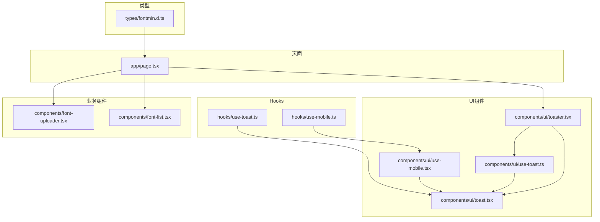
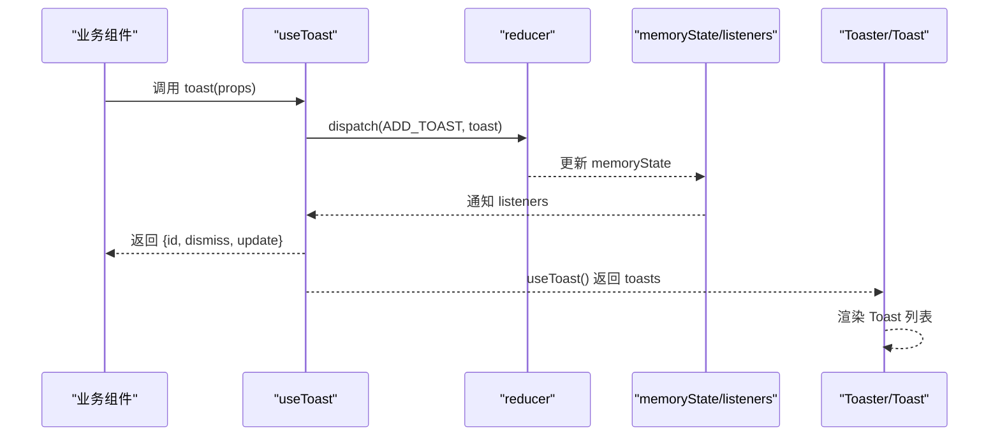
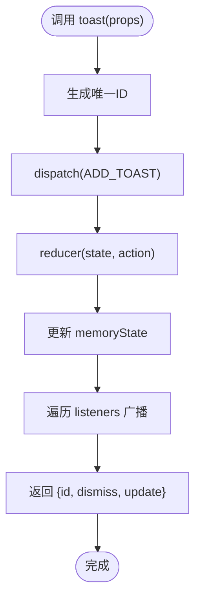
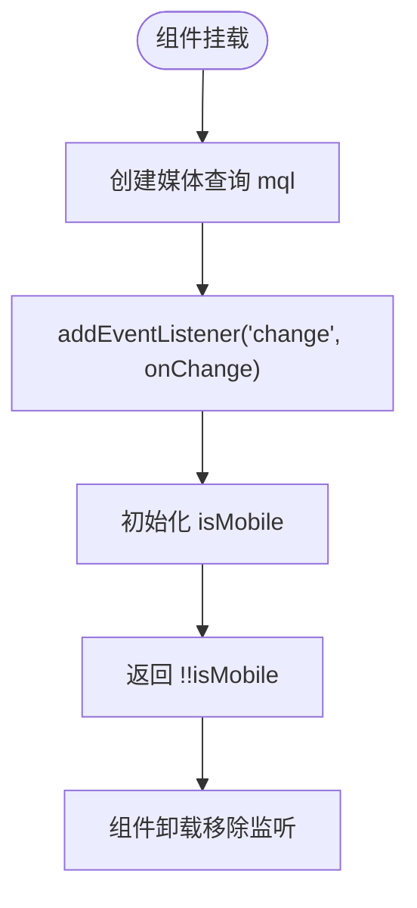
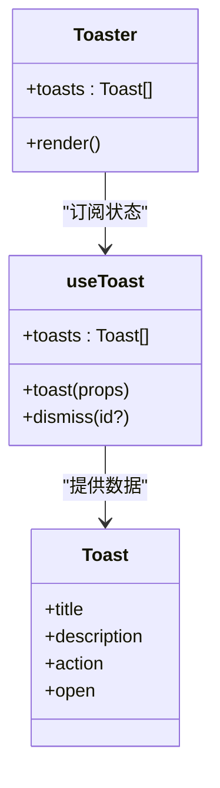
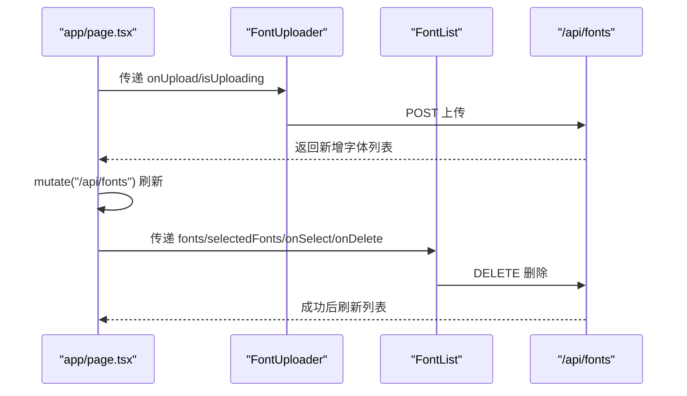
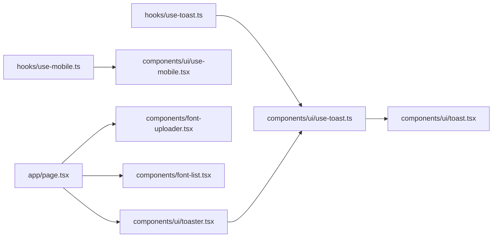

# 自定义Hook开发

<cite>
**本文引用的文件**
- [hooks/use-toast.ts](file://hooks/use-toast.ts)
- [hooks/use-mobile.ts](file://hooks/use-mobile.ts)
- [components/ui/use-toast.ts](file://components/ui/use-toast.ts)
- [components/ui/use-mobile.tsx](file://components/ui/use-mobile.tsx)
- [components/ui/toast.tsx](file://components/ui/toast.tsx)
- [components/ui/toaster.tsx](file://components/ui/toaster.tsx)
- [components/font-uploader.tsx](file://components/font-uploader.tsx)
- [components/font-list.tsx](file://components/font-list.tsx)
- [app/page.tsx](file://app/page.tsx)
- [types/fontmin.d.ts](file://types/fontmin.d.ts)
- [README.md](file://README.md)
</cite>

## 目录
1. [引言](#引言)
2. [项目结构](#项目结构)
3. [核心组件](#核心组件)
4. [架构总览](#架构总览)
5. [详细组件分析](#详细组件分析)
6. [依赖关系分析](#依赖关系分析)
7. [性能考量](#性能考量)
8. [故障排查指南](#故障排查指南)
9. [结论](#结论)
10. [附录](#附录)

## 引言
本指南面向FontMin字体子集化工具的前端开发者，系统讲解如何设计与实现可复用的React Hook，结合项目中的use-toast与use-mobile两个典型示例，阐述Hook的设计原则（单一职责、状态封装、副作用管理）、异步处理与错误边界、性能优化、测试策略与调试技巧、Hook组合与依赖注入的最佳实践，并给出从简单状态管理Hook到复杂业务逻辑Hook的开发路径与组件集成模式。

## 项目结构
该项目采用Next.js App Router组织结构，前端组件与Hook位于components与hooks目录，UI基础组件位于components/ui，业务页面位于app目录。字体处理能力通过fontmin库与类型声明文件对接。

图表来源
- [hooks/use-toast.ts](file://hooks/use-toast.ts#L1-L192)
- [hooks/use-mobile.ts](file://hooks/use-mobile.ts#L1-L20)
- [components/ui/use-toast.ts](file://components/ui/use-toast.ts#L1-L192)
- [components/ui/use-mobile.tsx](file://components/ui/use-mobile.tsx#L1-L20)
- [components/ui/toast.tsx](file://components/ui/toast.tsx#L1-L130)
- [components/ui/toaster.tsx](file://components/ui/toaster.tsx#L1-L36)
- [components/font-uploader.tsx](file://components/font-uploader.tsx#L1-L166)
- [components/font-list.tsx](file://components/font-list.tsx#L1-L159)
- [app/page.tsx](file://app/page.tsx#L1-L279)
- [types/fontmin.d.ts](file://types/fontmin.d.ts#L1-L53)

章节来源
- [README.md](file://README.md#L135-L160)

## 核心组件
- use-toast：基于订阅-分发的状态管理Hook，提供全局通知能力，支持添加、更新、关闭与移除通知，内部维护内存状态与监听器列表。
- use-mobile：响应式断点检测Hook，返回当前是否为移动端状态，内部使用window.matchMedia监听窗口尺寸变化。
- UI层toast与toaster：基于Radix UI的Toast组件与容器，配合use-toast渲染通知。
- 页面与业务组件：app/page.tsx中使用SWR进行数据获取与缓存更新，业务组件如FontUploader、FontList负责上传、列表与删除交互。

章节来源
- [hooks/use-toast.ts](file://hooks/use-toast.ts#L1-L192)
- [hooks/use-mobile.ts](file://hooks/use-mobile.ts#L1-L20)
- [components/ui/use-toast.ts](file://components/ui/use-toast.ts#L1-L192)
- [components/ui/use-mobile.tsx](file://components/ui/use-mobile.tsx#L1-L20)
- [components/ui/toast.tsx](file://components/ui/toast.tsx#L1-L130)
- [components/ui/toaster.tsx](file://components/ui/toaster.tsx#L1-L36)
- [app/page.tsx](file://app/page.tsx#L1-L279)

## 架构总览
use-toast采用“内存状态+订阅者模式”，通过dispatch分发动作，reducer计算新状态，listeners广播给所有订阅者；use-mobile通过useEffect注册媒体查询监听，在组件卸载时清理事件；UI层Toaster消费useToast提供的状态并渲染Toast。

图表来源
- [hooks/use-toast.ts](file://hooks/use-toast.ts#L142-L169)
- [hooks/use-toast.ts](file://hooks/use-toast.ts#L171-L189)
- [hooks/use-toast.ts](file://hooks/use-toast.ts#L74-L127)
- [components/ui/toaster.tsx](file://components/ui/toaster.tsx#L13-L35)
- [components/ui/toast.tsx](file://components/ui/toast.tsx#L1-L130)

## 详细组件分析

### use-toast Hook 分析
- 单一职责：集中管理全局通知状态与动作分发，不关心UI细节。
- 状态封装：内部state通过memoryState与listeners抽象，对外暴露useToast与toast函数。
- 副作用管理：dispatch在内存中计算状态，useEffect将当前组件加入/移除监听器，避免重复订阅。
- 异步与定时：addToRemoveQueue基于Map记录超时任务，统一移除逻辑。
- 错误边界：toast内部onOpenChange触发dismiss，确保非打开状态自动清理。
- 性能优化：TOAST_LIMIT限制数量，slice裁剪避免无限增长；listeners数组按需增删。

图表来源
- [hooks/use-toast.ts](file://hooks/use-toast.ts#L142-L169)
- [hooks/use-toast.ts](file://hooks/use-toast.ts#L171-L189)
- [hooks/use-toast.ts](file://hooks/use-toast.ts#L74-L127)

章节来源
- [hooks/use-toast.ts](file://hooks/use-toast.ts#L1-L192)
- [components/ui/use-toast.ts](file://components/ui/use-toast.ts#L1-L192)

### use-mobile Hook 分析
- 单一职责：仅负责移动端断点判断，返回布尔值。
- 状态封装：useState保存isMobile状态，useEffect在挂载时初始化并注册媒体查询监听。
- 副作用管理：在cleanup中移除事件监听，避免内存泄漏。
- 性能优化：使用matchMedia与事件回调，避免频繁重排；初始值在服务端/客户端分别设置。

图表来源
- [hooks/use-mobile.ts](file://hooks/use-mobile.ts#L5-L19)
- [components/ui/use-mobile.tsx](file://components/ui/use-mobile.tsx#L5-L19)

章节来源
- [hooks/use-mobile.ts](file://hooks/use-mobile.ts#L1-L20)
- [components/ui/use-mobile.tsx](file://components/ui/use-mobile.tsx#L1-L20)

### UI 层 Toast 与 Toaster
- Toaster：消费useToast返回的toasts，逐条渲染Toast，包含标题、描述、操作按钮与关闭按钮。
- Toast：基于Radix UI，支持变体与动画，通过cva控制样式。
- 依赖关系：Toaster依赖use-toast；Toast依赖toaster.tsx中导入的UI组件集合。

图表来源
- [components/ui/toaster.tsx](file://components/ui/toaster.tsx#L13-L35)
- [components/ui/use-toast.ts](file://components/ui/use-toast.ts#L171-L189)
- [components/ui/toast.tsx](file://components/ui/toast.tsx#L43-L129)

章节来源
- [components/ui/toaster.tsx](file://components/ui/toaster.tsx#L1-L36)
- [components/ui/toast.tsx](file://components/ui/toast.tsx#L1-L130)
- [components/ui/use-toast.ts](file://components/ui/use-toast.ts#L1-L192)

### 页面与业务组件中的Hook使用
- app/page.tsx：使用SWR进行字体列表的获取与刷新，上传、删除、子集化等操作均通过fetch API完成，错误处理统一捕获并提示。
- FontUploader：负责拖拽/选择文件、校验格式、上传与清空列表。
- FontList：负责字体列表渲染、全选/反选、删除确认对话框与删除流程。

图表来源
- [app/page.tsx](file://app/page.tsx#L33-L92)
- [components/font-uploader.tsx](file://components/font-uploader.tsx#L65-L70)
- [components/font-list.tsx](file://components/font-list.tsx#L49-L54)

章节来源
- [app/page.tsx](file://app/page.tsx#L1-L279)
- [components/font-uploader.tsx](file://components/font-uploader.tsx#L1-L166)
- [components/font-list.tsx](file://components/font-list.tsx#L1-L159)

## 依赖关系分析
- use-toast与UI层解耦：use-toast仅负责状态与动作，UI层通过Toaster消费状态，便于替换UI方案。
- use-mobile与平台解耦：仅依赖window.matchMedia，可在SSR/CSR环境中稳定工作。
- 页面与组件：页面通过SWR与API交互，组件通过Hook与UI层交互，形成清晰的分层。

图表来源
- [hooks/use-toast.ts](file://hooks/use-toast.ts#L1-L192)
- [components/ui/use-toast.ts](file://components/ui/use-toast.ts#L1-L192)
- [components/ui/toast.tsx](file://components/ui/toast.tsx#L1-L130)
- [components/ui/toaster.tsx](file://components/ui/toaster.tsx#L1-L36)
- [hooks/use-mobile.ts](file://hooks/use-mobile.ts#L1-L20)
- [components/ui/use-mobile.tsx](file://components/ui/use-mobile.tsx#L1-L20)
- [app/page.tsx](file://app/page.tsx#L1-L279)
- [components/font-uploader.tsx](file://components/font-uploader.tsx#L1-L166)
- [components/font-list.tsx](file://components/font-list.tsx#L1-L159)

## 性能考量
- use-toast
  - 内存状态与订阅者模式避免昂贵的全局状态库依赖，但需注意listeners数组的增删与去重。
  - TOAST_LIMIT与slice裁剪限制通知数量，减少渲染压力。
  - addToRemoveQueue使用Map去重，避免重复定时器。
- use-mobile
  - matchMedia监听一次性注册，cleanup移除避免内存泄漏。
  - 初始值在挂载时设置，避免不必要的重渲染。
- 页面与组件
  - SWR缓存与mutate减少重复请求，useCallback稳定回调避免无谓重渲染。
  - 文件上传与删除操作在finally阶段重置状态，保证UI一致性。

章节来源
- [hooks/use-toast.ts](file://hooks/use-toast.ts#L7-L127)
- [hooks/use-mobile.ts](file://hooks/use-mobile.ts#L5-L19)
- [app/page.tsx](file://app/page.tsx#L33-L92)

## 故障排查指南
- 通知不消失或重复出现
  - 检查dismiss与onOpenChange是否正确触发，确认addToRemoveQueue是否重复添加。
  - 确认listeners在组件卸载时已移除。
- 移动端断点不生效
  - 确认matchMedia监听是否注册与移除，检查MOBILE_BREAKPOINT常量与媒体查询表达式。
- 页面数据不刷新
  - 确认SWR的mutate调用时机与URL一致，检查headers中会话标识是否正确。
- 上传/删除失败
  - 捕获异常并提示用户，检查API响应状态码与错误信息解析。

章节来源
- [hooks/use-toast.ts](file://hooks/use-toast.ts#L58-L127)
- [hooks/use-mobile.ts](file://hooks/use-mobile.ts#L8-L16)
- [app/page.tsx](file://app/page.tsx#L33-L92)

## 结论
本指南通过use-toast与use-mobile两个示例，展示了如何设计与实现可复用的React Hook：明确单一职责、封装内部状态、妥善管理副作用、处理异步与错误、关注性能与可测试性。在FontMin项目中，这些Hook与UI层、页面与业务组件协同工作，形成了清晰、可扩展的前端架构。

## 附录

### 设计原则与最佳实践
- 单一职责：每个Hook只做一件事，如状态管理或响应式检测。
- 状态封装：对外暴露稳定的API，内部状态与副作用隔离。
- 副作用管理：在useEffect中注册/清理，确保组件卸载时释放资源。
- 异步与错误：在Hook内统一处理Promise与错误，向上抛出可读信息。
- 性能优化：限制状态规模、避免重复订阅、使用memo化与去抖。
- 测试策略：为Hook编写单元测试（模拟React环境）、集成测试（与组件联调）、快照测试（UI层）。
- 调试技巧：利用React DevTools Profiler、console.log、测试覆盖率工具定位问题。
- Hook组合与依赖注入：通过参数注入外部依赖（如API客户端），在上层组合多个Hook形成复合逻辑。

### 从简单到复杂的Hook开发路径
- 简单状态管理Hook（如use-mobile）
  - 仅依赖useState与useEffect，返回派生状态。
  - 示例参考：[hooks/use-mobile.ts](file://hooks/use-mobile.ts#L1-L20)、[components/ui/use-mobile.tsx](file://components/ui/use-mobile.tsx#L1-L20)
- 中等复杂度Hook（如use-toast）
  - 内部维护内存状态与动作分发，向外暴露API。
  - 示例参考：[hooks/use-toast.ts](file://hooks/use-toast.ts#L1-L192)、[components/ui/use-toast.ts](file://components/ui/use-toast.ts#L1-L192)
- 复杂业务Hook（如字体处理流程）
  - 组合use-toast、SWR、fetch、文件处理等，封装业务流程。
  - 示例参考：页面与业务组件的交互，如上传、删除、子集化流程。

### 组件集成模式与使用注意事项
- 在页面中组合多个Hook，通过props向下传递状态与回调。
- UI层Toaster应挂载在根组件，确保全局可见。
- 注意会话隔离与权限头（如x-font-session-id）的一致性。
- 对外暴露的Hook尽量保持纯函数式风格，便于测试与复用。

章节来源
- [app/page.tsx](file://app/page.tsx#L1-L279)
- [components/ui/toaster.tsx](file://components/ui/toaster.tsx#L1-L36)
- [types/fontmin.d.ts](file://types/fontmin.d.ts#L1-L53)