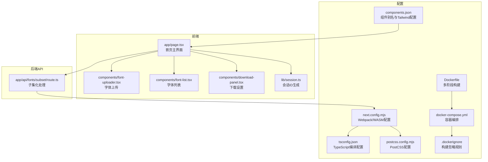
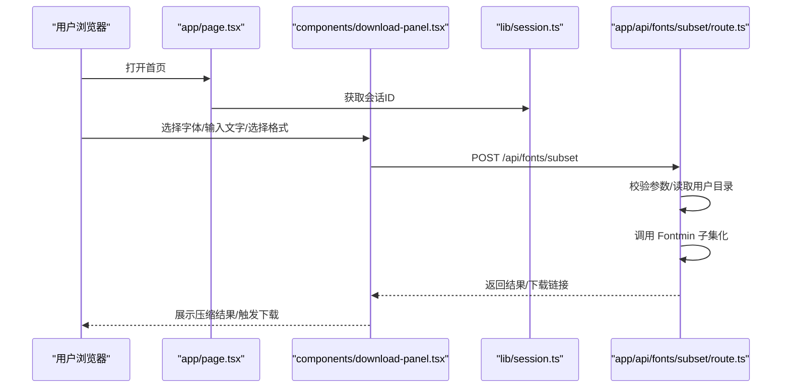
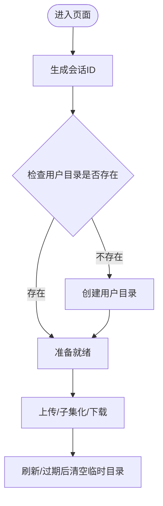
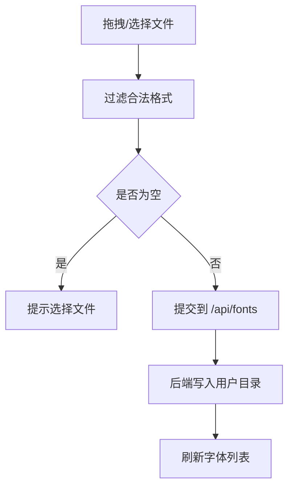
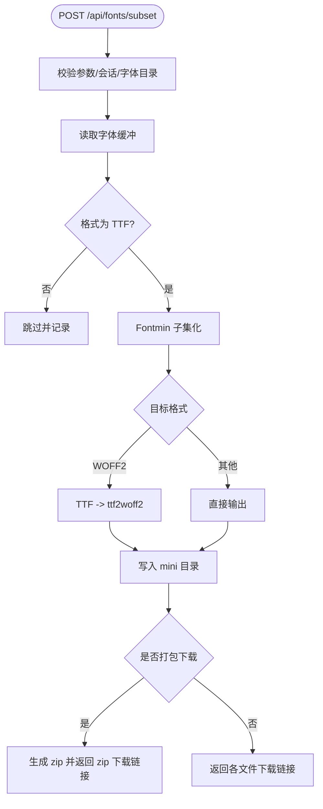
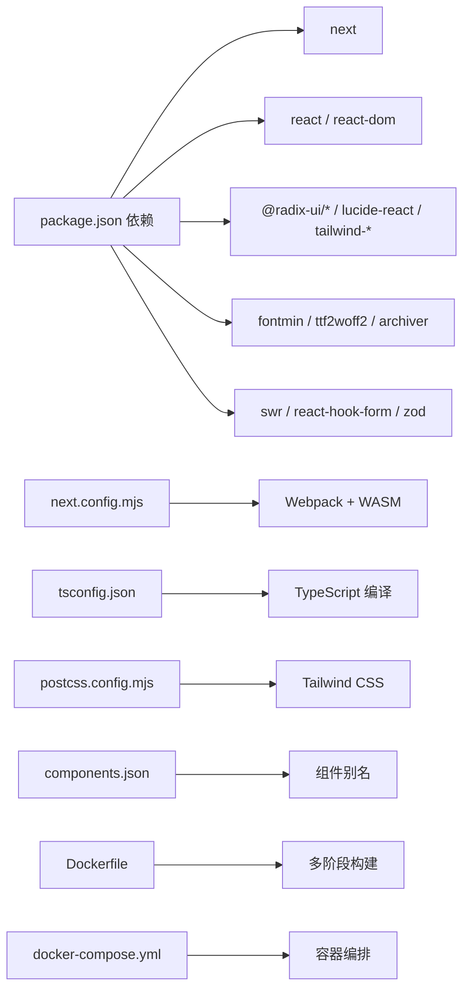

# 快速开始

<cite>
**本文引用的文件**
- [README.md](file://README.md)
- [DOCKER_DEPLOY.md](file://DOCKER_DEPLOY.md)
- [Dockerfile](file://Dockerfile)
- [docker-compose.yml](file://docker-compose.yml)
- [.dockerignore](file://.dockerignore)
- [.dockerbuildconfig](file://.dockerbuildconfig)
- [docker-build.sh](file://docker-build.sh)
- [docker-deploy.sh](file://docker-deploy.sh)
- [docker-build.bat](file://docker-build.bat)
- [docker-deploy.bat](file://docker-deploy.bat)
- [docker-build.ps1](file://docker-build.ps1)
- [package.json](file://package.json)
- [next.config.mjs](file://next.config.mjs)
- [tsconfig.json](file://tsconfig.json)
- [components.json](file://components.json)
- [deploy.sh](file://deploy.sh)
- [postcss.config.mjs](file://postcss.config.mjs)
- [app/page.tsx](file://app/page.tsx)
- [app/api/fonts/subset/route.ts](file://app/api/fonts/subset/route.ts)
- [components/font-uploader.tsx](file://components/font-uploader.tsx)
- [components/font-list.tsx](file://components/font-list.tsx)
- [components/download-panel.tsx](file://components/download-panel.tsx)
- [lib/session.ts](file://lib/session.ts)
- [types/fontmin.d.ts](file://types/fontmin.d.ts)
</cite>

## 目录
1. [简介](#简介)
2. [环境要求](#环境要求)
3. [安装步骤](#安装步骤)
4. [Docker 容器化部署](#docker-容器化部署)
5. [开发环境启动](#开发环境启动)
6. [生产构建与部署](#生产构建与部署)
7. [项目结构](#项目结构)
8. [核心组件](#核心组件)
9. [架构总览](#架构总览)
10. [详细组件分析](#详细组件分析)
11. [依赖分析](#依赖分析)
12. [性能考虑](#性能考虑)
13. [故障排除指南](#故障排除指南)
14. [结论](#结论)
15. [附录](#附录)

## 简介
本指南面向初学者，帮助你在本地快速搭建 FontMin 字体子集化工具的开发环境，并完成开发调试、生产构建与部署。项目基于 Next.js 16、React 19 与 TypeScript，采用 Webpack 模式运行以支持 WASM 模块加载；后端通过 Fontmin 对字体进行子集化处理，支持 TTF、WOFF、WOFF2、EOT、SVG 等格式输出。现在项目也支持 Docker 容器化部署，提供更加便捷的生产环境部署方案。

## 环境要求
- **Node.js 18.0 或更高版本**
- **pnpm 8.0 或更高版本**
- **Docker 20.10+（可选，用于容器化部署）**
- **Docker Compose 2.0+（可选，用于容器化部署）**

## 安装步骤
### 本地安装
```bash
# 克隆项目
git clone https://github.com/tutusiji/FontMinify.git

# 进入项目目录
cd FontMinify

# 安装依赖
pnpm install
```

### Docker 安装
```bash
# 克隆项目
git clone https://github.com/tutusiji/FontMinify.git

# 进入项目目录
cd FontMinify

# 构建并启动容器
docker-compose up -d
```

## Docker 容器化部署

### 前置要求
- Docker 20.10+
- Docker Compose 2.0+

### 一键部署
**Windows 系统（PowerShell）：**
```powershell
.\docker-deploy.ps1
```

**Windows 系统（CMD）：**
```cmd
docker-deploy.bat
```

**Linux/macOS 系统：**
```bash
chmod +x docker-deploy.sh
./docker-deploy.sh
```

### 手动部署
#### 1. 构建镜像
```bash
docker-compose build
```

#### 2. 启动服务
```bash
docker-compose up -d
```

#### 3. 查看日志
```bash
docker-compose logs -f
```

#### 4. 停止服务
```bash
docker-compose down
```

### 配置说明

#### 端口配置
默认端口：`6739`

修改端口：编辑 `docker-compose.yml` 文件
```yaml
ports:
  - "8080:6739"  # 将本地 8080 端口映射到容器 6739 端口
```

#### 数据持久化
以下目录会自动挂载到宿主机，确保数据持久化：
- `./font-source` - 源字体文件
- `./font-mini` - 生成的精简字体
- `./font-temp` - 临时文件

#### 环境变量
可在 `docker-compose.yml` 中配置环境变量：
```yaml
environment:
  - NODE_ENV=production
  - PORT=6739
  - HOSTNAME=0.0.0.0
```

### 常用命令

#### 查看运行状态
```bash
docker-compose ps
```

#### 重启服务
```bash
docker-compose restart
```

#### 进入容器
```bash
docker-compose exec font-subsetting-tool sh
```

#### 查看资源占用
```bash
docker stats font-subsetting-tool
```

#### 更新镜像
```bash
docker-compose pull
docker-compose up -d
```

#### 完全清理
```bash
docker-compose down --rmi all -v
```

### 架构说明

#### 多阶段构建
1. **deps 阶段**: 安装依赖
2. **builder 阶段**: 构建 Next.js 应用
3. **runner 阶段**: 精简运行时镜像

#### 镜像优化
- 使用 Alpine Linux 减小镜像体积
- 多阶段构建，最终镜像只包含必要文件
- 非 root 用户运行，提高安全性

### 生产环境建议

#### 1. 使用反向代理
建议使用 Nginx 作为反向代理：
```nginx
server {
    listen 80;
    server_name your-domain.com;

    location / {
        proxy_pass http://localhost:6739;
        proxy_set_header Host $host;
        proxy_set_header X-Real-IP $remote_addr;
    }
}
```

#### 2. 启用 HTTPS
使用 Let's Encrypt 证书：
```bash
certbot --nginx -d your-domain.com
```

#### 3. 配置日志
```yaml
services:
  font-subsetting-tool:
    logging:
      driver: "json-file"
      options:
        max-size: "10m"
        max-file: "3"
```

#### 4. 健康检查
```yaml
services:
  font-subsetting-tool:
    healthcheck:
      test: ["CMD", "wget", "--quiet", "--tries=1", "--spider", "http://localhost:6739"]
      interval: 30s
      timeout: 10s
      retries: 3
```

### 访问应用
部署成功后，访问：
- 本地：http://localhost:6739
- 远程：http://your-server-ip:6739

### 监控和维护

#### 定期备份
```bash
# 备份字体文件
tar -czf fonts-backup-$(date +%Y%m%d).tar.gz font-source font-mini

# 备份到远程
rsync -avz font-source font-mini user@backup-server:/backup/
```

#### 定期清理
```bash
# 清理临时文件
docker-compose exec font-subsetting-tool sh -c "rm -rf font-temp/*"

# 清理未使用的镜像
docker image prune -a
```

## 开发环境启动

### 本地开发
```bash
# 启动开发服务器（使用 Webpack）
pnpm dev

# 项目将在 http://localhost:6739 运行
```

### Docker 开发
```bash
# 构建开发镜像
docker-compose -f docker-compose.yml -f docker-compose.dev.yml up -d

# 访问 http://localhost:6739
```

## 生产构建与部署

### 本地生产构建
```bash
# 构建生产版本
pnpm build

# 启动生产服务器
pnpm start
```

### Docker 生产部署
```bash
# 构建生产镜像
docker-compose build

# 启动生产服务
docker-compose up -d

# 查看日志
docker-compose logs -f
```

### 自动化部署脚本
```bash
# Linux/macOS
chmod +x deploy.sh
./deploy.sh

# Windows
deploy.bat
```

## 项目结构
项目采用 Next.js App Router 结构，核心目录与职责如下：
- app/: 页面与 API 路由
  - app/page.tsx: 首页主界面
  - app/api/fonts/: 字体相关 API（上传、子集化、下载、预览）
- components/: UI 组件与基础组件库封装
- lib/: 工具函数（如会话管理）
- types/: TypeScript 类型声明
- 配置文件: next.config.mjs、tsconfig.json、postcss.config.mjs、components.json
- Docker 配置: Dockerfile、docker-compose.yml、.dockerignore



**图表来源**
- [app/page.tsx](file://app/page.tsx#L1-L279)
- [components/font-uploader.tsx](file://components/font-uploader.tsx#L1-L166)
- [components/font-list.tsx](file://components/font-list.tsx#L1-L159)
- [components/download-panel.tsx](file://components/download-panel.tsx#L1-L295)
- [lib/session.ts](file://lib/session.ts#L1-L34)
- [app/api/fonts/subset/route.ts](file://app/api/fonts/subset/route.ts#L1-L366)
- [next.config.mjs](file://next.config.mjs#L1-L44)
- [tsconfig.json](file://tsconfig.json#L1-L42)
- [postcss.config.mjs](file://postcss.config.mjs#L1-L9)
- [components.json](file://components.json#L1-L22)
- [Dockerfile](file://Dockerfile#L1-L60)
- [docker-compose.yml](file://docker-compose.yml#L1-L34)
- [.dockerignore](file://.dockerignore#L1-L59)

**章节来源**
- [README.md](file://README.md#L135-L160)
- [next.config.mjs](file://next.config.mjs#L1-L44)
- [tsconfig.json](file://tsconfig.json#L1-L42)
- [postcss.config.mjs](file://postcss.config.mjs#L1-L9)
- [components.json](file://components.json#L1-L22)
- [Dockerfile](file://Dockerfile#L1-L60)
- [docker-compose.yml](file://docker-compose.yml#L1-L34)
- [.dockerignore](file://.dockerignore#L1-L59)

## 核心组件
- 会话管理：lib/session.ts 为每个页面生成唯一会话 ID，用于区分用户临时目录与隔离数据。
- 上传组件：components/font-uploader.tsx 支持拖拽与选择文件，过滤受支持的字体格式。
- 字体列表：components/font-list.tsx 展示已上传字体，支持全选、单选与删除。
- 下载设置：components/download-panel.tsx 选择输出格式、触发子集化处理、展示压缩结果与下载链接。
- API 路由：app/api/fonts/subset/route.ts 负责接收请求、调用 Fontmin 进行子集化、生成文件并返回结果。

**章节来源**
- [lib/session.ts](file://lib/session.ts#L1-L34)
- [components/font-uploader.tsx](file://components/font-uploader.tsx#L1-L166)
- [components/font-list.tsx](file://components/font-list.tsx#L1-L159)
- [components/download-panel.tsx](file://components/download-panel.tsx#L1-L295)
- [app/api/fonts/subset/route.ts](file://app/api/fonts/subset/route.ts#L1-L366)

## 架构总览
下图展示了从前端交互到后端处理与文件生成的整体流程。



**图表来源**
- [app/page.tsx](file://app/page.tsx#L1-L279)
- [components/download-panel.tsx](file://components/download-panel.tsx#L1-L295)
- [lib/session.ts](file://lib/session.ts#L1-L34)
- [app/api/fonts/subset/route.ts](file://app/api/fonts/subset/route.ts#L164-L366)

## 详细组件分析

### 会话与数据隔离
- 会话 ID 生成策略：在浏览器端为每个页面生成唯一 ID，用于标识用户临时目录，实现跨热更新保持一致但刷新清空的效果。
- 临时目录结构：每个会话对应一个独立目录，用于存放本次会话的上传字体与生成的子集化字体；永久备份目录保存所有上传的字体副本。



**图表来源**
- [lib/session.ts](file://lib/session.ts#L1-L34)
- [app/api/fonts/subset/route.ts](file://app/api/fonts/subset/route.ts#L9-L23)

**章节来源**
- [lib/session.ts](file://lib/session.ts#L1-L34)
- [README.md](file://README.md#L191-L221)

### 字体上传与校验
- 支持格式：TTF、OTF、WOFF、WOFF2、EOT、SVG；注意 Fontmin 子集化输入需为 TTF。
- 上传流程：拖拽或选择文件，过滤合法格式，提交到后端 API。



**图表来源**
- [components/font-uploader.tsx](file://components/font-uploader.tsx#L15-L70)
- [app/page.tsx](file://app/page.tsx#L33-L65)

**章节来源**
- [components/font-uploader.tsx](file://components/font-uploader.tsx#L1-L166)
- [app/page.tsx](file://app/page.tsx#L33-L65)

### 子集化处理与输出
- 输入校验：必须选择字体、输入文字且非空。
- 处理逻辑：对每个选定字体与格式组合执行子集化；WOFF2 通过先 TTF 再 ttf2woff2 转换得到最终产物。
- 输出结果：返回每个文件的原始大小、压缩后大小、下载链接；可选打包下载。



**图表来源**
- [app/api/fonts/subset/route.ts](file://app/api/fonts/subset/route.ts#L164-L366)
- [types/fontmin.d.ts](file://types/fontmin.d.ts#L1-L53)

**章节来源**
- [app/api/fonts/subset/route.ts](file://app/api/fonts/subset/route.ts#L1-L366)
- [types/fontmin.d.ts](file://types/fontmin.d.ts#L1-L53)

### 下载与批量处理
- 单文件下载：点击文件卡片上的下载按钮。
- 批量下载：当生成多个文件时，可选择打包下载整个压缩包。
- 压缩统计：展示原始大小、压缩后大小与节省百分比。

**章节来源**
- [components/download-panel.tsx](file://components/download-panel.tsx#L1-L295)

## 依赖分析
- 运行时依赖
  - next、react、react-dom、react-hook-form、swr、tailwindcss、lucide-react、fontmin、ttf2woff2、archiver 等
- 开发依赖
  - TypeScript、Tailwind CSS、PostCSS、@types/* 等
- 关键配置
  - next.config.mjs：启用 Webpack、WASM 支持、外部化 server 端依赖
  - tsconfig.json：严格类型检查、路径映射、增量编译
  - postcss.config.mjs：集成 Tailwind CSS 插件
  - components.json：组件别名与 Tailwind 配置
  - Dockerfile：多阶段构建配置
  - docker-compose.yml：容器编排配置



**图表来源**
- [package.json](file://package.json#L11-L66)
- [next.config.mjs](file://next.config.mjs#L14-L40)
- [tsconfig.json](file://tsconfig.json#L25-L29)
- [postcss.config.mjs](file://postcss.config.mjs#L1-L9)
- [components.json](file://components.json#L13-L19)
- [Dockerfile](file://Dockerfile#L1-L60)
- [docker-compose.yml](file://docker-compose.yml#L1-L34)

**章节来源**
- [package.json](file://package.json#L1-L78)
- [next.config.mjs](file://next.config.mjs#L1-L44)
- [tsconfig.json](file://tsconfig.json#L1-L42)
- [postcss.config.mjs](file://postcss.config.mjs#L1-L9)
- [components.json](file://components.json#L1-L22)
- [Dockerfile](file://Dockerfile#L1-L60)
- [docker-compose.yml](file://docker-compose.yml#L1-L34)

## 性能考虑
- 选择合适输出格式：推荐 WOFF2 以获得最佳压缩率。
- 批量处理：一次选择多个格式或多个字体，减少多次往返。
- 会话隔离：临时目录按会话划分，避免跨用户干扰，便于清理与维护。
- 构建优化：使用 Next.js 生产构建，结合静态资源优化与缓存策略。
- Docker 优化：使用多阶段构建减小镜像体积，非 root 用户运行提高安全性。

## 故障排除指南
- 环境版本不匹配
  - 确保 Node.js 版本满足要求，pnpm 版本满足要求。
  - 参考：[README.md](file://README.md#L44-L48)
- 安装依赖失败
  - 清理缓存后重试安装；若网络受限，可配置镜像源。
  - 参考：[README.md](file://README.md#L49-L60)
- 开发服务器启动失败
  - 端口占用时调整端口；确保使用 Webpack 模式运行。
  - 参考：[package.json](file://package.json#L5-L10)、[next.config.mjs](file://next.config.mjs#L14-L20)
- Docker 容器启动失败
  - 检查端口占用情况，确保 Docker 服务正常运行。
  - 参考：[DOCKER_DEPLOY.md](file://DOCKER_DEPLOY.md#L120-L143)
- 字体格式不支持
  - Fontmin 子集化输入需为 TTF；上传其他格式会被跳过并提示。
  - 参考：[app/api/fonts/subset/route.ts](file://app/api/fonts/subset/route.ts#L240-L300)、[components/font-uploader.tsx](file://components/font-uploader.tsx#L117-L119)
- 会话目录权限问题
  - 确认运行用户对 font-temp 与 font-source 目录具有读写权限。
  - 参考：[README.md](file://README.md#L179-L189)
- 生产构建报错
  - 检查 TypeScript 类型错误与 Webpack/WASM 配置；必要时开启忽略类型错误选项。
  - 参考：[next.config.mjs](file://next.config.mjs#L8-L10)、[tsconfig.json](file://tsconfig.json#L11-L11)
- 部署后访问异常
  - 使用提供的部署脚本自动化拉取、安装、构建与重启服务。
  - 参考：[deploy.sh](file://deploy.sh#L1-L23)

**章节来源**
- [README.md](file://README.md#L44-L79)
- [package.json](file://package.json#L5-L10)
- [next.config.mjs](file://next.config.mjs#L8-L20)
- [tsconfig.json](file://tsconfig.json#L11-L11)
- [app/api/fonts/subset/route.ts](file://app/api/fonts/subset/route.ts#L240-L300)
- [components/font-uploader.tsx](file://components/font-uploader.tsx#L117-L119)
- [deploy.sh](file://deploy.sh#L1-L23)
- [DOCKER_DEPLOY.md](file://DOCKER_DEPLOY.md#L120-L143)

## 结论
通过本快速开始指南，你可以完成环境准备、安装依赖、启动开发服务器、执行生产构建与部署。项目提供了直观的上传与预览界面，以及完善的子集化与下载能力。现在还支持 Docker 容器化部署，提供更加便捷的生产环境部署方案。遇到问题时，可依据"故障排除指南"逐项排查。

## 附录

### 环境要求与安装步骤
- 环境要求
  - Node.js 18.0 或更高版本
  - pnpm 8.0 或更高版本
  - Docker 20.10+（可选）
  - Docker Compose 2.0+（可选）
- 安装步骤
  - 克隆仓库并进入目录
  - 安装依赖
- 参考
  - [README.md](file://README.md#L44-L60)

**章节来源**
- [README.md](file://README.md#L44-L60)

### 开发与生产命令
- 开发
  - 启动开发服务器（使用 Webpack）
  - 预期：项目在本地端口运行
- 构建与启动
  - 构建生产版本
  - 启动生产服务器
- Docker 命令
  - 构建镜像：`docker-compose build`
  - 启动服务：`docker-compose up -d`
  - 查看日志：`docker-compose logs -f`
- 参考
  - [README.md](file://README.md#L62-L79)、[package.json](file://package.json#L5-L10)

**章节来源**
- [README.md](file://README.md#L62-L79)
- [package.json](file://package.json#L5-L10)

### 关键配置文件说明
- next.config.mjs：启用 Webpack、WASM 支持与 server 端外部化依赖
- tsconfig.json：严格类型检查、路径映射、增量编译
- postcss.config.mjs：集成 Tailwind CSS 插件
- components.json：组件别名与 Tailwind 配置
- Dockerfile：多阶段构建配置
- docker-compose.yml：容器编排配置
- .dockerignore：构建忽略规则
- 参考
  - [next.config.mjs](file://next.config.mjs#L1-L44)
  - [tsconfig.json](file://tsconfig.json#L1-L42)
  - [postcss.config.mjs](file://postcss.config.mjs#L1-L9)
  - [components.json](file://components.json#L1-L22)
  - [Dockerfile](file://Dockerfile#L1-L60)
  - [docker-compose.yml](file://docker-compose.yml#L1-L34)
  - [.dockerignore](file://.dockerignore#L1-L59)

**章节来源**
- [next.config.mjs](file://next.config.mjs#L1-L44)
- [tsconfig.json](file://tsconfig.json#L1-L42)
- [postcss.config.mjs](file://postcss.config.mjs#L1-L9)
- [components.json](file://components.json#L1-L22)
- [Dockerfile](file://Dockerfile#L1-L60)
- [docker-compose.yml](file://docker-compose.yml#L1-L34)
- [.dockerignore](file://.dockerignore#L1-L59)

### 部署脚本
- 自动化流程：拉取代码 → 安装依赖 → 构建 → 重启服务 → 查看状态与日志
- Docker 部署脚本：提供一键部署、启动、停止、重启、查看日志、清理等功能
- 参考
  - [deploy.sh](file://deploy.sh#L1-L23)
  - [docker-deploy.sh](file://docker-deploy.sh#L1-L80)
  - [docker-deploy.bat](file://docker-deploy.bat#L1-L120)
  - [docker-deploy.ps1](file://docker-deploy.ps1#L1-L67)

**章节来源**
- [deploy.sh](file://deploy.sh#L1-L23)
- [docker-deploy.sh](file://docker-deploy.sh#L1-L80)
- [docker-deploy.bat](file://docker-deploy.bat#L1-L120)
- [docker-deploy.ps1](file://docker-deploy.ps1#L1-L67)

### Docker 构建优化
- BuildKit 加速构建：`DOCKER_BUILDKIT=1`
- 并行构建层数：`DOCKER_BUILD_PARALLEL=4`
- 构建缓存优化：使用 .dockerignore 避免不必要的文件复制
- 参考
  - [.dockerbuildconfig](file://.dockerbuildconfig#L1-L12)
  - [.dockerignore](file://.dockerignore#L1-L59)

**章节来源**
- [.dockerbuildconfig](file://.dockerbuildconfig#L1-L12)
- [.dockerignore](file://.dockerignore#L1-L59)