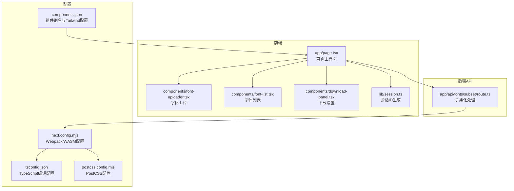
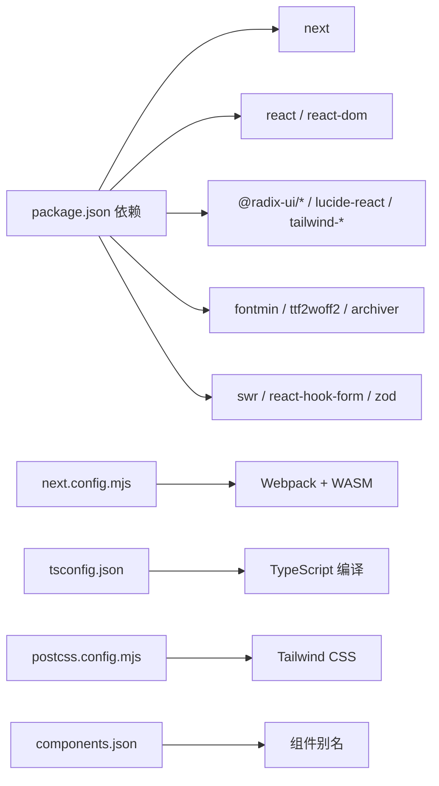

# 快速开始

<cite>
**本文引用的文件**
- [README.md](file://README.md)
- [package.json](file://package.json)
- [next.config.mjs](file://next.config.mjs)
- [tsconfig.json](file://tsconfig.json)
- [components.json](file://components.json)
- [deploy.sh](file://deploy.sh)
- [postcss.config.mjs](file://postcss.config.mjs)
- [app/page.tsx](file://app/page.tsx)
- [app/api/fonts/subset/route.ts](file://app/api/fonts/subset/route.ts)
- [components/font-uploader.tsx](file://components/font-uploader.tsx)
- [components/font-list.tsx](file://components/font-list.tsx)
- [components/download-panel.tsx](file://components/download-panel.tsx)
- [lib/session.ts](file://lib/session.ts)
- [types/fontmin.d.ts](file://types/fontmin.d.ts)
</cite>

## 目录
1. [简介](#简介)
2. [项目结构](#项目结构)
3. [核心组件](#核心组件)
4. [架构总览](#架构总览)
5. [详细组件分析](#详细组件分析)
6. [依赖分析](#依赖分析)
7. [性能考虑](#性能考虑)
8. [故障排除指南](#故障排除指南)
9. [结论](#结论)
10. [附录](#附录)

## 简介
本指南面向初学者，帮助你在本地快速搭建 FontMin 字体子集化工具的开发环境，并完成开发调试、生产构建与部署。项目基于 Next.js 16、React 19 与 TypeScript，采用 Webpack 模式运行以支持 WASM 模块加载；后端通过 Fontmin 对字体进行子集化处理，支持 TTF、WOFF、WOFF2、EOT、SVG 等格式输出。

## 项目结构
项目采用 Next.js App Router 结构，核心目录与职责如下：
- app/: 页面与 API 路由
  - app/page.tsx: 首页主界面
  - app/api/fonts/: 字体相关 API（上传、子集化、下载、预览）
- components/: UI 组件与基础组件库封装
- lib/: 工具函数（如会话管理）
- types/: TypeScript 类型声明
- 配置文件: next.config.mjs、tsconfig.json、postcss.config.mjs、components.json

图表来源
- [app/page.tsx](file://app/page.tsx#L1-L279)
- [components/font-uploader.tsx](file://components/font-uploader.tsx#L1-L166)
- [components/font-list.tsx](file://components/font-list.tsx#L1-L159)
- [components/download-panel.tsx](file://components/download-panel.tsx#L1-L295)
- [lib/session.ts](file://lib/session.ts#L1-L34)
- [app/api/fonts/subset/route.ts](file://app/api/fonts/subset/route.ts#L1-L366)
- [next.config.mjs](file://next.config.mjs#L1-L44)
- [tsconfig.json](file://tsconfig.json#L1-L42)
- [postcss.config.mjs](file://postcss.config.mjs#L1-L9)
- [components.json](file://components.json#L1-L22)

章节来源
- [README.md](file://README.md#L135-L160)
- [next.config.mjs](file://next.config.mjs#L1-L44)
- [tsconfig.json](file://tsconfig.json#L1-L42)
- [postcss.config.mjs](file://postcss.config.mjs#L1-L9)
- [components.json](file://components.json#L1-L22)

## 核心组件
- 会话管理：lib/session.ts 为每个页面生成唯一会话 ID，用于区分用户临时目录与隔离数据。
- 上传组件：components/font-uploader.tsx 支持拖拽与选择文件，过滤受支持的字体格式。
- 字体列表：components/font-list.tsx 展示已上传字体，支持全选、单选与删除。
- 下载设置：components/download-panel.tsx 选择输出格式、触发子集化处理、展示压缩结果与下载链接。
- API 路由：app/api/fonts/subset/route.ts 负责接收请求、调用 Fontmin 进行子集化、生成文件并返回结果。

章节来源
- [lib/session.ts](file://lib/session.ts#L1-L34)
- [components/font-uploader.tsx](file://components/font-uploader.tsx#L1-L166)
- [components/font-list.tsx](file://components/font-list.tsx#L1-L159)
- [components/download-panel.tsx](file://components/download-panel.tsx#L1-L295)
- [app/api/fonts/subset/route.ts](file://app/api/fonts/subset/route.ts#L1-L366)

## 架构总览
下图展示了从前端交互到后端处理与文件生成的整体流程。

图表来源
- [app/page.tsx](file://app/page.tsx#L1-L279)
- [components/download-panel.tsx](file://components/download-panel.tsx#L1-L295)
- [lib/session.ts](file://lib/session.ts#L1-L34)
- [app/api/fonts/subset/route.ts](file://app/api/fonts/subset/route.ts#L164-L366)

## 详细组件分析

### 会话与数据隔离
- 会话 ID 生成策略：在浏览器端为每个页面生成唯一 ID，用于标识用户临时目录，实现跨热更新保持一致但刷新清空的效果。
- 临时目录结构：每个会话对应一个独立目录，用于存放本次会话的上传字体与生成的子集化字体；永久备份目录保存所有上传的字体副本。

图表来源
- [lib/session.ts](file://lib/session.ts#L1-L34)
- [app/api/fonts/subset/route.ts](file://app/api/fonts/subset/route.ts#L9-L23)

章节来源
- [lib/session.ts](file://lib/session.ts#L1-L34)
- [README.md](file://README.md#L191-L221)

### 字体上传与校验
- 支持格式：TTF、OTF、WOFF、WOFF2、EOT、SVG；注意 Fontmin 子集化输入需为 TTF。
- 上传流程：拖拽或选择文件，过滤合法格式，提交到后端 API。

图表来源
- [components/font-uploader.tsx](file://components/font-uploader.tsx#L15-L70)
- [app/page.tsx](file://app/page.tsx#L33-L65)

章节来源
- [components/font-uploader.tsx](file://components/font-uploader.tsx#L1-L166)
- [app/page.tsx](file://app/page.tsx#L33-L65)

### 子集化处理与输出
- 输入校验：必须选择字体、输入文字且非空。
- 处理逻辑：对每个选定字体与格式组合执行子集化；WOFF2 通过先 TTF 再 ttf2woff2 转换得到最终产物。
- 输出结果：返回每个文件的原始大小、压缩后大小、下载链接；可选打包下载。

图表来源
- [app/api/fonts/subset/route.ts](file://app/api/fonts/subset/route.ts#L164-L366)
- [types/fontmin.d.ts](file://types/fontmin.d.ts#L1-L53)

章节来源
- [app/api/fonts/subset/route.ts](file://app/api/fonts/subset/route.ts#L1-L366)
- [types/fontmin.d.ts](file://types/fontmin.d.ts#L1-L53)

### 下载与批量处理
- 单文件下载：点击文件卡片上的下载按钮。
- 批量下载：当生成多个文件时，可选择打包下载整个压缩包。
- 压缩统计：展示原始大小、压缩后大小与节省百分比。

章节来源
- [components/download-panel.tsx](file://components/download-panel.tsx#L1-L295)

## 依赖分析
- 运行时依赖
  - next、react、react-dom、react-hook-form、swr、tailwindcss、lucide-react、fontmin、ttf2woff2、archiver 等
- 开发依赖
  - TypeScript、Tailwind CSS、PostCSS、@types/* 等
- 关键配置
  - next.config.mjs：启用 Webpack、WASM 支持、外部化 server 端依赖
  - tsconfig.json：严格类型检查、路径映射、增量编译
  - postcss.config.mjs：集成 Tailwind CSS 插件
  - components.json：组件别名与 Tailwind 配置

图表来源
- [package.json](file://package.json#L11-L66)
- [next.config.mjs](file://next.config.mjs#L14-L40)
- [tsconfig.json](file://tsconfig.json#L25-L29)
- [postcss.config.mjs](file://postcss.config.mjs#L1-L9)
- [components.json](file://components.json#L13-L19)

章节来源
- [package.json](file://package.json#L1-L78)
- [next.config.mjs](file://next.config.mjs#L1-L44)
- [tsconfig.json](file://tsconfig.json#L1-L42)
- [postcss.config.mjs](file://postcss.config.mjs#L1-L9)
- [components.json](file://components.json#L1-L22)

## 性能考虑
- 选择合适输出格式：推荐 WOFF2 以获得最佳压缩率。
- 批量处理：一次选择多个格式或多个字体，减少多次往返。
- 会话隔离：临时目录按会话划分，避免跨用户干扰，便于清理与维护。
- 构建优化：使用 Next.js 生产构建，结合静态资源优化与缓存策略。

## 故障排除指南
- 环境版本不匹配
  - 确保 Node.js 版本满足要求，pnpm 版本满足要求。
  - 参考：[README.md](file://README.md#L44-L48)
- 安装依赖失败
  - 清理缓存后重试安装；若网络受限，可配置镜像源。
  - 参考：[README.md](file://README.md#L49-L60)
- 开发服务器启动失败
  - 端口占用时调整端口；确保使用 Webpack 模式运行。
  - 参考：[package.json](file://package.json#L5-L10)、[next.config.mjs](file://next.config.mjs#L14-L20)
- 字体格式不支持
  - Fontmin 子集化输入需为 TTF；上传其他格式会被跳过并提示。
  - 参考：[app/api/fonts/subset/route.ts](file://app/api/fonts/subset/route.ts#L240-L300)、[components/font-uploader.tsx](file://components/font-uploader.tsx#L117-L119)
- 会话目录权限问题
  - 确认运行用户对 font-temp 与 font-source 目录具有读写权限。
  - 参考：[README.md](file://README.md#L179-L189)
- 生产构建报错
  - 检查 TypeScript 类型错误与 Webpack/WASM 配置；必要时开启忽略类型错误选项。
  - 参考：[next.config.mjs](file://next.config.mjs#L8-L10)、[tsconfig.json](file://tsconfig.json#L11-L11)
- 部署后访问异常
  - 使用提供的部署脚本自动化拉取、安装、构建与重启服务。
  - 参考：[deploy.sh](file://deploy.sh#L1-L23)

章节来源
- [README.md](file://README.md#L44-L79)
- [package.json](file://package.json#L5-L10)
- [next.config.mjs](file://next.config.mjs#L8-L20)
- [tsconfig.json](file://tsconfig.json#L11-L11)
- [app/api/fonts/subset/route.ts](file://app/api/fonts/subset/route.ts#L240-L300)
- [components/font-uploader.tsx](file://components/font-uploader.tsx#L117-L119)
- [deploy.sh](file://deploy.sh#L1-L23)

## 结论
通过本快速开始指南，你可以完成环境准备、安装依赖、启动开发服务器、执行生产构建与部署。项目提供了直观的上传与预览界面，以及完善的子集化与下载能力。遇到问题时，可依据“故障排除指南”逐项排查。

## 附录

### 环境要求与安装步骤
- 环境要求
  - Node.js 18.0 或更高版本
  - pnpm 8.0 或更高版本
- 安装步骤
  - 克隆仓库并进入目录
  - 安装依赖
- 参考
  - [README.md](file://README.md#L44-L60)

章节来源
- [README.md](file://README.md#L44-L60)

### 开发与生产命令
- 开发
  - 启动开发服务器（使用 Webpack）
  - 预期：项目在本地端口运行
- 构建与启动
  - 构建生产版本
  - 启动生产服务器
- 参考
  - [README.md](file://README.md#L62-L79)、[package.json](file://package.json#L5-L10)

章节来源
- [README.md](file://README.md#L62-L79)
- [package.json](file://package.json#L5-L10)

### 关键配置文件说明
- next.config.mjs：启用 Webpack、WASM 支持与 server 端外部化依赖
- tsconfig.json：严格类型检查、路径映射、增量编译
- postcss.config.mjs：集成 Tailwind CSS 插件
- components.json：组件别名与 Tailwind 配置
- 参考
  - [next.config.mjs](file://next.config.mjs#L1-L44)
  - [tsconfig.json](file://tsconfig.json#L1-L42)
  - [postcss.config.mjs](file://postcss.config.mjs#L1-L9)
  - [components.json](file://components.json#L1-L22)

章节来源
- [next.config.mjs](file://next.config.mjs#L1-L44)
- [tsconfig.json](file://tsconfig.json#L1-L42)
- [postcss.config.mjs](file://postcss.config.mjs#L1-L9)
- [components.json](file://components.json#L1-L22)

### 部署脚本
- 自动化流程：拉取代码 → 安装依赖 → 构建 → 重启服务 → 查看状态与日志
- 参考
  - [deploy.sh](file://deploy.sh#L1-L23)

章节来源
- [deploy.sh](file://deploy.sh#L1-L23)