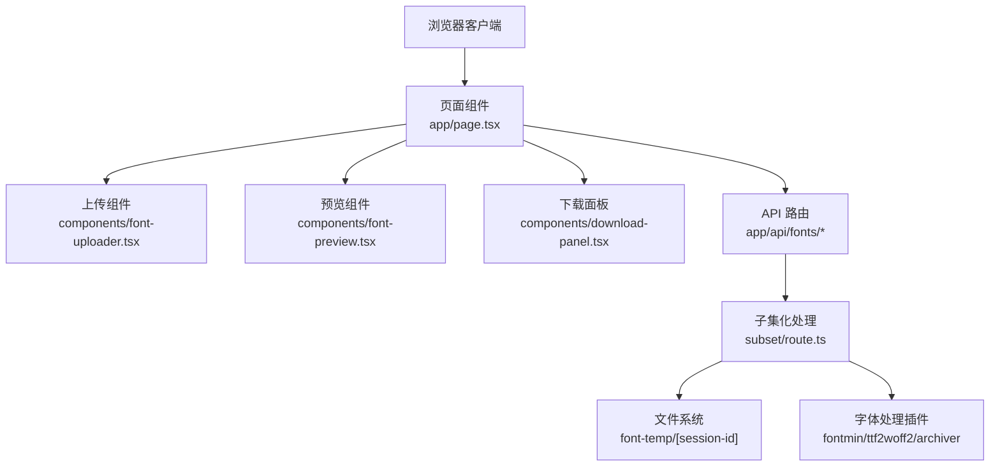
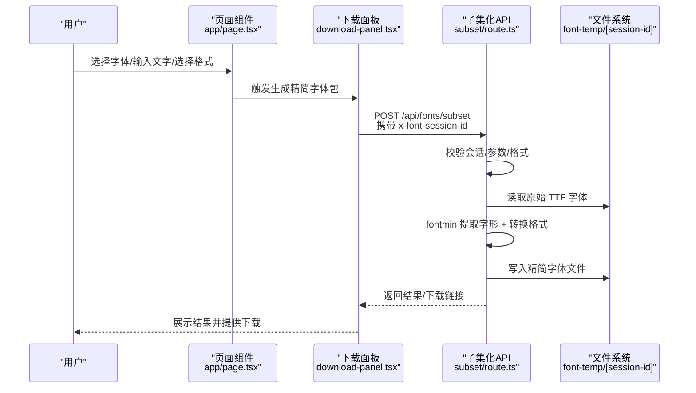
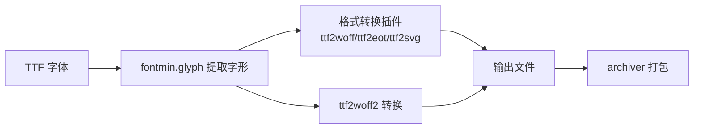

# 常见问题

<cite>
**本文引用的文件**
- [README.md](file://README.md)
- [app/api/fonts/subset/route.ts](file://app/api/fonts/subset/route.ts)
- [components/font-uploader.tsx](file://components/font-uploader.tsx)
- [components/download-panel.tsx](file://components/download-panel.tsx)
- [components/font-preview.tsx](file://components/font-preview.tsx)
- [components/font-list.tsx](file://components/font-list.tsx)
- [app/page.tsx](file://app/page.tsx)
- [lib/session.ts](file://lib/session.ts)
- [types/fontmin.d.ts](file://types/fontmin.d.ts)
- [package.json](file://package.json)
- [next.config.mjs](file://next.config.mjs)
</cite>

## 目录
1. [简介](#简介)
2. [项目结构](#项目结构)
3. [核心组件](#核心组件)
4. [架构总览](#架构总览)
5. [详细组件分析](#详细组件分析)
6. [依赖分析](#依赖分析)
7. [性能考虑](#性能考虑)
8. [故障排查指南](#故障排查指南)
9. [结论](#结论)
10. [附录](#附录)

## 简介
本FAQ面向使用 FontMin 字体子集化工具的初学者与高级用户，聚焦于上传失败、处理异常、格式不支持、文件损坏、浏览器兼容性、API 调用失败等常见问题，提供症状描述、可能原因、标准化解决方案、预防措施与最佳实践。

## 项目结构
- 前端采用 Next.js App Router，页面组件负责上传、字体列表、预览与下载设置。
- 后端 API 路由位于 app/api/fonts，其中子集化处理逻辑集中在 subset 路由。
- 字体处理依赖 fontmin、ttf2woff2、archiver 等模块；会话隔离通过 x-font-session-id 请求头实现。
- 会话目录位于 font-temp/[session-id]，永久备份位于 font-source。

图表来源
- [app/page.tsx](file://app/page.tsx#L1-L279)
- [components/font-uploader.tsx](file://components/font-uploader.tsx#L1-L166)
- [components/font-preview.tsx](file://components/font-preview.tsx#L1-L123)
- [components/download-panel.tsx](file://components/download-panel.tsx#L1-L295)
- [app/api/fonts/subset/route.ts](file://app/api/fonts/subset/route.ts#L1-L366)

章节来源
- [README.md](file://README.md#L135-L160)
- [next.config.mjs](file://next.config.mjs#L14-L39)

## 核心组件
- 会话管理：通过 lib/session.ts 生成并持久化会话 ID，并在请求头中携带 x-font-session-id。
- 上传组件：支持多种字体格式的前端校验与选择，但子集化输入仅接受 TTF。
- 预览组件：实时加载字体并展示输入文本的渲染效果。
- 下载面板：选择输出格式、触发处理、展示结果与下载链接。
- 子集化 API：验证会话、过滤非 TTF 文件、调用 fontmin 与 ttf2woff2、打包 zip 并返回结果。

章节来源
- [lib/session.ts](file://lib/session.ts#L1-L34)
- [components/font-uploader.tsx](file://components/font-uploader.tsx#L15-L59)
- [components/font-preview.tsx](file://components/font-preview.tsx#L15-L48)
- [components/download-panel.tsx](file://components/download-panel.tsx#L30-L66)
- [app/api/fonts/subset/route.ts](file://app/api/fonts/subset/route.ts#L164-L366)

## 架构总览
下图展示了从用户操作到服务端处理再到结果返回的关键流程。

图表来源
- [app/page.tsx](file://app/page.tsx#L113-L145)
- [components/download-panel.tsx](file://components/download-panel.tsx#L68-L89)
- [app/api/fonts/subset/route.ts](file://app/api/fonts/subset/route.ts#L164-L366)

## 详细组件分析

### 上传失败
- 症状
  - 上传按钮无响应或报错“上传失败”。
  - 选择文件后未出现在已选列表。
- 可能原因
  - 未携带会话头 x-font-session-id。
  - 服务器端未识别会话目录或权限不足。
  - 前端 accept 校验与实际上传行为不一致。
- 解决方案
  - 确认页面已正确注入会话 ID 并随请求发送。
  - 检查 font-temp/[session-id] 是否存在且可写。
  - 确保选择的文件扩展名符合 ACCEPTED_FORMATS。
- 预防与最佳实践
  - 使用组件内置的拖拽/选择入口，避免直接调用底层 fetch。
  - 上传前先刷新页面以确保会话头有效。
  - 优先使用 TTF 格式，避免因格式不支持导致后续处理失败。

章节来源
- [app/page.tsx](file://app/page.tsx#L33-L65)
- [components/font-uploader.tsx](file://components/font-uploader.tsx#L15-L59)
- [lib/session.ts](file://lib/session.ts#L1-L34)

### 处理异常（子集化失败）
- 症状
  - “处理失败”，返回错误信息或空结果。
  - 部分字体被跳过，提示仅支持 TTF。
- 可能原因
  - 输入字体不是 TTF 格式（Fontmin 仅支持 TTF 作为输入）。
  - 字体文件损坏或不可读。
  - 字符串为空或无效。
  - 服务器内部异常（如磁盘写入失败、插件转换失败）。
- 解决方案
  - 将字体转换为 TTF 后再上传。
  - 检查字体文件完整性，尝试用其他工具打开验证。
  - 确保输入文本非空且包含有效字符。
  - 查看服务端日志定位具体错误（如 WOFF2 转换失败）。
- 预防与最佳实践
  - 上传前先用字体编辑器确认 TTF 可用。
  - 使用“全选”格式时优先选择 WOFF2 以获得更好压缩比。
  - 对大文本进行去重，减少处理时间。

章节来源
- [app/api/fonts/subset/route.ts](file://app/api/fonts/subset/route.ts#L25-L29)
- [app/api/fonts/subset/route.ts](file://app/api/fonts/subset/route.ts#L195-L204)
- [app/api/fonts/subset/route.ts](file://app/api/fonts/subset/route.ts#L240-L245)
- [app/api/fonts/subset/route.ts](file://app/api/fonts/subset/route.ts#L297-L310)

### 格式不支持
- 症状
  - 仅能选择 TTF 输出，其他格式显示为禁用或不可用。
  - 前端提示“Fontmin 仅支持 TTF 格式作为输入进行子集提取”。
- 可能原因
  - Fontmin 插件链仅对 TTF 进行字形提取，其他格式需先转 TTF。
  - 服务端对非 TTF 文件直接跳过并记录警告。
- 解决方案
  - 使用 TTF 作为输入，输出时选择目标格式（推荐 WOFF2）。
  - 若已有其他格式，先转换为 TTF 再上传。
- 预防与最佳实践
  - 明确输入/输出格式边界，避免混淆。
  - 输出格式建议：WOFF2（最佳压缩）、WOFF（兼容性好）、TTF（通用）。

章节来源
- [components/font-uploader.tsx](file://components/font-uploader.tsx#L115-L119)
- [app/api/fonts/subset/route.ts](file://app/api/fonts/subset/route.ts#L25-L29)
- [app/api/fonts/subset/route.ts](file://app/api/fonts/subset/route.ts#L300-L305)

### 文件大小限制
- 症状
  - 上传大文件卡顿或超时。
  - 处理耗时过长或内存占用过高。
- 可能原因
  - 浏览器/网络限制上传尺寸。
  - 服务器端未配置上传大小限制。
  - 字体文件过大导致处理时间增加。
- 解决方案
  - 优先使用较小的字体文件或裁剪字体源。
  - 分批处理多个小字体，减少单次处理压力。
  - 优化网络环境，必要时使用稳定带宽。
- 预防与最佳实践
  - 上传前检查字体文件大小，尽量控制在合理范围。
  - 使用 WOFF2 输出以降低体积。

章节来源
- [components/font-uploader.tsx](file://components/font-uploader.tsx#L146-L148)
- [README.md](file://README.md#L86-L87)

### 字符集处理失败
- 症状
  - 生成的字体缺少某些字符或显示为空白。
  - 预览正常但下载后字体不完整。
- 可能原因
  - 输入文本未包含目标字符。
  - 字符重复被去重，导致部分字符未覆盖。
  - 字体本身不包含某些字形。
- 解决方案
  - 在预览区域输入完整的目标文本，确保包含所有需要的字符。
  - 避免重复字符导致的去重影响，必要时手动补充。
  - 更换字体源，确保其包含所需字库。
- 预防与最佳实践
  - 使用“全选”功能或复制粘贴完整语料。
  - 对特殊字符（如标点、符号）逐一验证。

章节来源
- [app/api/fonts/subset/route.ts](file://app/api/fonts/subset/route.ts#L215-L217)
- [components/font-preview.tsx](file://components/font-preview.tsx#L15-L21)

### 浏览器兼容性问题
- 症状
  - 预览字体加载失败或显示乱码。
  - 下载链接无法触发或弹窗被拦截。
- 可能原因
  - 浏览器阻止弹出窗口或下载。
  - 字体跨域或路径错误。
  - 浏览器对特定格式支持差异。
- 解决方案
  - 允许弹窗与下载，或改为右键另存为。
  - 确认字体路径与会话头正确传递。
  - 优先使用 WOFF2，兼容性更佳。
- 预防与最佳实践
  - 使用现代浏览器并保持更新。
  - 如遇下载拦截，允许弹窗后再试。

章节来源
- [components/download-panel.tsx](file://components/download-panel.tsx#L81-L93)
- [components/font-preview.tsx](file://components/font-preview.tsx#L34-L48)

### API 调用失败
- 症状
  - “处理失败”或返回 4xx/5xx 错误。
  - 控制台出现异常堆栈信息。
- 可能原因
  - 缺少会话头或会话不存在。
  - 请求体参数缺失（如字体名、文本、格式）。
  - 服务器内部异常（磁盘写入、插件转换、打包）。
- 解决方案
  - 确保携带 x-font-session-id。
  - 检查请求体字段是否完整。
  - 查看服务端日志定位具体错误位置。
- 预防与最佳实践
  - 使用页面提供的统一调用入口，避免手写请求。
  - 处理失败时重试一次，若仍失败则检查日志。

章节来源
- [app/page.tsx](file://app/page.tsx#L113-L145)
- [app/api/fonts/subset/route.ts](file://app/api/fonts/subset/route.ts#L167-L175)
- [app/api/fonts/subset/route.ts](file://app/api/fonts/subset/route.ts#L351-L364)

## 依赖分析
- 字体处理链路
  - 输入：TTF（Fontmin 仅支持 TTF 输入）
  - 处理：glyph 提取字形 → 格式转换（WOFF/EOT/SVG/TTF）
  - 输出：各格式文件与可选 ZIP 包
- 关键外部依赖
  - fontmin：字形提取与格式转换
  - ttf2woff2：TTF 转 WOFF2
  - archiver：ZIP 打包
- 构建与运行
  - Next.js 16，启用 WASM 支持以加载 fontmin 依赖
  - 服务端 externals 外置原生模块

图表来源
- [app/api/fonts/subset/route.ts](file://app/api/fonts/subset/route.ts#L44-L64)
- [app/api/fonts/subset/route.ts](file://app/api/fonts/subset/route.ts#L82-L116)
- [types/fontmin.d.ts](file://types/fontmin.d.ts#L18-L45)
- [package.json](file://package.json#L41-L65)
- [next.config.mjs](file://next.config.mjs#L28-L36)

章节来源
- [types/fontmin.d.ts](file://types/fontmin.d.ts#L1-L53)
- [package.json](file://package.json#L41-L65)
- [next.config.mjs](file://next.config.mjs#L14-L39)

## 性能考虑
- 处理时间
  - 字体越大、字符越多，处理时间越长。
  - 建议优先使用 WOFF2 输出以降低体积。
- 内存与磁盘
  - 处理过程会读写临时目录，确保磁盘空间充足。
- 并发与批量
  - 单次处理多个格式时会生成多个文件，注意磁盘 IO。
  - 大量文件打包为 ZIP 时注意内存占用。

## 故障排查指南
- 会话相关
  - 症状：返回“会话未找到/未找到上传的字体”。
  - 排查：确认 x-font-session-id 是否存在；刷新页面重建会话。
- 输入格式
  - 症状：仅支持 TTF 输入，其他格式被跳过。
  - 排查：将字体转换为 TTF 后再上传。
- 文本输入
  - 症状：生成字体不包含某些字符。
  - 排查：确保输入文本包含目标字符；避免重复导致去重。
- 下载与弹窗
  - 症状：下载链接无效或被拦截。
  - 排查：允许弹窗；改用右键另存为。
- 服务器异常
  - 症状：返回 500 或错误堆栈。
  - 排查：查看服务端日志，定位具体插件或磁盘写入问题。

章节来源
- [app/api/fonts/subset/route.ts](file://app/api/fonts/subset/route.ts#L170-L175)
- [app/api/fonts/subset/route.ts](file://app/api/fonts/subset/route.ts#L206-L213)
- [app/api/fonts/subset/route.ts](file://app/api/fonts/subset/route.ts#L297-L310)
- [components/download-panel.tsx](file://components/download-panel.tsx#L81-L93)

## 结论
- FontMin 的核心是基于 TTF 的字形提取与多格式输出，建议始终以 TTF 作为输入。
- 上传与处理流程依赖会话隔离与正确的请求头，确保每次操作均携带 x-font-session-id。
- 遇到问题时，优先检查会话、输入格式、文本完整性与浏览器下载策略，再结合服务端日志定位根因。

## 附录
- 最佳实践清单
  - 上传前将字体转换为 TTF。
  - 输入文本包含完整字符集，避免重复导致去重。
  - 优先选择 WOFF2 输出以获得最佳压缩比。
  - 使用页面提供的统一上传与处理入口，避免手写请求。
  - 处理失败时重试一次，若仍失败则查看服务端日志。