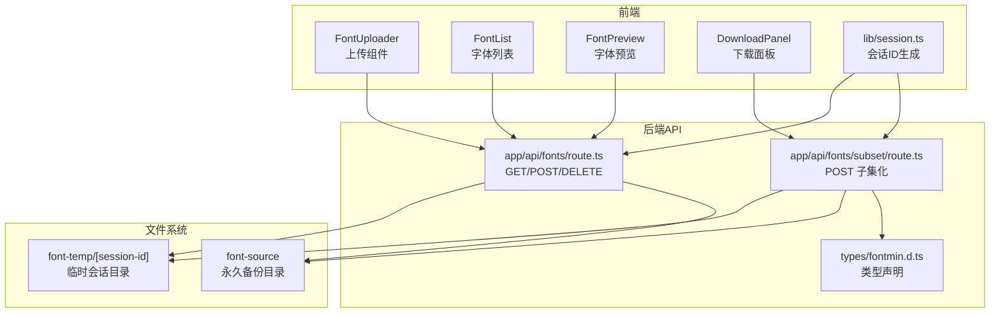
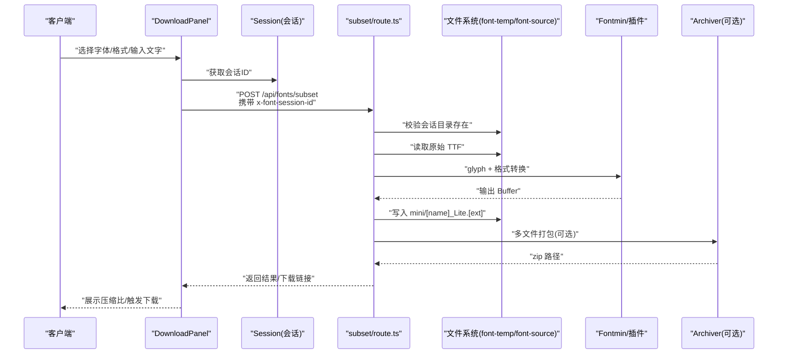
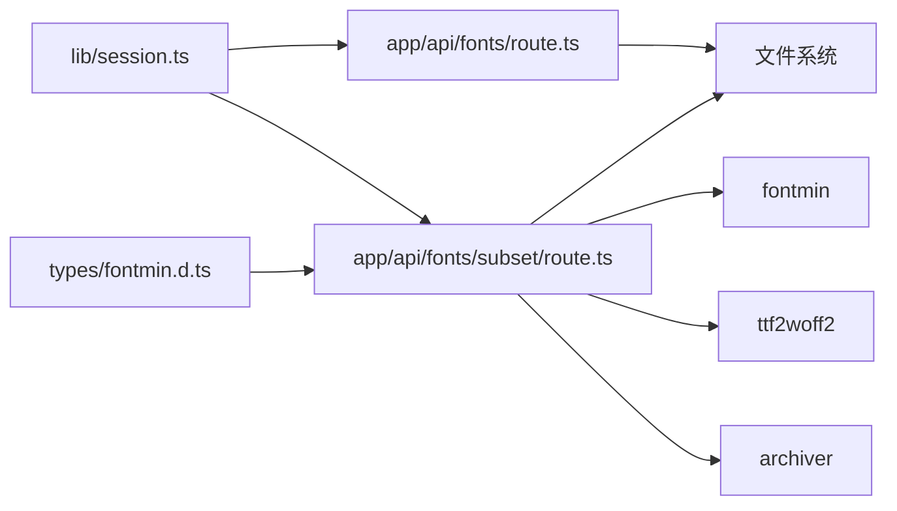
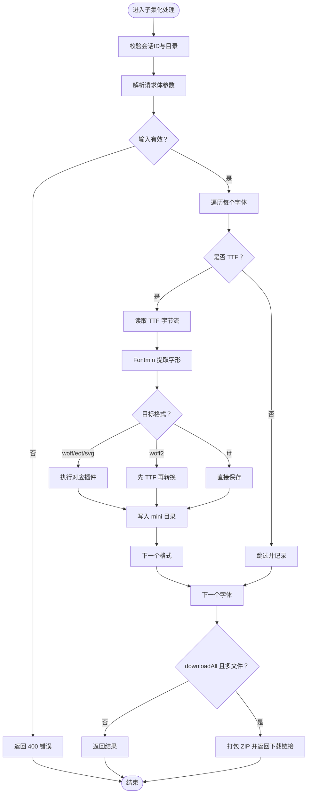

# 故障排除

<cite>
**本文引用的文件**
- [README.md](file://README.md)
- [package.json](file://package.json)
- [app/api/fonts/route.ts](file://app/api/fonts/route.ts)
- [app/api/fonts/subset/route.ts](file://app/api/fonts/subset/route.ts)
- [types/fontmin.d.ts](file://types/fontmin.d.ts)
- [components/font-uploader.tsx](file://components/font-uploader.tsx)
- [components/font-list.tsx](file://components/font-list.tsx)
- [components/font-preview.tsx](file://components/font-preview.tsx)
- [components/download-panel.tsx](file://components/download-panel.tsx)
- [lib/session.ts](file://lib/session.ts)
- [lib/utils.ts](file://lib/utils.ts)
- [test-api.js](file://test-api.js)
- [next.config.mjs](file://next.config.mjs)
</cite>

## 目录
1. [简介](#简介)
2. [项目结构](#项目结构)
3. [核心组件](#核心组件)
4. [架构总览](#架构总览)
5. [详细组件分析](#详细组件分析)
6. [依赖关系分析](#依赖关系分析)
7. [性能考虑](#性能考虑)
8. [故障排除指南](#故障排除指南)
9. [结论](#结论)
10. [附录](#附录)

## 简介
本故障排除文档面向技术支持与运维人员，聚焦 FontMin 字体子集化工具在开发与生产环境中的常见问题与系统化排查流程。内容涵盖：会话与文件权限问题、网络与 API 调用失败、字体格式与处理链路异常、日志与错误信息解读、性能瓶颈识别与优化建议，以及开发与生产环境差异化的处理策略。

## 项目结构
- 前端采用 Next.js App Router，API 路由位于 app/api/fonts 下，分别处理字体上传、列表查询、删除与子集化生成。
- 字体处理依赖 fontmin、ttf2woff2、archiver 等模块；会话通过 x-font-session-id 请求头传递，临时文件按会话隔离存放于 font-temp/[session-id]，永久备份存放于 font-source。
- 类型声明对 fontmin 插件接口进行约束，便于静态检查与 IDE 提示。

图表来源
- [app/api/fonts/route.ts](file://app/api/fonts/route.ts#L1-L167)
- [app/api/fonts/subset/route.ts](file://app/api/fonts/subset/route.ts#L1-L366)
- [types/fontmin.d.ts](file://types/fontmin.d.ts#L1-L53)
- [lib/session.ts](file://lib/session.ts#L1-L34)

章节来源
- [README.md](file://README.md#L135-L190)
- [package.json](file://package.json#L1-L78)

## 核心组件
- 会话与请求头
  - 服务端通过请求头 x-font-session-id 获取会话ID，若缺失则返回 404 并提示“会话未找到，请重新上传字体”。
- 上传与备份
  - 上传接口接收表单数据，将文件写入用户会话目录与永久备份目录；若未提供文件则返回 400。
- 列表与删除
  - 列表接口过滤 .ttf/.otf/.woff/.woff2/.eot/.svg 后缀；删除接口仅删除会话目录中的文件，保留备份。
- 子集化处理
  - 仅支持 TTF 作为输入；对 woff2 需先得到 TTF 再转码；支持多格式输出并可打包下载；对空文本、重复字符去重处理。
- 前端交互
  - 上传组件支持拖拽与多选；列表组件支持全选与删除确认；预览组件动态加载字体；下载面板展示压缩比并支持单个/打包下载。

章节来源
- [app/api/fonts/route.ts](file://app/api/fonts/route.ts#L16-L167)
- [app/api/fonts/subset/route.ts](file://app/api/fonts/subset/route.ts#L164-L366)
- [components/font-uploader.tsx](file://components/font-uploader.tsx#L1-L166)
- [components/font-list.tsx](file://components/font-list.tsx#L1-L159)
- [components/font-preview.tsx](file://components/font-preview.tsx#L1-L123)
- [components/download-panel.tsx](file://components/download-panel.tsx#L1-L295)
- [lib/session.ts](file://lib/session.ts#L1-L34)

## 架构总览
下图展示一次典型“子集化生成”的端到端流程，包括请求头会话传递、文件系统读写、字体处理链路与响应返回。

图表来源
- [components/download-panel.tsx](file://components/download-panel.tsx#L68-L89)
- [lib/session.ts](file://lib/session.ts#L1-L34)
- [app/api/fonts/subset/route.ts](file://app/api/fonts/subset/route.ts#L164-L366)

## 详细组件分析

### 会话与请求头
- 问题症状
  - “会话未找到，请重新上传字体”
  - 404 响应且提示“未找到上传的字体，请重新上传”
- 原因分析
  - 缺少 x-font-session-id 请求头；或会话目录不存在且未正确创建
- 解决方案
  - 确保前端每次请求携带正确的会话ID；服务端在首次访问时自动创建会话目录
- 调试要点
  - 检查请求头是否包含 x-font-session-id
  - 查看服务端日志中“Creating user directory”等信息

章节来源
- [app/api/fonts/route.ts](file://app/api/fonts/route.ts#L16-L46)
- [app/api/fonts/subset/route.ts](file://app/api/fonts/subset/route.ts#L167-L213)
- [lib/session.ts](file://lib/session.ts#L1-L34)

### 上传与备份
- 问题症状
  - “No font files provided”（400）
  - 上传后列表为空
- 原因分析
  - 前端未正确选择文件；或文件名不匹配允许的扩展名
- 解决方案
  - 确认前端 ACCEPTED_FORMATS 与实际文件扩展名一致；检查表单字段名为 fonts
- 调试要点
  - 查看服务端日志中“Uploading N files”与“Saved to session/Backed up to”

章节来源
- [app/api/fonts/route.ts](file://app/api/fonts/route.ts#L71-L127)
- [components/font-uploader.tsx](file://components/font-uploader.tsx#L15-L59)

### 列表与删除
- 问题症状
  - 列表显示异常或删除无效
- 原因分析
  - 文件路径拼接错误；删除仅作用于会话目录，备份不受影响
- 解决方案
  - 确认 sessionId 与路径拼接正确；如需彻底删除，需同时清理备份目录
- 调试要点
  - 查看服务端日志中“Removed from session/Backup retained in”

章节来源
- [app/api/fonts/route.ts](file://app/api/fonts/route.ts#L36-L69)
- [app/api/fonts/route.ts](file://app/api/fonts/route.ts#L129-L167)

### 子集化处理链路
- 问题症状
  - “未找到 TTF 文件用于 WOFF2 转换”
  - “未返回任何文件”
  - “处理失败：...”
- 原因分析
  - 输入非 TTF 格式；Fontmin 插件链返回空；WOFF2 需先 TTF 再转换
- 解决方案
  - 确保上传 TTF；检查 text 是否为空；对 woff2 先得到 TTF 再转换
- 调试要点
  - 查看服务端日志中“Checking file/Converting TTF to WOFF2”等信息

章节来源
- [app/api/fonts/subset/route.ts](file://app/api/fonts/subset/route.ts#L25-L162)
- [app/api/fonts/subset/route.ts](file://app/api/fonts/subset/route.ts#L164-L366)
- [types/fontmin.d.ts](file://types/fontmin.d.ts#L1-L53)

### 前端交互组件
- 上传组件
  - 问题：拖拽/选择无效
  - 排查：确认 ACCEPTED_FORMATS 与 input accept 属性一致
- 列表组件
  - 问题：全选/删除不生效
  - 排查：确认回调函数绑定与状态更新逻辑
- 预览组件
  - 问题：字体加载失败
  - 排查：检查字体路径与 FontFace 加载错误日志
- 下载面板
  - 问题：无法下载/打包
  - 排查：确认返回的 downloadUrl 与 zipDownload

章节来源
- [components/font-uploader.tsx](file://components/font-uploader.tsx#L1-L166)
- [components/font-list.tsx](file://components/font-list.tsx#L1-L159)
- [components/font-preview.tsx](file://components/font-preview.tsx#L34-L48)
- [components/download-panel.tsx](file://components/download-panel.tsx#L68-L89)

## 依赖关系分析
- 外部依赖
  - fontmin：字体子集化核心引擎
  - ttf2woff2：TTF 转 WOFF2
  - archiver：ZIP 打包
- 内部依赖
  - lib/session.ts：会话ID生成
  - types/fontmin.d.ts：字体处理插件类型约束
- 关键耦合点
  - API 路由依赖文件系统与第三方库；前端通过会话ID与 API 交互

图表来源
- [lib/session.ts](file://lib/session.ts#L1-L34)
- [app/api/fonts/route.ts](file://app/api/fonts/route.ts#L1-L167)
- [app/api/fonts/subset/route.ts](file://app/api/fonts/subset/route.ts#L1-L366)
- [types/fontmin.d.ts](file://types/fontmin.d.ts#L1-L53)
- [package.json](file://package.json#L41-L65)

章节来源
- [package.json](file://package.json#L11-L66)

## 性能考虑
- 字体处理性能
  - TTF 转换链路复杂度与字符集大小成正比；建议对大文本进行去重（代码已实现）
  - WOFF2 转换为 CPU 密集型操作，建议限制并发与超时
- 文件系统 IO
  - 频繁读写会话目录可能成为瓶颈；建议启用合适的文件系统缓存与磁盘配额
- 前端渲染
  - 预览组件动态加载字体，注意 FontFace 加载失败的降级策略与错误提示
- 生产部署建议
  - 使用稳定版本的 Node.js 与依赖；合理配置进程数与内存上限

章节来源
- [app/api/fonts/subset/route.ts](file://app/api/fonts/subset/route.ts#L215-L217)
- [README.md](file://README.md#L44-L79)

## 故障排除指南

### 通用诊断流程
- 步骤一：确认环境与依赖
  - Node.js 与 pnpm 版本满足要求；依赖安装完成
- 步骤二：验证会话与请求头
  - 检查 x-font-session-id 是否正确传递
- 步骤三：检查文件系统
  - font-temp 与 font-source 目录是否存在；权限是否足够
- 步骤四：查看日志
  - 服务端控制台输出与浏览器开发者工具 Network 面板
- 步骤五：复现与最小化
  - 使用 test-api.js 最小化复现问题

章节来源
- [README.md](file://README.md#L44-L79)
- [test-api.js](file://test-api.js#L1-L36)

### 常见问题与解决方案

#### 1. 会话未找到/字体列表为空
- 症状
  - 404 提示“会话未找到，请重新上传字体”
  - 列表为空
- 可能原因
  - 缺失 x-font-session-id；会话目录未创建
- 处理步骤
  - 确认前端每次请求携带会话ID；检查服务端日志中会话目录创建信息
- 相关代码参考
  - [会话ID生成](file://lib/session.ts#L1-L34)
  - [会话目录创建](file://app/api/fonts/route.ts#L28-L46)

章节来源
- [app/api/fonts/route.ts](file://app/api/fonts/route.ts#L16-L46)
- [lib/session.ts](file://lib/session.ts#L1-L34)

#### 2. 上传失败或无文件
- 症状
  - 400 错误“No font files provided”
- 可能原因
  - 表单字段名不是 fonts；未选择文件
- 处理步骤
  - 确认表单字段名为 fonts；检查前端 ACCEPTED_FORMATS 与 input accept
- 相关代码参考
  - [上传接口](file://app/api/fonts/route.ts#L71-L127)
  - [上传组件](file://components/font-uploader.tsx#L15-L59)

章节来源
- [app/api/fonts/route.ts](file://app/api/fonts/route.ts#L71-L127)
- [components/font-uploader.tsx](file://components/font-uploader.tsx#L15-L59)

#### 3. 字体格式不支持
- 症状
  - “Fontmin 仅支持 TTF 格式的字体文件。以下字体被跳过: ...”
- 可能原因
  - 上传了非 TTF 格式
- 处理步骤
  - 上传 TTF 格式字体；如需其他格式，可在子集化时选择对应输出格式
- 相关代码参考
  - [格式校验](file://app/api/fonts/subset/route.ts#L240-L245)

章节来源
- [app/api/fonts/subset/route.ts](file://app/api/fonts/subset/route.ts#L240-L245)

#### 4. 字体处理失败
- 症状
  - “Fontmin 处理失败: ...”、“未返回任何文件”、“未找到 [format] 格式的输出文件”
- 可能原因
  - 输入为空文本；Fontmin 插件链返回空；WOFF2 转换缺少 TTF
- 处理步骤
  - 确保 text 非空；检查插件链顺序；对 woff2 先 TTF 再转换
- 相关代码参考
  - [处理流程](file://app/api/fonts/subset/route.ts#L31-L162)

章节来源
- [app/api/fonts/subset/route.ts](file://app/api/fonts/subset/route.ts#L31-L162)

#### 5. 下载链接无效
- 症状
  - 返回的 downloadUrl 无法打开
- 可能原因
  - 会话ID不匹配；mini 目录未生成；路径编码问题
- 处理步骤
  - 确认 sessionId 与请求头一致；检查 mini 目录写入；验证 URL 编码
- 相关代码参考
  - [下载URL生成](file://app/api/fonts/subset/route.ts#L278-L283)

章节来源
- [app/api/fonts/subset/route.ts](file://app/api/fonts/subset/route.ts#L278-L283)

#### 6. 网络连接与跨域
- 症状
  - CORS 错误；本地开发环境跨域
- 处理步骤
  - 确认服务端允许的来源；开发环境使用代理或调整跨域策略
- 相关代码参考
  - [开发脚本与端口](file://package.json#L5-L10)

章节来源
- [package.json](file://package.json#L5-L10)

#### 7. 文件权限与磁盘空间
- 症状
  - 写入失败；目录不可创建
- 处理步骤
  - 检查 font-temp 与 font-source 的写权限；清理磁盘空间；定期清理过期会话
- 相关代码参考
  - [目录创建与写入](file://app/api/fonts/route.ts#L9-L14)
  - [会话目录写入](file://app/api/fonts/subset/route.ts#L267-L270)

章节来源
- [app/api/fonts/route.ts](file://app/api/fonts/route.ts#L9-L14)
- [app/api/fonts/subset/route.ts](file://app/api/fonts/subset/route.ts#L267-L270)
- [README.md](file://README.md#L222-L241)

#### 8. 内存不足与超时
- 症状
  - 处理大字体或大批量文件时崩溃或超时
- 处理步骤
  - 限制并发；拆分任务；增加内存与超时时间；监控内存使用
- 相关代码参考
  - [打包压缩](file://app/api/fonts/subset/route.ts#L317-L332)

章节来源
- [app/api/fonts/subset/route.ts](file://app/api/fonts/subset/route.ts#L317-L332)

#### 9. API 调用失败排查
- 步骤
  - 使用 test-api.js 复现；检查请求头、请求体与响应内容类型
  - 关注服务端日志中的错误堆栈与警告
- 相关代码参考
  - [测试脚本](file://test-api.js#L1-L36)

章节来源
- [test-api.js](file://test-api.js#L1-L36)

### 日志分析与错误解读
- 控制台日志
  - 包含请求阶段、文件读写、插件执行、转换过程与错误堆栈
- 关键日志片段定位
  - 会话创建与上传记录：[日志位置](file://app/api/fonts/route.ts#L44-L107)
  - 处理链路与格式转换：[日志位置](file://app/api/fonts/subset/route.ts#L39-L115)
  - 错误捕获与返回：[日志位置](file://app/api/fonts/subset/route.ts#L351-L363)
- 错误信息解读
  - “会话未找到/未找到上传的字体”：会话头缺失或目录不存在
  - “未找到 TTF 文件用于 WOFF2 转换”：输入非 TTF 或插件未产出 TTF
  - “处理失败: ...”：具体异常消息与堆栈

章节来源
- [app/api/fonts/route.ts](file://app/api/fonts/route.ts#L44-L107)
- [app/api/fonts/subset/route.ts](file://app/api/fonts/subset/route.ts#L39-L115)
- [app/api/fonts/subset/route.ts](file://app/api/fonts/subset/route.ts#L351-L363)

### 开发与生产环境差异策略
- 开发环境
  - 使用 --webpack 模式；启用热重载；注意会话ID在刷新时变化
- 生产环境
  - 固定会话ID策略；启用 HTTPS；配置反向代理与静态资源缓存
- 监控与清理
  - 定期清理 font-temp 过期目录；备份 font-source；监控磁盘与内存

章节来源
- [README.md](file://README.md#L162-L177)
- [README.md](file://README.md#L222-L241)

### 标准化问题处理流程与升级机制
- 标准流程
  - 收集信息 → 复现问题 → 分析日志 → 定位组件 → 实施修复 → 验证回归 → 文档更新
- 升级机制
  - 依赖版本统一管理；发布前在测试环境验证；变更记录与回滚预案

章节来源
- [package.json](file://package.json#L1-L78)
- [README.md](file://README.md#L222-L241)

## 结论
本故障排除文档基于实际代码实现，提供了从请求头、文件系统、字体处理链路到前端交互的全链路排查方法。建议在日常运维中结合日志与最小化复现实例，快速定位并解决问题；在生产环境中强化监控、备份与清理策略，保障稳定性与可维护性。

## 附录

### API 调用示例与参数说明
- 示例脚本
  - [test-api.js](file://test-api.js#L1-L36)
- 参数说明
  - fontNames：待处理字体名称数组
  - text：需要提取的文字（将进行去重）
  - outputFormats：输出格式数组（ttf/woff/woff2/eot/svg）
  - downloadAll：是否打包下载

章节来源
- [test-api.js](file://test-api.js#L1-L36)
- [components/download-panel.tsx](file://components/download-panel.tsx#L68-L89)

### 关键流程图：子集化处理算法

图表来源
- [app/api/fonts/subset/route.ts](file://app/api/fonts/subset/route.ts#L164-L366)