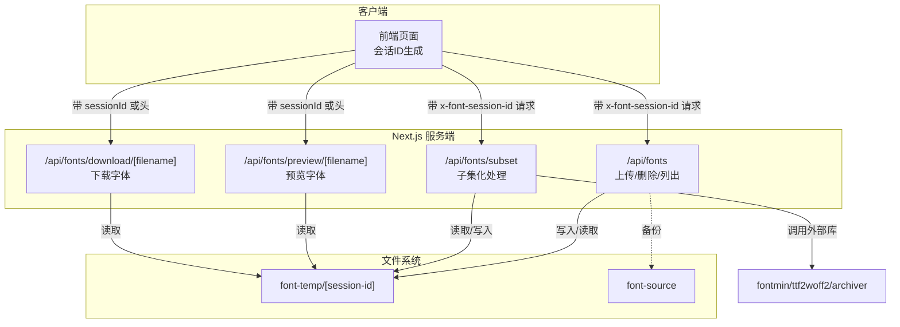
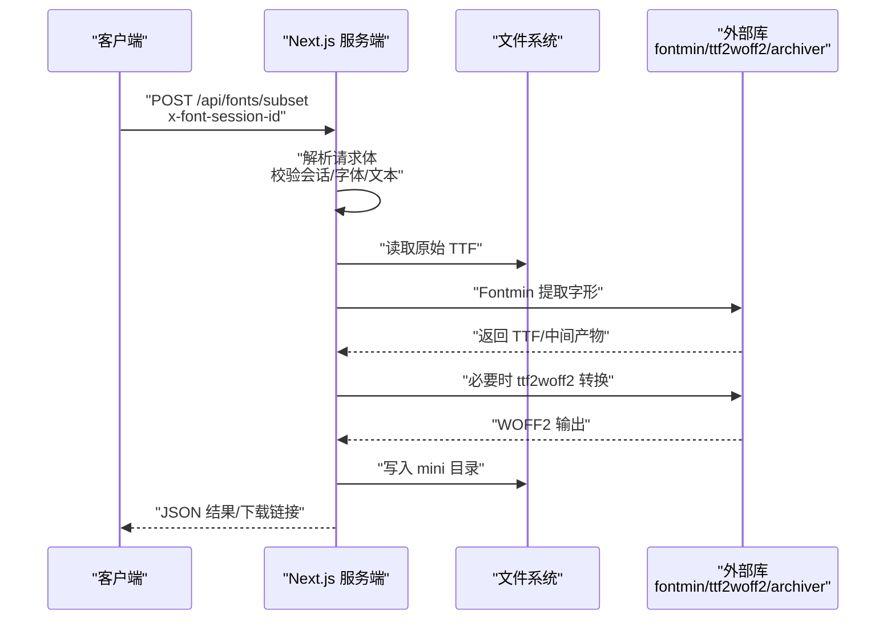
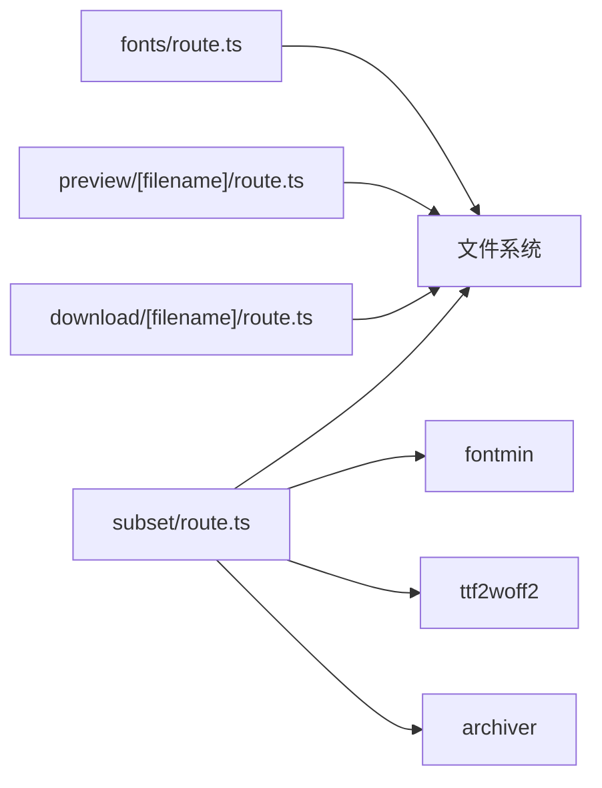
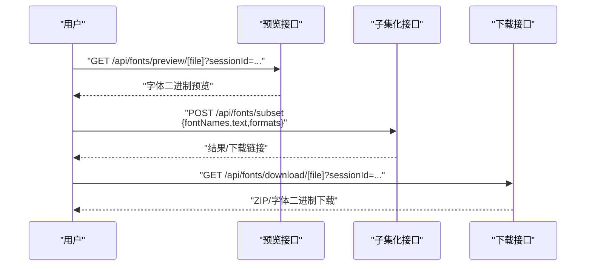

# 调试工具

<cite>
**本文引用的文件**   
- [README.md](file://README.md)
- [package.json](file://package.json)
- [next.config.mjs](file://next.config.mjs)
- [app/api/fonts/route.ts](file://app/api/fonts/route.ts)
- [app/api/fonts/subset/route.ts](file://app/api/fonts/subset/route.ts)
- [app/api/fonts/download/[filename]/route.ts](file://app/api/fonts/download/[filename]/route.ts)
- [app/api/fonts/preview/[filename]/route.ts](file://app/api/fonts/preview/[filename]/route.ts)
- [lib/session.ts](file://lib/session.ts)
- [test-api.js](file://test-api.js)
</cite>

## 目录
1. [简介](#简介)
2. [项目结构](#项目结构)
3. [核心组件](#核心组件)
4. [架构总览](#架构总览)
5. [详细组件分析](#详细组件分析)
6. [依赖分析](#依赖分析)
7. [性能考虑](#性能考虑)
8. [故障排查指南](#故障排查指南)
9. [结论](#结论)
10. [附录](#附录)

## 简介
本指南面向开发与运维工程师，聚焦 FontMin 字体子集化工具在开发与生产环境中的调试方法与最佳实践。内容涵盖：
- Node.js 调试器与 Chrome DevTools 的网络与性能分析
- API 测试工具（Postman、curl、内置脚本）的使用与排障
- 日志分析与错误堆栈跟踪
- 文件系统与权限问题诊断
- 网络连通性与服务器状态监控
- 断点设置、变量检查与异步流程调试
- 生产环境问题定位与性能优化策略

## 项目结构
该项目基于 Next.js App Router，API 路由位于 app/api/fonts 下，包含上传、预览、子集化生成与下载等能力；前端通过会话 ID 隔离用户数据，服务端通过日志记录关键路径。

图表来源
- [app/api/fonts/route.ts](file://app/api/fonts/route.ts#L1-L167)
- [app/api/fonts/subset/route.ts](file://app/api/fonts/subset/route.ts#L1-L366)
- [app/api/fonts/preview/[filename]/route.ts](file://app/api/fonts/preview/[filename]/route.ts#L1-L61)
- [app/api/fonts/download/[filename]/route.ts](file://app/api/fonts/download/[filename]/route.ts#L1-L62)

章节来源
- [README.md](file://README.md#L135-L160)
- [package.json](file://package.json#L1-L78)
- [next.config.mjs](file://next.config.mjs#L1-L44)

## 核心组件
- 会话与请求头
  - 客户端通过 lib/session.ts 生成会话 ID，并在请求头中携带 x-font-session-id；服务端通过请求头或查询参数读取该 ID，实现用户隔离。
- 字体上传与备份
  - app/api/fonts/route.ts 提供上传、列出与删除接口，上传时同时写入用户会话目录与永久备份目录。
- 字体子集化处理
  - app/api/fonts/subset/route.ts 调用 fontmin、ttf2woff2、archiver 等库进行子集化与格式转换，生成 Lite 字体并可打包下载。
- 预览与下载
  - app/api/fonts/preview/[filename]/route.ts 与 app/api/fonts/download/[filename]/route.ts 分别提供预览与下载能力，严格校验会话 ID 并设置合适的 Content-Type。

章节来源
- [lib/session.ts](file://lib/session.ts#L1-L34)
- [app/api/fonts/route.ts](file://app/api/fonts/route.ts#L1-L167)
- [app/api/fonts/subset/route.ts](file://app/api/fonts/subset/route.ts#L1-L366)
- [app/api/fonts/preview/[filename]/route.ts](file://app/api/fonts/preview/[filename]/route.ts#L1-L61)
- [app/api/fonts/download/[filename]/route.ts](file://app/api/fonts/download/[filename]/route.ts#L1-L62)

## 架构总览
下图展示一次“子集化请求”的端到端流程，包括会话校验、输入验证、字体处理与响应返回。

图表来源
- [app/api/fonts/subset/route.ts](file://app/api/fonts/subset/route.ts#L164-L366)

章节来源
- [app/api/fonts/subset/route.ts](file://app/api/fonts/subset/route.ts#L164-L366)

## 详细组件分析

### 会话与请求头
- 关键点
  - 客户端生成会话 ID 并持久化，服务端通过 x-font-session-id 或查询参数 sessionId 识别用户上下文。
  - 若缺失会话 ID，相关接口返回 404/400 错误，便于早期发现会话问题。
- 调试要点
  - 在浏览器控制台确认会话 ID 是否存在且稳定。
  - 使用抓包工具（如 DevTools Network）检查请求头是否正确传递。
  - 如需跨域预览，注意预览接口已设置允许跨域响应头。

章节来源
- [lib/session.ts](file://lib/session.ts#L1-L34)
- [app/api/fonts/preview/[filename]/route.ts](file://app/api/fonts/preview/[filename]/route.ts#L15-L23)
- [app/api/fonts/download/[filename]/route.ts](file://app/api/fonts/download/[filename]/route.ts#L15-L23)

### 上传与备份（/api/fonts）
- 关键点
  - 支持多文件上传，服务端对文件名进行清洗并保存至用户会话目录与永久备份目录。
  - 列表接口仅返回受支持的字体扩展名，便于前端筛选。
  - 删除接口仅移除会话目录中的文件，保留备份目录。
- 调试要点
  - 观察服务端日志中“保存到会话/备份到源”记录，确认文件落盘。
  - 若出现“找不到字体”，优先检查会话目录是否存在以及文件名编码。

章节来源
- [app/api/fonts/route.ts](file://app/api/fonts/route.ts#L36-L127)

### 子集化处理（/api/fonts/subset）
- 关键点
  - 仅支持 TTF 输入；非 TTF 文件会被跳过并记录警告。
  - 支持多种输出格式（ttf/woff/woff2/eot/svg），其中 woff2 需额外转换。
  - 可选择逐个下载或打包为 zip。
- 调试要点
  - 关注 processFont 中的“开始/找到目标文件/转换成功/异常”日志。
  - 若返回“未找到输出文件”，检查格式参数与 Fontmin 输出路径匹配逻辑。
  - 大量并发请求时，留意磁盘 IO 与内存占用峰值。

章节来源
- [app/api/fonts/subset/route.ts](file://app/api/fonts/subset/route.ts#L25-L162)
- [app/api/fonts/subset/route.ts](file://app/api/fonts/subset/route.ts#L164-L366)

### 预览与下载（/api/fonts/preview/[filename] 与 /api/fonts/download/[filename]）
- 关键点
  - 预览接口设置 no-cache 与允许跨域，适合前端实时预览。
  - 下载接口根据扩展名设置正确的 Content-Type，并作为附件返回。
- 调试要点
  - 若预览失败，检查 sessionId 与文件路径是否一致。
  - 下载 404 通常表示 mini 目录中不存在对应文件，需确认子集化流程是否完成。

章节来源
- [app/api/fonts/preview/[filename]/route.ts](file://app/api/fonts/preview/[filename]/route.ts#L7-L61)
- [app/api/fonts/download/[filename]/route.ts](file://app/api/fonts/download/[filename]/route.ts#L7-L62)

### 外部依赖与构建配置
- 关键点
  - next.config.mjs 启用 asyncWebAssembly 与 layers，并将 fontmin、ttf2woff2、archiver 声明为 server 外部模块，避免打包进客户端。
  - package.json 定义了开发与生产启动端口（6739），便于本地调试。
- 调试要点
  - 若出现 WASM 加载或外部模块相关报错，优先核对 webpack 外部化配置。
  - 端口冲突时，可在 scripts 中调整端口或通过命令行传参覆盖。

章节来源
- [next.config.mjs](file://next.config.mjs#L14-L40)
- [package.json](file://package.json#L5-L10)

## 依赖分析
- 组件耦合
  - 子集化路由依赖文件系统与外部库；上传/预览/下载路由依赖会话 ID 与文件路径。
- 外部依赖
  - fontmin：字形提取核心
  - ttf2woff2：TTF 转 WOFF2
  - archiver：ZIP 打包
- 潜在风险
  - 外部库异常会直接反映为处理失败与错误堆栈；磁盘空间不足会导致写入失败。

图表来源
- [app/api/fonts/subset/route.ts](file://app/api/fonts/subset/route.ts#L1-L366)
- [app/api/fonts/route.ts](file://app/api/fonts/route.ts#L1-L167)
- [app/api/fonts/preview/[filename]/route.ts](file://app/api/fonts/preview/[filename]/route.ts#L1-L61)
- [app/api/fonts/download/[filename]/route.ts](file://app/api/fonts/download/[filename]/route.ts#L1-L62)

章节来源
- [app/api/fonts/subset/route.ts](file://app/api/fonts/subset/route.ts#L1-L366)
- [next.config.mjs](file://next.config.mjs#L28-L36)

## 性能考虑
- I/O 与并发
  - 子集化涉及多次磁盘读写与格式转换，建议限制并发数量并观察磁盘队列。
- 内存占用
  - 大字体文件与多格式输出会增加内存峰值，建议分批处理与及时释放缓冲区。
- 网络传输
  - 预览接口设置 no-cache，避免不必要的缓存；下载接口设置 Content-Length，利于进度反馈。
- 构建与运行
  - 使用指定端口（6739）避免与其他服务冲突；生产启动前确保外部模块已正确打包/外置。

章节来源
- [app/api/fonts/subset/route.ts](file://app/api/fonts/subset/route.ts#L318-L332)
- [app/api/fonts/preview/[filename]/route.ts](file://app/api/fonts/preview/[filename]/route.ts#L46-L52)
- [package.json](file://package.json#L5-L10)

## 故障排查指南

### Node.js 调试器与 Chrome DevTools
- 启动与断点
  - 使用 pnpm dev 启动（端口 6739），在浏览器打开调试器，在服务端代码中设置断点。
  - 对子集化流程，可在 processFont 与请求体解析处打断点，检查输入参数与中间产物。
- 网络分析
  - 在 DevTools Network 中过滤 XHR/Fetch，查看请求头（x-font-session-id）、响应体与状态码。
  - 关注预览与下载接口的 Content-Type 设置是否正确。
- 性能分析
  - 使用 Performance 面板录制子集化过程，观察主线程阻塞点与内存增长曲线。

章节来源
- [package.json](file://package.json#L5-L10)
- [app/api/fonts/subset/route.ts](file://app/api/fonts/subset/route.ts#L36-L162)
- [app/api/fonts/preview/[filename]/route.ts](file://app/api/fonts/preview/[filename]/route.ts#L46-L52)

### API 测试工具
- curl 示例
  - 列出会话内字体：带上 x-font-session-id 头
  - 上传字体：multipart/form-data，字段名为 fonts[]
  - 子集化：POST JSON，包含 fontNames、text、outputFormats、downloadAll
  - 下载：GET 返回二进制流
- Postman
  - 将会话 ID 设置为全局或环境变量，统一注入到请求头。
  - 使用 Tests 脚本打印响应状态、内容类型与关键字段，便于回归。
- 内置脚本
  - test-api.js 展示了如何发送子集化请求并打印响应与头部信息，适合快速验证。

章节来源
- [test-api.js](file://test-api.js#L1-L36)
- [app/api/fonts/route.ts](file://app/api/fonts/route.ts#L71-L127)
- [app/api/fonts/subset/route.ts](file://app/api/fonts/subset/route.ts#L164-L193)
- [app/api/fonts/download/[filename]/route.ts](file://app/api/fonts/download/[filename]/route.ts#L7-L62)

### 日志分析与错误堆栈
- 控制台输出
  - 上传/删除/预览/下载与子集化主流程均包含日志，按时间顺序排查有助于定位问题。
- 错误堆栈
  - 子集化主流程捕获异常并返回 500，同时记录错误消息与堆栈，便于回溯。
- 建议
  - 在开发阶段开启更详细的日志级别；生产环境结合日志聚合平台统一收集。

章节来源
- [app/api/fonts/route.ts](file://app/api/fonts/route.ts#L44-L46)
- [app/api/fonts/subset/route.ts](file://app/api/fonts/subset/route.ts#L351-L364)

### 文件系统与权限
- 目录结构
  - font-temp/[session-id]：用户会话目录，包含原始字体与生成的 Lite 字体
  - font-source：永久备份目录，所有上传字体的副本
- 常见问题
  - 权限不足导致写入失败：检查 Node 进程对两个目录的写权限
  - 目录不存在：首次访问会自动创建，若被删除需确认自动创建逻辑是否生效
  - 文件名非法：服务端会对文件名进行清洗，避免路径穿越
- 诊断步骤
  - 使用 ls -la 检查目录权限与归属
  - 在服务端日志中确认“创建目录/保存文件/备份文件”记录
  - 若下载 404，确认 mini 目录中是否存在目标文件

章节来源
- [README.md](file://README.md#L179-L190)
- [app/api/fonts/route.ts](file://app/api/fonts/route.ts#L9-L14)
- [app/api/fonts/subset/route.ts](file://app/api/fonts/subset/route.ts#L16-L23)

### 网络连接与服务器状态
- 端口与进程
  - 开发端口 6739，可通过 lsof 或 netstat 检查端口占用
- 健康检查
  - GET /api/fonts 可作为轻量健康检查入口（返回当前会话字体列表）
- CDN/代理
  - 若前置代理或 CDN 缓存预览/下载响应，需配合 no-cache 与正确 MIME 类型

章节来源
- [package.json](file://package.json#L5-L10)
- [app/api/fonts/route.ts](file://app/api/fonts/route.ts#L36-L69)

### 异步流程与断点调试
- 关键异步点
  - 请求体解析、文件系统读写、外部库回调、ZIP 打包
- 调试技巧
  - 在每个 Promise 链路设置断点，检查 resolved/rejected 值
  - 使用 DevTools 的 Promise 面板查看未捕获异常
  - 对大文件处理，分段读取与流式写入可降低内存峰值

章节来源
- [app/api/fonts/subset/route.ts](file://app/api/fonts/subset/route.ts#L318-L332)

### 生产环境定位与优化
- 问题定位
  - 通过日志聚合平台检索“Fontmin error/Conversion failed/No output file”等关键词
  - 对高频失败的格式（如 woff2）单独抽样复现
- 性能优化
  - 限制并发数与批量大小，引入队列与重试
  - 对热点字体建立缓存（如 mini 目录中已存在的 Lite 文件）
  - 监控磁盘 IO 与 CPU 占用，必要时拆分服务或使用 SSD

章节来源
- [app/api/fonts/subset/route.ts](file://app/api/fonts/subset/route.ts#L82-L116)

## 结论
本指南提供了从开发到生产的全链路调试方法：以会话 ID 为线索串联请求与文件系统，利用日志与 DevTools 快速定位问题，借助 API 测试工具与内置脚本高效验证，结合文件系统与网络监控完善运维保障。针对生产环境，建议建立日志聚合、性能基线与容量预警机制，持续优化 I/O 与并发策略。

## 附录

### API 调用序列（子集化）

图表来源
- [app/api/fonts/preview/[filename]/route.ts](file://app/api/fonts/preview/[filename]/route.ts#L7-L61)
- [app/api/fonts/subset/route.ts](file://app/api/fonts/subset/route.ts#L164-L366)
- [app/api/fonts/download/[filename]/route.ts](file://app/api/fonts/download/[filename]/route.ts#L7-L62)