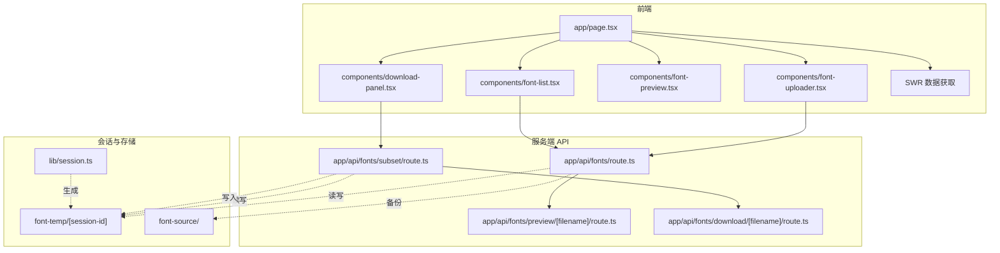
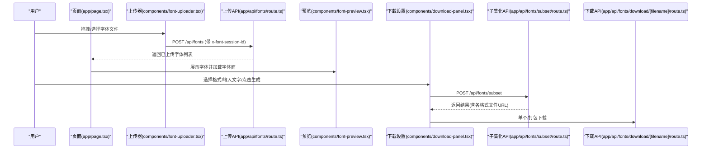
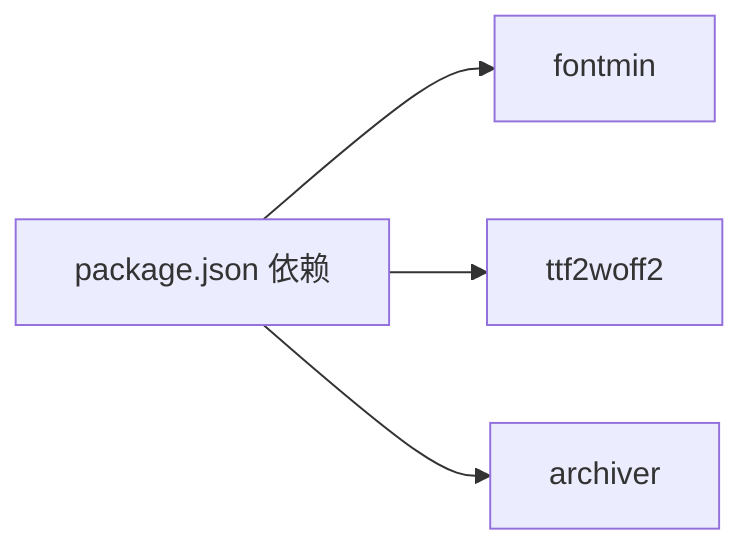

# 使用指南

<cite>
**本文引用的文件**
- [README.md](file://README.md)
- [package.json](file://package.json)
- [app/page.tsx](file://app/page.tsx)
- [components/font-uploader.tsx](file://components/font-uploader.tsx)
- [components/font-preview.tsx](file://components/font-preview.tsx)
- [components/download-panel.tsx](file://components/download-panel.tsx)
- [components/font-list.tsx](file://components/font-list.tsx)
- [app/api/fonts/route.ts](file://app/api/fonts/route.ts)
- [app/api/fonts/subset/route.ts](file://app/api/fonts/subset/route.ts)
- [app/api/fonts/preview/[filename]/route.ts](file://app/api/fonts/preview/[filename]/route.ts)
- [app/api/fonts/download/[filename]/route.ts](file://app/api/fonts/download/[filename]/route.ts)
- [lib/session.ts](file://lib/session.ts)
- [types/fontmin.d.ts](file://types/fontmin.d.ts)
</cite>

## 目录
1. [简介](#简介)
2. [项目结构](#项目结构)
3. [核心组件](#核心组件)
4. [架构总览](#架构总览)
5. [详细组件解析](#详细组件解析)
6. [依赖关系分析](#依赖关系分析)
7. [性能与效率建议](#性能与效率建议)
8. [故障排查指南](#故障排查指南)
9. [结论](#结论)
10. [附录](#附录)

## 简介
FontMin 是一款现代化的字体子集化工具，通过“拖拽上传字体 + 输入目标文字 + 一键生成精简字体包”的工作流，帮助用户显著减小字体文件体积，优化网页与应用的加载性能。系统支持多种输出格式（TTF、WOFF、WOFF2、EOT、SVG），提供实时预览、批量处理、压缩统计与隐私隔离等能力。

## 项目结构
前端采用 Next.js App Router，核心页面位于 app/page.tsx；上传、预览、下载设置等功能通过独立组件实现；服务端 API 路由位于 app/api/fonts 下，负责会话隔离、文件存储与字体处理。

图表来源
- [app/page.tsx](file://app/page.tsx#L1-L279)
- [components/font-uploader.tsx](file://components/font-uploader.tsx#L1-L166)
- [components/font-list.tsx](file://components/font-list.tsx#L1-L159)
- [components/font-preview.tsx](file://components/font-preview.tsx#L1-L123)
- [components/download-panel.tsx](file://components/download-panel.tsx#L1-L295)
- [app/api/fonts/route.ts](file://app/api/fonts/route.ts#L1-L167)
- [app/api/fonts/subset/route.ts](file://app/api/fonts/subset/route.ts#L1-L366)
- [app/api/fonts/preview/[filename]/route.ts](file://app/api/fonts/preview/[filename]/route.ts#L1-L61)
- [app/api/fonts/download/[filename]/route.ts](file://app/api/fonts/download/[filename]/route.ts#L1-L62)
- [lib/session.ts](file://lib/session.ts#L1-L34)

章节来源
- [README.md](file://README.md#L135-L160)
- [package.json](file://package.json#L1-L78)

## 核心组件
- 页面容器与状态编排：app/page.tsx 负责上传、删除、选择字体、调用子集化 API、拉取字体列表等。
- 字体上传器：components/font-uploader.tsx 支持拖拽/选择、格式过滤、批量预览与上传。
- 字体列表：components/font-list.tsx 展示已上传字体、全选/删除与交互提示。
- 字体预览：components/font-preview.tsx 实时加载字体、输入预览文字、滑条调节字号。
- 下载设置：components/download-panel.tsx 选择输出格式、触发生成、展示压缩结果与批量下载。
- 会话与存储：lib/session.ts 生成会话 ID；API 路由按会话隔离读写临时目录，同时备份至 font-source。

章节来源
- [app/page.tsx](file://app/page.tsx#L1-L279)
- [components/font-uploader.tsx](file://components/font-uploader.tsx#L1-L166)
- [components/font-list.tsx](file://components/font-list.tsx#L1-L159)
- [components/font-preview.tsx](file://components/font-preview.tsx#L1-L123)
- [components/download-panel.tsx](file://components/download-panel.tsx#L1-L295)
- [lib/session.ts](file://lib/session.ts#L1-L34)

## 架构总览
下图展示了从前端交互到服务端处理与存储的整体流程。

图表来源
- [app/page.tsx](file://app/page.tsx#L33-L145)
- [components/font-uploader.tsx](file://components/font-uploader.tsx#L65-L70)
- [app/api/fonts/route.ts](file://app/api/fonts/route.ts#L72-L127)
- [components/font-preview.tsx](file://components/font-preview.tsx#L34-L48)
- [components/download-panel.tsx](file://components/download-panel.tsx#L68-L89)
- [app/api/fonts/subset/route.ts](file://app/api/fonts/subset/route.ts#L164-L366)
- [app/api/fonts/download/[filename]/route.ts](file://app/api/fonts/download/[filename]/route.ts#L7-L61)

## 详细组件解析

### 字体上传与最佳实践
- 支持的输入格式：TTF、OTF、WOFF、WOFF2、EOT、SVG。注意：子集化引擎仅接受 TTF 作为输入，系统会自动跳过非 TTF 字体并给出提示。
- 上传技巧：
  - 使用拖拽或点击选择，支持多文件同时加入队列；
  - 上传前可预览文件名与大小，便于筛选；
  - 上传成功后自动选中并刷新列表。
- 会话与存储：
  - 每个会话对应独立临时目录，避免跨用户数据泄露；
  - 上传的字体同时备份到 font-source，删除仅影响会话目录，不涉及备份。

章节来源
- [components/font-uploader.tsx](file://components/font-uploader.tsx#L15-L59)
- [app/api/fonts/route.ts](file://app/api/fonts/route.ts#L72-L127)
- [README.md](file://README.md#L186-L189)

### 字体预览与实时效果
- 文字输入：在预览区域输入或粘贴目标文字，系统会实时渲染；
- 字号调节：通过滑条调整预览字号，观察不同字号下的排版效果；
- 字体加载：为每个预览字体动态注入 FontFace 并加入 document.fonts，确保实时预览；
- 默认示例：组件内置中英混排示例文本，便于快速验证。

章节来源
- [components/font-preview.tsx](file://components/font-preview.tsx#L15-L48)
- [components/font-preview.tsx](file://components/font-preview.tsx#L52-L81)
- [components/font-preview.tsx](file://components/font-preview.tsx#L83-L119)

### 下载设置与格式选择策略
- 输出格式：TTF、WOFF、WOFF2、EOT、SVG；
- 推荐策略：
  - 网页优先：WOFF2（最佳压缩率与兼容性）；
  - 旧版 IE：EOT；
  - 通用兼容：WOFF；
  - 原始需求：TTF；
  - SVG：特殊场景或调试用途。
- 生成流程：选择字体、输入文字、选择格式后点击“生成精简字体包”，系统返回各格式文件的下载链接；可选择打包下载全部文件。

章节来源
- [components/download-panel.tsx](file://components/download-panel.tsx#L30-L36)
- [components/download-panel.tsx](file://components/download-panel.tsx#L68-L89)
- [README.md](file://README.md#L95-L99)

### 批量处理与效率优化
- 批量操作：可在字体列表中全选，输入统一文字后一次性生成多种格式；
- 顺序下载：支持逐个下载，避免浏览器并发过多导致的卡顿；
- 打包下载：当存在多个文件时，可直接打包为 zip，提升下载效率；
- 文本去重：内部对输入文字做去重处理，减少无效重复字符带来的处理开销。

章节来源
- [components/font-list.tsx](file://components/font-list.tsx#L72-L86)
- [components/download-panel.tsx](file://components/download-panel.tsx#L95-L100)
- [app/api/fonts/subset/route.ts](file://app/api/fonts/subset/route.ts#L215-L217)

### 常见使用场景示例
- 网页字体优化：仅包含页面实际使用的字符，显著降低字体体积，提升首屏加载速度；
- 移动应用：为 App 提供精简字体资源，减少安装包体积与内存占用；
- 电子书/设计项目：导出仅包含文中字符的字体文件，保证一致性与合规性。

章节来源
- [README.md](file://README.md#L35-L40)

### 会话管理与数据隔离
- 会话生成：前端通过 lib/session.ts 生成唯一会话 ID，请求头携带 x-font-session-id；
- 隔离机制：每个会话拥有独立的临时目录 font-temp/[session-id]，不同会话互不可见；
- 生命周期：
  - 刷新页面：会话数据清空（若 Cookie 未过期则保留）；
  - 会话过期：临时目录清理；
  - 删除字体：仅删除会话目录中的文件，备份目录不受影响。

章节来源
- [lib/session.ts](file://lib/session.ts#L1-L27)
- [app/api/fonts/route.ts](file://app/api/fonts/route.ts#L16-L34)
- [README.md](file://README.md#L191-L221)

### 用户体验与交互模式
- 实时反馈：上传、删除、生成均提供加载状态与错误提示；
- 交互引导：预设默认示例文本，帮助快速上手；
- 结果可视化：展示原始大小、精简后大小与压缩百分比，直观对比；
- 成功后操作：支持立即下载或批量打包下载。

章节来源
- [app/page.tsx](file://app/page.tsx#L33-L92)
- [components/font-preview.tsx](file://components/font-preview.tsx#L52-L65)
- [components/download-panel.tsx](file://components/download-panel.tsx#L118-L166)
- [components/download-panel.tsx](file://components/download-panel.tsx#L206-L291)

## 依赖关系分析
- 前端依赖：Next.js、React、Radix UI、Tailwind CSS、SWR、React Hook Form、Lucide React 等；
- 字体处理：fontmin（子集化）、ttf2woff2（TTF→WOFF2）、archiver（打包）；
- 会话与类型：自定义会话 ID 生成、fontmin 类型声明。

图表来源
- [package.json](file://package.json#L41-L65)

章节来源
- [package.json](file://package.json#L1-L78)
- [types/fontmin.d.ts](file://types/fontmin.d.ts#L1-L53)

## 性能与效率建议
- 优先使用 WOFF2：在现代浏览器中具备最佳压缩率与加载性能；
- 控制输入文字长度：仅包含必要字符，减少处理时间；
- 合理分批：大项目建议分批生成，避免单次处理时间过长；
- 使用打包下载：批量文件建议直接下载 zip，减少多次请求开销；
- 服务器端清理：定期清理 font-temp 中过期会话目录，释放磁盘空间。

章节来源
- [README.md](file://README.md#L222-L241)
- [components/download-panel.tsx](file://components/download-panel.tsx#L95-L100)

## 故障排查指南
- 上传失败：检查网络与会话头是否正确传递；确认文件格式符合要求；
- 生成失败：确保选择了有效字体且输入了非空文字；查看控制台错误信息；
- 预览空白：确认字体已成功上传并加载；检查浏览器字体加载日志；
- 下载失败：确认文件存在于会话 mini 目录；检查会话 ID 是否匹配。

章节来源
- [app/page.tsx](file://app/page.tsx#L33-L92)
- [app/api/fonts/route.ts](file://app/api/fonts/route.ts#L72-L127)
- [app/api/fonts/subset/route.ts](file://app/api/fonts/subset/route.ts#L164-L366)
- [app/api/fonts/download/[filename]/route.ts](file://app/api/fonts/download/[filename]/route.ts#L7-L61)

## 结论
FontMin 通过简洁的交互与强大的字体子集化能力，帮助开发者与设计师在保证视觉一致性的前提下，显著优化字体资源体积与加载性能。结合合理的格式选择、批量处理与会话隔离策略，可满足从网页到移动端的多样化场景需求。

## 附录
- 快速开始与环境要求：参考项目自述文件中的安装与启动说明；
- 技术栈与字体处理：Next.js、React、fontmin、ttf2woff2、archiver 等。

章节来源
- [README.md](file://README.md#L42-L79)
- [README.md](file://README.md#L113-L134)