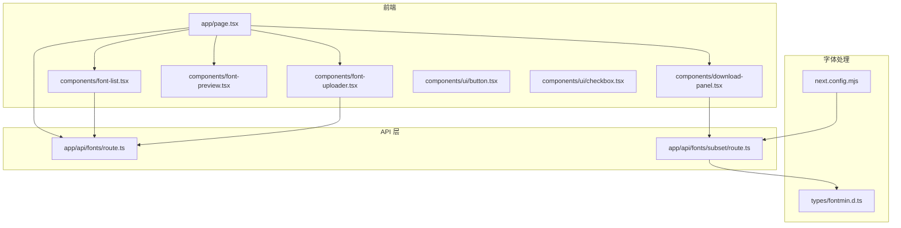
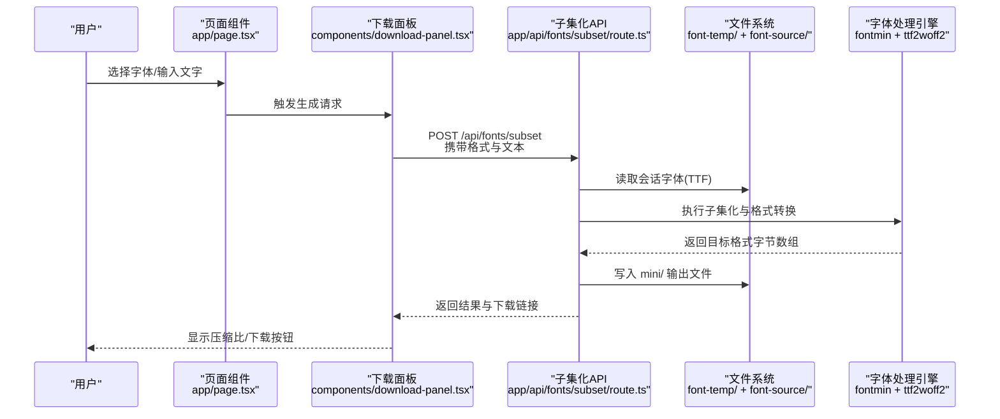
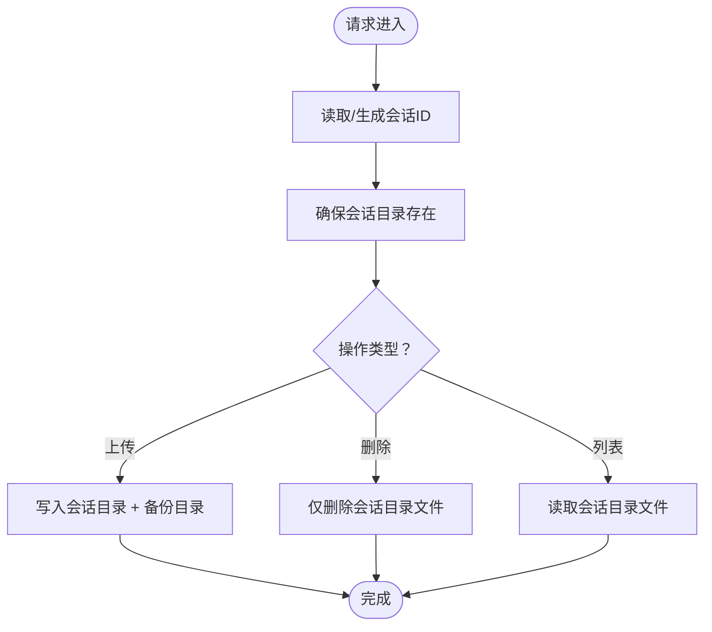
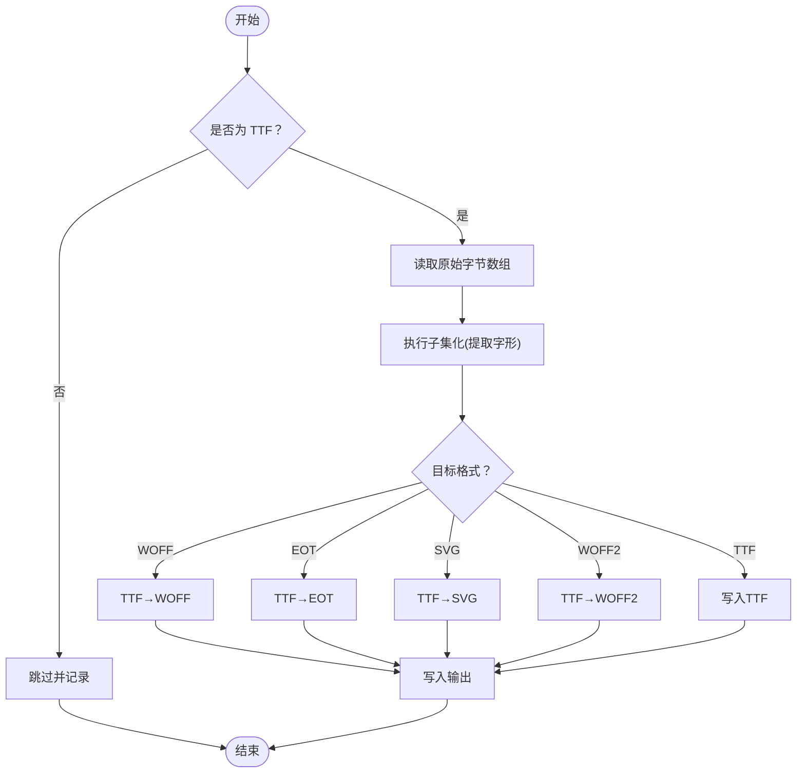
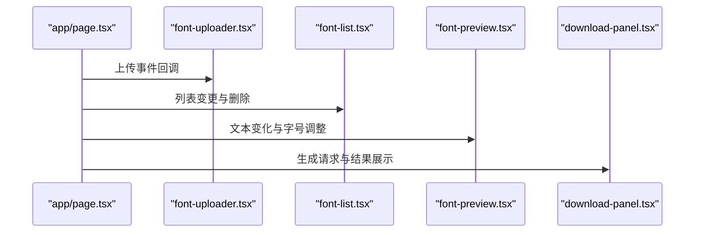
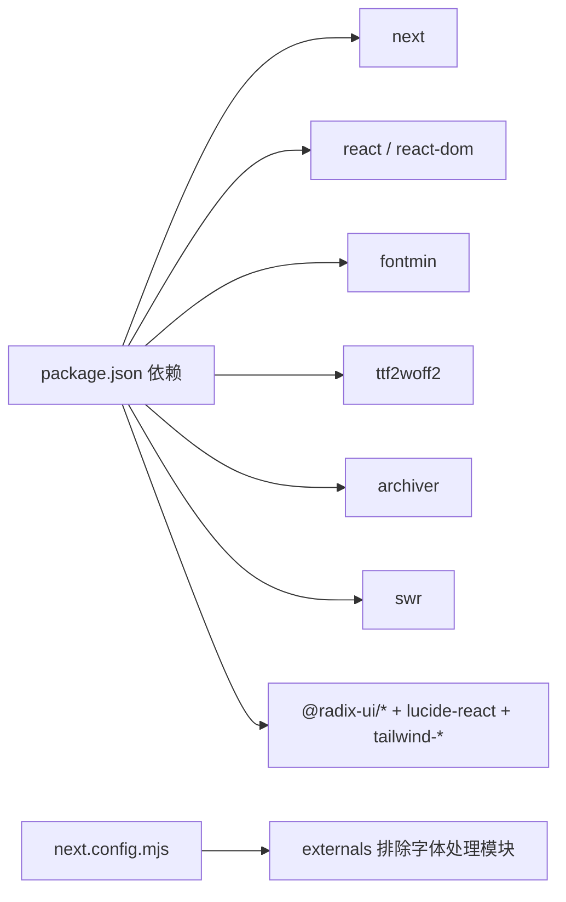

# 最佳实践

<cite>
**本文引用的文件**
- [README.md](file://README.md)
- [package.json](file://package.json)
- [next.config.mjs](file://next.config.mjs)
- [types/fontmin.d.ts](file://types/fontmin.d.ts)
- [app/api/fonts/route.ts](file://app/api/fonts/route.ts)
- [app/api/fonts/subset/route.ts](file://app/api/fonts/subset/route.ts)
- [app/page.tsx](file://app/page.tsx)
- [components/font-uploader.tsx](file://components/font-uploader.tsx)
- [components/font-list.tsx](file://components/font-list.tsx)
- [components/font-preview.tsx](file://components/font-preview.tsx)
- [components/download-panel.tsx](file://components/download-panel.tsx)
- [lib/session.ts](file://lib/session.ts)
- [components/ui/button.tsx](file://components/ui/button.tsx)
- [components/ui/checkbox.tsx](file://components/ui/checkbox.tsx)
- [test-api.js](file://test-api.js)
</cite>

## 目录
1. [简介](#简介)
2. [项目结构](#项目结构)
3. [核心组件](#核心组件)
4. [架构总览](#架构总览)
5. [详细组件分析](#详细组件分析)
6. [依赖关系分析](#依赖关系分析)
7. [性能考虑](#性能考虑)
8. [故障排查指南](#故障排查指南)
9. [结论](#结论)
10. [附录](#附录)

## 简介
本指南面向使用 FontMin 字体子集化工具的用户与维护者，提供从性能优化、格式选择、批量处理、隐私与数据安全、用户体验到第三方集成与问题诊断的系统性最佳实践。内容基于仓库现有实现，结合前端 Next.js 16、服务端字体处理流程与会话隔离机制，给出可操作的建议与方法论。

## 项目结构
- 前端采用 Next.js App Router，页面组件位于 app/，UI 组件位于 components/，全局样式位于 styles/ 与 app/globals.css。
- 字体处理 API 位于 app/api/fonts/，包含上传/列出/删除与子集化生成两个路由。
- 字体类型声明位于 types/fontmin.d.ts，字体处理引擎为 fontmin，转换器包括 ttf2woff2、archiver。
- 会话与目录隔离逻辑通过 lib/session.ts 与 API 路由共同实现。

**图表来源**
- [app/page.tsx](file://app/page.tsx#L1-L279)
- [components/font-uploader.tsx](file://components/font-uploader.tsx#L1-L166)
- [components/font-list.tsx](file://components/font-list.tsx#L1-L159)
- [components/font-preview.tsx](file://components/font-preview.tsx#L1-L123)
- [components/download-panel.tsx](file://components/download-panel.tsx#L1-L295)
- [app/api/fonts/route.ts](file://app/api/fonts/route.ts#L1-L167)
- [app/api/fonts/subset/route.ts](file://app/api/fonts/subset/route.ts#L1-L366)
- [types/fontmin.d.ts](file://types/fontmin.d.ts#L1-L53)
- [next.config.mjs](file://next.config.mjs#L1-L44)

**章节来源**
- [README.md](file://README.md#L135-L160)
- [package.json](file://package.json#L1-L78)
- [next.config.mjs](file://next.config.mjs#L1-L44)

## 核心组件
- 会话与目录隔离：通过请求头 x-font-session-id 识别用户会话，API 路由在 font-temp/[session-id] 下隔离存储；同时将上传字体备份至 font-source，实现“临时+永久”双存储。
- 字体上传与列表：支持多格式上传，但子集化仅接受 TTF 输入；列表展示与删除操作均作用于会话目录。
- 实时预览：基于 FontFace 动态加载字体，支持中文、英文、数字与符号混合预览。
- 子集化与批量下载：支持 TTF/WOFF/WOFF2/EOT/SVG 输出；可单个或打包下载；对 WOFF2 采用 TTF→WOFF2 的二次转换。
- UI 组件：统一使用 Radix UI 与 Tailwind，提供按钮、复选框等基础组件，保证一致的交互与可访问性。

**章节来源**
- [lib/session.ts](file://lib/session.ts#L1-L34)
- [app/api/fonts/route.ts](file://app/api/fonts/route.ts#L16-L34)
- [app/api/fonts/route.ts](file://app/api/fonts/route.ts#L72-L127)
- [app/api/fonts/route.ts](file://app/api/fonts/route.ts#L129-L167)
- [components/font-preview.tsx](file://components/font-preview.tsx#L34-L48)
- [app/api/fonts/subset/route.ts](file://app/api/fonts/subset/route.ts#L25-L29)
- [app/api/fonts/subset/route.ts](file://app/api/fonts/subset/route.ts#L31-L162)
- [app/api/fonts/subset/route.ts](file://app/api/fonts/subset/route.ts#L164-L366)
- [components/download-panel.tsx](file://components/download-panel.tsx#L30-L36)
- [components/ui/button.tsx](file://components/ui/button.tsx#L1-L61)
- [components/ui/checkbox.tsx](file://components/ui/checkbox.tsx#L1-L33)

## 架构总览
下图展示了从前端交互到服务端字体处理与输出的完整流程。

**图表来源**
- [app/page.tsx](file://app/page.tsx#L113-L145)
- [components/download-panel.tsx](file://components/download-panel.tsx#L68-L89)
- [app/api/fonts/subset/route.ts](file://app/api/fonts/subset/route.ts#L164-L366)
- [types/fontmin.d.ts](file://types/fontmin.d.ts#L29-L45)

## 详细组件分析

### 会话与目录隔离机制
- 会话标识：前端通过 lib/session.ts 生成随机会话 ID 并随请求头发送；API 路由据此定位用户目录。
- 目录策略：上传与备份分别写入 font-temp/[session-id] 与 font-source；删除仅影响会话目录，不触碰备份。
- 生命周期：会话目录按天清理，备份目录长期保留；刷新页面不清空数据（Cookie 未过期时保留）。

**图表来源**
- [lib/session.ts](file://lib/session.ts#L1-L34)
- [app/api/fonts/route.ts](file://app/api/fonts/route.ts#L16-L34)
- [app/api/fonts/route.ts](file://app/api/fonts/route.ts#L72-L127)
- [app/api/fonts/route.ts](file://app/api/fonts/route.ts#L129-L167)

**章节来源**
- [lib/session.ts](file://lib/session.ts#L1-L34)
- [app/api/fonts/route.ts](file://app/api/fonts/route.ts#L16-L34)
- [app/api/fonts/route.ts](file://app/api/fonts/route.ts#L72-L127)
- [app/api/fonts/route.ts](file://app/api/fonts/route.ts#L129-L167)
- [README.md](file://README.md#L191-L242)

### 字体子集化处理流程
- 输入限制：仅 TTF 作为输入；若非 TTF，API 将跳过并返回提示。
- 子集化：使用 fontmin.glyph 提取指定文本的字形；根据目标格式插入相应转换插件。
- WOFF2 转换：先得到 TTF，再用 ttf2woff2 转换为 WOFF2。
- 输出组织：结果写入 mini/ 目录，生成下载链接；支持打包下载。

**图表来源**
- [app/api/fonts/subset/route.ts](file://app/api/fonts/subset/route.ts#L25-L29)
- [app/api/fonts/subset/route.ts](file://app/api/fonts/subset/route.ts#L31-L162)
- [app/api/fonts/subset/route.ts](file://app/api/fonts/subset/route.ts#L164-L366)
- [types/fontmin.d.ts](file://types/fontmin.d.ts#L18-L38)

**章节来源**
- [app/api/fonts/subset/route.ts](file://app/api/fonts/subset/route.ts#L25-L29)
- [app/api/fonts/subset/route.ts](file://app/api/fonts/subset/route.ts#L31-L162)
- [app/api/fonts/subset/route.ts](file://app/api/fonts/subset/route.ts#L164-L366)
- [types/fontmin.d.ts](file://types/fontmin.d.ts#L18-L38)

### 前端交互与状态管理
- 页面组件负责聚合上传、列表、预览与下载面板；通过 SWR 获取会话内字体列表。
- 下载面板控制格式选择、触发处理、展示结果与下载链接；支持顺序下载与打包下载。
- 预览组件动态加载字体，支持滑杆调节字号与多字体并列预览。

**图表来源**
- [app/page.tsx](file://app/page.tsx#L33-L145)
- [components/font-uploader.tsx](file://components/font-uploader.tsx#L65-L70)
- [components/font-list.tsx](file://components/font-list.tsx#L42-L58)
- [components/font-preview.tsx](file://components/font-preview.tsx#L17-L48)
- [components/download-panel.tsx](file://components/download-panel.tsx#L68-L89)

**章节来源**
- [app/page.tsx](file://app/page.tsx#L27-L145)
- [components/font-uploader.tsx](file://components/font-uploader.tsx#L1-L166)
- [components/font-list.tsx](file://components/font-list.tsx#L1-L159)
- [components/font-preview.tsx](file://components/font-preview.tsx#L1-L123)
- [components/download-panel.tsx](file://components/download-panel.tsx#L1-L295)

## 依赖关系分析
- 前端依赖：Next.js 16、React 19、Radix UI、Tailwind CSS、Lucide React、SWR、React Hook Form 等。
- 字体处理依赖：fontmin（子集化）、ttf2woff2（TTF→WOFF2）、archiver（ZIP 打包）。
- Webpack 配置：启用 asyncWebAssembly 与 layers，服务端 externals 排除字体处理相关模块，避免打包体积膨胀。

**图表来源**
- [package.json](file://package.json#L11-L66)
- [next.config.mjs](file://next.config.mjs#L28-L36)

**章节来源**
- [package.json](file://package.json#L11-L66)
- [next.config.mjs](file://next.config.mjs#L14-L39)

## 性能考虑
- 输入格式优化
  - 仅 TTF 作为子集化输入，确保兼容性与稳定性；如需 WOFF2，优先在输出阶段转换。
  - 对于 OTF/其他格式，建议先转换为 TTF 再子集化，避免中间步骤复杂度。
- 并发与批处理
  - 单次请求可处理多个字体与多种格式；合理拆分任务，避免单次超大负载。
  - 使用“下载全部”打包功能减少浏览器并发连接压力。
- I/O 与内存
  - 大字体文件读取与写入应避免阻塞主线程；必要时在服务端异步处理并返回进度或分片结果。
  - 控制预览文本长度，避免一次性加载过多字形导致内存峰值过高。
- 压缩与传输
  - WOFF2 压缩率最高，优先选择；ZIP 打包时使用较高压缩等级。
  - 合理设置缓存与 CDN，减少重复下载。
- 构建与运行
  - 保持 Webpack 配置开启 WASM 支持，确保字体处理模块正常加载。
  - 生产环境建议启用静态资源优化与服务端渲染缓存。

[本节为通用性能建议，无需特定文件引用]

## 故障排查指南
- 常见错误与定位
  - 会话缺失：API 返回 404，提示“会话未找到，请重新上传字体”。检查请求头 x-font-session-id 是否正确传递。
  - 未找到上传字体：用户会话目录不存在或文件已被删除。确认上传流程与删除操作。
  - 非 TTF 格式：子集化仅支持 TTF 输入，API 会跳过非 TTF 并返回提示。请先转换为 TTF。
  - 字体处理异常：检查日志中的错误堆栈，关注 Fontmin 插件链路与 WOFF2 转换环节。
- 日志与可观测性
  - API 路由中包含大量日志输出，便于定位具体步骤与文件路径。
  - 使用 test-api.js 进行端到端验证，观察响应状态与内容类型。
- 修复建议
  - 重新上传 TTF 字体并确保会话有效。
  - 分批处理字体与格式，降低单次负载。
  - 检查磁盘空间与权限，确保 mini/ 目录可写。

**章节来源**
- [app/api/fonts/subset/route.ts](file://app/api/fonts/subset/route.ts#L170-L175)
- [app/api/fonts/subset/route.ts](file://app/api/fonts/subset/route.ts#L206-L213)
- [app/api/fonts/subset/route.ts](file://app/api/fonts/subset/route.ts#L240-L245)
- [app/api/fonts/subset/route.ts](file://app/api/fonts/subset/route.ts#L297-L310)
- [test-api.js](file://test-api.js#L1-L36)

## 结论
本指南围绕 FontMin 的会话隔离、字体处理流程、UI 交互与性能优化提供了系统性的最佳实践。遵循本文建议，可在保障隐私与数据安全的前提下，高效完成字体子集化与批量处理任务，并获得良好的用户体验。

[本节为总结性内容，无需特定文件引用]

## 附录

### 字体格式选择策略与适用场景
- TTF
  - 优点：兼容性好，适合需要广泛支持的场景。
  - 场景：传统网页、移动应用基础字体。
- WOFF
  - 优点：压缩适中，兼容性良好。
  - 场景：跨浏览器兼容需求较高的网页。
- WOFF2
  - 优点：压缩率高，体积最小。
  - 场景：对带宽敏感的网页与移动端优先选择。
- EOT
  - 优点：旧版 IE 支持。
  - 场景：遗留系统兼容。
- SVG
  - 优点：矢量特性，可缩放。
  - 场景：特殊图标字体或低频使用场景。

**章节来源**
- [components/download-panel.tsx](file://components/download-panel.tsx#L30-L36)
- [README.md](file://README.md#L95-L99)

### 批量处理最佳实践与效率优化
- 合理拆分任务：一次处理多个字体与格式时，建议分批提交，避免单次超载。
- 使用打包下载：当结果较多时，优先选择打包下载，减少浏览器并发。
- 预处理文本：去除重复字符，减少子集化计算量。
- 服务器资源：为字体处理分配足够内存与 CPU，避免 OOM 或超时。

**章节来源**
- [components/download-panel.tsx](file://components/download-panel.tsx#L68-L89)
- [app/api/fonts/subset/route.ts](file://app/api/fonts/subset/route.ts#L215-L217)
- [app/api/fonts/subset/route.ts](file://app/api/fonts/subset/route.ts#L313-L342)

### 隐私保护与数据安全管理
- 会话隔离：基于 Cookie 的会话 ID，不同用户与浏览器标签页数据隔离。
- 双重存储：会话目录临时存放，备份目录长期保留；删除仅影响会话目录。
- 服务器清理：定期清理 font-temp 超过 1 天的目录；监控备份目录容量并定期备份。

**章节来源**
- [lib/session.ts](file://lib/session.ts#L1-L34)
- [app/api/fonts/route.ts](file://app/api/fonts/route.ts#L16-L34)
- [README.md](file://README.md#L191-L242)

### 用户体验优化设计原则与交互模式
- 明确的状态反馈：处理中显示加载状态，成功后展示压缩比与下载入口。
- 便捷的操作路径：全选、单个删除、顺序下载与打包下载。
- 实时预览：支持多字体并列预览与字号调节，提升决策效率。
- 错误提示：清晰的错误信息与可操作建议。

**章节来源**
- [components/download-panel.tsx](file://components/download-panel.tsx#L168-L186)
- [components/download-panel.tsx](file://components/download-panel.tsx#L198-L203)
- [components/font-preview.tsx](file://components/font-preview.tsx#L67-L81)
- [components/font-list.tsx](file://components/font-list.tsx#L138-L156)

### 第三方集成推荐与 API 使用技巧
- 前端调用
  - 通过 app/page.tsx 中的 handleSubset 发起子集化请求，携带 selectedFonts、text、outputFormats、downloadAll。
  - 使用 SWR 获取会话字体列表，确保数据一致性。
- 后端 API
  - /api/fonts：GET 列出、POST 上传、DELETE 删除。
  - /api/fonts/subset：POST 执行子集化与格式转换。
- 测试脚本
  - 使用 test-api.js 验证子集化接口，观察响应状态与内容类型。

**章节来源**
- [app/page.tsx](file://app/page.tsx#L113-L145)
- [app/api/fonts/route.ts](file://app/api/fonts/route.ts#L36-L69)
- [app/api/fonts/route.ts](file://app/api/fonts/route.ts#L71-L127)
- [app/api/fonts/route.ts](file://app/api/fonts/route.ts#L129-L167)
- [app/api/fonts/subset/route.ts](file://app/api/fonts/subset/route.ts#L164-L366)
- [test-api.js](file://test-api.js#L1-L36)

### 面向不同技术水平的使用建议
- 新手用户
  - 优先使用 WOFF2 输出，兼顾体积与兼容性。
  - 一次仅选择少量字体与格式，逐步熟悉流程。
- 进阶用户
  - 使用打包下载与顺序下载，提高批量效率。
  - 自行准备 TTF 字体，减少格式转换开销。
- 维护者
  - 关注日志与错误堆栈，定位子集化与转换环节问题。
  - 合理配置 Webpack 与服务端 externals，避免打包体积膨胀。

**章节来源**
- [components/download-panel.tsx](file://components/download-panel.tsx#L30-L36)
- [app/api/fonts/subset/route.ts](file://app/api/fonts/subset/route.ts#L31-L162)
- [next.config.mjs](file://next.config.mjs#L28-L36)