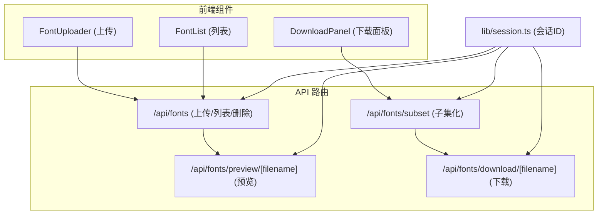
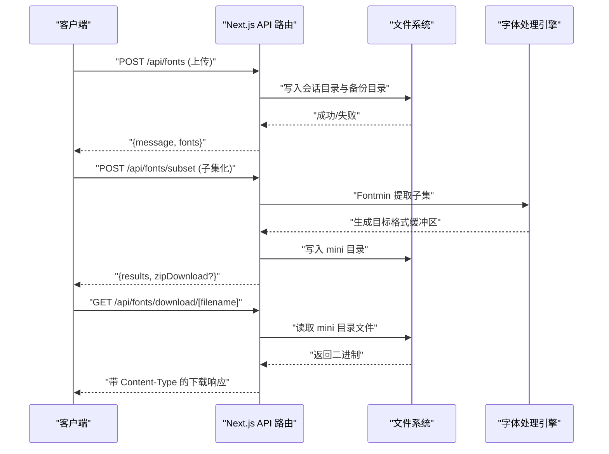
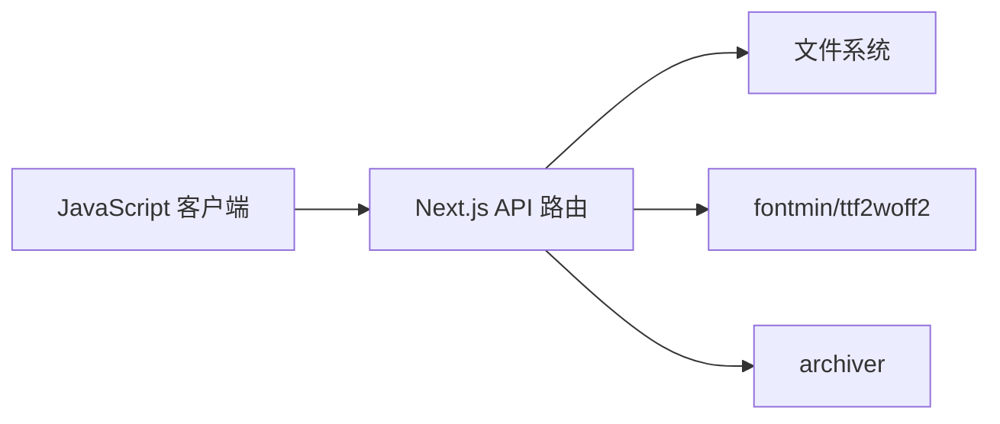

# 集成示例

<cite>
**本文引用的文件**   
- [README.md](file://README.md)
- [app/api/fonts/route.ts](file://app/api/fonts/route.ts)
- [app/api/fonts/subset/route.ts](file://app/api/fonts/subset/route.ts)
- [app/api/fonts/download/[filename]/route.ts](file://app/api/fonts/download/[filename]/route.ts)
- [app/api/fonts/preview/[filename]/route.ts](file://app/api/fonts/preview/[filename]/route.ts)
- [lib/session.ts](file://lib/session.ts)
- [components/font-uploader.tsx](file://components/font-uploader.tsx)
- [components/font-list.tsx](file://components/font-list.tsx)
- [components/download-panel.tsx](file://components/download-panel.tsx)
- [test-api.js](file://test-api.js)
- [package.json](file://package.json)
</cite>

## 目录
1. [简介](#简介)
2. [项目结构](#项目结构)
3. [核心组件](#核心组件)
4. [架构总览](#架构总览)
5. [详细组件分析](#详细组件分析)
6. [依赖关系分析](#依赖关系分析)
7. [性能考虑](#性能考虑)
8. [故障排除指南](#故障排除指南)
9. [结论](#结论)
10. [附录](#附录)

## 简介
本文件面向第三方系统集成者，提供 FontMin 字体子集化工具的集成示例与最佳实践。内容涵盖：
- RESTful API 的调用方式、参数与响应处理
- 自动化处理（批量脚本、CI/CD 集成）
- Webhook 与事件通知的配置思路
- 多语言 SDK 使用示例（JavaScript、Python、Java）
- 性能优化与安全集成要点
- 故障排除与调试指南

## 项目结构
该仓库采用 Next.js App Router 结构，API 路由位于 app/api/fonts 下，分别处理上传、子集化、预览与下载；前端组件负责上传、列表与下载面板展示。

图表来源
- [app/api/fonts/route.ts](file://app/api/fonts/route.ts#L36-L127)
- [app/api/fonts/subset/route.ts](file://app/api/fonts/subset/route.ts#L164-L365)
- [app/api/fonts/preview/[filename]/route.ts](file://app/api/fonts/preview/[filename]/route.ts#L7-L60)
- [app/api/fonts/download/[filename]/route.ts](file://app/api/fonts/download/[filename]/route.ts#L7-L61)
- [lib/session.ts](file://lib/session.ts#L1-L34)

章节来源
- [README.md](file://README.md#L135-L160)
- [package.json](file://package.json#L1-L78)

## 核心组件
- 会话管理：通过 x-font-session-id 请求头或 sessionId 查询参数维持用户隔离的临时目录。
- 上传与备份：上传接口接收多文件表单，同时写入用户会话目录与永久备份目录。
- 子集化处理：基于 Fontmin 的 TTF 子集提取，支持输出多种格式；WOFF2 通过 TTF 转换生成。
- 预览与下载：按需返回字体二进制流，设置合适的 Content-Type 与下载响应头。

章节来源
- [lib/session.ts](file://lib/session.ts#L1-L34)
- [app/api/fonts/route.ts](file://app/api/fonts/route.ts#L36-L127)
- [app/api/fonts/subset/route.ts](file://app/api/fonts/subset/route.ts#L31-L162)
- [app/api/fonts/preview/[filename]/route.ts](file://app/api/fonts/preview/[filename]/route.ts#L7-L60)
- [app/api/fonts/download/[filename]/route.ts](file://app/api/fonts/download/[filename]/route.ts#L7-L61)

## 架构总览
下图展示了从客户端到服务端的典型调用链路：会话初始化 → 上传字体 → 子集化 → 下载产物。

图表来源
- [app/api/fonts/route.ts](file://app/api/fonts/route.ts#L71-L127)
- [app/api/fonts/subset/route.ts](file://app/api/fonts/subset/route.ts#L164-L365)
- [app/api/fonts/download/[filename]/route.ts](file://app/api/fonts/download/[filename]/route.ts#L7-L61)

## 详细组件分析

### 1) 会话与身份标识
- 会话 ID 来源：客户端每次刷新页面生成新的随机 ID；可通过 x-font-session-id 请求头传递。
- 会话隔离：每个会话对应独立的临时目录，避免跨用户数据泄露。
- 建议：在 CI/CD 中为每次任务生成独立 sessionId，避免并发污染。

章节来源
- [lib/session.ts](file://lib/session.ts#L1-L34)
- [README.md](file://README.md#L191-L221)

### 2) 上传接口（/api/fonts）
- 方法：GET/POST/DELETE
- 功能：
  - GET：列出当前会话下的字体文件
  - POST：多文件上传，写入会话目录与备份目录
  - DELETE：删除会话目录中的文件（不删除备份）

章节来源
- [app/api/fonts/route.ts](file://app/api/fonts/route.ts#L36-L127)

### 3) 子集化接口（/api/fonts/subset）
- 方法：POST
- 请求体字段：
  - fontNames: string[]（必填，当前会话中的字体名）
  - text: string（必填，用于提取的字符集合）
  - outputFormats: string[]（可选，默认 ["ttf"]，支持 ["ttf","woff","woff2","eot","svg"]）
  - downloadAll: boolean（可选，默认 false，是否打包下载）
- 成功响应：
  - results: 每个输出文件的元信息（含原始大小、压缩后大小、下载链接）
  - textLength: 去重后的字符数
  - zipDownload?: 当 downloadAll=true 且存在多个文件时返回打包下载链接
  - warnings/skippedFonts: 失败或被跳过的提示
- 错误响应：根据具体错误返回 4xx/5xx

章节来源
- [app/api/fonts/subset/route.ts](file://app/api/fonts/subset/route.ts#L164-L365)

### 4) 预览接口（/api/fonts/preview/[filename]）
- 方法：GET
- 功能：返回指定字体文件的二进制流，设置合适的 Content-Type
- 注意：为预览场景设置无缓存头

章节来源
- [app/api/fonts/preview/[filename]/route.ts](file://app/api/fonts/preview/[filename]/route.ts#L7-L60)

### 5) 下载接口（/api/fonts/download/[filename]）
- 方法：GET
- 功能：返回 mini 目录中的子集化产物，设置 Content-Disposition 为附件下载
- 注意：支持 .zip 打包下载

章节来源
- [app/api/fonts/download/[filename]/route.ts](file://app/api/fonts/download/[filename]/route.ts#L7-L61)

### 6) 前端组件与工作流
- FontUploader：拖拽/选择文件，过滤支持格式，触发上传
- FontList：勾选字体、删除确认
- DownloadPanel：选择格式、触发子集化、展示结果与下载

章节来源
- [components/font-uploader.tsx](file://components/font-uploader.tsx#L17-L70)
- [components/font-list.tsx](file://components/font-list.tsx#L34-L67)
- [components/download-panel.tsx](file://components/download-panel.tsx#L44-L89)

## 依赖关系分析
- 服务端依赖：
  - fontmin：字体子集化引擎（TTF 输入）
  - ttf2woff2：TTF 转 WOFF2
  - archiver：ZIP 打包
- 前端依赖：Next.js、React、Radix UI、Tailwind CSS 等
- 会话隔离：基于文件系统目录与请求头/查询参数

图表来源
- [package.json](file://package.json#L41-L65)
- [app/api/fonts/subset/route.ts](file://app/api/fonts/subset/route.ts#L5-L7)

章节来源
- [package.json](file://package.json#L1-L78)

## 性能考虑
- 并发与会话隔离
  - 为每个任务分配独立 sessionId，避免共享临时目录导致的锁争用
- 批量处理
  - 使用 downloadAll=true 返回 ZIP，减少多次下载往返
- 输出格式选择
  - WOFF2 压缩率最优，但需额外转换；若对兼容性要求高可优先 WOFF
- I/O 优化
  - 将临时目录与备份目录置于高性能磁盘
  - 定期清理 font-temp 超期目录，避免磁盘膨胀
- 前端体验
  - 子集化过程中禁用交互，及时反馈进度与错误

[本节为通用建议，无需特定文件引用]

## 故障排除指南
- 常见错误与排查
  - 404 会话未找到：检查请求头 x-font-session-id 或查询参数 sessionId 是否正确传递
  - 404 未找到字体：确认字体已在当前会话中上传
  - 400 文本为空：确保 text 参数非空且包含有效字符
  - 400 仅支持 TTF：确认上传的是 TTF 格式文件
  - 500 处理失败：查看服务端日志中的堆栈信息
- 日志定位
  - 子集化接口内部记录输入参数、中间状态与错误堆栈，便于定位问题
- 建议流程
  1) 生成 sessionId 并贯穿整个流程
  2) 先上传再子集化，最后下载
  3) 对批量场景使用 ZIP 下载
  4) 如遇异常，先检查会话目录是否存在与权限是否正确

章节来源
- [app/api/fonts/subset/route.ts](file://app/api/fonts/subset/route.ts#L164-L365)
- [app/api/fonts/route.ts](file://app/api/fonts/route.ts#L71-L127)

## 结论
通过统一的会话机制与清晰的 RESTful API，FontMin 能够稳定地支撑第三方系统的集成需求。建议在生产环境中结合会话隔离、批量下载与格式优化策略，配合完善的日志与告警体系，确保高可用与高性能。

[本节为总结性内容，无需特定文件引用]

## 附录

### A. RESTful API 使用指南

- 会话初始化
  - 客户端在每次请求前生成 sessionId（可参考 lib/session.ts 的生成逻辑）
  - 将 sessionId 通过请求头 x-font-session-id 或查询参数 sessionId 传给后端

- 上传字体
  - 方法：POST /api/fonts
  - 内容类型：multipart/form-data
  - 字段：fonts[]（多文件）
  - 响应：包含上传成功的文件列表

- 列出字体
  - 方法：GET /api/fonts
  - 响应：当前会话中的字体列表（含预览链接）

- 删除字体
  - 方法：DELETE /api/fonts?name=xxx
  - 影响：仅删除会话目录中的文件，备份目录保留

- 子集化
  - 方法：POST /api/fonts/subset
  - 请求体字段：
    - fontNames: string[]（必填）
    - text: string（必填）
    - outputFormats: string[]（可选）
    - downloadAll: boolean（可选）
  - 响应：results 数组与可选 zipDownload

- 预览字体
  - 方法：GET /api/fonts/preview/[filename]?sessionId=...
  - 响应：字体二进制流，Content-Type 依据扩展名

- 下载产物
  - 方法：GET /api/fonts/download/[filename]?sessionId=...
  - 响应：字体或 ZIP 二进制流，Content-Disposition 为附件下载

章节来源
- [app/api/fonts/route.ts](file://app/api/fonts/route.ts#L36-L127)
- [app/api/fonts/subset/route.ts](file://app/api/fonts/subset/route.ts#L164-L365)
- [app/api/fonts/preview/[filename]/route.ts](file://app/api/fonts/preview/[filename]/route.ts#L7-L60)
- [app/api/fonts/download/[filename]/route.ts](file://app/api/fonts/download/[filename]/route.ts#L7-L61)

### B. 自动化处理与 CI/CD 集成

- 批量处理脚本思路
  - 生成 sessionId
  - 上传一批字体文件
  - 调用子集化接口，指定 outputFormats 与 downloadAll
  - 解析响应中的 results 或 zipDownload，下载产物
  - 清理临时目录（可选）

- CI/CD 集成建议
  - 为每个流水线作业生成独立 sessionId，避免并发冲突
  - 将 ZIP 下载作为制品归档
  - 失败时记录服务端返回的 details 字段以便回溯

- 示例参考
  - 可参考 test-api.js 的调用方式组织批量脚本

章节来源
- [test-api.js](file://test-api.js#L1-L36)
- [app/api/fonts/subset/route.ts](file://app/api/fonts/subset/route.ts#L164-L365)

### C. Webhook 与事件通知
- 当前仓库未内置 Webhook 机制。建议：
  - 在业务层增加事件发布（如消息队列或 HTTP 回调）
  - 在子集化完成后推送结果摘要（如文件名、压缩比、耗时）
  - 为回调提供幂等性校验与重试机制

[本节为概念性建议，无需特定文件引用]

### D. 多语言 SDK 使用示例

- JavaScript（fetch）
  - 参考 test-api.js 的 POST 调用方式
  - 上传使用 FormData，子集化使用 JSON 请求体
  - 下载使用 GET 并解析二进制响应

- Python
  - 使用 requests 库：
    - 上传：multipart/form-data，files=['fonts'] 多值
    - 子集化：JSON 请求体，headers 包含 Content-Type
    - 下载：stream=True 获取二进制并写入文件

- Java
  - 使用 HttpClient 发送 multipart 请求上传
  - 使用 JSON 构造请求体调用子集化接口
  - 使用 InputStream 读取下载响应并写入本地文件

[本节为通用示例说明，无需特定文件引用]

### E. 安全集成要点
- 认证与授权
  - 在网关或反向代理层统一鉴权，后端仅依赖 sessionId
- 会话隔离
  - 强制使用 sessionId，避免跨用户访问
- 数据传输加密
  - 始终使用 HTTPS，防止明文传输
- 输入校验
  - 对文件名与路径进行白名单过滤，避免路径穿越
- 最小权限
  - 服务端文件系统仅授予必要目录读写权限

章节来源
- [lib/session.ts](file://lib/session.ts#L1-L34)
- [app/api/fonts/route.ts](file://app/api/fonts/route.ts#L96-L104)

### F. 前端组件与集成映射
- 上传：使用 FontUploader 触发 /api/fonts POST
- 列表：使用 FontList 展示 /api/fonts GET 结果
- 子集化：使用 DownloadPanel 触发 /api/fonts/subset POST
- 下载：使用 DownloadPanel 或直接访问 /api/fonts/download/[filename]

章节来源
- [components/font-uploader.tsx](file://components/font-uploader.tsx#L17-L70)
- [components/font-list.tsx](file://components/font-list.tsx#L34-L67)
- [components/download-panel.tsx](file://components/download-panel.tsx#L44-L89)