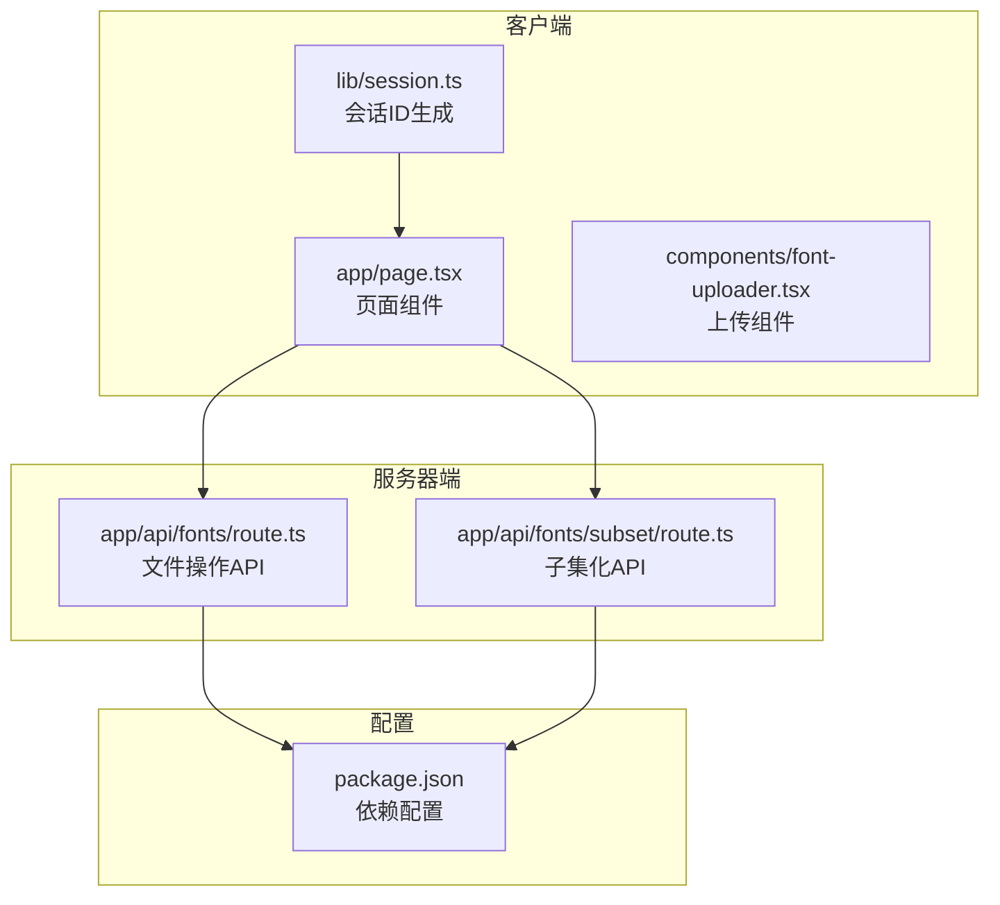
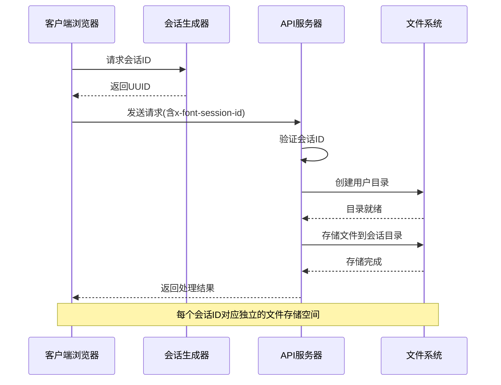
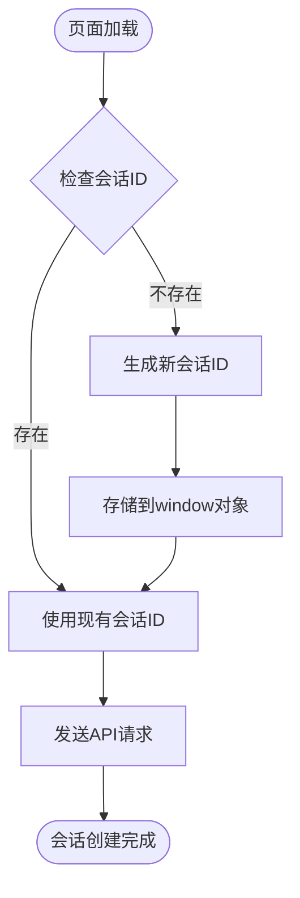
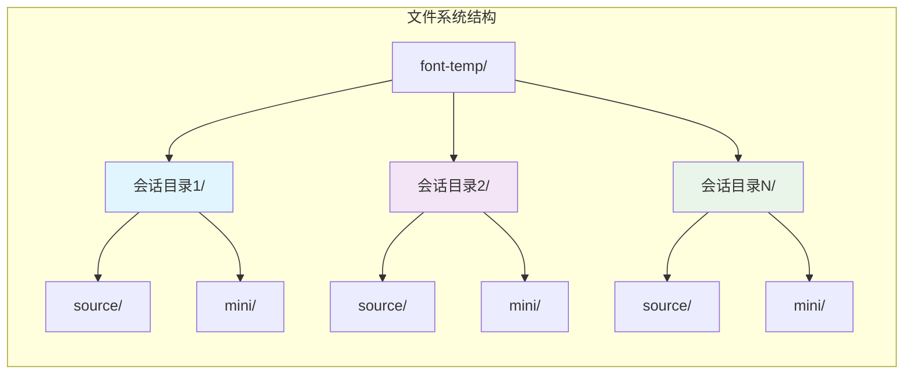
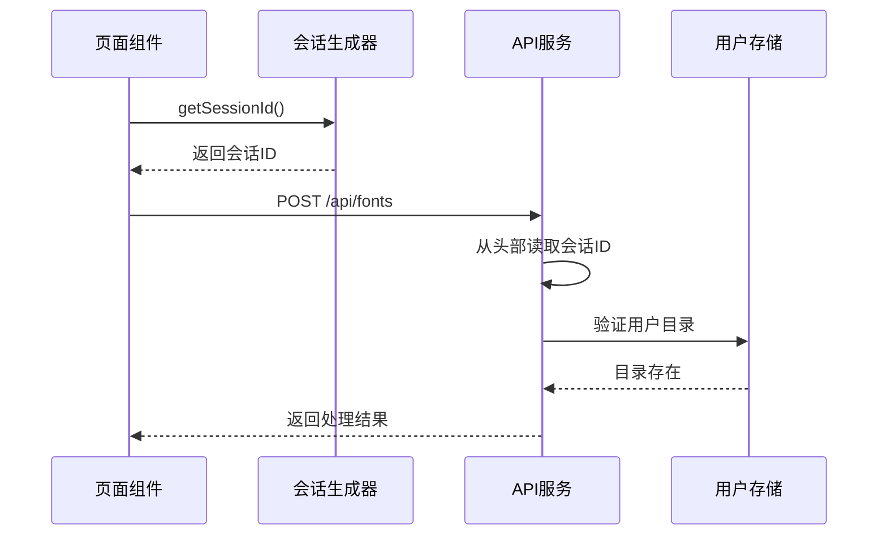
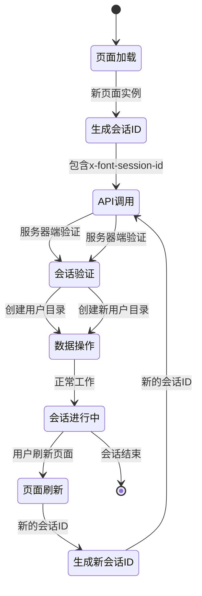
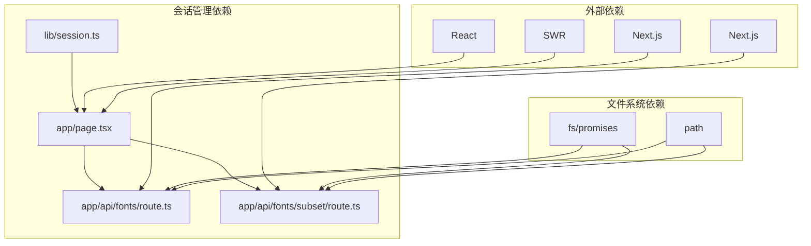

# 会话管理机制

<cite>
**本文档引用的文件**
- [lib/session.ts](file://lib/session.ts)
- [app/page.tsx](file://app/page.tsx)
- [app/api/fonts/route.ts](file://app/api/fonts/route.ts)
- [app/api/fonts/subset/route.ts](file://app/api/fonts/subset/route.ts)
- [components/font-uploader.tsx](file://components/font-uploader.tsx)
- [package.json](file://package.json)
</cite>

## 目录
1. [简介](#简介)
2. [项目结构](#项目结构)
3. [核心组件](#核心组件)
4. [架构概览](#架构概览)
5. [详细组件分析](#详细组件分析)
6. [依赖关系分析](#依赖关系分析)
7. [性能考虑](#性能考虑)
8. [故障排除指南](#故障排除指南)
9. [结论](#结论)

## 简介

FontMin字体子集化工具采用基于会话ID的用户数据隔离机制，通过x-font-session-id请求头实现客户端与服务器端的会话关联。该系统确保每个用户的字体文件和处理结果相互独立，防止跨用户数据泄露。

## 项目结构

项目采用Next.js框架的目录结构，会话管理相关的代码分布在以下位置：

**图表来源**
- [lib/session.ts](file://lib/session.ts#L1-L34)
- [app/page.tsx](file://app/page.tsx#L1-L279)
- [app/api/fonts/route.ts](file://app/api/fonts/route.ts#L1-L167)

**章节来源**
- [lib/session.ts](file://lib/session.ts#L1-L34)
- [app/page.tsx](file://app/page.tsx#L1-L279)
- [app/api/fonts/route.ts](file://app/api/fonts/route.ts#L1-L167)

## 核心组件

### 会话ID生成器

会话ID生成器位于`lib/session.ts`，负责在客户端生成唯一的会话标识符：

- **生成策略**：使用浏览器crypto.randomUUID()或RFC4122版本4的回退实现
- **存储机制**：存储在window对象的全局变量中，确保页面刷新时保持一致
- **作用域限制**：每个页面加载生成新的会话ID，实现"硬刷新清除"的效果

### API路由层

服务器端API路由通过x-font-session-id请求头获取会话信息，并基于会话ID创建用户专属的工作目录：

- **会话目录结构**：`font-temp/{sessionId}/`
- **用户隔离**：每个会话ID对应独立的文件存储空间
- **临时性设计**：会话目录仅用于当前会话期间的数据存储

**章节来源**
- [lib/session.ts](file://lib/session.ts#L1-L34)
- [app/api/fonts/route.ts](file://app/api/fonts/route.ts#L16-L34)

## 架构概览

系统采用客户端-服务器端分离的会话管理模式：

**图表来源**
- [lib/session.ts](file://lib/session.ts#L1-L34)
- [app/api/fonts/route.ts](file://app/api/fonts/route.ts#L16-L34)

## 详细组件分析

### 会话生命周期管理

#### 会话创建流程

**图表来源**
- [lib/session.ts](file://lib/session.ts#L11-L26)
- [app/page.tsx](file://app/page.tsx#L14-L19)

#### 会话维护策略

- **前端维护**：会话ID存储在window对象中，页面刷新时重新生成
- **后端维护**：基于会话ID动态创建和验证用户目录
- **数据隔离**：所有用户相关操作都在对应的会话目录中执行

#### 会话销毁机制

- **自动清理**：会话ID随页面刷新而失效
- **手动清理**：用户离开页面或关闭浏览器后，会话数据不再可用
- **临时存储**：会话数据仅存储在内存中，不进行持久化

### 会话隔离机制

系统通过多层隔离确保用户数据的安全性和独立性：

#### 目录隔离

**图表来源**
- [app/api/fonts/route.ts](file://app/api/fonts/route.ts#L23-L34)
- [app/api/fonts/subset/route.ts](file://app/api/fonts/subset/route.ts#L11-L23)

#### 数据流隔离

- **上传隔离**：每个会话的上传文件存储在独立目录
- **处理隔离**：子集化处理结果仅对当前会话可见
- **下载隔离**：生成的文件只能通过当前会话的下载链接访问

### API请求头传递机制

#### x-font-session-id头部使用

系统在所有API请求中强制包含x-font-session-id头部：

**图表来源**
- [app/page.tsx](file://app/page.tsx#L14-L19)
- [app/page.tsx](file://app/page.tsx#L39-L45)
- [app/page.tsx](file://app/page.tsx#L70-L77)

#### 请求头处理流程

| API端点 | 请求方法 | 会话ID来源 | 功能 |
|---------|----------|------------|------|
| /api/fonts | GET | 请求头 | 列出用户上传的字体 |
| /api/fonts | POST | 请求头 | 上传新字体文件 |
| /api/fonts | DELETE | 请求头 | 删除指定字体文件 |
| /api/fonts/subset | POST | 请求头 | 执行字体子集化处理 |

**章节来源**
- [app/page.tsx](file://app/page.tsx#L14-L19)
- [app/page.tsx](file://app/page.tsx#L39-L45)
- [app/page.tsx](file://app/page.tsx#L70-L77)
- [app/page.tsx](file://app/page.tsx#L115-L127)

### 会话持久化策略

#### 浏览器本地存储

- **存储位置**：window对象的全局变量
- **存储类型**：内存存储，不使用localStorage或sessionStorage
- **生命周期**：页面刷新时自动清除，确保会话隔离

#### 服务器端会话存储

- **存储位置**：文件系统中的临时目录
- **存储类型**：基于会话ID的目录结构
- **生命周期**：会话结束时自动清理（通过文件系统清理）

### 硬刷新会话恢复机制

系统实现了智能的会话恢复机制：

**图表来源**
- [lib/session.ts](file://lib/session.ts#L11-L26)
- [app/api/fonts/route.ts](file://app/api/fonts/route.ts#L16-L20)

### 并发访问控制

系统通过以下机制处理并发访问：

- **会话隔离**：每个会话ID对应独立的文件操作空间
- **原子操作**：文件系统操作在单个会话上下文中执行
- **竞态条件避免**：通过会话ID确保不同用户不会互相影响

### 安全防护措施

#### 跨用户数据保护

- **目录权限**：每个会话目录仅限当前会话访问
- **路径遍历防护**：严格验证文件名和路径
- **数据隔离**：上传的字体文件和处理结果完全隔离

#### 输入验证

- **文件格式验证**：只接受支持的字体格式
- **会话ID验证**：确保请求包含有效的会话ID
- **参数验证**：对API请求参数进行完整性检查

**章节来源**
- [app/api/fonts/route.ts](file://app/api/fonts/route.ts#L96-L104)
- [app/api/fonts/route.ts](file://app/api/fonts/route.ts#L132-L154)

## 依赖关系分析

### 核心依赖

**图表来源**
- [lib/session.ts](file://lib/session.ts#L1-L34)
- [app/page.tsx](file://app/page.tsx#L1-L279)
- [app/api/fonts/route.ts](file://app/api/fonts/route.ts#L1-L167)
- [app/api/fonts/subset/route.ts](file://app/api/fonts/subset/route.ts#L1-L366)

### 组件耦合度分析

- **低耦合**：会话生成器与业务逻辑分离
- **高内聚**：API路由专注于会话管理和文件操作
- **清晰边界**：客户端和服务器端职责明确划分

**章节来源**
- [package.json](file://package.json#L11-L78)

## 性能考虑

### 内存使用优化

- **会话ID缓存**：在window对象中缓存会话ID，避免重复生成
- **按需加载**：只在需要时才创建用户目录和执行文件操作
- **及时清理**：页面卸载时自动清理会话相关资源

### 文件系统性能

- **目录结构**：扁平化的目录结构减少文件系统层级
- **异步操作**：使用Promise和async/await避免阻塞
- **错误处理**：完善的错误处理机制确保操作可靠性

## 故障排除指南

### 常见问题及解决方案

#### 会话ID丢失问题

**症状**：API调用返回会话未找到错误
**原因**：请求中缺少x-font-session-id头部
**解决方案**：
1. 检查客户端是否正确调用getSessionId()
2. 确认fetch请求是否包含正确的请求头
3. 验证页面是否正常加载会话脚本

#### 文件操作失败

**症状**：上传或删除文件时出现错误
**原因**：会话目录不存在或权限不足
**解决方案**：
1. 检查font-temp目录是否存在且可写
2. 验证会话ID格式是否正确
3. 确认用户目录创建权限

#### 跨域问题

**症状**：API请求被浏览器阻止
**原因**：CORS配置缺失
**解决方案**：
1. 配置Next.js的CORS中间件
2. 设置适当的响应头
3. 验证请求域名和端口

### 调试技巧

#### 日志分析

系统在关键操作处添加了详细的日志输出：

- **会话创建**：记录会话ID生成和验证过程
- **文件操作**：记录文件上传、下载和删除操作
- **错误处理**：记录详细的错误信息和堆栈跟踪

#### 性能监控

建议添加以下监控指标：
- 会话创建成功率
- 文件操作响应时间
- 错误率统计
- 用户活跃度分析

**章节来源**
- [app/api/fonts/route.ts](file://app/api/fonts/route.ts#L38-L68)
- [app/api/fonts/subset/route.ts](file://app/api/fonts/subset/route.ts#L164-L365)

## 结论

FontMin字体子集化工具的会话管理机制通过简洁而有效的设计实现了用户数据的完全隔离。基于x-font-session-id的请求头机制确保了客户端与服务器端的无缝协作，而基于会话ID的目录结构则提供了强大的数据隔离能力。

该系统的主要优势包括：

1. **简单可靠**：基于UUID的会话ID生成机制简单易懂
2. **安全隔离**：多层隔离确保用户数据完全独立
3. **易于维护**：清晰的代码结构和职责分离便于维护
4. **性能友好**：内存存储和异步操作保证了良好的性能表现

通过遵循本文档的最佳实践和故障排除指南，可以确保系统的稳定运行和良好的用户体验。