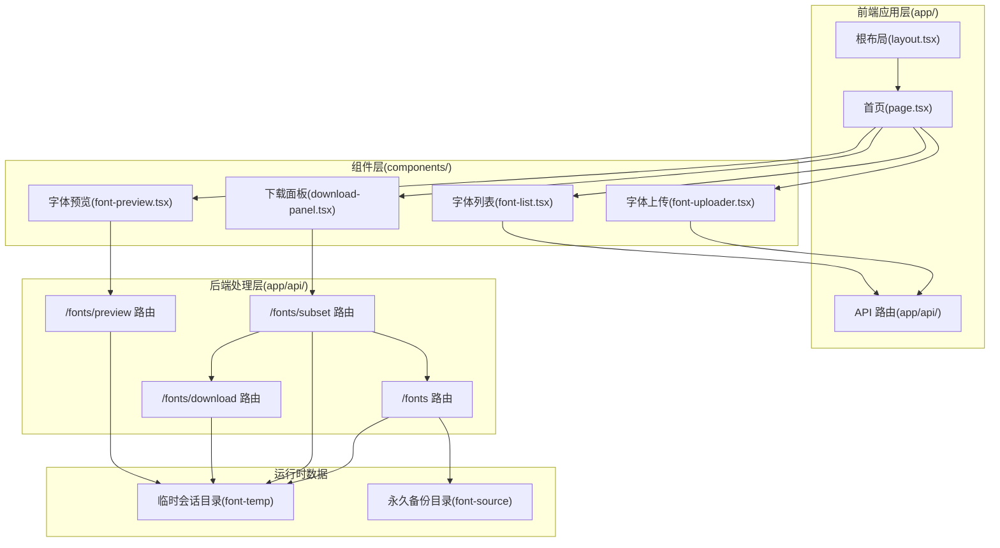
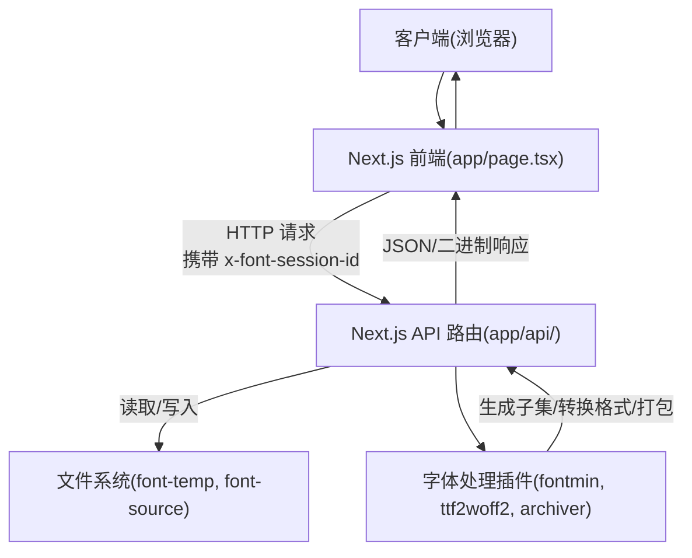
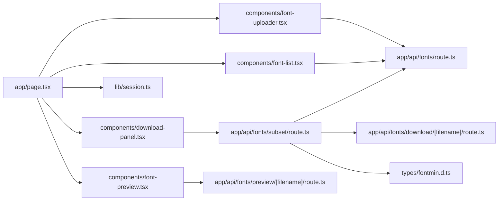

# 整体架构

<cite>
**本文引用的文件**
- [README.md](file://README.md)
- [package.json](file://package.json)
- [next.config.mjs](file://next.config.mjs)
- [tsconfig.json](file://tsconfig.json)
- [app/layout.tsx](file://app/layout.tsx)
- [app/page.tsx](file://app/page.tsx)
- [app/api/fonts/route.ts](file://app/api/fonts/route.ts)
- [app/api/fonts/subset/route.ts](file://app/api/fonts/subset/route.ts)
- [app/api/fonts/download/[filename]/route.ts](file://app/api/fonts/download/[filename]/route.ts)
- [app/api/fonts/preview/[filename]/route.ts](file://app/api/fonts/preview/[filename]/route.ts)
- [components/font-uploader.tsx](file://components/font-uploader.tsx)
- [components/font-list.tsx](file://components/font-list.tsx)
- [components/font-preview.tsx](file://components/font-preview.tsx)
- [components/download-panel.tsx](file://components/download-panel.tsx)
- [lib/session.ts](file://lib/session.ts)
- [types/fontmin.d.ts](file://types/fontmin.d.ts)
- [components/theme-provider.tsx](file://components/theme-provider.tsx)
</cite>

## 目录
1. [引言](#引言)
2. [项目结构](#项目结构)
3. [核心组件](#核心组件)
4. [架构总览](#架构总览)
5. [详细组件分析](#详细组件分析)
6. [依赖分析](#依赖分析)
7. [性能考虑](#性能考虑)
8. [故障排查指南](#故障排查指南)
9. [结论](#结论)
10. [附录](#附录)

## 引言
本项目是一个基于 Next.js 16 的字体子集化工具，目标是帮助用户从原始字体中提取指定文字，生成更小体积的字体包，并支持多种输出格式（TTF、WOFF、WOFF2、EOT、SVG）。系统采用前后端分离的架构：前端使用 Next.js App Router 构建用户界面与交互；后端通过 API 路由层处理文件上传、子集化处理与下载。系统强调隐私隔离（基于会话的文件隔离）、实时预览、批量处理与压缩统计。

## 项目结构
项目采用 Next.js App Router 的标准目录组织方式，核心分为三层：
- 前端应用层（app/）：页面、布局、全局样式与 API 路由
- 组件层（components/）：可复用 UI 组件与业务组件
- 后端处理层（app/api/...）：文件上传、子集化处理、下载与预览

图表来源
- [app/layout.tsx](file://app/layout.tsx#L1-L44)
- [app/page.tsx](file://app/page.tsx#L1-L279)
- [app/api/fonts/route.ts](file://app/api/fonts/route.ts#L1-L167)
- [app/api/fonts/subset/route.ts](file://app/api/fonts/subset/route.ts#L1-L366)
- [app/api/fonts/download/[filename]/route.ts](file://app/api/fonts/download/[filename]/route.ts#L1-L62)
- [app/api/fonts/preview/[filename]/route.ts](file://app/api/fonts/preview/[filename]/route.ts#L1-L61)

章节来源
- [README.md](file://README.md#L135-L160)
- [package.json](file://package.json#L1-L78)

## 核心组件
- 页面与布局：根布局负责站点元数据与全局样式；首页承载上传、列表、预览与下载设置四大功能区域。
- 业务组件：
  - 字体上传：支持拖拽与文件选择，过滤不支持格式，展示已选文件并触发上传。
  - 字体列表：展示当前会话字体、全选/反选、逐项删除与删除确认对话框。
  - 字体预览：动态加载字体、实时预览输入文字、滑杆调节字号。
  - 下载面板：选择输出格式、生成子集化字体包、单个/打包下载、压缩统计。
- 会话与状态：前端通过自定义会话 ID 与后端 API 交互；使用 SWR 进行数据获取与缓存更新。

章节来源
- [app/layout.tsx](file://app/layout.tsx#L1-L44)
- [app/page.tsx](file://app/page.tsx#L1-L279)
- [components/font-uploader.tsx](file://components/font-uploader.tsx#L1-L166)
- [components/font-list.tsx](file://components/font-list.tsx#L1-L159)
- [components/font-preview.tsx](file://components/font-preview.tsx#L1-L123)
- [components/download-panel.tsx](file://components/download-panel.tsx#L1-L295)
- [lib/session.ts](file://lib/session.ts#L1-L34)

## 架构总览
系统采用“前端 Next.js + 后端 API 路由”的前后端分离架构：
- 前端层：Next.js App Router 提供页面与路由；React 19 + TypeScript 提供类型安全与现代开发体验；UI 基于 Radix UI 与 Tailwind CSS。
- API 层：Next.js API 路由处理上传、子集化、下载与预览；基于会话隔离的文件系统结构实现隐私保护。
- 处理层：后端使用 fontmin、ttf2woff2、archiver 等库完成字体子集化与格式转换、打包下载。
- 数据流：前端通过 HTTP 请求携带会话头与表单数据调用 API，后端读取/写入本地文件系统，返回 JSON 或二进制响应。

图表来源
- [app/page.tsx](file://app/page.tsx#L14-L145)
- [app/api/fonts/route.ts](file://app/api/fonts/route.ts#L1-L167)
- [app/api/fonts/subset/route.ts](file://app/api/fonts/subset/route.ts#L1-L366)
- [app/api/fonts/download/[filename]/route.ts](file://app/api/fonts/download/[filename]/route.ts#L1-L62)
- [app/api/fonts/preview/[filename]/route.ts](file://app/api/fonts/preview/[filename]/route.ts#L1-L61)

## 详细组件分析

### 前端页面与布局
- 根布局负责站点标题、图标与全局样式注入。
- 首页整合上传、列表、预览与下载设置，使用 SWR 获取会话字体列表，统一通过 fetcher 携带会话头。

章节来源
- [app/layout.tsx](file://app/layout.tsx#L1-L44)
- [app/page.tsx](file://app/page.tsx#L1-L279)

### 字体上传组件
- 支持拖拽与文件选择，过滤不支持格式，展示文件名与大小，触发上传回调。
- 上传流程：构造 FormData，附带会话头，POST 到 /api/fonts，成功后触发 SWR 缓存更新并自动选中新上传字体。

章节来源
- [components/font-uploader.tsx](file://components/font-uploader.tsx#L1-L166)
- [app/page.tsx](file://app/page.tsx#L33-L65)

### 字体列表组件
- 展示当前会话字体，支持全选/反选与逐项删除；删除前弹出确认对话框。
- 删除流程：DELETE /api/fonts?name=...，成功后触发 SWR 缓存更新并清除选中状态。

章节来源
- [components/font-list.tsx](file://components/font-list.tsx#L1-L159)
- [app/page.tsx](file://app/page.tsx#L67-L92)

### 字体预览组件
- 动态加载字体：为每个字体生成唯一的 FontFace 名称，通过 /api/fonts/preview/[filename]?sessionId=... 加载字体。
- 实时预览：根据输入文字与字号渲染多行预览卡片。

章节来源
- [components/font-preview.tsx](file://components/font-preview.tsx#L1-L123)
- [app/api/fonts/preview/[filename]/route.ts](file://app/api/fonts/preview/[filename]/route.ts#L1-L61)

### 下载面板组件
- 选择输出格式（TTF/WOFF/WOFF2/EOT/SVG），输入文字后生成子集化字体包。
- 单个/打包下载：POST /api/fonts/subset，成功后展示压缩统计与下载链接；支持批量顺序下载。

章节来源
- [components/download-panel.tsx](file://components/download-panel.tsx#L1-L295)
- [app/page.tsx](file://app/page.tsx#L113-L145)
- [app/api/fonts/subset/route.ts](file://app/api/fonts/subset/route.ts#L164-L366)

### API 路由层

#### /api/fonts 路由
- GET：列出当前会话字体，过滤支持的字体扩展名，返回字体数组。
- POST：接收多文件上传，保存至会话目录与永久备份目录。
- DELETE：删除会话目录中的字体（保留备份）。

章节来源
- [app/api/fonts/route.ts](file://app/api/fonts/route.ts#L1-L167)

#### /api/fonts/subset 路由
- POST：对选中字体按输入文字进行子集化，支持多格式输出；WOFF2 通过 TTF 转换；可打包下载。
- 流程要点：校验会话、校验输入、加载 TTF、调用 fontmin 提取字形、格式转换、写入 mini 目录、生成下载链接。

章节来源
- [app/api/fonts/subset/route.ts](file://app/api/fonts/subset/route.ts#L1-L366)

#### /api/fonts/download/[filename] 路由
- GET：根据 sessionId 与文件名返回二进制内容，设置合适的 Content-Type 与下载头。

章节来源
- [app/api/fonts/download/[filename]/route.ts](file://app/api/fonts/download/[filename]/route.ts#L1-L62)

#### /api/fonts/preview/[filename] 路由
- GET：返回字体二进制内容，设置缓存控制与跨域头，供前端动态加载。

章节来源
- [app/api/fonts/preview/[filename]/route.ts](file://app/api/fonts/preview/[filename]/route.ts#L1-L61)

### 会话与隐私隔离
- 会话 ID：前端通过自定义逻辑生成并持久化，请求头携带 x-font-session-id。
- 隔离机制：每个会话对应独立的临时目录，不同用户/浏览器标签页数据隔离；删除仅影响会话目录，备份目录保留。

章节来源
- [lib/session.ts](file://lib/session.ts#L1-L34)
- [README.md](file://README.md#L191-L221)

### 技术栈与集成方式
- 前端框架：Next.js 16、React 19、TypeScript；UI 基于 Radix UI 与 Tailwind CSS。
- 字体处理：fontmin（子集化）、ttf2woff2（TTF→WOFF2）、archiver（ZIP 打包）。
- 状态管理：SWR（数据获取与缓存）、React Hook Form（表单管理）。
- 构建配置：Webpack 模式启用 WASM 支持，服务端 externals 处理原生依赖。

章节来源
- [README.md](file://README.md#L113-L134)
- [package.json](file://package.json#L11-L66)
- [next.config.mjs](file://next.config.mjs#L14-L40)
- [tsconfig.json](file://tsconfig.json#L1-L42)

### 模块化设计与依赖注入
- 模块化：按功能拆分组件与 API 路由，组件通过 props 传递数据与回调，降低耦合。
- 依赖注入：会话 ID 通过请求头注入，避免在组件内部硬编码；字体路径与下载链接通过 API 返回，便于替换实现。
- 可复用策略：UI 组件（如按钮、表单控件）来自 Radix UI；主题切换通过 next-themes；通用工具函数封装在 lib/utils 中。

章节来源
- [app/page.tsx](file://app/page.tsx#L1-L279)
- [components/theme-provider.tsx](file://components/theme-provider.tsx#L1-L12)

### 系统边界与外部依赖
- 系统边界：前端仅通过 API 与后端交互；后端通过文件系统与第三方库完成处理。
- 外部依赖：fontmin、ttf2woff2、archiver；构建期依赖 Next.js、React、TypeScript 与 Tailwind CSS。
- 第三方服务：无外部在线服务依赖，所有处理在本地完成。

章节来源
- [app/api/fonts/subset/route.ts](file://app/api/fonts/subset/route.ts#L1-L366)
- [package.json](file://package.json#L11-L66)

### 架构决策的技术权衡
- 前后端分离：提升开发效率与可维护性，但需明确 API 边界与数据契约。
- 会话隔离：通过文件系统实现隐私保护，避免跨用户数据泄露；代价是磁盘占用与清理策略。
- 字体处理链路：fontmin 仅支持 TTF 输入，需在流程中做格式约束与提示；WOFF2 通过二次转换保证兼容性。
- 构建模式：Webpack 模式启用 WASM 支持，满足特定依赖需求，但启动时间可能略增。

章节来源
- [README.md](file://README.md#L162-L177)
- [app/api/fonts/subset/route.ts](file://app/api/fonts/subset/route.ts#L25-L29)

## 依赖分析
系统依赖关系主要体现在前端组件与 API 路由之间的调用关系，以及后端对第三方库的使用。

图表来源
- [app/page.tsx](file://app/page.tsx#L1-L279)
- [components/font-uploader.tsx](file://components/font-uploader.tsx#L1-L166)
- [components/font-list.tsx](file://components/font-list.tsx#L1-L159)
- [components/font-preview.tsx](file://components/font-preview.tsx#L1-L123)
- [components/download-panel.tsx](file://components/download-panel.tsx#L1-L295)
- [app/api/fonts/route.ts](file://app/api/fonts/route.ts#L1-L167)
- [app/api/fonts/subset/route.ts](file://app/api/fonts/subset/route.ts#L1-L366)
- [app/api/fonts/download/[filename]/route.ts](file://app/api/fonts/download/[filename]/route.ts#L1-L62)
- [app/api/fonts/preview/[filename]/route.ts](file://app/api/fonts/preview/[filename]/route.ts#L1-L61)
- [lib/session.ts](file://lib/session.ts#L1-L34)
- [types/fontmin.d.ts](file://types/fontmin.d.ts#L1-L53)

章节来源
- [package.json](file://package.json#L11-L66)

## 性能考虑
- 字体加载与预览：前端动态加载字体，建议限制预览字体数量与文本长度，避免过多 FontFace 并发导致阻塞。
- 子集化处理：输入文字去重减少重复计算；WOFF2 转换为同步步骤，建议在后台任务或异步队列中处理大文件。
- 文件系统 IO：上传与下载频繁读写磁盘，建议使用 SSD 与合理的清理策略（临时目录定期清理）。
- 构建与运行：Webpack 模式启用 WASM 支持，有利于某些依赖加载，但需关注启动与内存占用。

## 故障排查指南
- 上传失败：检查会话头是否正确传递；确认文件格式与大小；查看后端日志定位错误。
- 子集化失败：确认输入文字非空且去重有效；确保上传的是 TTF 格式；查看后端错误堆栈。
- 下载失败：确认 sessionId 与文件名匹配；检查 mini 目录是否存在；验证 MIME 类型设置。
- 预览空白：检查 /api/fonts/preview/[filename] 是否返回 200；确认缓存控制与跨域头设置。

章节来源
- [app/page.tsx](file://app/page.tsx#L47-L139)
- [app/api/fonts/route.ts](file://app/api/fonts/route.ts#L80-L126)
- [app/api/fonts/subset/route.ts](file://app/api/fonts/subset/route.ts#L195-L310)
- [app/api/fonts/download/[filename]/route.ts](file://app/api/fonts/download/[filename]/route.ts#L21-L61)
- [app/api/fonts/preview/[filename]/route.ts](file://app/api/fonts/preview/[filename]/route.ts#L21-L61)

## 结论
本项目通过清晰的前后端分层与模块化设计，实现了从上传、预览到子集化与下载的一体化流程。会话隔离机制保障了隐私与数据安全；基于 Next.js 16 与 React 19 的技术栈提供了良好的开发体验与性能基础。后续可在子集化异步化、缓存策略与监控告警方面进一步增强可运维性与可扩展性。

## 附录
- 部署架构与运行时要求：Node.js 18+、pnpm 8+；生产构建与启动脚本位于 package.json；Webpack 配置启用 WASM 支持。
- 数据生命周期：临时目录随会话过期清理，永久备份目录保留；建议定期清理临时目录并备份永久目录。

章节来源
- [README.md](file://README.md#L44-L79)
- [next.config.mjs](file://next.config.mjs#L14-L40)