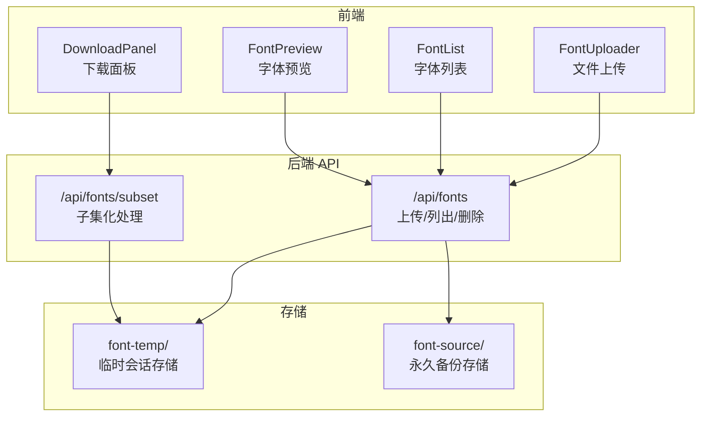
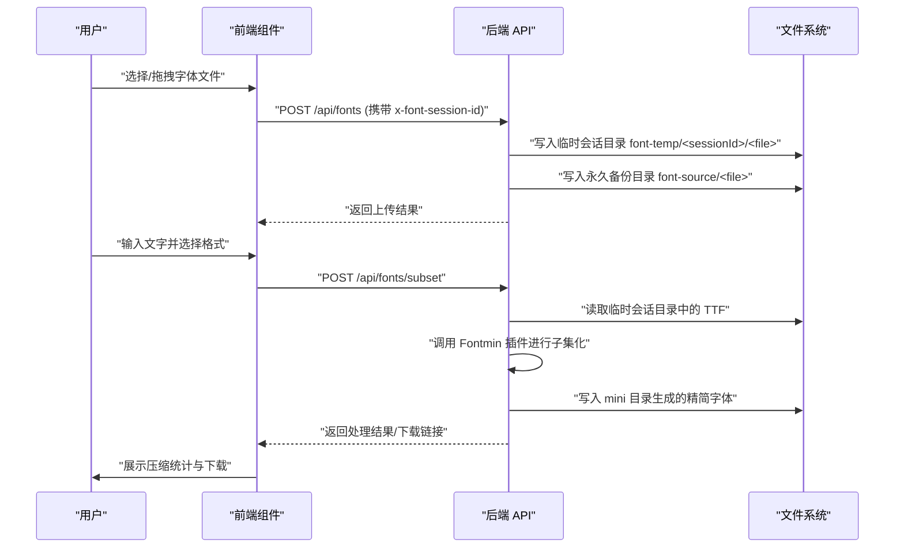
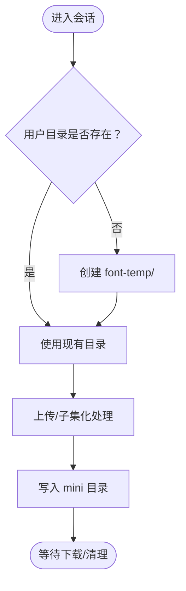
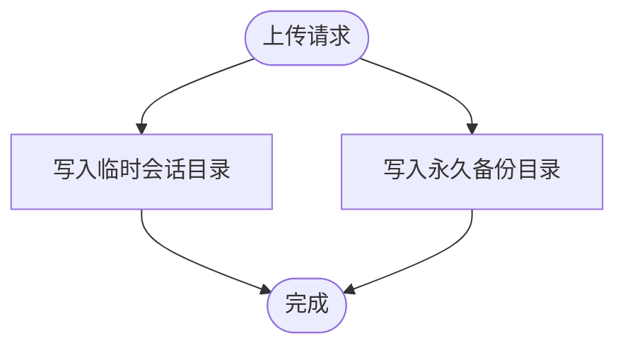
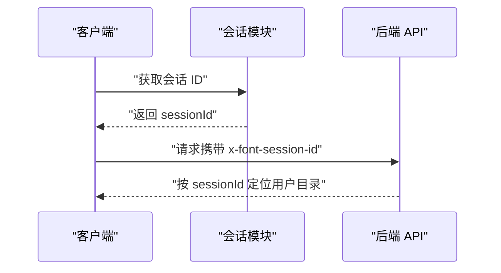
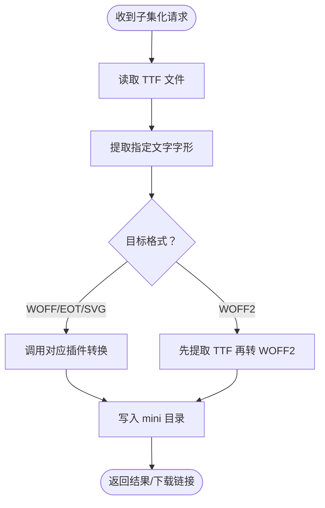
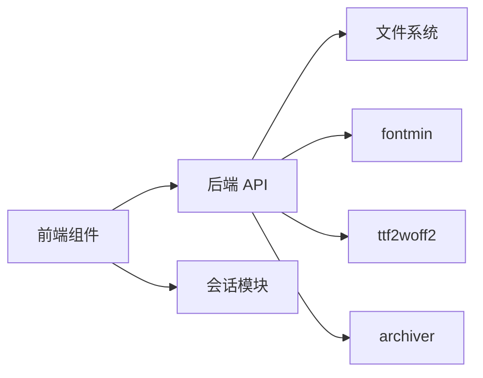

# 文件存储设计

<cite>
**本文引用的文件**
- [app/api/fonts/route.ts](file://app/api/fonts/route.ts)
- [app/api/fonts/subset/route.ts](file://app/api/fonts/subset/route.ts)
- [lib/session.ts](file://lib/session.ts)
- [components/font-uploader.tsx](file://components/font-uploader.tsx)
- [components/font-list.tsx](file://components/font-list.tsx)
- [components/font-preview.tsx](file://components/font-preview.tsx)
- [components/download-panel.tsx](file://components/download-panel.tsx)
- [types/fontmin.d.ts](file://types/fontmin.d.ts)
- [package.json](file://package.json)
- [README.md](file://README.md)
</cite>

## 目录
1. [引言](#引言)
2. [项目结构](#项目结构)
3. [核心组件](#核心组件)
4. [架构总览](#架构总览)
5. [详细组件分析](#详细组件分析)
6. [依赖关系分析](#依赖关系分析)
7. [性能考虑](#性能考虑)
8. [故障排查指南](#故障排查指南)
9. [结论](#结论)
10. [附录](#附录)

## 引言
本设计文档围绕 FontMin 字体子集化工具的文件存储体系展开，系统性阐述临时会话存储与永久备份存储的分层架构、基于会话 ID 的用户数据隔离机制、临时目录的生命周期与清理策略、永久备份目录的作用与备份策略、文件命名规则与路径组织、文件权限控制建议、上传完整性校验与重复检测思路、存储容量监控与性能优化建议，以及故障恢复方案。

## 项目结构
- 服务端 API 路由位于 app/api/fonts/，负责上传、列出、删除字体，以及触发子集化处理。
- 临时会话存储目录为 font-temp，按会话 ID 分层组织，实现用户间数据隔离。
- 永久备份存储目录为 font-source，用于长期保存所有用户上传的字体文件。
- 前端组件负责文件选择、列表展示、预览与下载面板交互，并通过 API 与后端通信。
- 类型声明文件定义了字体处理插件接口，支撑子集化流程。

图表来源
- [app/api/fonts/route.ts](file://app/api/fonts/route.ts#L1-L167)
- [app/api/fonts/subset/route.ts](file://app/api/fonts/subset/route.ts#L1-L366)

章节来源
- [README.md](file://README.md#L135-L160)
- [app/api/fonts/route.ts](file://app/api/fonts/route.ts#L1-L167)
- [app/api/fonts/subset/route.ts](file://app/api/fonts/subset/route.ts#L1-L366)

## 核心组件
- 会话 ID 生成与传递：前端通过模块级变量生成会话 ID；后端从请求头读取会话 ID，若缺失则回退至默认值。
- 临时会话目录：按会话 ID 创建用户专属目录，存放当前会话上传的字体与生成的精简字体。
- 永久备份目录：所有上传的字体均同步写入永久备份目录，确保数据安全与可恢复。
- 子集化处理：仅支持 TTF 输入，按需转换为目标格式，生成的精简字体保存在临时目录的 mini 子目录中。
- 文件命名与路径：上传文件名经清洗后直接使用；子集化产物以“原文件名_base64编码”形式命名，避免冲突。
- 删除策略：仅删除临时会话目录中的文件，永久备份目录保留。

章节来源
- [lib/session.ts](file://lib/session.ts#L1-L34)
- [app/api/fonts/route.ts](file://app/api/fonts/route.ts#L16-L34)
- [app/api/fonts/route.ts](file://app/api/fonts/route.ts#L71-L127)
- [app/api/fonts/route.ts](file://app/api/fonts/route.ts#L129-L167)
- [app/api/fonts/subset/route.ts](file://app/api/fonts/subset/route.ts#L164-L366)

## 架构总览
下图展示了从用户上传到子集化生成再到下载的整体流程，以及临时与永久存储的交互关系。

图表来源
- [app/api/fonts/route.ts](file://app/api/fonts/route.ts#L71-L127)
- [app/api/fonts/subset/route.ts](file://app/api/fonts/subset/route.ts#L164-L366)

## 详细组件分析

### 临时会话存储（font-temp）
- 目录结构
  - 根目录：font-temp
  - 用户目录：font-temp/<sessionId>
  - 生成产物：font-temp/<sessionId>/mini
- 生命周期
  - 创建：首次访问或上传时按会话 ID 自动创建用户目录
  - 清理：未内置自动清理逻辑，需通过外部脚本定期清理
- 数据隔离
  - 通过会话 ID 将不同用户的文件物理隔离，避免互相覆盖
- 生成物管理
  - 子集化产物统一写入 mini 子目录，便于后续下载与打包

图表来源
- [app/api/fonts/route.ts](file://app/api/fonts/route.ts#L23-L34)
- [app/api/fonts/subset/route.ts](file://app/api/fonts/subset/route.ts#L16-L23)

章节来源
- [app/api/fonts/route.ts](file://app/api/fonts/route.ts#L6-L34)
- [app/api/fonts/subset/route.ts](file://app/api/fonts/subset/route.ts#L16-L23)

### 永久备份存储（font-source）
- 作用
  - 保存所有用户上传的字体文件，作为长期备份与审计依据
  - 删除操作不影响备份目录，确保数据可恢复
- 写入策略
  - 上传时同步写入永久备份目录，文件名保持一致
- 备份建议
  - 建议定期对备份目录进行归档与异地备份

图表来源
- [app/api/fonts/route.ts](file://app/api/fonts/route.ts#L102-L104)

章节来源
- [app/api/fonts/route.ts](file://app/api/fonts/route.ts#L9-L14)
- [app/api/fonts/route.ts](file://app/api/fonts/route.ts#L102-L104)

### 会话 ID 与数据隔离机制
- 生成方式
  - 前端：使用随机 UUID 生成会话 ID，刷新页面后重置
  - 后端：从请求头读取会话 ID，若不存在则使用默认标识
- 隔离效果
  - 不同会话 ID 对应不同用户目录，实现跨浏览器、跨标签页的数据隔离
- 传输方式
  - 通过请求头 x-font-session-id 传递，避免在 URL 中暴露

图表来源
- [lib/session.ts](file://lib/session.ts#L1-L27)
- [app/api/fonts/route.ts](file://app/api/fonts/route.ts#L16-L20)

章节来源
- [lib/session.ts](file://lib/session.ts#L1-L34)
- [app/api/fonts/route.ts](file://app/api/fonts/route.ts#L16-L20)

### 文件命名规则与路径组织
- 上传文件名清洗
  - 保留字母、数字、点、下划线、中文字符，其余替换为下划线
- 子集化产物命名
  - 基于原文件名与格式生成，如“原名_Lite.<format>”
  - 输出路径：font-temp/<sessionId>/mini/<文件名>
- 列表与预览路径
  - 列表项包含预览路径参数，携带会话 ID 以便后端定位用户目录

章节来源
- [app/api/fonts/route.ts](file://app/api/fonts/route.ts#L96-L113)
- [app/api/fonts/subset/route.ts](file://app/api/fonts/subset/route.ts#L267-L278)

### 文件权限控制机制
- 当前实现
  - 未显式设置文件权限，遵循系统默认权限
- 建议
  - 限制临时目录写权限，仅允许进程用户读写
  - 备份目录设置只读或受限写权限，防止误删
  - 使用最小权限原则，避免全局可写

章节来源
- [app/api/fonts/route.ts](file://app/api/fonts/route.ts#L98-L104)
- [app/api/fonts/subset/route.ts](file://app/api/fonts/subset/route.ts#L267-L270)

### 上传完整性校验与重复检测
- 完整性校验
  - 当前未实现哈希校验或断点续传
  - 建议：上传完成后计算文件哈希并与客户端发送的摘要比对
- 重复文件检测
  - 当前未实现去重逻辑
  - 建议：基于文件内容哈希建立索引，命中则复用已有文件并返回相同路径
- 存储优化
  - 去重可显著降低备份目录占用
  - 建议结合压缩与分块存储进一步优化

章节来源
- [app/api/fonts/route.ts](file://app/api/fonts/route.ts#L93-L114)

### 子集化处理与格式转换
- 输入限制
  - 仅支持 TTF 格式作为输入
- 处理流程
  - 使用 Fontmin 提取指定文字的字形
  - 按需转换为 WOFF、EOT、SVG 或 WOFF2（WOFF2 通过 TTF 转换）
- 产物存储
  - 生成的精简字体写入临时会话目录的 mini 子目录
- 错误处理
  - 对未找到目标格式、转换失败等情况进行明确报错

图表来源
- [app/api/fonts/subset/route.ts](file://app/api/fonts/subset/route.ts#L31-L162)
- [types/fontmin.d.ts](file://types/fontmin.d.ts#L1-L53)

章节来源
- [app/api/fonts/subset/route.ts](file://app/api/fonts/subset/route.ts#L25-L29)
- [app/api/fonts/subset/route.ts](file://app/api/fonts/subset/route.ts#L31-L162)
- [types/fontmin.d.ts](file://types/fontmin.d.ts#L1-L53)

### 删除策略与数据保留
- 删除范围
  - 仅删除临时会话目录中的文件
  - 永久备份目录保留，确保可恢复
- 删除流程
  - 通过查询参数指定文件名，定位用户目录并删除
  - 删除后打印日志提示备份位置

章节来源
- [app/api/fonts/route.ts](file://app/api/fonts/route.ts#L129-L167)

### 前端交互与 API 协作
- 文件上传
  - 支持多种字体格式选择，仅接受 TTF/OTF/WOFF/woff2/EOT/SVG
  - 上传时携带会话 ID 请求头
- 字体列表
  - 展示当前会话可用的字体，支持勾选与删除
- 预览与下载
  - 预览通过动态加载字体路径实现
  - 下载面板支持单个/打包下载，自动触发浏览器下载

章节来源
- [components/font-uploader.tsx](file://components/font-uploader.tsx#L15-L59)
- [components/font-list.tsx](file://components/font-list.tsx#L19-L41)
- [components/font-preview.tsx](file://components/font-preview.tsx#L15-L48)
- [components/download-panel.tsx](file://components/download-panel.tsx#L68-L89)

## 依赖关系分析
- 外部依赖
  - fontmin：字体子集化与格式转换
  - ttf2woff2：TTF 转 WOFF2
  - archiver：ZIP 打包下载
- 内部依赖
  - 会话模块提供会话 ID
  - API 路由依赖文件系统进行读写
  - 前端组件依赖 API 返回的路径与结果

图表来源
- [package.json](file://package.json#L48-L65)
- [lib/session.ts](file://lib/session.ts#L1-L34)
- [app/api/fonts/route.ts](file://app/api/fonts/route.ts#L1-L10)
- [app/api/fonts/subset/route.ts](file://app/api/fonts/subset/route.ts#L1-L8)

章节来源
- [package.json](file://package.json#L48-L65)
- [lib/session.ts](file://lib/session.ts#L1-L34)
- [app/api/fonts/route.ts](file://app/api/fonts/route.ts#L1-L10)
- [app/api/fonts/subset/route.ts](file://app/api/fonts/subset/route.ts#L1-L8)

## 性能考虑
- 临时目录清理
  - 建议通过定时任务定期清理超过 1 天的会话目录，释放磁盘空间
- 备份目录监控
  - 定期统计备份目录总大小与文件数量，制定容量预警
- 子集化性能
  - 对大字体文件进行分批处理，避免长时间阻塞
  - 合理配置压缩等级，平衡压缩比与 CPU 开销
- 并发与缓存
  - 对重复的子集化请求进行缓存，命中则直接返回缓存结果
- 磁盘 I/O
  - 将临时与备份目录分别挂载到不同磁盘，减少 I/O 竞争

章节来源
- [README.md](file://README.md#L222-L241)

## 故障排查指南
- 上传失败
  - 检查会话 ID 是否正确传递
  - 确认临时目录与备份目录存在且具备写权限
- 子集化失败
  - 确认上传文件为 TTF 格式
  - 检查字体内容是否有效，必要时尝试重新上传
- 下载异常
  - 确认 mini 目录中存在对应文件
  - 检查下载链接是否包含正确的会话 ID 参数
- 清理策略
  - 若临时目录占用过高，检查清理脚本是否按计划执行
- 日志定位
  - 关注后端日志中的错误信息与堆栈，定位具体失败环节

章节来源
- [app/api/fonts/route.ts](file://app/api/fonts/route.ts#L71-L127)
- [app/api/fonts/subset/route.ts](file://app/api/fonts/subset/route.ts#L164-L366)

## 结论
本设计通过“临时会话存储 + 永久备份存储”的双层架构，实现了用户数据的强隔离与高可靠。基于会话 ID 的路径组织确保了不同用户互不干扰；临时目录的产物集中管理便于下载与打包；备份目录保障了数据可恢复性。建议在现有基础上补充去重、完整性校验与自动清理策略，以进一步提升存储效率与运维可靠性。

## 附录
- 服务器管理建议（来自项目文档）
  - 定期清理临时目录：删除超过 1 天的会话目录
  - 监控备份目录：查看总大小与文件数量，定期归档备份

章节来源
- [README.md](file://README.md#L222-L241)