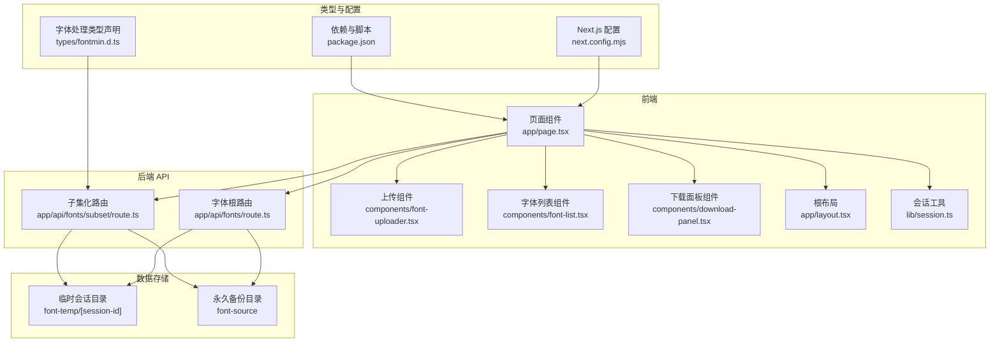
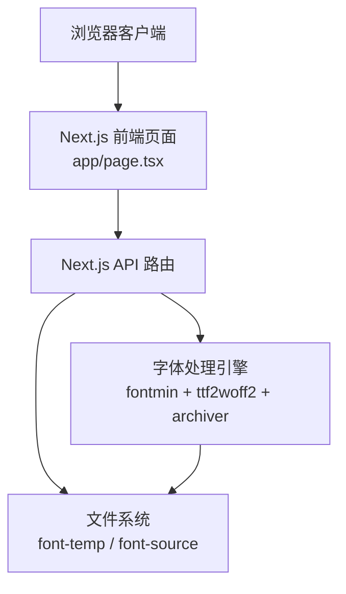
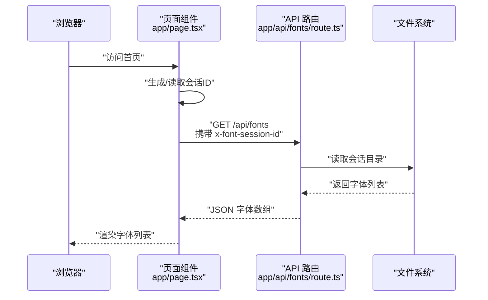
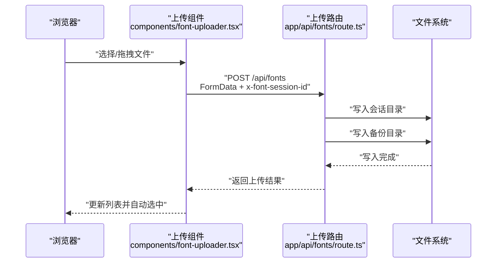
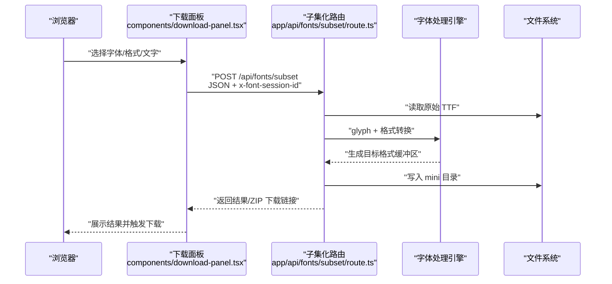
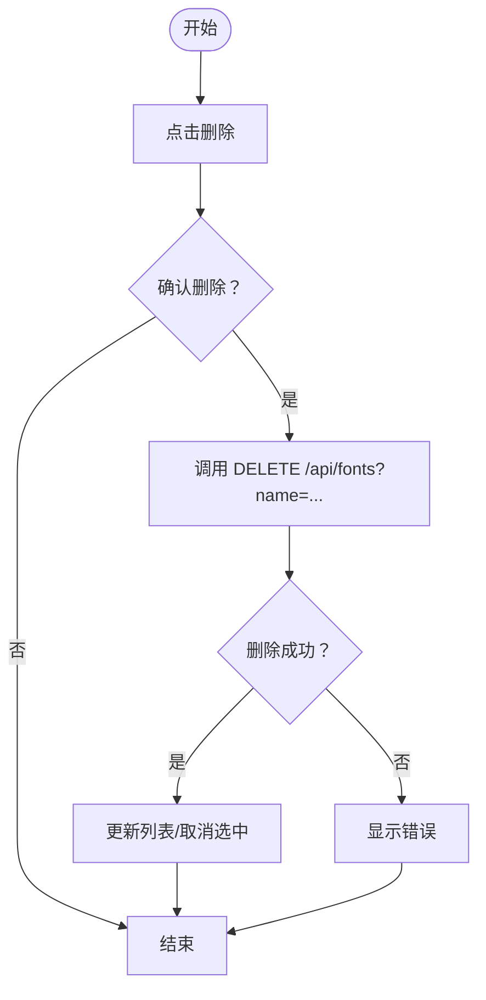
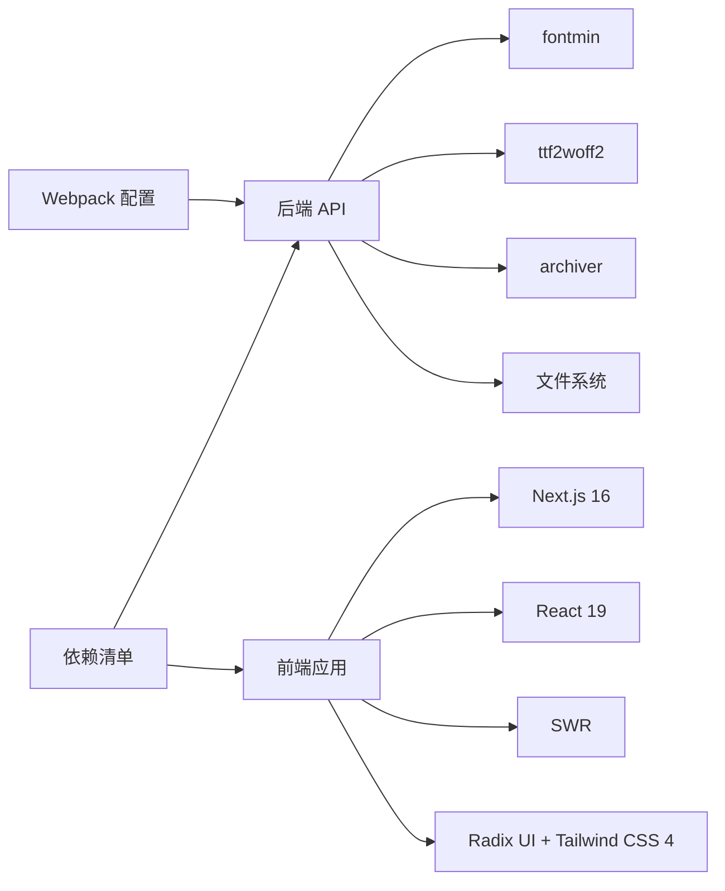

# 架构设计

<cite>
**本文引用的文件**
- [README.md](file://README.md)
- [package.json](file://package.json)
- [next.config.mjs](file://next.config.mjs)
- [app/layout.tsx](file://app/layout.tsx)
- [app/page.tsx](file://app/page.tsx)
- [lib/session.ts](file://lib/session.ts)
- [components/font-uploader.tsx](file://components/font-uploader.tsx)
- [components/font-list.tsx](file://components/font-list.tsx)
- [components/download-panel.tsx](file://components/download-panel.tsx)
- [types/fontmin.d.ts](file://types/fontmin.d.ts)
- [app/api/fonts/route.ts](file://app/api/fonts/route.ts)
- [app/api/fonts/subset/route.ts](file://app/api/fonts/subset/route.ts)
</cite>

## 目录
1. [引言](#引言)
2. [项目结构](#项目结构)
3. [核心组件](#核心组件)
4. [架构总览](#架构总览)
5. [详细组件分析](#详细组件分析)
6. [依赖分析](#依赖分析)
7. [性能考量](#性能考量)
8. [故障排查指南](#故障排查指南)
9. [结论](#结论)
10. [附录](#附录)

## 引言
本架构设计文档面向 FontMin 字体子集化工具，系统采用前端全栈框架 Next.js 16 + React 19，结合服务端字体处理引擎 fontmin 与格式转换工具，实现“上传 → 预览 → 子集化 → 下载”的完整流程。系统通过会话隔离保障数据隐私，采用双存储策略（临时会话目录与永久备份目录）平衡用户体验与数据治理，并通过 Webpack 配置支持 WASM 模块加载。

## 项目结构
项目采用 Next.js App Router 分层组织，前端组件位于 components 与 app 目录，API 路由位于 app/api 下，类型声明位于 types，会话逻辑位于 lib，字体处理逻辑位于服务端 API。

图表来源
- [app/page.tsx](file://app/page.tsx#L1-L279)
- [components/font-uploader.tsx](file://components/font-uploader.tsx#L1-L166)
- [components/font-list.tsx](file://components/font-list.tsx#L1-L159)
- [components/download-panel.tsx](file://components/download-panel.tsx#L1-L295)
- [lib/session.ts](file://lib/session.ts#L1-L34)
- [app/layout.tsx](file://app/layout.tsx#L1-L44)
- [app/api/fonts/route.ts](file://app/api/fonts/route.ts#L1-L167)
- [app/api/fonts/subset/route.ts](file://app/api/fonts/subset/route.ts#L1-L366)
- [types/fontmin.d.ts](file://types/fontmin.d.ts#L1-L53)
- [next.config.mjs](file://next.config.mjs#L1-L44)
- [package.json](file://package.json#L1-L78)

章节来源
- [README.md](file://README.md#L135-L160)
- [next.config.mjs](file://next.config.mjs#L14-L39)
- [package.json](file://package.json#L1-L78)

## 核心组件
- 页面与布局
  - 根布局负责站点元信息与全局样式注入。
  - 主页面承载上传、字体列表、预览与下载设置四大功能区域。
- 会话管理
  - 客户端通过模块级变量生成会话 ID，随请求头 x-font-session-id 传递至服务端。
- 字体处理
  - 服务端 API 使用 fontmin 进行字形提取与格式转换，支持 TTF、WOFF、WOFF2、EOT、SVG 输出；WOFF2 通过 ttf2woff2 单独转换。
- 存储与隔离
  - 临时会话目录按会话隔离；永久备份目录统一保存所有上传字体，删除仅影响会话目录，不波及备份。

章节来源
- [app/layout.tsx](file://app/layout.tsx#L10-L31)
- [app/page.tsx](file://app/page.tsx#L21-L145)
- [lib/session.ts](file://lib/session.ts#L1-L34)
- [app/api/fonts/route.ts](file://app/api/fonts/route.ts#L36-L69)
- [app/api/fonts/subset/route.ts](file://app/api/fonts/subset/route.ts#L31-L162)

## 架构总览
系统采用三层分层设计：前端展示层、后端 API 层与文件存储层。前端通过 Next.js App Router 提供页面与 API 路由，后端 API 使用 Node.js 文件系统与第三方字体处理库完成业务逻辑，文件存储采用本地磁盘目录结构实现会话隔离与数据备份。

图表来源
- [app/page.tsx](file://app/page.tsx#L14-L145)
- [app/api/fonts/route.ts](file://app/api/fonts/route.ts#L36-L127)
- [app/api/fonts/subset/route.ts](file://app/api/fonts/subset/route.ts#L164-L366)
- [types/fontmin.d.ts](file://types/fontmin.d.ts#L1-L53)
- [next.config.mjs](file://next.config.mjs#L14-L39)

## 详细组件分析

### 会话管理与数据隔离
- 会话标识
  - 客户端在首次访问时生成会话 ID 并写入模块级变量，每次请求通过请求头 x-font-session-id 发送。
- 隔离策略
  - 服务端根据会话 ID 动态定位用户会话目录，确保不同用户、不同浏览器标签页的数据相互隔离。
- 生命周期
  - 临时会话目录随会话存在，刷新页面不清空（Cookie 未过期时保留），但临时目录会在过期后被清理；永久备份目录不受影响。

图表来源
- [lib/session.ts](file://lib/session.ts#L1-L34)
- [app/page.tsx](file://app/page.tsx#L14-L29)
- [app/api/fonts/route.ts](file://app/api/fonts/route.ts#L36-L69)

章节来源
- [lib/session.ts](file://lib/session.ts#L1-L34)
- [app/page.tsx](file://app/page.tsx#L11-L19)
- [README.md](file://README.md#L191-L221)

### 字体上传与备份
- 输入校验
  - 前端限制可接受的字体格式，服务端对上传文件进行二次校验与命名规范化。
- 双重存储
  - 上传文件同时写入会话目录与永久备份目录，保证数据可恢复与审计。
- 错误处理
  - 对上传失败、目录不存在等情况返回明确错误码与消息。

图表来源
- [components/font-uploader.tsx](file://components/font-uploader.tsx#L65-L70)
- [app/page.tsx](file://app/page.tsx#L33-L65)
- [app/api/fonts/route.ts](file://app/api/fonts/route.ts#L72-L127)

章节来源
- [components/font-uploader.tsx](file://components/font-uploader.tsx#L15-L59)
- [app/api/fonts/route.ts](file://app/api/fonts/route.ts#L72-L127)
- [README.md](file://README.md#L186-L189)

### 字体子集化与格式转换
- 输入约束
  - fontmin 仅支持 TTF 作为输入，非 TTF 文件会被跳过并记录警告。
- 处理流程
  - 读取原始字体，按唯一字符集合提取字形，按目标格式生成子集文件；WOFF2 通过 ttf2woff2 单独转换。
- 批量与打包
  - 支持单个下载与打包下载，批量下载时使用 archiver 创建 ZIP。
- 错误与回退
  - 对每种格式的转换失败进行捕获与聚合，最终返回汇总错误信息。

图表来源
- [components/download-panel.tsx](file://components/download-panel.tsx#L68-L89)
- [app/page.tsx](file://app/page.tsx#L113-L145)
- [app/api/fonts/subset/route.ts](file://app/api/fonts/subset/route.ts#L164-L366)
- [types/fontmin.d.ts](file://types/fontmin.d.ts#L1-L53)

章节来源
- [app/api/fonts/subset/route.ts](file://app/api/fonts/subset/route.ts#L25-L162)
- [types/fontmin.d.ts](file://types/fontmin.d.ts#L18-L45)

### 字体删除与数据治理
- 删除范围
  - 仅删除会话目录中的文件，永久备份目录保持不变，符合“可恢复”与“不可逆”的治理原则。
- 前端交互
  - 通过确认对话框避免误删，删除后刷新列表并自动取消选中。

图表来源
- [components/font-list.tsx](file://components/font-list.tsx#L45-L58)
- [app/page.tsx](file://app/page.tsx#L67-L92)
- [app/api/fonts/route.ts](file://app/api/fonts/route.ts#L129-L166)

章节来源
- [components/font-list.tsx](file://components/font-list.tsx#L138-L156)
- [app/api/fonts/route.ts](file://app/api/fonts/route.ts#L129-L166)

## 依赖分析
- 前端依赖
  - Next.js 16、React 19、SWR、React Hook Form、Radix UI、Tailwind CSS 4、Lucide React、next-themes 等。
- 字体处理依赖
  - fontmin（字形提取与格式转换）、ttf2woff2（TTF→WOFF2）、archiver（ZIP 打包）。
- 构建与运行
  - Webpack 模式启用 WASM 支持，服务端 externals 外置 fontmin、ttf2woff2、archiver，避免打包体积过大。

图表来源
- [package.json](file://package.json#L11-L66)
- [next.config.mjs](file://next.config.mjs#L14-L39)
- [app/api/fonts/subset/route.ts](file://app/api/fonts/subset/route.ts#L5-L7)

章节来源
- [package.json](file://package.json#L11-L66)
- [next.config.mjs](file://next.config.mjs#L14-L39)

## 性能考量
- 会话隔离与并发
  - 每个会话独立目录，避免跨用户竞争 IO；建议在高并发场景下配合文件系统优化与磁盘配额控制。
- 字体处理开销
  - 字形提取与格式转换为 CPU 密集型任务，建议限制单次处理字体数量与字符长度，必要时引入队列与异步处理。
- 前端缓存
  - 使用 SWR 缓存字体列表，减少重复请求；下载面板对结果进行分组展示，降低渲染压力。
- 构建与运行
  - Webpack WASM 支持与 externals 外置第三方原生模块，缩短构建时间并减小包体。

## 故障排查指南
- 上传失败
  - 检查会话头是否正确传递、会话目录是否存在、文件权限是否允许写入。
- 子集化失败
  - 确认上传字体为 TTF 格式；检查 uniqueText 是否为空；查看日志中格式转换错误。
- 下载异常
  - 确认 mini 目录存在且文件已生成；检查 ZIP 打包是否完成；浏览器是否拦截弹窗。
- 会话数据丢失
  - 刷新页面不清空（Cookie 未过期时保留）；若需清理临时目录，参考 README 中的定期清理建议。

章节来源
- [app/api/fonts/route.ts](file://app/api/fonts/route.ts#L72-L127)
- [app/api/fonts/subset/route.ts](file://app/api/fonts/subset/route.ts#L164-L366)
- [README.md](file://README.md#L222-L241)

## 结论
本系统通过清晰的分层架构、严格的会话隔离与双存储策略，在保证隐私与可恢复性的前提下，实现了高效的字体子集化处理。前端与后端的职责边界明确，第三方依赖与构建配置合理，具备良好的可维护性与扩展性。建议在生产环境中结合文件系统优化、队列与异步处理进一步提升吞吐能力，并完善监控与告警体系。

## 附录
- 基础设施需求
  - Node.js 18+、pnpm 8+；Linux/Windows 均可；建议为 font-temp 与 font-source 配置独立挂载与磁盘配额。
- 可扩展性考虑
  - 存储层可替换为对象存储（如 S3）以支持横向扩展；处理层可引入 Worker/队列异步化；CDN 加速下载。
- 部署拓扑
  - 单机部署：Next.js 服务 + 本地文件系统；多机部署：共享存储 + 负载均衡 + CDN。
- 安全性、监控与灾备
  - 安全：限制上传格式、校验文件名、严格目录隔离；监控：接入日志与指标；灾备：定期备份 font-source 目录。
- 技术栈与版本兼容
  - 前端：Next.js 16、React 19、SWR、Radix UI、Tailwind CSS 4；后端：Node.js、fontmin、ttf2woff2、archiver；构建：Webpack WASM 支持。

章节来源
- [README.md](file://README.md#L44-L79)
- [package.json](file://package.json#L11-L66)
- [next.config.mjs](file://next.config.mjs#L14-L39)