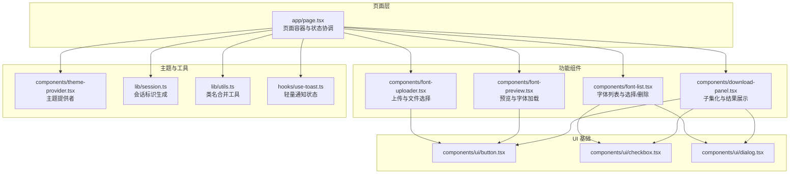
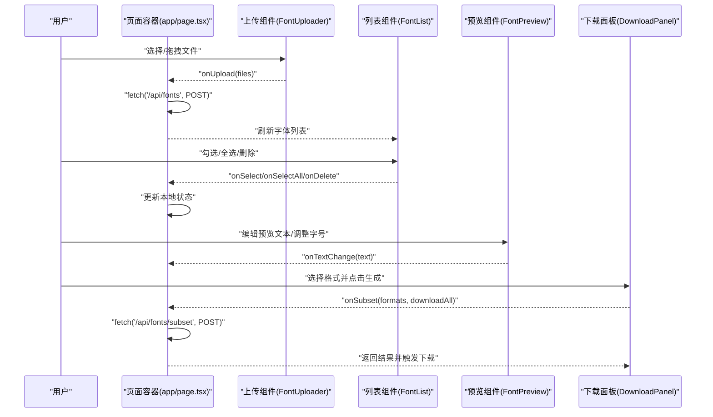
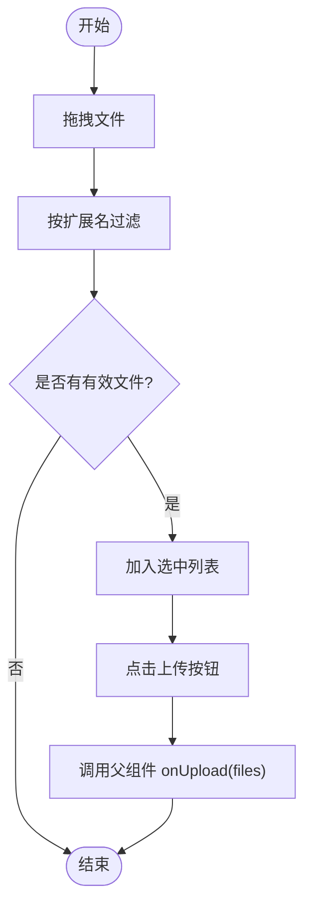
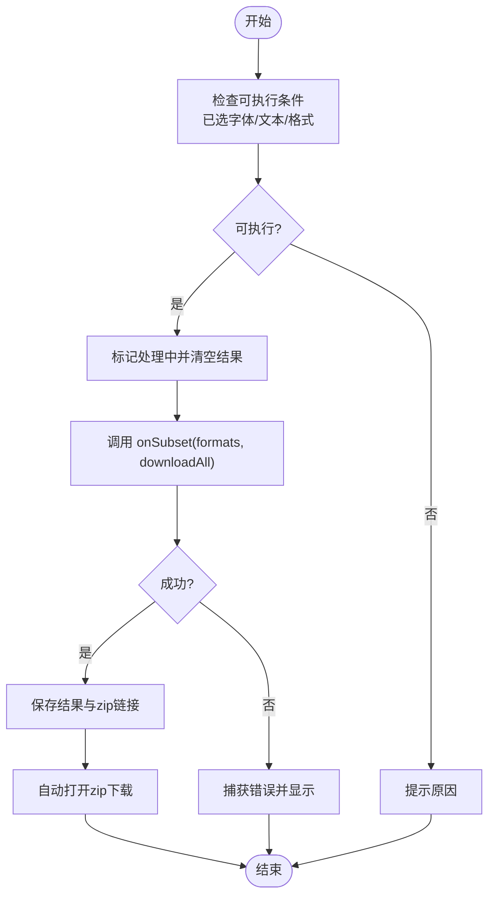
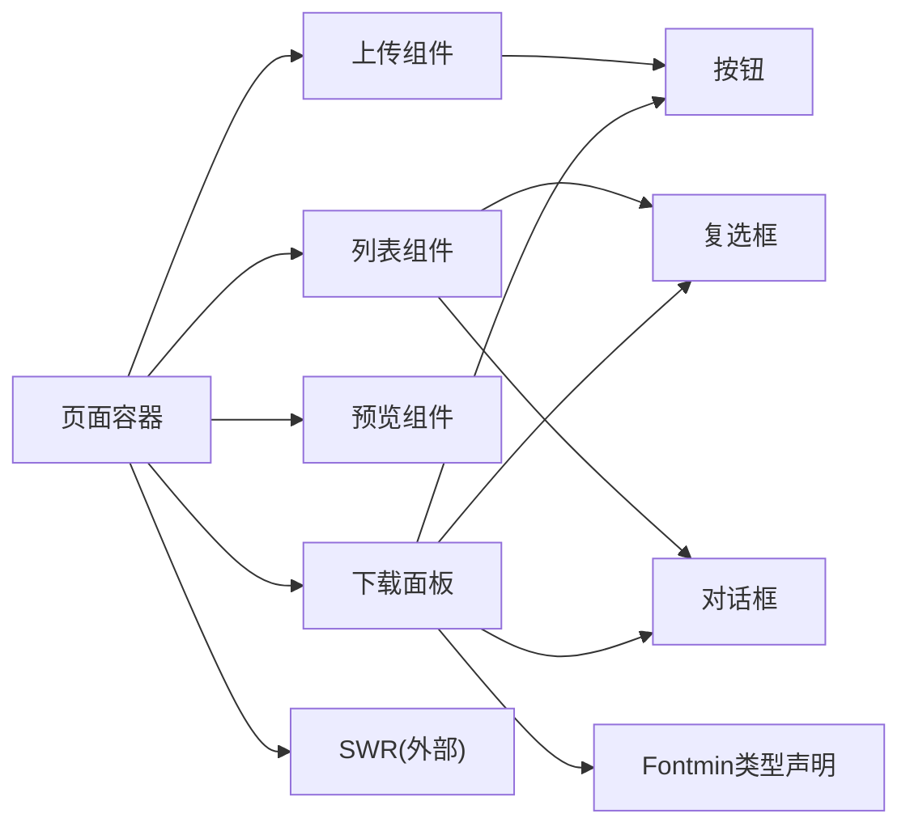

# 组件交互模式

<cite>
**本文引用的文件**
- [app/page.tsx](file://app/page.tsx)
- [app/layout.tsx](file://app/layout.tsx)
- [components/font-uploader.tsx](file://components/font-uploader.tsx)
- [components/font-list.tsx](file://components/font-list.tsx)
- [components/font-preview.tsx](file://components/font-preview.tsx)
- [components/download-panel.tsx](file://components/download-panel.tsx)
- [components/theme-provider.tsx](file://components/theme-provider.tsx)
- [hooks/use-toast.ts](file://hooks/use-toast.ts)
- [lib/session.ts](file://lib/session.ts)
- [types/fontmin.d.ts](file://types/fontmin.d.ts)
- [components/ui/button.tsx](file://components/ui/button.tsx)
- [components/ui/checkbox.tsx](file://components/ui/checkbox.tsx)
- [components/ui/dialog.tsx](file://components/ui/dialog.tsx)
- [lib/utils.ts](file://lib/utils.ts)
</cite>

## 目录
1. [引言](#引言)
2. [项目结构](#项目结构)
3. [核心组件](#核心组件)
4. [架构总览](#架构总览)
5. [详细组件分析](#详细组件分析)
6. [依赖关系分析](#依赖关系分析)
7. [性能考量](#性能考量)
8. [故障排查指南](#故障排查指南)
9. [结论](#结论)
10. [附录](#附录)

## 引言
本文件聚焦于 FontMin 字体子集化工具的前端组件交互模式，系统阐述组件间通信机制（父子、兄弟与跨层级）、状态管理模式（局部与全局）、事件驱动流程、数据流向、生命周期与内存防护、以及最佳实践。目标是帮助开发者在不深入源码的情况下，也能清晰理解组件如何协同工作，并指导后续扩展与维护。

## 项目结构
该应用采用 Next.js 客户端组件模式，页面级容器负责聚合与状态协调，各功能模块以独立组件形式组合，配合 UI 基础组件库与轻量状态钩子实现交互闭环。

图表来源
- [app/page.tsx](file://app/page.tsx#L21-L278)
- [components/font-uploader.tsx](file://components/font-uploader.tsx#L17-L165)
- [components/font-list.tsx](file://components/font-list.tsx#L34-L158)
- [components/font-preview.tsx](file://components/font-preview.tsx#L17-L122)
- [components/download-panel.tsx](file://components/download-panel.tsx#L44-L294)
- [components/theme-provider.tsx](file://components/theme-provider.tsx#L9-L11)
- [lib/session.ts](file://lib/session.ts#L1-L34)
- [lib/utils.ts](file://lib/utils.ts#L4-L6)
- [hooks/use-toast.ts](file://hooks/use-toast.ts#L171-L189)
- [components/ui/button.tsx](file://components/ui/button.tsx#L39-L60)
- [components/ui/checkbox.tsx](file://components/ui/checkbox.tsx#L9-L32)
- [components/ui/dialog.tsx](file://components/ui/dialog.tsx#L9-L143)

章节来源
- [app/page.tsx](file://app/page.tsx#L21-L278)
- [app/layout.tsx](file://app/layout.tsx#L33-L43)

## 核心组件
- 页面容器：负责顶层状态（选中字体、预览文本、上传/删除状态）与 API 调用，通过 SWR 获取字体列表，统一协调上传、删除、子集化等动作。
- 上传组件：接收文件集合，过滤格式，支持拖拽与选择，触发父级上传回调。
- 列表组件：展示字体列表，支持全选/反选、逐项选择、删除确认对话框。
- 预览组件：动态加载字体，根据输入文本与字号实时预览效果。
- 下载面板：选择输出格式，发起子集化请求，展示结果与批量下载。

章节来源
- [app/page.tsx](file://app/page.tsx#L21-L278)
- [components/font-uploader.tsx](file://components/font-uploader.tsx#L17-L165)
- [components/font-list.tsx](file://components/font-list.tsx#L34-L158)
- [components/font-preview.tsx](file://components/font-preview.tsx#L17-L122)
- [components/download-panel.tsx](file://components/download-panel.tsx#L44-L294)

## 架构总览
组件交互遵循“自上而下”的单向数据流：页面容器持有全局状态与副作用，向下传递 props；子组件通过回调向上反馈变更；UI 基础组件提供一致的交互语义；主题与工具模块提供横切能力。

图表来源
- [app/page.tsx](file://app/page.tsx#L33-L145)
- [components/font-uploader.tsx](file://components/font-uploader.tsx#L65-L70)
- [components/font-list.tsx](file://components/font-list.tsx#L49-L58)
- [components/font-preview.tsx](file://components/font-preview.tsx#L57-L58)
- [components/download-panel.tsx](file://components/download-panel.tsx#L68-L89)

## 详细组件分析

### 页面容器（FontMinPage）
- 职责：聚合状态、协调 API、驱动数据刷新与下载。
- 关键点：
  - 使用 SWR 获取字体列表，自动刷新关闭。
  - 上传/删除/子集化均通过 fetch 发起请求，并在成功后调用 mutate 刷新缓存。
  - 通过回调函数将事件向上抛出，供子组件使用。
- 生命周期与内存：
  - 未显式注册全局事件监听器，卸载时无需额外清理。
  - 上传/删除/子集化过程中的状态在本地完成，避免内存泄漏风险。

章节来源
- [app/page.tsx](file://app/page.tsx#L21-L278)
- [lib/session.ts](file://lib/session.ts#L1-L34)

### 上传组件（FontUploader）
- 职责：文件选择、拖拽处理、格式校验、移除文件、触发上传。
- 交互模式：
  - 子传父：将选中文件数组通过 onUpload 回调交给父组件。
  - 内部状态：拖拽态、选中文件列表。
- 事件链路：
  - 拖拽进入/离开/放下 -> 过滤合法格式 -> 更新内部列表 -> 触发上传回调。

图表来源
- [components/font-uploader.tsx](file://components/font-uploader.tsx#L21-L70)

章节来源
- [components/font-uploader.tsx](file://components/font-uploader.tsx#L17-L165)

### 列表组件（FontList）
- 职责：展示字体、多选/全选、删除确认。
- 交互模式：
  - 子传父：onSelect/onSelectAll/onDelete 由父容器处理。
  - 内部状态：当前待删除字体名，用于控制删除对话框与按钮禁用。
- 对话框协作：
  - 通过受控 open 属性与 onOpenChange 控制显示/隐藏，保证状态一致性。

章节来源
- [components/font-list.tsx](file://components/font-list.tsx#L34-L158)
- [components/ui/dialog.tsx](file://components/ui/dialog.tsx#L9-L143)

### 预览组件（FontPreview）
- 职责：动态加载字体、渲染预览文本、调整字号。
- 数据流：
  - 输入：fonts、text、onTextChange。
  - 输出：通过回调更新父容器的预览文本。
- 性能与健壮性：
  - 使用 useMemo 生成唯一字体族名，避免重复样式注入。
  - 使用 useEffect 加载字体，记录已加载集合，防止重复加载。
  - 字体加载异常时记录日志，不影响其他字体预览。

章节来源
- [components/font-preview.tsx](file://components/font-preview.tsx#L17-L122)

### 下载面板（DownloadPanel）
- 职责：选择输出格式、触发子集化、展示结果、批量下载。
- 交互模式：
  - 子传父：onSubset(formats, downloadAll) 由父容器实现。
  - 内部状态：选中格式、处理中、结果列表、压缩包下载链接、错误信息。
- 流程图：

图表来源
- [components/download-panel.tsx](file://components/download-panel.tsx#L68-L89)

章节来源
- [components/download-panel.tsx](file://components/download-panel.tsx#L44-L294)

### 主题与工具
- 主题提供者：包裹应用根节点，提供明暗主题切换能力。
- 类名合并工具：统一处理 Tailwind/clsx 的类名拼接。
- 会话标识：为每次页面加载生成唯一会话 ID，贯穿 API 请求头，便于服务端区分会话。

章节来源
- [components/theme-provider.tsx](file://components/theme-provider.tsx#L9-L11)
- [lib/utils.ts](file://lib/utils.ts#L4-L6)
- [lib/session.ts](file://lib/session.ts#L1-L34)

### UI 基础组件
- 按钮、复选框、对话框等基础组件提供一致的交互语义与无障碍属性，降低上层组件的复杂度。

章节来源
- [components/ui/button.tsx](file://components/ui/button.tsx#L39-L60)
- [components/ui/checkbox.tsx](file://components/ui/checkbox.tsx#L9-L32)
- [components/ui/dialog.tsx](file://components/ui/dialog.tsx#L9-L143)

## 依赖关系分析
- 组件耦合度控制：
  - 页面容器集中管理状态与副作用，子组件仅关注自身 UI 逻辑，耦合度低。
  - 通过 props 与回调传递数据与事件，避免直接共享可变状态。
- 外部依赖：
  - SWR：用于字体列表的缓存与刷新。
  - Fontmin 类型声明：定义子集化插件与运行时接口，约束服务端处理流程。
- 可复用性：
  - 子组件参数化程度高，可在其他场景复用。
  - UI 基础组件抽象良好，便于替换与扩展。

图表来源
- [app/page.tsx](file://app/page.tsx#L27-L29)
- [components/download-panel.tsx](file://components/download-panel.tsx#L19-L22)
- [types/fontmin.d.ts](file://types/fontmin.d.ts#L29-L45)

章节来源
- [app/page.tsx](file://app/page.tsx#L27-L29)
- [types/fontmin.d.ts](file://types/fontmin.d.ts#L1-L53)

## 性能考量
- 单向数据流与局部状态：
  - 页面容器集中管理可变状态，减少跨组件共享带来的重渲染。
- 计算优化：
  - 预览组件使用 useMemo 生成字体族名映射，避免重复计算。
- 渲染优化：
  - 列表与结果区域使用滚动容器限制高度，提升长列表渲染性能。
- 网络与缓存：
  - SWR 提供缓存与去重，减少重复请求。
- 字体加载：
  - 避免重复加载已加载字体，异常捕获不影响其他字体。

[本节为通用性能建议，不直接分析具体文件]

## 故障排查指南
- 上传失败：
  - 检查父容器上传回调是否正确调用 mutate 刷新列表。
  - 确认会话 ID 是否随请求头发送。
- 删除失败：
  - 确认 isDeleting 状态是否正确回写，避免按钮误禁用。
- 子集化失败：
  - 捕获服务端错误并解析错误消息，显示给用户。
- 预览字体不生效：
  - 检查字体路径与 FontFace 加载是否成功，确认已添加到 document.fonts。
- 通知与提示：
  - 若需全局提示，可引入轻量 toast 钩子，但当前组件未使用。

章节来源
- [app/page.tsx](file://app/page.tsx#L33-L92)
- [lib/session.ts](file://lib/session.ts#L1-L34)
- [components/font-preview.tsx](file://components/font-preview.tsx#L35-L48)
- [hooks/use-toast.ts](file://hooks/use-toast.ts#L171-L189)

## 结论
该组件体系通过“页面容器 + 功能组件 + UI 基础组件”的分层设计，实现了清晰的职责划分与低耦合的交互模式。单向数据流与局部状态管理使组件易于理解与测试；事件驱动的回调机制保证了父子与兄弟组件之间的协作顺畅；主题与工具模块提供了横切能力，进一步提升了可复用性与可维护性。建议在后续迭代中保持现有模式，必要时引入更完善的全局状态方案以应对复杂业务场景。

## 附录
- 最佳实践清单
  - 职责分离：页面容器负责状态与副作用，子组件专注 UI 与交互。
  - 接口设计：以 props 与回调为主，避免跨层级共享可变状态。
  - 错误处理：在子组件内捕获局部错误，在页面容器统一呈现或上报。
  - 生命周期与内存：避免在组件外注册长期监听；及时清理定时器与订阅。
  - 可测试性：将副作用抽离至可注入的回调或钩子，便于单元测试。

[本节为通用建议，不直接分析具体文件]