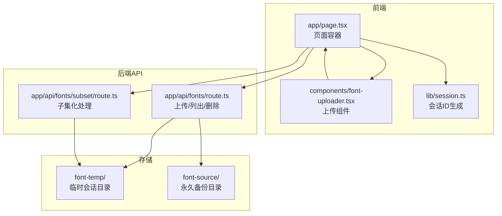
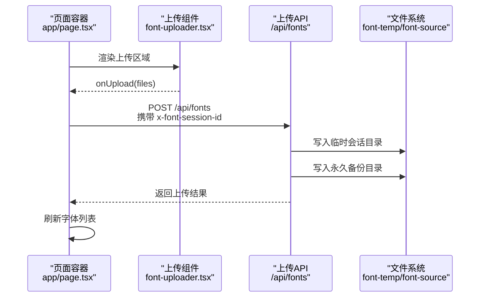
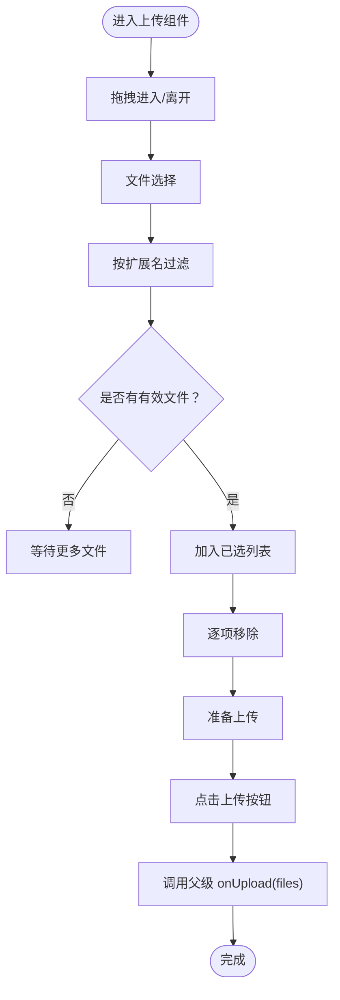
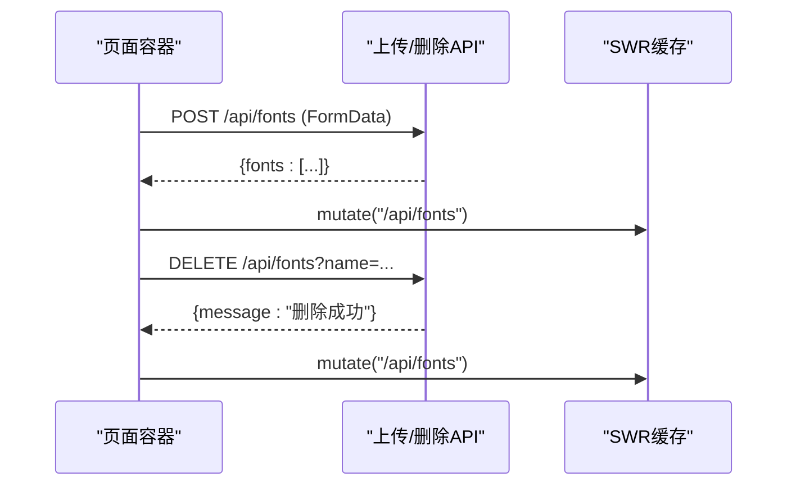
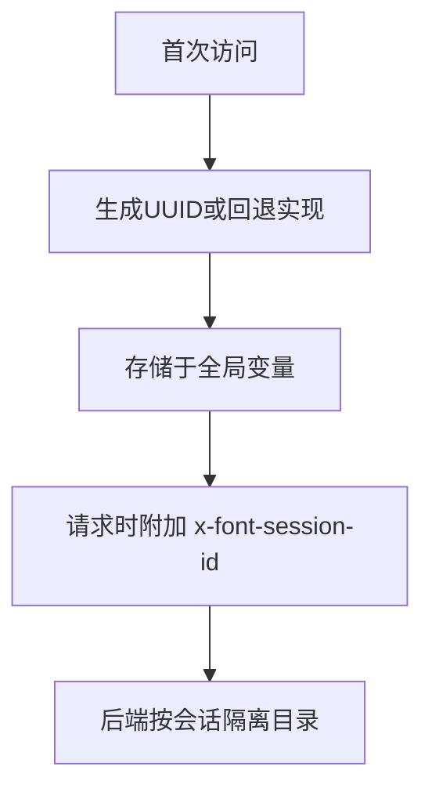
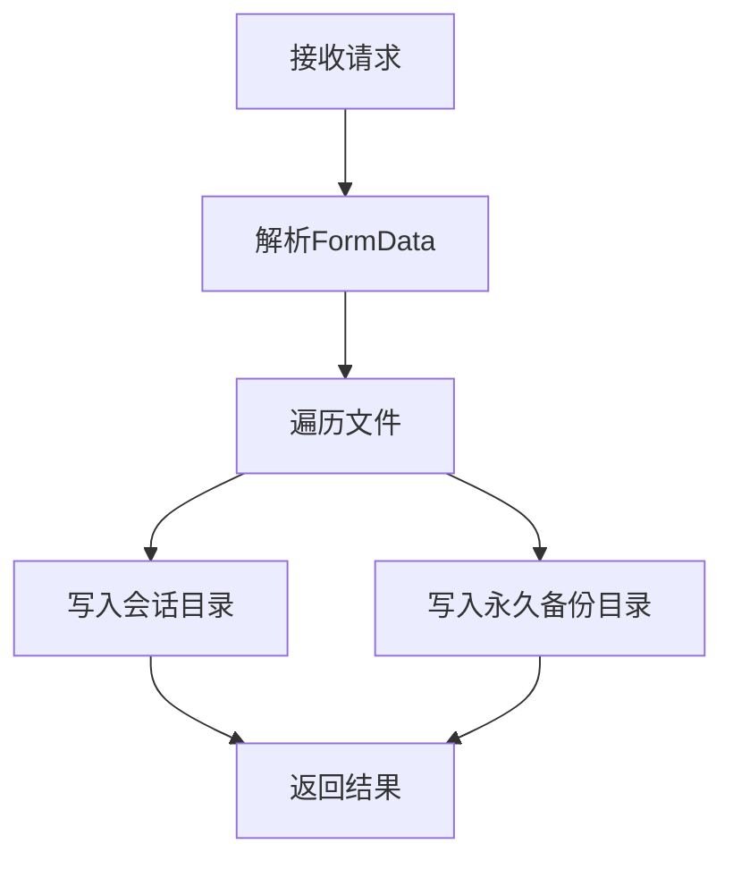
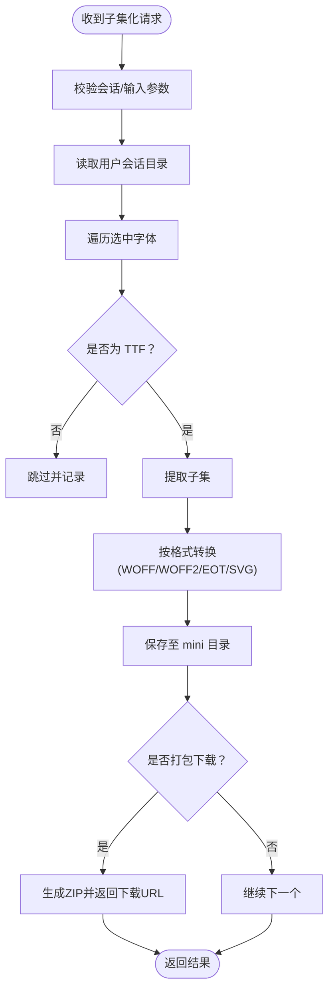
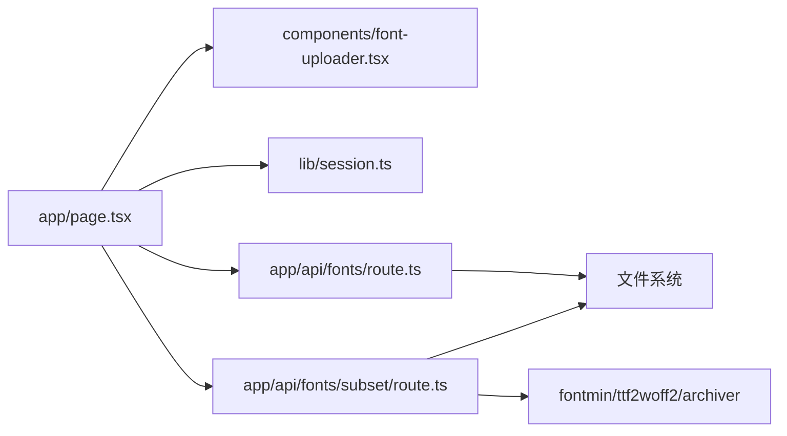

# 字体上传管理

<cite>
**本文引用的文件**
- [components/font-uploader.tsx](file://components/font-uploader.tsx)
- [app/page.tsx](file://app/page.tsx)
- [app/api/fonts/route.ts](file://app/api/fonts/route.ts)
- [app/api/fonts/subset/route.ts](file://app/api/fonts/subset/route.ts)
- [lib/session.ts](file://lib/session.ts)
- [types/fontmin.d.ts](file://types/fontmin.d.ts)
- [README.md](file://README.md)
</cite>

## 目录
1. [简介](#简介)
2. [项目结构](#项目结构)
3. [核心组件](#核心组件)
4. [架构总览](#架构总览)
5. [详细组件分析](#详细组件分析)
6. [依赖关系分析](#依赖关系分析)
7. [性能考量](#性能考量)
8. [故障排查指南](#故障排查指南)
9. [结论](#结论)
10. [附录](#附录)

## 简介
本文件面向“字体上传管理”功能，系统性阐述前端上传组件的实现原理与后端 API 的处理流程，覆盖拖拽上传、文件选择、格式过滤、批量处理、会话隔离、临时存储与永久备份、错误处理与用户体验优化等关键点。同时明确支持的字体格式（TTF、OTF、WOFF、WOFF2、EOT、SVG）及其限制，并给出集成示例与最佳实践。

## 项目结构
该仓库采用 Next.js App Router 结构，字体上传管理涉及前端组件、页面容器、API 路由与会话管理模块，配合本地文件系统实现临时与永久存储。

图表来源
- [app/page.tsx](file://app/page.tsx#L1-L279)
- [components/font-uploader.tsx](file://components/font-uploader.tsx#L1-L166)
- [lib/session.ts](file://lib/session.ts#L1-L34)
- [app/api/fonts/route.ts](file://app/api/fonts/route.ts#L1-L167)
- [app/api/fonts/subset/route.ts](file://app/api/fonts/subset/route.ts#L1-L366)

章节来源
- [README.md](file://README.md#L135-L160)
- [app/page.tsx](file://app/page.tsx#L1-L279)
- [components/font-uploader.tsx](file://components/font-uploader.tsx#L1-L166)
- [lib/session.ts](file://lib/session.ts#L1-L34)
- [app/api/fonts/route.ts](file://app/api/fonts/route.ts#L1-L167)
- [app/api/fonts/subset/route.ts](file://app/api/fonts/subset/route.ts#L1-L366)

## 核心组件
- 上传组件：提供拖拽与文件选择入口，过滤不支持格式，维护已选文件列表，触发父级上传回调。
- 页面容器：负责发起上传请求、删除请求、拉取列表、状态管理与错误提示。
- 会话管理：生成并持久化会话ID，通过请求头传递给后端，实现用户隔离。
- API 路由：处理上传、列出、删除；子集化路由负责 TTF 子集提取与多格式转换。
- 类型声明：为 fontmin 插件链路提供类型约束。

章节来源
- [components/font-uploader.tsx](file://components/font-uploader.tsx#L10-L70)
- [app/page.tsx](file://app/page.tsx#L33-L92)
- [lib/session.ts](file://lib/session.ts#L1-L34)
- [app/api/fonts/route.ts](file://app/api/fonts/route.ts#L71-L127)
- [app/api/fonts/subset/route.ts](file://app/api/fonts/subset/route.ts#L164-L365)
- [types/fontmin.d.ts](file://types/fontmin.d.ts#L1-L53)

## 架构总览
前端通过会话ID隔离用户数据，上传组件将文件交给页面容器，页面容器以表单形式 POST 至 /api/fonts，后端将文件写入临时会话目录与永久备份目录。子集化处理仅接受 TTF 输入，按需转换为 WOFF、WOFF2、EOT、SVG 等格式，并可打包下载。

图表来源
- [app/page.tsx](file://app/page.tsx#L33-L65)
- [components/font-uploader.tsx](file://components/font-uploader.tsx#L65-L70)
- [app/api/fonts/route.ts](file://app/api/fonts/route.ts#L71-L127)

## 详细组件分析

### 上传组件（拖拽/选择/过滤/批量）
- 功能要点
  - 支持拖拽进入、拖出状态高亮与反馈。
  - 文件选择时按扩展名过滤，仅保留支持格式。
  - 维护已选文件列表，支持逐项移除与批量上传。
  - 上传按钮禁用状态与“上传中”文案联动。
- 关键实现路径
  - 拖拽事件处理与状态切换：[handleDragOver/handleDragLeave/handleDrop](file://components/font-uploader.tsx#L21-L45)
  - 文件选择过滤与追加：[handleFileSelect](file://components/font-uploader.tsx#L47-L59)
  - 移除单个文件：[removeFile](file://components/font-uploader.tsx#L61-L63)
  - 触发上传回调与清空列表：[handleUpload](file://components/font-uploader.tsx#L65-L70)
  - 支持格式常量与渲染逻辑：[ACCEPTED_FORMATS/渲染区域](file://components/font-uploader.tsx#L15-L121)

图表来源
- [components/font-uploader.tsx](file://components/font-uploader.tsx#L17-L70)

章节来源
- [components/font-uploader.tsx](file://components/font-uploader.tsx#L10-L166)

### 页面容器（集成与交互）
- 功能要点
  - 通过 SWR 获取字体列表，携带会话ID。
  - 上传：构造 FormData，发送 POST 请求，成功后刷新列表并自动勾选新上传字体。
  - 删除：向 /api/fonts 发送 DELETE 请求，仅删除会话目录中的文件，保留备份。
  - 子集化：向 /api/fonts/subset 发送 POST，支持批量下载与格式选择。
- 关键实现路径
  - 会话ID注入与 fetcher：[getSessionId/fetcher](file://app/page.tsx#L12-L19)
  - 上传处理与错误提示：[handleUpload](file://app/page.tsx#L33-L65)
  - 删除处理与状态更新：[handleDelete](file://app/page.tsx#L67-L92)
  - 子集化处理与结果解析：[handleSubset](file://app/page.tsx#L113-L145)

图表来源
- [app/page.tsx](file://app/page.tsx#L33-L92)

章节来源
- [app/page.tsx](file://app/page.tsx#L1-L279)

### 会话管理（ID生成与传递）
- 功能要点
  - 浏览器端生成唯一会话ID，避免热重载影响。
  - 通过请求头 x-font-session-id 传递给后端，实现用户隔离。
- 关键实现路径
  - 会话ID生成与回退策略：[getSessionId](file://lib/session.ts#L1-L27)
  - 请求头注入：[fetcher/header](file://app/page.tsx#L14-L19)

图表来源
- [lib/session.ts](file://lib/session.ts#L1-L34)
- [app/page.tsx](file://app/page.tsx#L14-L19)

章节来源
- [lib/session.ts](file://lib/session.ts#L1-L34)
- [app/page.tsx](file://app/page.tsx#L12-L19)

### 上传 API（格式过滤、双写、错误处理）
- 功能要点
  - 仅接受指定扩展名（.ttf/.otf/.woff/.woff2/.eot/.svg）。
  - 将文件写入用户会话临时目录与永久备份目录。
  - 列表接口仅返回支持格式文件，预览链接携带会话参数。
  - 删除接口仅删除会话目录中的文件，保留备份。
- 关键实现路径
  - 会话ID获取与目录隔离：[getSessionId/getUserSessionDir](file://app/api/fonts/route.ts#L16-L25)
  - 上传与双写逻辑：[POST](file://app/api/fonts/route.ts#L71-L127)
  - 列表过滤与预览链接：[GET](file://app/api/fonts/route.ts#L36-L69)
  - 删除逻辑与备份保留：[DELETE](file://app/api/fonts/route.ts#L129-L166)

图表来源
- [app/api/fonts/route.ts](file://app/api/fonts/route.ts#L71-L127)

章节来源
- [app/api/fonts/route.ts](file://app/api/fonts/route.ts#L1-L167)

### 子集化 API（TTF 限制与多格式转换）
- 功能要点
  - 仅接受 TTF 格式作为输入（Fontmin 限制）。
  - 对 OTF/SVG 等非 TTF 文件跳过处理。
  - 支持输出格式：WOFF、WOFF2、EOT、SVG；WOFF2 通过 TTF 转换。
  - 可批量生成并打包下载。
- 关键实现路径
  - 会话目录与 mini 输出目录：[getUserSessionDir/ensureMiniDir](file://app/api/fonts/subset/route.ts#L11-L23)
  - TTF 校验与跳过逻辑：[isTTFFont](file://app/api/fonts/subset/route.ts#L25-L29)
  - 处理流程与 WOFF2 转换：[processFont](file://app/api/fonts/subset/route.ts#L31-L162)
  - 批量处理与打包下载：[POST](file://app/api/fonts/subset/route.ts#L164-L365)

图表来源
- [app/api/fonts/subset/route.ts](file://app/api/fonts/subset/route.ts#L164-L365)

章节来源
- [app/api/fonts/subset/route.ts](file://app/api/fonts/subset/route.ts#L1-L366)
- [types/fontmin.d.ts](file://types/fontmin.d.ts#L1-L53)

## 依赖关系分析
- 组件耦合
  - 页面容器依赖上传组件与会话模块，负责状态与网络请求。
  - 上传组件与页面容器松耦合，通过回调 onUpload 通信。
- 外部依赖
  - 后端依赖文件系统（fs/promises）、字体处理库（fontmin、ttf2woff2、archiver）。
  - 前端依赖 SWR（数据获取与缓存）、Lucide Icons（UI 图标）。
- 会话隔离
  - 通过 x-font-session-id 请求头与目录层级实现强隔离，避免跨用户污染。

图表来源
- [app/page.tsx](file://app/page.tsx#L1-L279)
- [components/font-uploader.tsx](file://components/font-uploader.tsx#L1-L166)
- [lib/session.ts](file://lib/session.ts#L1-L34)
- [app/api/fonts/route.ts](file://app/api/fonts/route.ts#L1-L167)
- [app/api/fonts/subset/route.ts](file://app/api/fonts/subset/route.ts#L1-L366)

章节来源
- [app/page.tsx](file://app/page.tsx#L1-L279)
- [components/font-uploader.tsx](file://components/font-uploader.tsx#L1-L166)
- [lib/session.ts](file://lib/session.ts#L1-L34)
- [app/api/fonts/route.ts](file://app/api/fonts/route.ts#L1-L167)
- [app/api/fonts/subset/route.ts](file://app/api/fonts/subset/route.ts#L1-L366)

## 性能考量
- 上传阶段
  - 使用 FormData 分块传输，避免大文件一次性内存压力。
  - 前端已选列表滚动容器限制高度，减少渲染开销。
- 处理阶段
  - 子集化仅针对 TTF，避免不必要的格式转换。
  - WOFF2 通过 TTF 转换，减少插件链复杂度。
  - 可选打包下载，降低多次请求成本。
- 缓存与刷新
  - 使用 SWR 缓存列表，上传/删除后主动刷新，保证一致性。

## 故障排查指南
- 常见问题与定位
  - 上传失败：检查请求头是否包含 x-font-session-id，确认会话目录存在且可写。
  - 未返回文件：确认上传格式为 .ttf/.otf/.woff/.woff2/.eot/.svg，列表接口仅返回支持格式。
  - 子集化失败：确认输入为 TTF 格式，检查 text 参数非空，查看后端日志中的错误堆栈。
  - 删除无效：确认传入 name 参数，仅删除会话目录文件，备份仍保留。
- 错误处理路径
  - 上传/删除/子集化均捕获异常并返回结构化错误信息，前端统一提示。
  - 子集化对非 TTF 文件跳过并汇总提示，便于用户修正。

章节来源
- [app/api/fonts/route.ts](file://app/api/fonts/route.ts#L71-L127)
- [app/api/fonts/route.ts](file://app/api/fonts/route.ts#L129-L166)
- [app/api/fonts/subset/route.ts](file://app/api/fonts/subset/route.ts#L164-L365)

## 结论
该字体上传管理方案以“会话隔离 + 双写备份”为核心，前端提供直观的拖拽/选择与批量管理能力，后端以清晰的 API 边界与严格的格式约束保障稳定性。子集化处理遵循 Fontmin 的 TTF 输入限制，结合多格式输出满足多样化部署需求。整体架构简洁可靠，易于扩展与维护。

## 附录

### 支持的字体格式与限制
- 前端上传支持：TTF、OTF、WOFF、WOFF2、EOT、SVG
- 后端列表过滤：TTF、OTF、WOFF、WOFF2、EOT、SVG
- 子集化输入限制：仅 TTF（Fontmin 限制）
- 输出格式：WOFF、WOFF2、EOT、SVG（WOFF2 通过 TTF 转换）

章节来源
- [components/font-uploader.tsx](file://components/font-uploader.tsx#L15-L119)
- [app/api/fonts/route.ts](file://app/api/fonts/route.ts#L49-L51)
- [app/api/fonts/subset/route.ts](file://app/api/fonts/subset/route.ts#L25-L29)

### 文件组织结构
- 临时会话目录：font-temp/<sessionId>/（24 小时后过期）
- 永久备份目录：font-source/（长期保存）
- 子集化输出目录：font-temp/<sessionId>/mini/（本次会话生成的精简字体）

章节来源
- [README.md](file://README.md#L179-L189)
- [app/api/fonts/route.ts](file://app/api/fonts/route.ts#L6-L7)
- [app/api/fonts/subset/route.ts](file://app/api/fonts/subset/route.ts#L9-L23)

### 集成示例（步骤说明）
- 在页面中引入上传组件并绑定上传回调
  - 组件导入与渲染：[页面容器中组件使用](file://app/page.tsx#L186-L189)
  - 上传回调实现：[handleUpload](file://app/page.tsx#L33-L65)
- 设置会话头
  - 会话ID生成与注入：[getSessionId/fetcher](file://app/page.tsx#L12-L19)
- 列表与删除
  - 列表获取与错误处理：[SWR与错误提示](file://app/page.tsx#L27-L31)
  - 删除实现与刷新：[handleDelete](file://app/page.tsx#L67-L92)

章节来源
- [app/page.tsx](file://app/page.tsx#L176-L191)
- [app/page.tsx](file://app/page.tsx#L33-L92)

### 最佳实践
- 上传前提示格式限制，避免无效文件进入队列。
- 批量上传时控制单次数量，避免超时与内存压力。
- 子集化前先确认输入为 TTF，非 TTF 文件需引导用户转换。
- 使用“打包下载”减少多次请求，提升体验。
- 定期清理 font-temp 中过期会话目录，监控 font-source 大小。

章节来源
- [README.md](file://README.md#L222-L241)
- [components/font-uploader.tsx](file://components/font-uploader.tsx#L117-L119)