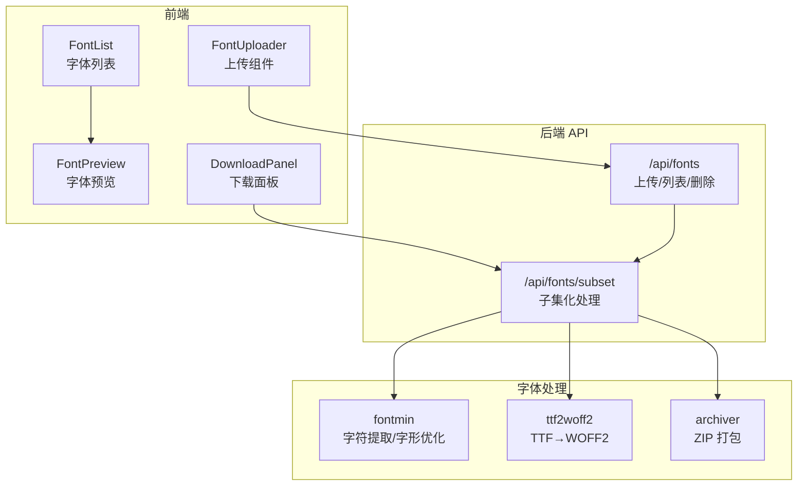
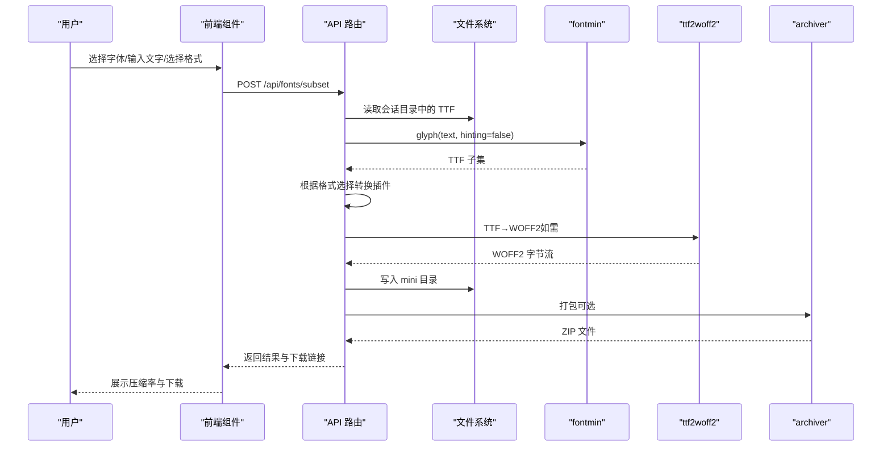
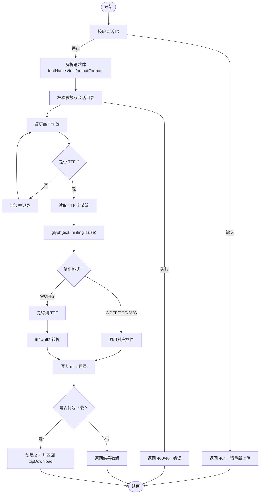
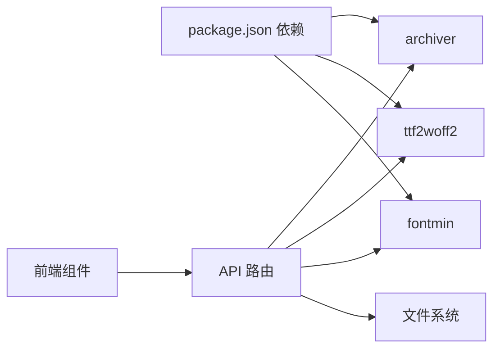

# 字体子集化处理

<cite>
**本文引用的文件**
- [README.md](file://README.md)
- [package.json](file://package.json)
- [types/fontmin.d.ts](file://types/fontmin.d.ts)
- [app/api/fonts/route.ts](file://app/api/fonts/route.ts)
- [app/api/fonts/subset/route.ts](file://app/api/fonts/subset/route.ts)
- [components/font-uploader.tsx](file://components/font-uploader.tsx)
- [components/font-list.tsx](file://components/font-list.tsx)
- [components/font-preview.tsx](file://components/font-preview.tsx)
- [components/download-panel.tsx](file://components/download-panel.tsx)
- [test-api.js](file://test-api.js)
</cite>

## 目录
1. [简介](#简介)
2. [项目结构](#项目结构)
3. [核心组件](#核心组件)
4. [架构总览](#架构总览)
5. [详细组件分析](#详细组件分析)
6. [依赖关系分析](#依赖关系分析)
7. [性能考量](#性能考量)
8. [故障排查指南](#故障排查指南)
9. [结论](#结论)
10. [附录](#附录)

## 简介
本项目是一个基于 Next.js 的字体子集化处理工具，核心目标是通过“字符提取 + 字形优化 + 格式转换”的流水线，将原始字体文件按需裁剪为仅包含指定文字的精简字体包，并支持多种输出格式（TTF、WOFF、WOFF2、EOT、SVG）。系统采用会话隔离机制保障隐私，前端提供直观的上传、预览与批量下载能力，后端通过 API 路由完成实际的字体处理与打包。

## 项目结构
项目采用 Next.js App Router 结构，核心目录与职责如下：
- app/api/fonts：API 路由层，负责上传、列出、删除字体以及子集化处理与下载
- components：前端组件，包括上传器、字体列表、预览、下载面板等
- types：类型声明，包含 fontmin 的类型定义
- 根目录配置文件：README、package.json、构建脚本与环境配置

图表来源
- [app/api/fonts/route.ts](file://app/api/fonts/route.ts#L1-L167)
- [app/api/fonts/subset/route.ts](file://app/api/fonts/subset/route.ts#L1-L366)
- [components/font-uploader.tsx](file://components/font-uploader.tsx#L1-L166)
- [components/font-list.tsx](file://components/font-list.tsx#L1-L159)
- [components/font-preview.tsx](file://components/font-preview.tsx#L1-L123)
- [components/download-panel.tsx](file://components/download-panel.tsx#L1-L295)

章节来源
- [README.md](file://README.md#L135-L161)
- [package.json](file://package.json#L1-L78)

## 核心组件
- 字体上传与管理：支持多格式上传，但子集化仅接受 TTF 输入；上传同时写入会话目录与永久备份目录
- 字体预览：实时加载字体并预览文本渲染效果
- 子集化处理：基于 fontmin 的字符提取与字形优化，再按需转换为 WOFF、WOFF2、EOT、SVG
- 下载面板：展示压缩前后大小、生成率与下载链接，支持单个/打包下载
- 会话隔离：基于 Cookie 的会话 ID，确保不同用户与标签页的数据隔离

章节来源
- [app/api/fonts/route.ts](file://app/api/fonts/route.ts#L36-L127)
- [components/font-uploader.tsx](file://components/font-uploader.tsx#L15-L119)
- [components/font-preview.tsx](file://components/font-preview.tsx#L17-L122)
- [components/download-panel.tsx](file://components/download-panel.tsx#L44-L295)
- [app/api/fonts/subset/route.ts](file://app/api/fonts/subset/route.ts#L164-L366)

## 架构总览
下图展示了从前端交互到后端处理与输出的整体流程：

图表来源
- [app/api/fonts/subset/route.ts](file://app/api/fonts/subset/route.ts#L31-L162)
- [app/api/fonts/subset/route.ts](file://app/api/fonts/subset/route.ts#L255-L350)
- [components/download-panel.tsx](file://components/download-panel.tsx#L68-L89)

## 详细组件分析

### 字体上传与会话管理
- 功能要点
  - 上传多格式文件，过滤非支持格式
  - 同步写入会话目录与永久备份目录
  - 列出当前会话字体，支持删除（仅会话目录）
- 关键行为
  - 会话 ID 来自请求头，不存在则回退默认值
  - 会话目录按 ID 分离，确保数据隔离
  - 删除操作不影响永久备份目录

章节来源
- [components/font-uploader.tsx](file://components/font-uploader.tsx#L17-L119)
- [app/api/fonts/route.ts](file://app/api/fonts/route.ts#L71-L127)

### 字体预览与文本输入
- 功能要点
  - 实时加载字体并渲染输入文本
  - 支持滑条调节字体大小
  - 默认示例文本覆盖中英文与常用字符
- 关键行为
  - 为每个预览字体生成唯一的 FontFamily 名称
  - 使用 FontFace 加载，加入 document.fonts 并记录加载状态

章节来源
- [components/font-preview.tsx](file://components/font-preview.tsx#L17-L122)

### 子集化处理流程（后端）
- 输入约束
  - 仅接受 TTF 格式作为输入（fontmin 限制）
  - 文本去重后参与字符提取
- 处理步骤
  - 使用 glyph 插件按文本提取字形
  - 根据输出格式选择相应转换插件（WOFF/EOT/SVG）
  - 对于 WOFF2，先得到 TTF 再用 ttf2woff2 转换
  - 将结果写入 mini 目录，生成下载链接
  - 支持打包下载（ZIP）
- 错误处理
  - 缺少会话、缺少字体、格式不支持、转换失败等均有明确错误码与消息
  - 会话过期或目录不存在时提示重新上传

图表来源
- [app/api/fonts/subset/route.ts](file://app/api/fonts/subset/route.ts#L164-L366)

章节来源
- [app/api/fonts/subset/route.ts](file://app/api/fonts/subset/route.ts#L25-L162)
- [app/api/fonts/subset/route.ts](file://app/api/fonts/subset/route.ts#L215-L295)

### 下载面板与结果展示
- 功能要点
  - 展示每个原始字体对应的多种格式产物
  - 显示原始大小、子集化后大小与压缩比例
  - 支持单个下载与打包下载
- 关键行为
  - 自动分组按原始字体名聚合结果
  - 当仅一个结果时提供“下载”按钮；多个结果时提供“下载全部”并自动触发下载

章节来源
- [components/download-panel.tsx](file://components/download-panel.tsx#L44-L295)

### 类型与插件接口（fontmin）
- 关键类型
  - FontminFile：包含路径、Buffer、相对路径等字段
  - GlyphOptions：text 与可选 hinting
  - FontminPlugin：插件签名
- 支持插件
  - glyph、ttf2woff、ttf2woff2、ttf2eot、ttf2svg、otf2ttf、svgs2ttf、css
- 使用方式
  - 通过 new Fontmin() 配置 src/dest/use/run 完成处理链

章节来源
- [types/fontmin.d.ts](file://types/fontmin.d.ts#L1-L53)

## 依赖关系分析
- 前端依赖
  - Next.js 16、React 19、Radix UI、Tailwind CSS、Lucide React、SWR、React Hook Form 等
- 字体处理依赖
  - fontmin：核心子集化引擎
  - ttf2woff2：TTF→WOFF2 转换
  - archiver：ZIP 打包
- 构建与运行
  - 使用 Webpack 模式以支持 WASM 模块加载

图表来源
- [package.json](file://package.json#L11-L66)
- [app/api/fonts/subset/route.ts](file://app/api/fonts/subset/route.ts#L5-L7)

章节来源
- [package.json](file://package.json#L1-L78)

## 性能考量
- 字符提取优化
  - 输入文本先去重，减少重复字形提取开销
- 格式转换策略
  - 对于 WOFF2，先得到 TTF 再转换，避免中间格式冗余
  - 其他格式直接通过 fontmin 插件生成，减少额外 IO
- 批量处理
  - 单次请求可处理多个字体与多种格式，减少往返次数
  - 支持打包下载，降低多次下载的网络开销
- I/O 与内存
  - 临时文件写入 mini 目录，处理完成后可按需清理
  - ZIP 使用较高压缩等级，平衡压缩比与 CPU 时间

章节来源
- [app/api/fonts/subset/route.ts](file://app/api/fonts/subset/route.ts#L215-L295)
- [app/api/fonts/subset/route.ts](file://app/api/fonts/subset/route.ts#L318-L332)

## 故障排查指南
- 常见错误与定位
  - 会话缺失：检查请求头是否携带会话 ID，或确认页面未过期
  - 未找到上传字体：确认字体是否存在于会话目录
  - 非 TTF 格式：子集化仅支持 TTF 输入，需先转换为 TTF
  - 转换失败：查看具体格式转换日志，确认插件可用
- 日志与调试
  - 后端打印详细的处理阶段日志，便于定位问题
  - 前端展示错误信息与重试建议
- 服务器维护建议
  - 定期清理 font-temp 中过期会话目录
  - 监控 font-source 目录容量与数量

章节来源
- [app/api/fonts/subset/route.ts](file://app/api/fonts/subset/route.ts#L170-L213)
- [app/api/fonts/subset/route.ts](file://app/api/fonts/subset/route.ts#L297-L310)
- [README.md](file://README.md#L222-L241)

## 结论
本项目通过清晰的前后端分工与稳健的后端处理链路，实现了从上传、预览到子集化与多格式输出的一体化流程。借助 fontmin 的字符提取与 ttf2woff2 的高效转换，结合会话隔离与批量下载能力，满足了网页字体优化、移动端资源精简与电子书制作等多种场景需求。

## 附录

### 支持的输入与输出格式
- 输入格式：TTF（子集化处理的唯一输入格式）
- 输出格式：TTF、WOFF、WOFF2、EOT、SVG

章节来源
- [app/api/fonts/subset/route.ts](file://app/api/fonts/subset/route.ts#L25-L29)
- [components/download-panel.tsx](file://components/download-panel.tsx#L30-L36)

### API 调用示例（参考）
- 请求示例（测试脚本）
  - 方法：POST
  - 路径：/api/fonts/subset
  - 请求体字段：fontNames、text、outputFormats、downloadAll
  - 示例参考：[test-api.js](file://test-api.js#L4-L15)

章节来源
- [test-api.js](file://test-api.js#L1-L36)

### 处理结果数据结构
- 字段说明
  - name：生成文件名（含 _Lite 后缀）
  - originalName：原始字体文件名
  - format：输出格式
  - originalSize：原始大小（字节）
  - minifiedSize：子集化后大小（字节）
  - downloadUrl：下载链接（带会话参数）
- 返回结构
  - results：结果数组
  - zipDownload：打包下载链接（可选）
  - textLength：去重后的字符数
  - skippedFonts/warnings：跳过的字体与警告信息（可选）

章节来源
- [app/api/fonts/subset/route.ts](file://app/api/fonts/subset/route.ts#L218-L225)
- [app/api/fonts/subset/route.ts](file://app/api/fonts/subset/route.ts#L334-L350)

### 处理时间估算与资源消耗
- 估算维度
  - 字体大小：越大处理时间越长
  - 字符集复杂度：字符越多，提取与优化耗时越高
  - 输出格式数量：每增加一种格式即多一次转换
  - 是否打包：ZIP 生成带来额外 CPU 与磁盘 IO
- 优化建议
  - 控制单次处理的字体数量与格式数量
  - 优先使用 WOFF2 以获得最佳压缩比
  - 合理设置文本范围，避免包含无关字符

[本节为通用指导，无需特定文件引用]

### 自定义参数与扩展处理流程
- 自定义参数
  - glyph 插件：hinting 可设为 false（默认）以减小字形复杂度
  - 输出格式：根据兼容性与压缩需求选择
- 扩展方向
  - 新增格式：在现有 switch 逻辑中添加新分支
  - 多语言支持：对不同语言字符集做分组处理
  - 并发控制：限制并发处理数量以稳定资源占用
  - 统计上报：记录处理耗时与压缩率，辅助性能分析

章节来源
- [app/api/fonts/subset/route.ts](file://app/api/fonts/subset/route.ts#L44-L48)
- [app/api/fonts/subset/route.ts](file://app/api/fonts/subset/route.ts#L53-L64)