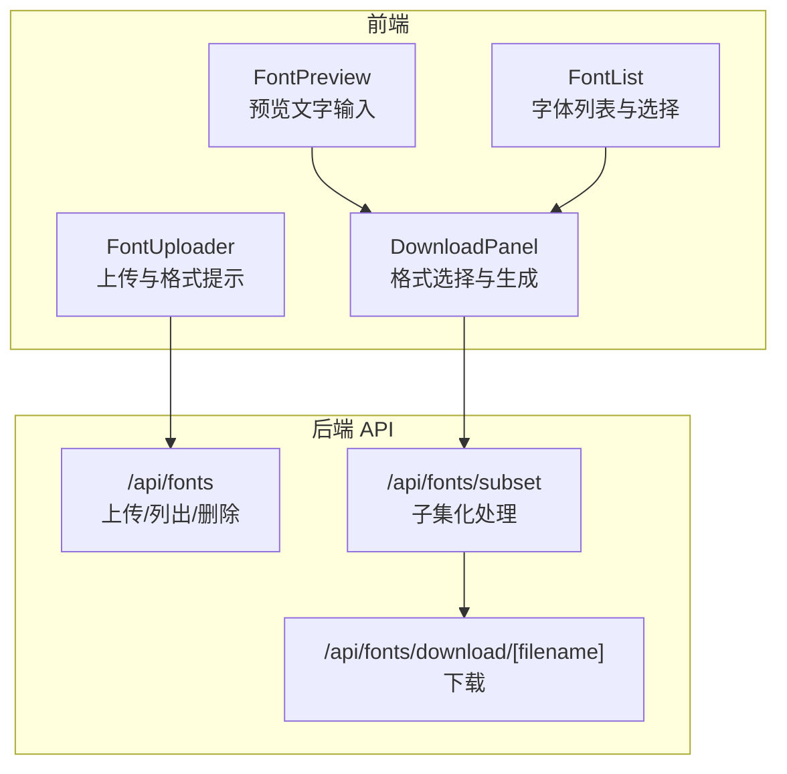
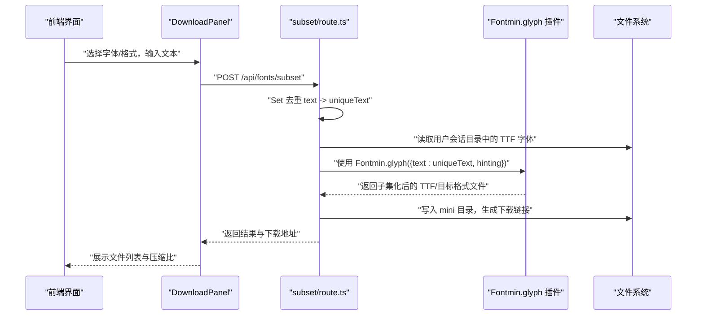
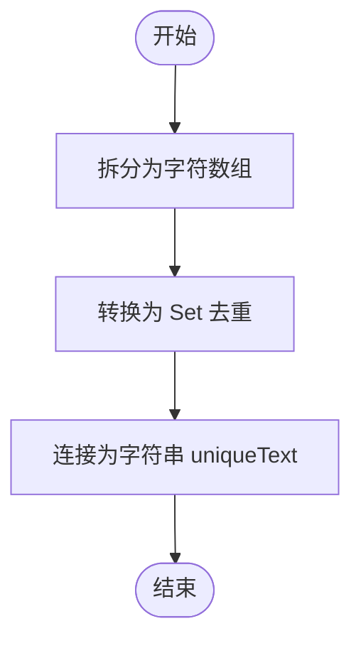
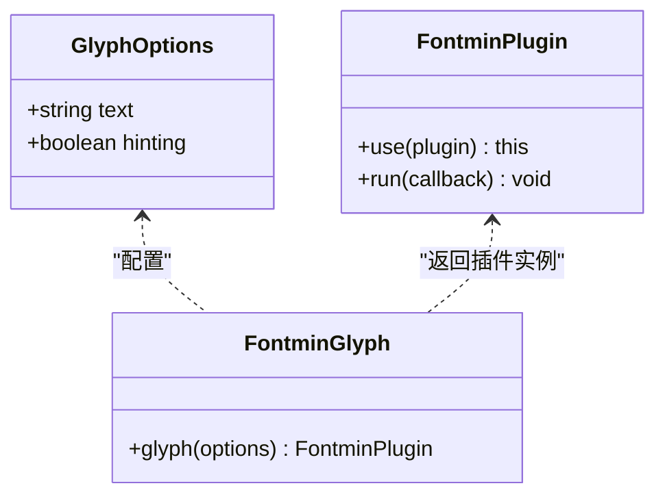
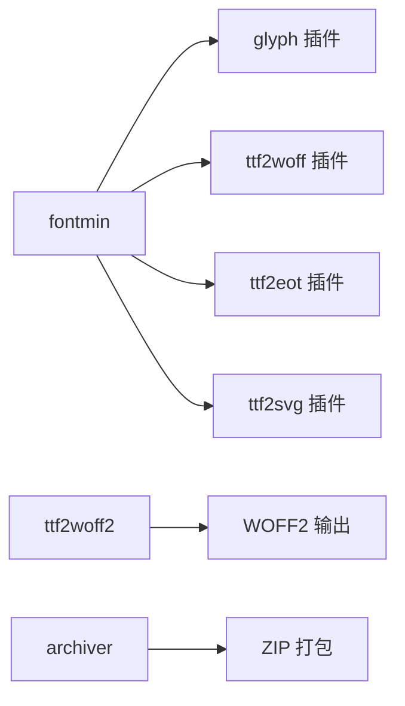

# 字符提取算法

<cite>
**本文引用的文件**
- [README.md](file://README.md)
- [package.json](file://package.json)
- [app/api/fonts/subset/route.ts](file://app/api/fonts/subset/route.ts)
- [types/fontmin.d.ts](file://types/fontmin.d.ts)
- [components/font-preview.tsx](file://components/font-preview.tsx)
- [components/download-panel.tsx](file://components/download-panel.tsx)
- [lib/session.ts](file://lib/session.ts)
- [components/font-uploader.tsx](file://components/font-uploader.tsx)
- [components/font-list.tsx](file://components/font-list.tsx)
- [app/api/fonts/route.ts](file://app/api/fonts/route.ts)
- [app/api/fonts/download/[filename]/route.ts](file://app/api/fonts/download/[filename]/route.ts)
- [test-api.js](file://test-api.js)
</cite>

## 目录
1. [简介](#简介)
2. [项目结构](#项目结构)
3. [核心组件](#核心组件)
4. [架构总览](#架构总览)
5. [详细组件分析](#详细组件分析)
6. [依赖关系分析](#依赖关系分析)
7. [性能考虑](#性能考虑)
8. [故障排查指南](#故障排查指南)
9. [结论](#结论)
10. [附录](#附录)

## 简介
本文件围绕“字符提取算法”展开，聚焦于前端界面输入的文本经由服务端 API 调用 fontmin 的 glyph 插件进行字形子集化处理的完整流程。重点解释：
- 字符集识别与去重（Set 去重）
- 字形匹配与优化策略（基于 glyph 插件）
- 文本输入处理流程与编码处理
- hinting 参数的作用及其对字形渲染的影响
- 性能分析与内存使用
- 参数配置示例与常见字符集处理策略
- 常见失败原因与解决方案

## 项目结构
该项目采用 Next.js App Router 架构，前端组件负责输入与展示，后端 API 路由负责字体上传、子集化处理与下载。与字符提取直接相关的关键模块如下：
- 前端输入与预览：字体上传、字体列表、预览与下载面板
- 服务端处理：上传、子集化、下载
- 类型定义：fontmin 插件接口与参数

图表来源
- [components/font-preview.tsx](file://components/font-preview.tsx#L15-L123)
- [components/font-list.tsx](file://components/font-list.tsx#L19-L159)
- [components/download-panel.tsx](file://components/download-panel.tsx#L30-L295)
- [components/font-uploader.tsx](file://components/font-uploader.tsx#L15-L166)
- [app/api/fonts/route.ts](file://app/api/fonts/route.ts#L36-L167)
- [app/api/fonts/subset/route.ts](file://app/api/fonts/subset/route.ts#L164-L366)
- [app/api/fonts/download/[filename]/route.ts](file://app/api/fonts/download/[filename]/route.ts#L7-L62)

章节来源
- [README.md](file://README.md#L135-L161)
- [package.json](file://package.json#L11-L66)

## 核心组件
- 字体上传与格式提示：支持多种字体格式上传，但子集化仅接受 TTF 作为输入。
- 字体列表与选择：多选字体参与子集化。
- 预览与输入：用户输入待提取的文本，支持中英文、数字、符号等。
- 下载面板：选择输出格式（TTF、WOFF、WOFF2、EOT、SVG），触发生成并下载。
- 子集化处理：服务端调用 fontmin 的 glyph 插件，按文本字符集提取字形，并按需转换为目标格式。

章节来源
- [components/font-uploader.tsx](file://components/font-uploader.tsx#L15-L166)
- [components/font-list.tsx](file://components/font-list.tsx#L19-L159)
- [components/font-preview.tsx](file://components/font-preview.tsx#L15-L123)
- [components/download-panel.tsx](file://components/download-panel.tsx#L30-L295)
- [app/api/fonts/route.ts](file://app/api/fonts/route.ts#L36-L167)
- [app/api/fonts/subset/route.ts](file://app/api/fonts/subset/route.ts#L31-L162)

## 架构总览
下图展示了从前端输入到服务端处理与输出的完整序列：

图表来源
- [components/download-panel.tsx](file://components/download-panel.tsx#L68-L89)
- [app/api/fonts/subset/route.ts](file://app/api/fonts/subset/route.ts#L215-L295)
- [app/api/fonts/subset/route.ts](file://app/api/fonts/subset/route.ts#L44-L49)
- [app/api/fonts/subset/route.ts](file://app/api/fonts/subset/route.ts#L259-L263)
- [app/api/fonts/download/[filename]/route.ts](file://app/api/fonts/download/[filename]/route.ts#L7-L62)

## 详细组件分析

### 字符集识别与去重（Set 去重）
- 去重逻辑：在服务端将输入文本转换为字符集合后再拼接，确保每个 Unicode 码点仅出现一次，减少不必要的字形提取与文件体积。
- 复杂度：去重与连接均为 O(n)，其中 n 为输入文本长度。
- 影响：去重可显著降低 glyph 插件的处理压力，缩短处理时间；但需注意某些语言组合（如变音符号）可能需要额外的 Unicode 规范化策略。

图表来源
- [app/api/fonts/subset/route.ts](file://app/api/fonts/subset/route.ts#L215-L217)

章节来源
- [app/api/fonts/subset/route.ts](file://app/api/fonts/subset/route.ts#L215-L217)

### 字形匹配与优化策略（glyph 插件）
- 插件配置：通过 Fontmin.glyph({ text, hinting }) 指定待提取字符集与 hinting 选项。
- 匹配策略：根据 text 中的每个字符码点查找对应字形；未命中的字符会被剔除，从而减小字体体积。
- 优化策略：
  - 使用 Set 去重避免重复字符
  - 仅支持 TTF 作为输入（Fontmin 限制）
  - 对 WOFF2 输出先生成 TTF 再用 ttf2woff2 转换，保证兼容性

图表来源
- [types/fontmin.d.ts](file://types/fontmin.d.ts#L11-L27)
- [types/fontmin.d.ts](file://types/fontmin.d.ts#L29-L45)

章节来源
- [types/fontmin.d.ts](file://types/fontmin.d.ts#L11-L27)
- [types/fontmin.d.ts](file://types/fontmin.d.ts#L29-L45)
- [app/api/fonts/subset/route.ts](file://app/api/fonts/subset/route.ts#L44-L49)

### 文本输入处理流程与编码处理
- 输入来源：前端预览组件允许用户输入任意文本，支持中英文、数字、符号等。
- 编码处理：服务端直接接收字符串，按 UTF-16 单元进行去重与匹配；若需处理复杂脚本（如组合字符），建议在前端进行 Unicode NFD/NFC 规范化后再传入。
- 会话隔离：通过请求头 x-font-session-id 识别用户会话，确保不同用户数据隔离。

章节来源
- [components/font-preview.tsx](file://components/font-preview.tsx#L15-L123)
- [lib/session.ts](file://lib/session.ts#L1-L34)
- [app/api/fonts/route.ts](file://app/api/fonts/route.ts#L16-L20)

### hinting 参数的作用与影响
- hinting 作用：控制是否启用字形提示（Hinting）。开启 hinting 可改善低分辨率设备上的像素对齐，但可能略微增加文件体积与处理时间；关闭 hinting 可获得更轻量的字形轮廓。
- 默认值：当前实现中 hinting 为 false，适合追求最小体积的场景。
- 影响范围：影响生成字体在屏幕渲染时的清晰度与锐利度，尤其在小字号与低 DPI 场景。

章节来源
- [app/api/fonts/subset/route.ts](file://app/api/fonts/subset/route.ts#L47-L48)
- [types/fontmin.d.ts](file://types/fontmin.d.ts#L13-L14)

### 输出格式与转换链路
- 支持格式：TTF、WOFF、WOFF2、EOT、SVG。
- 转换策略：
  - TTF/WOFF/EOT/SVG：由 Fontmin 插件直接生成
  - WOFF2：先生成 TTF，再用 ttf2woff2 转换
- 错误处理：若未找到目标扩展名文件，返回明确错误信息。

章节来源
- [components/download-panel.tsx](file://components/download-panel.tsx#L30-L36)
- [app/api/fonts/subset/route.ts](file://app/api/fonts/subset/route.ts#L53-L64)
- [app/api/fonts/subset/route.ts](file://app/api/fonts/subset/route.ts#L82-L116)
- [app/api/fonts/subset/route.ts](file://app/api/fonts/subset/route.ts#L118-L152)

### 会话与文件组织
- 会话目录：每个 sessionId 对应一个独立的临时目录，用于存放用户上传与生成的字体。
- 目录结构：用户上传字体保存在 font-temp/{sessionId}/，生成的子集化字体保存在 mini 子目录。
- 备份策略：上传的字体同时备份至 font-source，删除操作仅影响会话目录。

章节来源
- [app/api/fonts/route.ts](file://app/api/fonts/route.ts#L22-L34)
- [app/api/fonts/subset/route.ts](file://app/api/fonts/subset/route.ts#L9-L23)
- [README.md](file://README.md#L179-L189)

## 依赖关系分析
- fontmin：核心子集化引擎，提供 glyph、tff2woff 等插件。
- ttf2woff2：将 TTF 转换为 WOFF2。
- archiver：打包下载（ZIP）。
- Next.js API 路由：协调文件读写、插件调用与响应返回。

图表来源
- [types/fontmin.d.ts](file://types/fontmin.d.ts#L18-L27)
- [app/api/fonts/subset/route.ts](file://app/api/fonts/subset/route.ts#L53-L64)
- [app/api/fonts/subset/route.ts](file://app/api/fonts/subset/route.ts#L82-L116)

章节来源
- [package.json](file://package.json#L41-L65)
- [types/fontmin.d.ts](file://types/fontmin.d.ts#L18-L37)

## 性能考虑
- 时间复杂度
  - 去重：O(n)
  - 字形匹配：与字符集大小 k 成正比，k ≈ uniqueText.length
  - 插件链路：整体近似 O(n + k)
- 内存使用
  - 去重阶段使用 Set 结构，内存与唯一字符数线性相关
  - 字体缓冲读写与中间产物（TTF/WOFF2）占用堆内存，建议及时清理 mini 目录
- 优化建议
  - 在前端进行 Unicode 规范化，减少无效组合字符
  - 控制输入文本长度，避免超大文本导致 glyph 插件处理缓慢
  - 优先选择 WOFF2 以获得更好压缩比与传输效率

## 故障排查指南
- 未找到上传字体
  - 现象：返回“未找到上传的字体，请重新上传”
  - 原因：会话目录不存在或字体文件缺失
  - 解决：检查 x-font-session-id 是否正确传递，确认上传成功
- 字体格式不支持
  - 现象：提示“Fontmin 仅支持 TTF 格式的字体文件”，跳过非 TTF 字体
  - 原因：Fontmin 仅接受 TTF 作为输入
  - 解决：将字体转换为 TTF 后再上传
- 未返回任何文件
  - 现象：Fontmin 返回空文件
  - 原因：glyph 插件未匹配到任何字形或插件链路异常
  - 解决：检查 text 是否为空或仅包含不可见字符；确认 hinting 设置
- 未找到目标格式输出
  - 现象：找不到 .woff/.woff2/.eot/.svg 文件
  - 原因：插件未生成对应扩展名文件
  - 解决：确认 outputFormats 与插件链路一致；对于 WOFF2，确认 TTF 转换步骤

章节来源
- [app/api/fonts/subset/route.ts](file://app/api/fonts/subset/route.ts#L195-L214)
- [app/api/fonts/subset/route.ts](file://app/api/fonts/subset/route.ts#L297-L310)
- [app/api/fonts/subset/route.ts](file://app/api/fonts/subset/route.ts#L300-L305)
- [app/api/fonts/subset/route.ts](file://app/api/fonts/subset/route.ts#L148-L152)

## 结论
本项目通过前端输入与服务端 API 的协同，实现了基于 fontmin glyph 插件的高效字符提取与字形子集化。核心要点包括：
- 使用 Set 去重降低处理规模
- 严格限定 TTF 输入与多格式输出
- 通过 hinting 参数平衡清晰度与体积
- 完整的错误处理与会话隔离机制

## 附录

### 参数配置示例（路径参考）
- glyph 插件配置：[app/api/fonts/subset/route.ts](file://app/api/fonts/subset/route.ts#L44-L49)
- 输出格式选择：[components/download-panel.tsx](file://components/download-panel.tsx#L30-L36)
- 会话头传递：[lib/session.ts](file://lib/session.ts#L1-L34)
- API 请求示例：[test-api.js](file://test-api.js#L4-L15)

### 常见字符集处理策略
- 中文：建议直接输入汉字，必要时在前端进行 Unicode 规范化
- 英文：大小写与标点均会被保留，建议按需去重
- 数字与符号：建议保留常用字符，避免冗余
- 特殊符号与表情：部分符号可能无对应字形，需在前端过滤或降级处理

### 常见失败原因与解决方案
- 未上传字体或会话失效：重新上传并确保会话头正确
- 非 TTF 字体：转换为 TTF 后再处理
- text 为空或不可见字符：输入有效可见字符
- WOFF2 转换失败：检查 TTF 生成与 ttf2woff2 依赖