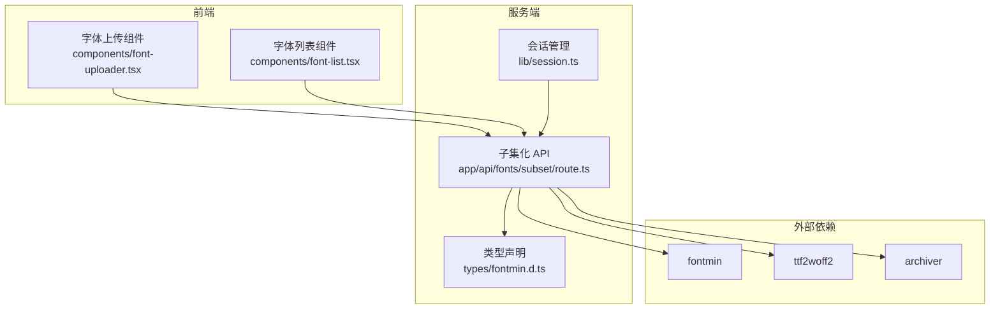
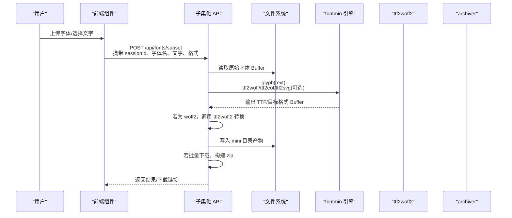
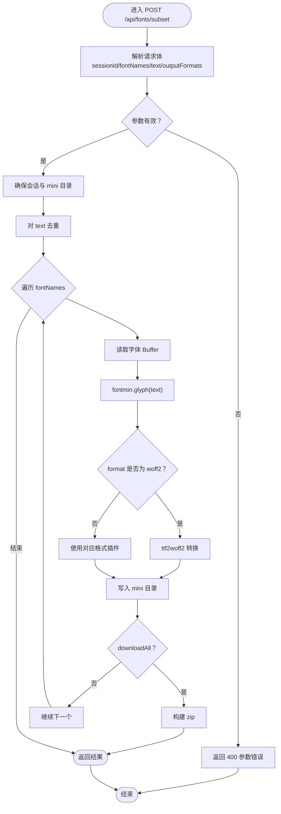
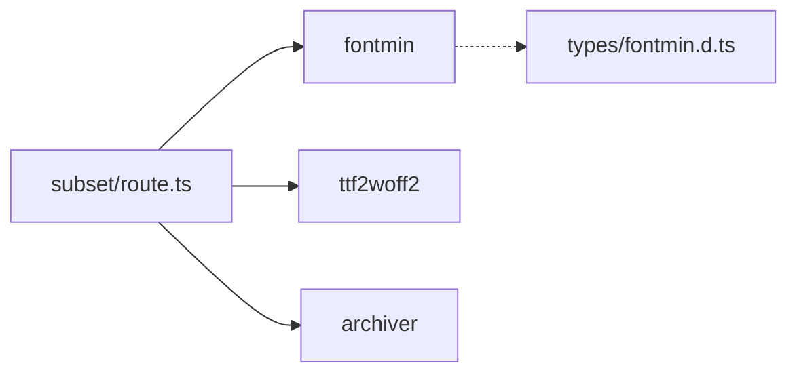

# 性能优化策略

<cite>
**本文引用的文件**
- [README.md](file://README.md)
- [app/api/fonts/subset/route.ts](file://app/api/fonts/subset/route.ts)
- [types/fontmin.d.ts](file://types/fontmin.d.ts)
- [lib/session.ts](file://lib/session.ts)
- [components/font-uploader.tsx](file://components/font-uploader.tsx)
- [components/font-list.tsx](file://components/font-list.tsx)
- [package.json](file://package.json)
</cite>

## 目录
1. [引言](#引言)
2. [项目结构](#项目结构)
3. [核心组件](#核心组件)
4. [架构总览](#架构总览)
5. [详细组件分析](#详细组件分析)
6. [依赖分析](#依赖分析)
7. [性能考量](#性能考量)
8. [故障排查指南](#故障排查指南)
9. [结论](#结论)
10. [附录](#附录)

## 引言
本文件面向字体子集化处理的性能优化，聚焦服务端处理流程中的性能瓶颈与优化机会，系统阐述内存使用优化策略（含大文件与流式处理）、CPU 密集型任务优化与并行策略、处理时间估算模型与资源消耗分析、缓存与重复处理避免机制、不同字体大小与字符集复杂度对性能的影响、性能监控指标与调试工具使用方法，以及生产环境下的调优建议与最佳实践。

## 项目结构
该项目采用 Next.js App Router 结构，前端组件通过 API 路由对接服务端处理逻辑。字体子集化核心位于 API 路由中，使用 fontmin 作为子集化引擎，结合 ttf2woff2、archiver 等工具完成格式转换与打包。

图表来源
- [app/api/fonts/subset/route.ts](file://app/api/fonts/subset/route.ts#L1-L366)
- [types/fontmin.d.ts](file://types/fontmin.d.ts#L1-L53)
- [lib/session.ts](file://lib/session.ts#L1-L34)
- [components/font-uploader.tsx](file://components/font-uploader.tsx#L1-L166)
- [components/font-list.tsx](file://components/font-list.tsx#L1-L159)

章节来源
- [README.md](file://README.md#L135-L161)
- [package.json](file://package.json#L1-L78)

## 核心组件
- 子集化 API 路由：负责接收请求、校验参数、加载字体、调用 fontmin 子集化、按需转换格式、写入结果、打包下载等。
- 字体上传组件：支持多格式拖拽/选择，过滤非 TTF/OTF/WOFF/WOFF2/EOT/SVG，提示 Fontmin 仅支持 TTF 输入。
- 字体列表组件：展示已上传字体、全选/删除、状态反馈。
- 会话管理：生成并持久化会话 ID，用于用户隔离与路径定位。
- 类型声明：fontmin 插件签名与文件结构，明确处理流程的输入输出形态。

章节来源
- [app/api/fonts/subset/route.ts](file://app/api/fonts/subset/route.ts#L164-L366)
- [components/font-uploader.tsx](file://components/font-uploader.tsx#L17-L166)
- [components/font-list.tsx](file://components/font-list.tsx#L34-L159)
- [lib/session.ts](file://lib/session.ts#L1-L34)
- [types/fontmin.d.ts](file://types/fontmin.d.ts#L1-L53)

## 架构总览
下图展示从用户上传到生成子集字体的端到端流程，以及关键性能关注点（内存、CPU、IO）：

图表来源
- [app/api/fonts/subset/route.ts](file://app/api/fonts/subset/route.ts#L164-L366)
- [types/fontmin.d.ts](file://types/fontmin.d.ts#L18-L45)

## 详细组件分析

### 子集化 API 流程与性能分析
- 请求解析与参数校验：校验 sessionId、字体名数组、文字内容；若缺失或为空则直接返回错误。
- 会话目录与 mini 目录：确保用户专属临时目录存在，避免 IO 错误。
- 文本去重：对输入文字做去重，减少 glyph 提取开销。
- 单字体多格式处理：逐格式调用 processFont，内部使用 fontmin 插件链，最后根据格式决定是否额外转换为 woff2。
- 结果写入与打包：将产物写入 mini 目录，若批量下载则使用 archiver 创建 zip。
- 错误处理：捕获并分类错误，返回结构化错误信息。

图表来源
- [app/api/fonts/subset/route.ts](file://app/api/fonts/subset/route.ts#L164-L366)

章节来源
- [app/api/fonts/subset/route.ts](file://app/api/fonts/subset/route.ts#L164-L366)

### 字体上传与预处理
- 支持多格式选择/拖拽，但仅接受指定扩展名；提示 Fontmin 仅支持 TTF 输入。
- 前端展示文件名与大小，便于用户预估处理规模。

章节来源
- [components/font-uploader.tsx](file://components/font-uploader.tsx#L17-L166)

### 字体列表与交互
- 展示已上传字体，支持全选/反选、逐项删除。
- 删除操作不影响永久备份目录（font-source），仅影响会话临时目录。

章节来源
- [components/font-list.tsx](file://components/font-list.tsx#L34-L159)

### 会话与路径隔离
- 会话 ID 生成与持久化，确保用户数据隔离与幂等处理。
- 临时目录按会话划分，便于清理与审计。

章节来源
- [lib/session.ts](file://lib/session.ts#L1-L34)
- [README.md](file://README.md#L180-L221)

## 依赖分析
- fontmin：核心子集化引擎，提供 glyph、ttf2woff、ttf2eot、ttf2svg 等插件。
- ttf2woff2：将 TTF 转换为 WOFF2。
- archiver：ZIP 打包，支持压缩级别配置。
- 类型声明：明确插件签名与文件结构，便于静态检查与 IDE 支持。

图表来源
- [app/api/fonts/subset/route.ts](file://app/api/fonts/subset/route.ts#L1-L10)
- [types/fontmin.d.ts](file://types/fontmin.d.ts#L1-L53)
- [package.json](file://package.json#L41-L65)

章节来源
- [package.json](file://package.json#L41-L65)
- [types/fontmin.d.ts](file://types/fontmin.d.ts#L18-L45)

## 性能考量

### 内存使用优化与大文件处理
- 当前实现：读取整个字体文件为 Buffer，传入 fontmin 处理，再写回磁盘。该方式在字体较大时会占用较多堆内存峰值。
- 优化建议：
  - 流式处理：在可能的情况下，将字体读取与插件链处理改为流式管道，避免一次性加载整文件到内存。
  - 分块处理：对超大字体分块读取与处理，降低峰值内存。
  - 及时释放：处理完成后尽快释放中间 Buffer，避免长时间持有。
  - 产物复用：对相同输入（字体+文字+格式）的结果进行缓存，避免重复计算。
  - 临时目录清理：定期清理过期会话目录，释放磁盘空间，间接缓解内存压力。

章节来源
- [app/api/fonts/subset/route.ts](file://app/api/fonts/subset/route.ts#L247-L253)
- [README.md](file://README.md#L222-L242)

### CPU 密集型任务优化与并行策略
- 当前实现：串行处理每个字体与每种格式组合，未启用并发。
- 优化建议：
  - 并行化：对不同字体之间启用并发（受 CPU 核心数限制），对同一字体的不同格式也应并行处理。
  - 限流与背压：引入并发池与队列，避免 CPU 与 IO 过载。
  - 插件链优化：确保 glyph 提取与格式转换插件的顺序合理，减少不必要的中间步骤。
  - 依赖库优化：升级至最新稳定版 fontmin、ttf2woff2，利用其内部优化。

章节来源
- [app/api/fonts/subset/route.ts](file://app/api/fonts/subset/route.ts#L231-L295)

### 处理时间估算模型与资源消耗
- 影响因素：
  - 字体大小：原始字体越大，读取、解析、写入耗时越高。
  - 字符集复杂度：文字数量越多、Unicode 范围越广，glyph 提取与路径计算越复杂。
  - 格式转换：woff2 转换通常比其他格式更耗时。
  - 并发度：并发度越高，吞吐量越大，但 CPU/IO 峰值也越高。
- 估算思路：
  - 基线：以单字体单格式为基准，记录读取、处理、写入、转换各阶段耗时。
  - 线性外推：按字体数量与格式数量线性扩展。
  - 并发修正：考虑并发度与资源上限，估算总耗时。
  - 建议：在生产环境部署基准测试，收集真实数据以校准模型。

章节来源
- [app/api/fonts/subset/route.ts](file://app/api/fonts/subset/route.ts#L255-L295)

### 缓存策略与重复处理避免
- 结果缓存：对“字体路径 + 去重后的文字 + 输出格式”作为键，缓存产物 Buffer，命中则直接返回下载链接。
- 会话内去重：前端已对文字做去重，服务端可进一步基于哈希键进行二次去重判断。
- 产物复用：若用户多次请求相同格式，优先返回已生成产物，避免重复转换。

章节来源
- [app/api/fonts/subset/route.ts](file://app/api/fonts/subset/route.ts#L215-L217)
- [app/api/fonts/subset/route.ts](file://app/api/fonts/subset/route.ts#L259-L263)

### 不同字体大小与字符集复杂度的影响
- 字体大小：直接影响 IO 与内存占用，大字体会显著增加读取与写入时间。
- 字符集复杂度：影响 glyph 提取与路径计算，复杂字符集（如 CJK、表情符号）会增加处理时间。
- 格式差异：woff2 转换成本最高，ttf2woff/ttf2eot/ttf2svg 成本相对较低。

章节来源
- [components/font-uploader.tsx](file://components/font-uploader.tsx#L117-L119)
- [app/api/fonts/subset/route.ts](file://app/api/fonts/subset/route.ts#L82-L116)

### 性能监控指标与调试工具
- 指标建议：
  - 处理时延：单字体/批量平均时延、P95/P99。
  - 内存占用：RSS、堆内存峰值、GC 次数与暂停时间。
  - CPU 利用率：用户态/系统态 CPU 百分比。
  - IO 吞吐：读写速率、磁盘队列长度。
  - 错误率：4xx/5xx 比例、超时比例。
- 调试工具：
  - Node.js Profiler：火焰图定位热点函数。
  - Heap Snapshot：检测内存泄漏与大对象。
  - Linux perf/strace：观察系统调用与阻塞点。
  - 日志采样：对关键路径打点，记录耗时与事件。

章节来源
- [app/api/fonts/subset/route.ts](file://app/api/fonts/subset/route.ts#L39-L161)

### 生产环境调优建议与最佳实践
- 部署建议：
  - 使用 PM2/Cluster 模式，按 CPU 核心数启动进程，配合负载均衡。
  - 设置合理的 Node.js 堆大小与 GC 参数，避免频繁 Full GC。
  - 对静态资源与产物启用 CDN，减轻服务端压力。
- 处理策略：
  - 批量处理：合并多个子集化请求，减少上下文切换。
  - 超时控制：为单次处理设置超时阈值，避免长尾阻塞。
  - 限流与熔断：根据 CPU/内存/IO 指标动态调整并发度。
- 存储与清理：
  - 定期清理 font-temp 中过期会话目录，避免磁盘膨胀。
  - 对 font-source 做容量监控与备份策略。

章节来源
- [README.md](file://README.md#L222-L242)
- [package.json](file://package.json#L5-L10)

## 故障排查指南
- 常见问题与定位：
  - 会话缺失：检查请求头 x-font-session-id 是否正确传递。
  - 字体不存在：确认会话目录是否存在且包含目标字体。
  - 非 TTF 格式：Fontmin 仅支持 TTF 输入，需提示用户转换或上传 TTF。
  - 处理失败：查看日志中的错误堆栈，定位具体插件或转换环节。
- 排查步骤：
  - 启用详细日志，记录每个阶段耗时与 Buffer 大小。
  - 对超大字体进行分步验证，确认是读取、处理还是写入阶段瓶颈。
  - 使用性能分析工具定位热点函数与内存分配点。

章节来源
- [app/api/fonts/subset/route.ts](file://app/api/fonts/subset/route.ts#L167-L213)
- [app/api/fonts/subset/route.ts](file://app/api/fonts/subset/route.ts#L240-L245)
- [app/api/fonts/subset/route.ts](file://app/api/fonts/subset/route.ts#L289-L294)

## 结论
本项目在前端交互与服务端处理上具备清晰的职责边界。性能优化的关键在于：以流式与分块策略降低内存峰值、通过并发与限流提升吞吐、以缓存避免重复计算、以监控与基准测试持续迭代。建议在生产环境中结合资源上限与业务负载，制定动态并发策略与清理策略，确保稳定性与可维护性。

## 附录
- 关键实现参考路径：
  - 子集化主流程：[app/api/fonts/subset/route.ts](file://app/api/fonts/subset/route.ts#L164-L366)
  - 字体去重与格式处理：[app/api/fonts/subset/route.ts](file://app/api/fonts/subset/route.ts#L215-L295)
  - 类型声明与插件签名：[types/fontmin.d.ts](file://types/fontmin.d.ts#L18-L45)
  - 会话 ID 生成：[lib/session.ts](file://lib/session.ts#L1-L34)
  - 上传组件与格式提示：[components/font-uploader.tsx](file://components/font-uploader.tsx#L17-L166)
  - 字体列表与删除交互：[components/font-list.tsx](file://components/font-list.tsx#L34-L159)
  - 依赖与脚本：[package.json](file://package.json#L1-L78)