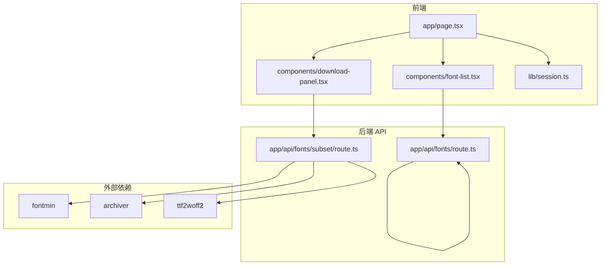
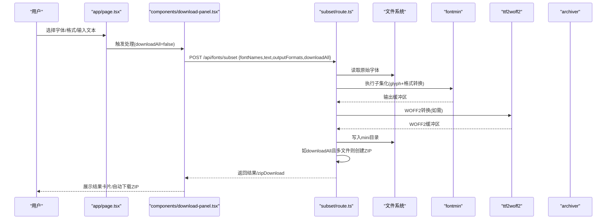
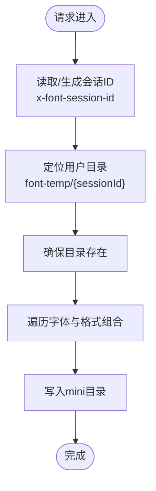
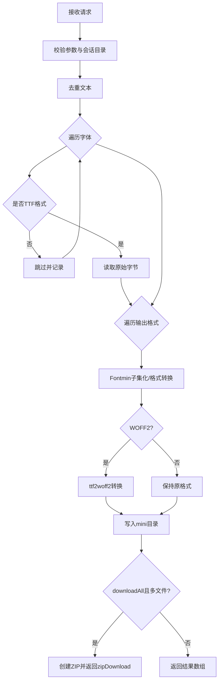
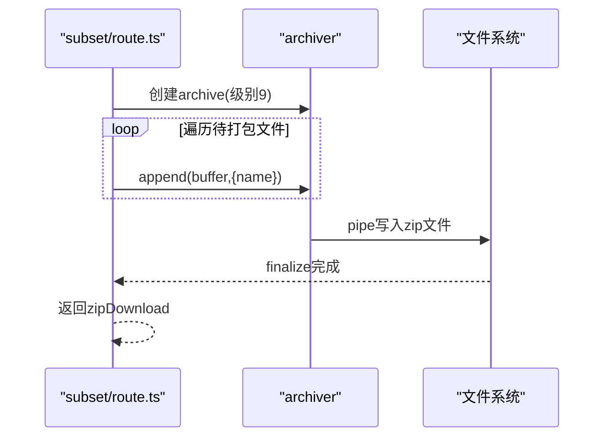
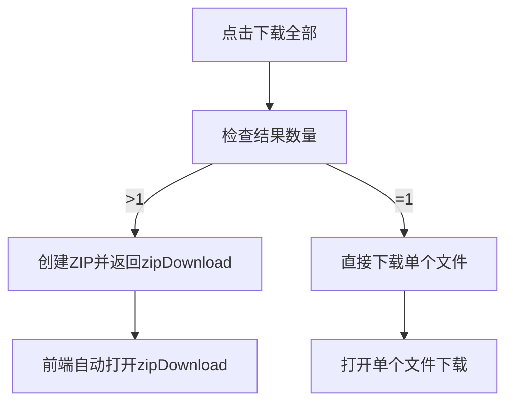
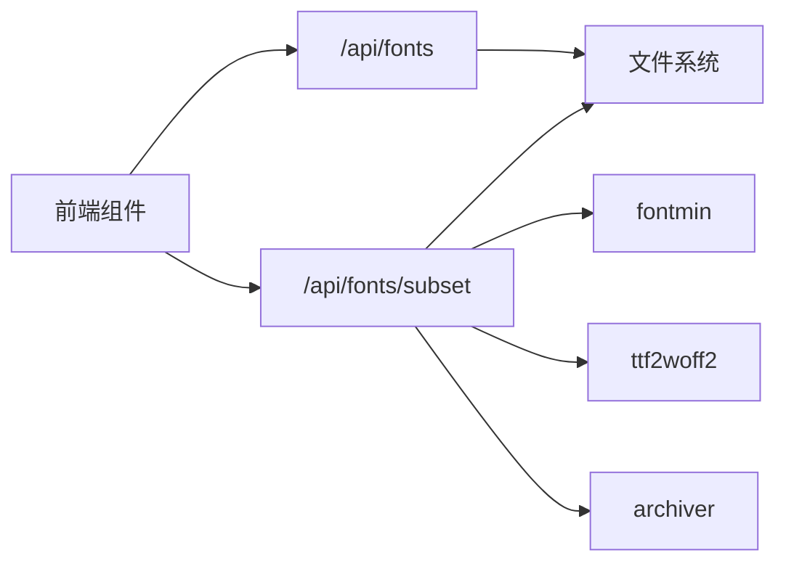

# 批量处理机制

<cite>
**本文引用的文件**
- [README.md](file://README.md)
- [app/api/fonts/route.ts](file://app/api/fonts/route.ts)
- [app/api/fonts/subset/route.ts](file://app/api/fonts/subset/route.ts)
- [components/download-panel.tsx](file://components/download-panel.tsx)
- [components/font-list.tsx](file://components/font-list.tsx)
- [app/page.tsx](file://app/page.tsx)
- [lib/session.ts](file://lib/session.ts)
- [types/fontmin.d.ts](file://types/fontmin.d.ts)
- [package.json](file://package.json)
</cite>

## 目录
1. [简介](#简介)
2. [项目结构](#项目结构)
3. [核心组件](#核心组件)
4. [架构总览](#架构总览)
5. [详细组件分析](#详细组件分析)
6. [依赖关系分析](#依赖关系分析)
7. [性能考虑](#性能考虑)
8. [故障排查指南](#故障排查指南)
9. [结论](#结论)
10. [附录](#附录)

## 简介
本文件系统性阐述该字体子集化工具的批量处理机制，涵盖多字体文件并发处理的架构设计、并发控制策略、性能优化与资源管理、ZIP 打包实现（含压缩级别与内存管理）、downloadAll 参数的工作原理与用户体验设计、进度与状态管理、性能基准与优化建议，以及错误隔离与容错策略。

## 项目结构
该项目采用 Next.js App Router 的前后端一体化架构，前端通过页面组件与 UI 组件协作，后端通过 App Router 的 API 路由提供服务。批量处理涉及以下关键路径：
- 前端页面与交互：app/page.tsx、components/download-panel.tsx、components/font-list.tsx
- 会话与目录隔离：lib/session.ts、app/api/fonts/route.ts
- 批量子集化与 ZIP 打包：app/api/fonts/subset/route.ts
- 类型声明：types/fontmin.d.ts
- 依赖与技术栈：package.json

图表来源
- [app/page.tsx](file://app/page.tsx#L1-L279)
- [components/download-panel.tsx](file://components/download-panel.tsx#L1-L295)
- [components/font-list.tsx](file://components/font-list.tsx#L1-L159)
- [lib/session.ts](file://lib/session.ts#L1-L34)
- [app/api/fonts/route.ts](file://app/api/fonts/route.ts#L1-L167)
- [app/api/fonts/subset/route.ts](file://app/api/fonts/subset/route.ts#L1-L366)
- [types/fontmin.d.ts](file://types/fontmin.d.ts#L1-L53)
- [package.json](file://package.json#L1-L78)

章节来源
- [README.md](file://README.md#L135-L160)
- [package.json](file://package.json#L11-L65)

## 核心组件
- 会话与目录隔离：基于请求头 x-font-session-id 识别用户会话，确保每个用户拥有独立的临时目录与备份目录，实现数据隔离与隐私保护。
- 字体上传与列表：支持多文件上传，自动备份至永久目录；列表展示与全选、删除等交互。
- 批量子集化与 ZIP 打包：接收选定字体、目标文本、输出格式集合与 downloadAll 标志，逐个处理并按需打包。
- 下载面板：提供格式选择、处理状态反馈、单个/批量下载触发与自动 ZIP 下载。

章节来源
- [app/api/fonts/route.ts](file://app/api/fonts/route.ts#L16-L34)
- [app/api/fonts/subset/route.ts](file://app/api/fonts/subset/route.ts#L164-L366)
- [components/download-panel.tsx](file://components/download-panel.tsx#L44-L94)
- [components/font-list.tsx](file://components/font-list.tsx#L34-L67)

## 架构总览
批量处理的端到端流程如下：
- 前端页面加载字体列表，用户选择字体与输出格式，输入待提取文本。
- 用户点击“生成精简字体包”，前端调用 /api/fonts/subset，携带 selectedFonts、text、outputFormats、downloadAll。
- 后端按顺序遍历每个字体与格式组合，调用 Fontmin 进行子集化，必要时使用 ttf2woff2 转换为 WOFF2，并将结果写入 mini 目录。
- 若 downloadAll 为真且存在多个文件，后端使用 archiver 以最高压缩级别创建 ZIP 包，返回 zipDownload 地址。
- 前端收到响应后渲染结果卡片，若存在 zipDownload 则自动触发下载。

图表来源
- [app/page.tsx](file://app/page.tsx#L113-L145)
- [components/download-panel.tsx](file://components/download-panel.tsx#L68-L94)
- [app/api/fonts/subset/route.ts](file://app/api/fonts/subset/route.ts#L164-L366)

## 详细组件分析

### 会话与目录隔离机制
- 会话标识：前端通过 lib/session.ts 生成或复用会话 ID，并在每次请求头中携带 x-font-session-id。
- 目录结构：每个会话对应一个独立的临时目录，用于存放本次会话的上传与生成文件；同时将上传文件备份至永久目录，实现“会话过期自动清理、备份持久保留”的数据生命周期管理。
- 并发控制：由于目录隔离，不同会话之间互不干扰；同一会话内的并发处理由后端顺序遍历与文件写入保证一致性。

图表来源
- [lib/session.ts](file://lib/session.ts#L1-L34)
- [app/api/fonts/route.ts](file://app/api/fonts/route.ts#L16-L34)
- [app/api/fonts/subset/route.ts](file://app/api/fonts/subset/route.ts#L164-L213)

章节来源
- [lib/session.ts](file://lib/session.ts#L1-L34)
- [app/api/fonts/route.ts](file://app/api/fonts/route.ts#L16-L34)
- [README.md](file://README.md#L191-L221)

### 批量子集化与并发控制策略
- 输入参数：fontNames、text、outputFormats、downloadAll。
- 文本去重：对输入文本进行去重，减少重复字符带来的处理开销。
- 并发模型：后端采用顺序遍历（for...of）处理每个字体与格式组合，避免高并发导致的资源争用与磁盘写入冲突；对于大文件与多格式，建议在前端限制一次性处理的字体数量以保障交互流畅。
- 格式支持：Fontmin 支持 glyph 提取与多种格式转换；WOFF2 通过 ttf2woff2 单独转换，确保兼容性与质量。
- 错误隔离：每个字体/格式组合的错误被捕获并记录，不影响其他文件的处理；最终汇总错误信息返回给前端。

图表来源
- [app/api/fonts/subset/route.ts](file://app/api/fonts/subset/route.ts#L164-L366)
- [types/fontmin.d.ts](file://types/fontmin.d.ts#L1-L53)

章节来源
- [app/api/fonts/subset/route.ts](file://app/api/fonts/subset/route.ts#L164-L366)
- [types/fontmin.d.ts](file://types/fontmin.d.ts#L18-L45)

### ZIP 打包实现（文件合并、压缩级别与内存管理）
- 文件合并：将满足 downloadAll 条件的多个文件缓冲区加入归档流。
- 压缩级别：使用 archiver 的 zlib.level=9，追求最高压缩比。
- 内存管理：采用流式写入（createWriteStream + archive.pipe），避免将整个 ZIP 全部加载到内存；每个文件以 Buffer 形式 append，适合中小规模批量文件。
- 下载体验：后端返回 zipDownload URL，前端检测到 zipDownload 后自动打开新窗口触发下载。

图表来源
- [app/api/fonts/subset/route.ts](file://app/api/fonts/subset/route.ts#L313-L342)

章节来源
- [app/api/fonts/subset/route.ts](file://app/api/fonts/subset/route.ts#L313-L342)
- [package.json](file://package.json#L41-L41)

### downloadAll 参数工作原理与用户体验设计
- 工作原理：downloadAll=true 时，后端在处理每个字体与格式组合后，将输出缓冲区收集到 filesToZip 列表；当结果数量大于 0 时，创建 ZIP 并返回 zipDownload。
- 用户体验：
  - 成功提示：展示“生成成功”横幅与文件数量。
  - 单文件：显示“下载”按钮；多文件：显示“下载全部”按钮。
  - 自动下载：前端检测到 zipDownload 后自动在新窗口打开下载链接。
  - 顺序下载：提供“依次下载”逻辑（逐个打开下载链接，带短延迟），便于用户感知每个文件的下载过程。

图表来源
- [components/download-panel.tsx](file://components/download-panel.tsx#L68-L100)
- [app/api/fonts/subset/route.ts](file://app/api/fonts/subset/route.ts#L313-L342)

章节来源
- [components/download-panel.tsx](file://components/download-panel.tsx#L68-L100)
- [app/api/fonts/subset/route.ts](file://app/api/fonts/subset/route.ts#L313-L342)

### 进度跟踪与状态管理机制
- 前端状态：
  - isProcessing：处理中禁用按钮与交互。
  - results：存储每个输出文件的名称、原始/精简大小、下载链接等。
  - zipDownloadUrl：ZIP 下载地址。
  - error：错误信息。
- 后端状态：
  - results：累积每个字体/格式组合的处理结果。
  - skippedFonts：非 TTF 格式被跳过的字体列表。
  - errors：各组合处理失败的错误明细。
- 前端渲染：根据 results 分组展示，计算压缩率，提供单个下载与批量下载入口。

章节来源
- [components/download-panel.tsx](file://components/download-panel.tsx#L44-L94)
- [app/api/fonts/subset/route.ts](file://app/api/fonts/subset/route.ts#L218-L310)

### 错误隔离与容错处理策略
- 输入校验：缺少字体、文本为空、会话目录不存在时返回明确错误。
- 格式过滤：仅处理 TTF 格式，非 TTF 字体记录到 skippedFonts 并跳过。
- 异常捕获：每个字体/格式组合的处理异常被捕获并记录，不影响其他文件。
- 最终汇总：若无有效结果，返回聚合错误信息与细节列表，便于用户定位问题。

章节来源
- [app/api/fonts/subset/route.ts](file://app/api/fonts/subset/route.ts#L195-L214)
- [app/api/fonts/subset/route.ts](file://app/api/fonts/subset/route.ts#L240-L246)
- [app/api/fonts/subset/route.ts](file://app/api/fonts/subset/route.ts#L288-L310)

## 依赖关系分析
- 字体处理链路：前端 -> subset/route.ts -> fontmin -> ttf2woff2（WOFF2）。
- 打包链路：subset/route.ts -> archiver -> 文件系统。
- 会话与目录：subset/route.ts 依赖 session.ts 生成的会话 ID，结合 fonts/route.ts 的目录结构实现隔离。

图表来源
- [app/api/fonts/route.ts](file://app/api/fonts/route.ts#L1-L167)
- [app/api/fonts/subset/route.ts](file://app/api/fonts/subset/route.ts#L1-L366)
- [package.json](file://package.json#L41-L63)

章节来源
- [package.json](file://package.json#L41-L63)
- [types/fontmin.d.ts](file://types/fontmin.d.ts#L1-L53)

## 性能考虑
- 并发与吞吐：
  - 当前实现为顺序处理，避免磁盘争用与内存峰值；适合中小规模批量（建议单次不超过 10–20 个文件）。
  - 对于大规模批量，建议在前端限制并发数（例如分批处理），或在后端引入队列与限流。
- 压缩与 I/O：
  - ZIP 使用 zlib.level=9，压缩比高但 CPU 开销较大；对超大文件集建议提供“低/中/高”压缩级别选项。
  - 流式写入避免内存峰值，适合中等规模批量；超大规模建议分卷或分批下载。
- 文本处理：
  - 输入文本去重减少重复字符处理成本，建议在前端也做预处理（如去除多余空白）。
- 缓存与复用：
  - 对相同文本与格式的重复处理，可在后端增加缓存键（sessionId + textHash + formats），命中则直接复用 mini 目录产物。
- 资源回收：
  - 处理完成后及时释放 Buffer，避免长时间持有大对象；ZIP 流结束后关闭写入流。
- 前端交互：
  - 处理期间禁用按钮与滚动条，提供骨架屏或进度指示器，改善长任务体验。

[本节为通用性能建议，无需特定文件引用]

## 故障排查指南
- 常见错误与定位：
  - “未找到上传的字体，请重新上传”：检查会话目录是否存在，确认上传成功。
  - “请选择字体/请输入需要提取的文字”：确认前端已选择字体与输入文本。
  - “Fontmin 仅支持 TTF 格式的字体文件”：确认上传为 TTF 格式，非 TTF 将被跳过。
  - “处理失败：...”：查看后端日志中的 details，定位具体失败的字体/格式组合。
- 日志与调试：
  - 后端在关键节点打印日志（开始/结束、文件大小、转换过程），便于定位瓶颈。
  - 前端在 catch 中统一弹窗提示，建议扩展为 Toast 或错误面板。
- 会话与数据：
  - 刷新页面会清空会话数据（Cookie 未过期时保留），若出现数据丢失，确认会话是否过期。

章节来源
- [app/api/fonts/subset/route.ts](file://app/api/fonts/subset/route.ts#L195-L214)
- [app/api/fonts/subset/route.ts](file://app/api/fonts/subset/route.ts#L297-L310)
- [README.md](file://README.md#L213-L221)

## 结论
该批量处理机制以会话隔离为核心，结合顺序处理与流式 ZIP 打包，在保证数据安全与用户体验的同时，实现了多字体、多格式的高效子集化。通过 downloadAll 参数与自动下载设计，显著提升了批量下载的便捷性。未来可在前端分批处理、后端队列与缓存、压缩级别可配置等方面进一步优化，以支撑更大规模的批量场景。

[本节为总结性内容，无需特定文件引用]

## 附录

### API 定义概览
- GET /api/fonts
  - 功能：列出当前会话上传的字体
  - 请求头：x-font-session-id
  - 响应：fonts 数组（id/name/path）
- POST /api/fonts
  - 功能：上传多个字体文件
  - 请求体：multipart/form-data，字段名 fonts
  - 响应：message 与 fonts 数组
- DELETE /api/fonts?name={fontName}
  - 功能：删除会话中的指定字体（不删除备份）
  - 响应：message
- POST /api/fonts/subset
  - 功能：批量子集化与可选 ZIP 打包
  - 请求体：{ fontNames[], text, outputFormats[], downloadAll:boolean }
  - 响应：results 数组与可选 zipDownload

章节来源
- [app/api/fonts/route.ts](file://app/api/fonts/route.ts#L36-L69)
- [app/api/fonts/route.ts](file://app/api/fonts/route.ts#L71-L127)
- [app/api/fonts/route.ts](file://app/api/fonts/route.ts#L129-L167)
- [app/api/fonts/subset/route.ts](file://app/api/fonts/subset/route.ts#L164-L366)