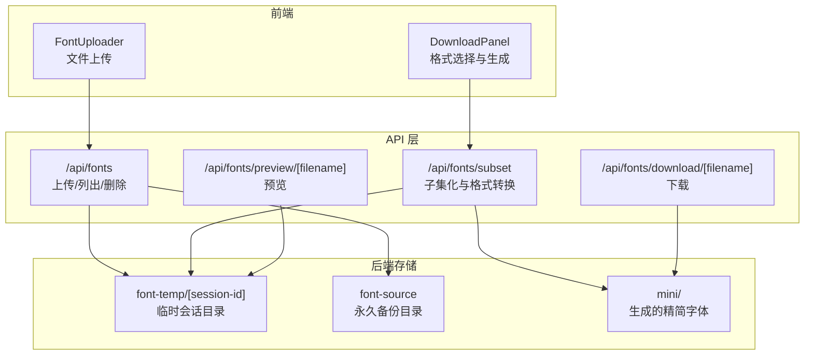
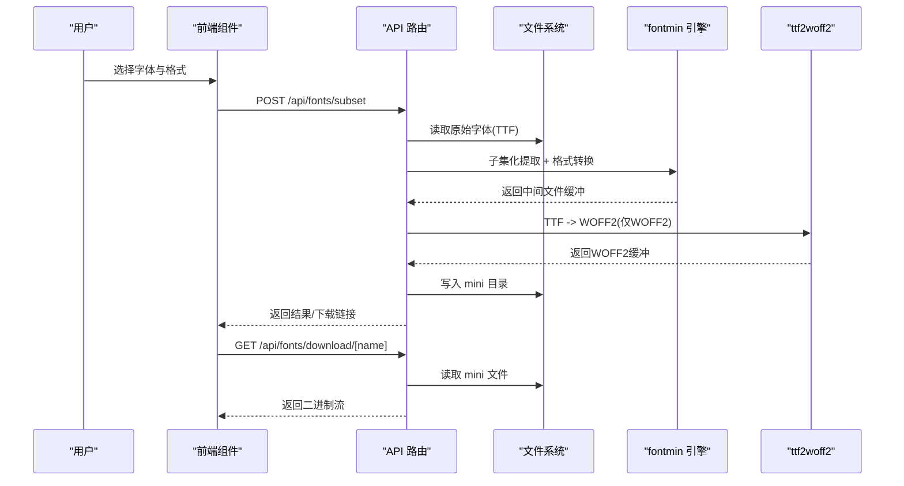
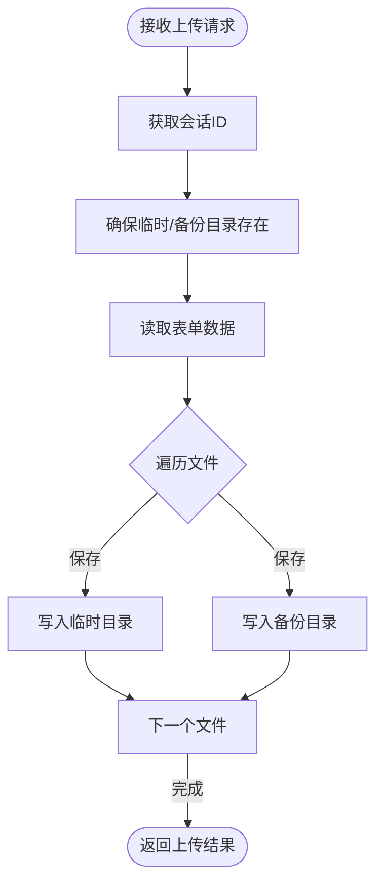
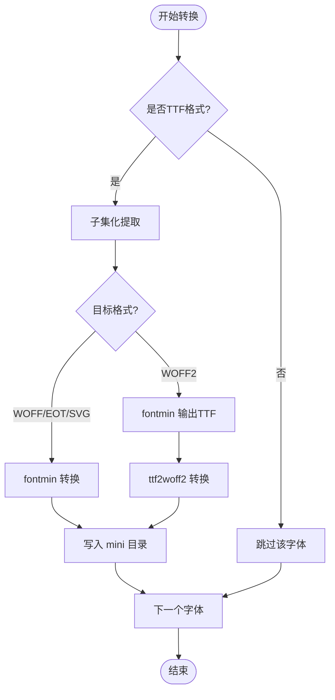
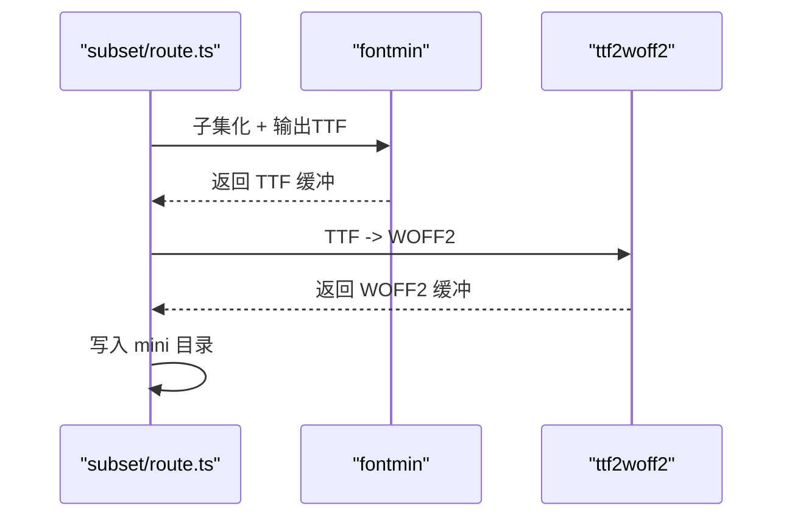
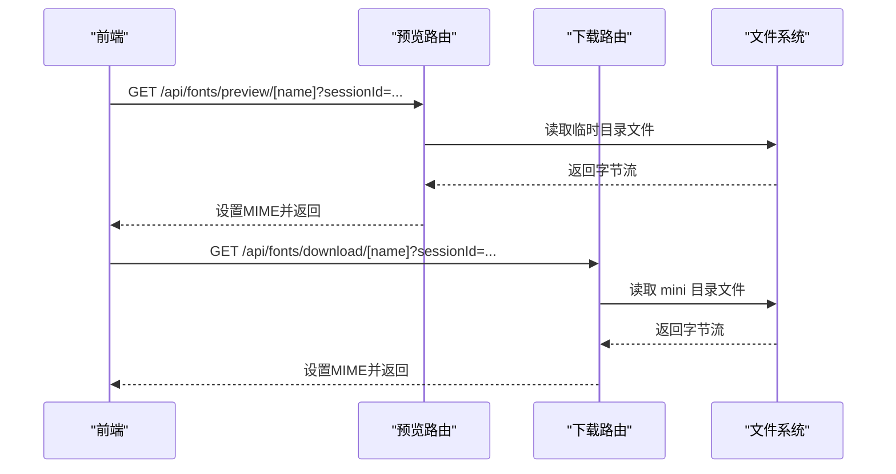
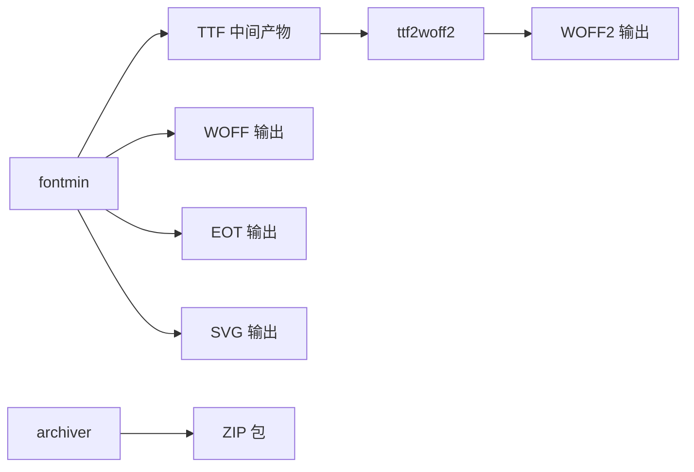

# 格式转换流程

<cite>
**本文档引用的文件**
- [README.md](file://README.md)
- [package.json](file://package.json)
- [app/api/fonts/route.ts](file://app/api/fonts/route.ts)
- [app/api/fonts/subset/route.ts](file://app/api/fonts/subset/route.ts)
- [app/api/fonts/download/[filename]/route.ts](file://app/api/fonts/download/[filename]/route.ts)
- [app/api/fonts/preview/[filename]/route.ts](file://app/api/fonts/preview/[filename]/route.ts)
- [components/font-uploader.tsx](file://components/font-uploader.tsx)
- [components/download-panel.tsx](file://components/download-panel.tsx)
- [lib/session.ts](file://lib/session.ts)
- [types/fontmin.d.ts](file://types/fontmin.d.ts)
</cite>

## 目录
1. [简介](#简介)
2. [项目结构](#项目结构)
3. [核心组件](#核心组件)
4. [架构总览](#架构总览)
5. [详细组件分析](#详细组件分析)
6. [依赖关系分析](#依赖关系分析)
7. [性能考量](#性能考量)
8. [故障排除指南](#故障排除指南)
9. [结论](#结论)
10. [附录](#附录)

## 简介
本文件系统性阐述字体格式转换流程，覆盖从 TTF 到 WOFF、WOFF2、EOT、SVG 的完整转换链路，重点解析 WOFF2 的两阶段转换机制（先子集化提取 TTF，再用 ttf2woff2 转换为 WOFF2）。文档还提供各格式的适用场景与性能特征、质量与兼容性对比、错误处理与回退策略、输出命名规则与存储位置，以及最佳实践与性能优化建议。

## 项目结构
该工具基于 Next.js 16 构建，采用 App Router，核心逻辑集中在 API 层与前端组件层：
- API 层负责字体上传、预览、子集化与格式转换、打包下载
- 前端组件负责用户交互、格式选择、结果展示与下载触发
- 会话隔离通过请求头携带的会话 ID 实现，数据持久化与临时目录分离

图表来源
- [app/api/fonts/route.ts](file://app/api/fonts/route.ts#L1-L167)
- [app/api/fonts/subset/route.ts](file://app/api/fonts/subset/route.ts#L1-L366)
- [app/api/fonts/download/[filename]/route.ts](file://app/api/fonts/download/[filename]/route.ts#L1-L62)
- [app/api/fonts/preview/[filename]/route.ts](file://app/api/fonts/preview/[filename]/route.ts#L1-L61)

章节来源
- [README.md](file://README.md#L135-L160)
- [package.json](file://package.json#L1-L78)

## 核心组件
- 会话管理：通过请求头携带的会话 ID 实现用户隔离，避免跨用户数据泄露
- 字体上传与备份：上传的字体同时写入临时会话目录与永久备份目录
- 子集化与转换：基于 fontmin 进行子集化提取，结合 ttf2woff2 实现 WOFF2 的两阶段转换
- 下载与预览：按扩展名映射 MIME 类型，支持单文件与打包下载

章节来源
- [lib/session.ts](file://lib/session.ts#L1-L34)
- [app/api/fonts/route.ts](file://app/api/fonts/route.ts#L16-L34)
- [app/api/fonts/subset/route.ts](file://app/api/fonts/subset/route.ts#L164-L366)
- [app/api/fonts/download/[filename]/route.ts](file://app/api/fonts/download/[filename]/route.ts#L1-L62)
- [app/api/fonts/preview/[filename]/route.ts](file://app/api/fonts/preview/[filename]/route.ts#L1-L61)

## 架构总览
整体流程：用户上传字体 → 服务端保存至临时目录与备份目录 → 选择目标格式 → 子集化提取 → 格式转换 → 写入 mini 目录 → 下载或打包下载。

图表来源
- [app/api/fonts/subset/route.ts](file://app/api/fonts/subset/route.ts#L32-L162)
- [app/api/fonts/download/[filename]/route.ts](file://app/api/fonts/download/[filename]/route.ts#L1-L62)

## 详细组件分析

### 字体上传与会话隔离
- 会话 ID 来源于请求头，若不存在则使用默认值
- 临时目录按会话 ID 分离，确保不同用户数据隔离
- 上传的字体同时写入临时目录与永久备份目录，便于后续恢复与管理

图表来源
- [app/api/fonts/route.ts](file://app/api/fonts/route.ts#L72-L127)

章节来源
- [app/api/fonts/route.ts](file://app/api/fonts/route.ts#L16-L34)
- [app/api/fonts/route.ts](file://app/api/fonts/route.ts#L72-L127)

### 子集化与格式转换（核心）
- 输入限制：fontmin 仅支持 TTF 作为输入进行子集化
- 子集化：根据用户输入的字符集合提取对应字形
- 格式转换：
  - WOFF/EOT/SVG：直接使用 fontmin 的转换插件
  - WOFF2：两阶段转换
    1) 先由 fontmin 输出 TTF
    2) 再用 ttf2woff2 将 TTF 转为 WOFF2
- 输出命名：以“原文件名_Lite.格式”命名，统一存放于 mini 目录
- 错误处理：对每种格式分别捕获异常，记录详细错误信息并返回

图表来源
- [app/api/fonts/subset/route.ts](file://app/api/fonts/subset/route.ts#L25-L162)

章节来源
- [app/api/fonts/subset/route.ts](file://app/api/fonts/subset/route.ts#L25-L162)
- [types/fontmin.d.ts](file://types/fontmin.d.ts#L18-L45)

### WOFF2 两阶段转换详解
- 第一阶段：fontmin 子集化后输出 TTF（WOFF2 专用中间产物）
- 第二阶段：ttf2woff2 将 TTF 转为 WOFF2，实现最佳压缩率
- 错误处理：若找不到 TTF 或转换失败，抛出明确错误并终止该格式处理

图表来源
- [app/api/fonts/subset/route.ts](file://app/api/fonts/subset/route.ts#L82-L116)

章节来源
- [app/api/fonts/subset/route.ts](file://app/api/fonts/subset/route.ts#L82-L116)

### 下载与预览
- 预览：读取临时目录中的原始字体，按扩展名设置 MIME 类型
- 下载：读取 mini 目录中的生成文件，按扩展名设置 MIME 类型；支持 ZIP 打包下载

图表来源
- [app/api/fonts/preview/[filename]/route.ts](file://app/api/fonts/preview/[filename]/route.ts#L1-L61)
- [app/api/fonts/download/[filename]/route.ts](file://app/api/fonts/download/[filename]/route.ts#L1-L62)

章节来源
- [app/api/fonts/preview/[filename]/route.ts](file://app/api/fonts/preview/[filename]/route.ts#L1-L61)
- [app/api/fonts/download/[filename]/route.ts](file://app/api/fonts/download/[filename]/route.ts#L1-L62)

### 前端交互组件
- 字体上传组件：支持拖拽/选择、多文件、格式过滤
- 下载面板：格式选择、字符数统计、结果展示、批量下载

章节来源
- [components/font-uploader.tsx](file://components/font-uploader.tsx#L15-L166)
- [components/download-panel.tsx](file://components/download-panel.tsx#L30-L295)

## 依赖关系分析
- fontmin：提供子集化与多种格式转换插件（glyph、ttf2woff、ttf2woff2、ttf2eot、ttf2svg 等）
- ttf2woff2：WOFF2 转换专用库
- archiver：ZIP 打包
- MIME 映射：根据扩展名设置响应头

图表来源
- [types/fontmin.d.ts](file://types/fontmin.d.ts#L18-L45)
- [package.json](file://package.json#L41-L65)

章节来源
- [package.json](file://package.json#L41-L65)
- [types/fontmin.d.ts](file://types/fontmin.d.ts#L1-L53)

## 性能考量
- 子集化收益：仅包含用户输入字符对应的字形，显著减小文件体积
- WOFF2 压缩：两阶段转换实现最佳压缩率，适合现代浏览器
- 并发处理：逐字体逐格式处理，避免阻塞；ZIP 打包在内存中拼接，注意大文件内存占用
- I/O 优化：临时目录与备份目录分离，减少重复读写；下载前检查文件存在性

[本节为通用性能建议，不直接分析具体文件]

## 故障排除指南
常见问题与处理：
- 未找到会话或字体：检查请求头是否包含会话 ID，确认临时目录是否存在
- 未返回文件：确认输入为 TTF 格式，且子集化后确实生成中间文件
- WOFF2 转换失败：检查中间 TTF 是否存在，确认 ttf2woff2 转换过程无异常
- 下载失败：确认 mini 目录下目标文件存在，扩展名与 MIME 映射正确
- 批量下载：若 ZIP 创建失败，检查磁盘空间与权限

章节来源
- [app/api/fonts/subset/route.ts](file://app/api/fonts/subset/route.ts#L170-L366)
- [app/api/fonts/download/[filename]/route.ts](file://app/api/fonts/download/[filename]/route.ts#L25-L53)

## 结论
本工具通过 fontmin 与 ttf2woff2 的组合，实现了从 TTF 到 WOFF、WOFF2、EOT、SVG 的高效子集化与转换。WOFF2 的两阶段转换确保最佳压缩率，配合会话隔离与双存储策略，兼顾性能与数据安全。建议优先选择 WOFF2 以获得最优体积与兼容性平衡。

[本节为总结性内容，不直接分析具体文件]

## 附录

### 输出命名规则与存储位置
- 命名规则：原文件名 + “_Lite.” + 扩展名
- 存储位置：
  - 临时会话目录：font-temp/[session-id]（原始字体与会话数据）
  - 生成目录：font-temp/[session-id]/mini（精简字体）
  - 永久备份目录：font-source（所有上传字体的备份）

章节来源
- [app/api/fonts/subset/route.ts](file://app/api/fonts/subset/route.ts#L266-L283)
- [README.md](file://README.md#L179-L189)

### 各格式适用场景与性能特点
- TTF：通用性强，兼容性最好，体积较大
- WOFF：兼容现代浏览器，体积适中
- WOFF2：压缩率最高，现代浏览器广泛支持，体积最小
- EOT：IE 系列浏览器支持，兼容性有限
- SVG：矢量字体，适合特定场景，体积与渲染性能因字体而异

章节来源
- [README.md](file://README.md#L27-L33)
- [components/download-panel.tsx](file://components/download-panel.tsx#L30-L36)

### 质量与兼容性对比
- 质量：子集化保证仅包含所需字符，避免无关字形影响
- 兼容性：WOFF2 为现代首选；如需 IE 支持可考虑 EOT；通用兼容可选 WOFF/TTF
- 建议：优先 WOFF2；如需 IE 支持，同时输出 EOT

[本节为通用对比说明，不直接分析具体文件]

### 最佳实践与性能优化建议
- 输入格式：确保上传 TTF，以获得最佳子集化效果
- 文本去重：前端已对输入文本去重，建议保持字符集合简洁
- 格式选择：优先 WOFF2；如需 IE 支持，同时输出 EOT
- 批量下载：大文件建议分批下载，避免一次性打包导致内存压力
- 会话管理：合理设置会话超时，定期清理临时目录

章节来源
- [components/font-uploader.tsx](file://components/font-uploader.tsx#L117-L119)
- [components/download-panel.tsx](file://components/download-panel.tsx#L68-L89)
- [README.md](file://README.md#L222-L241)