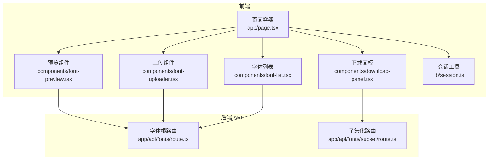
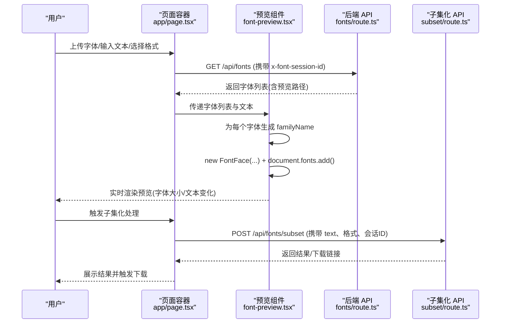
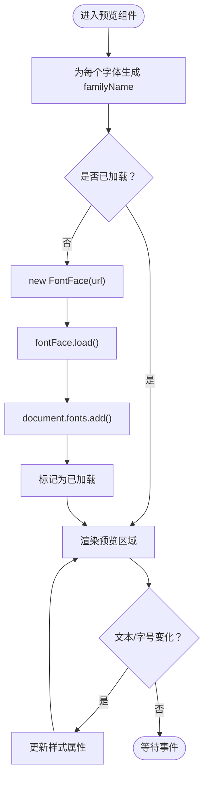
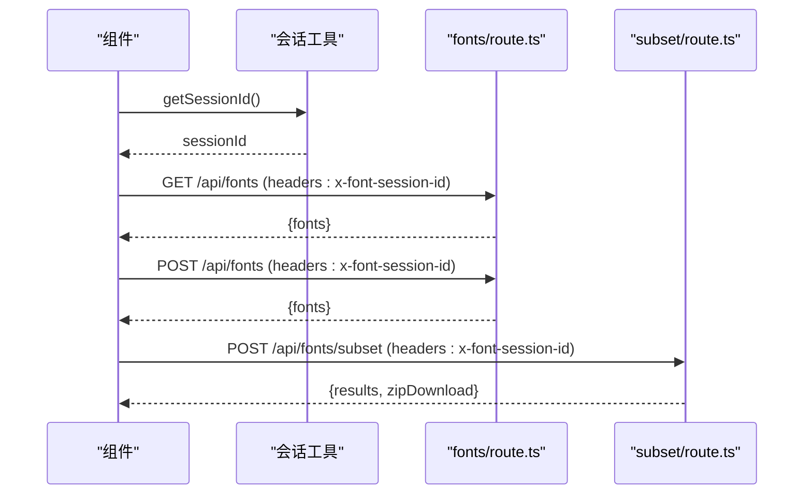
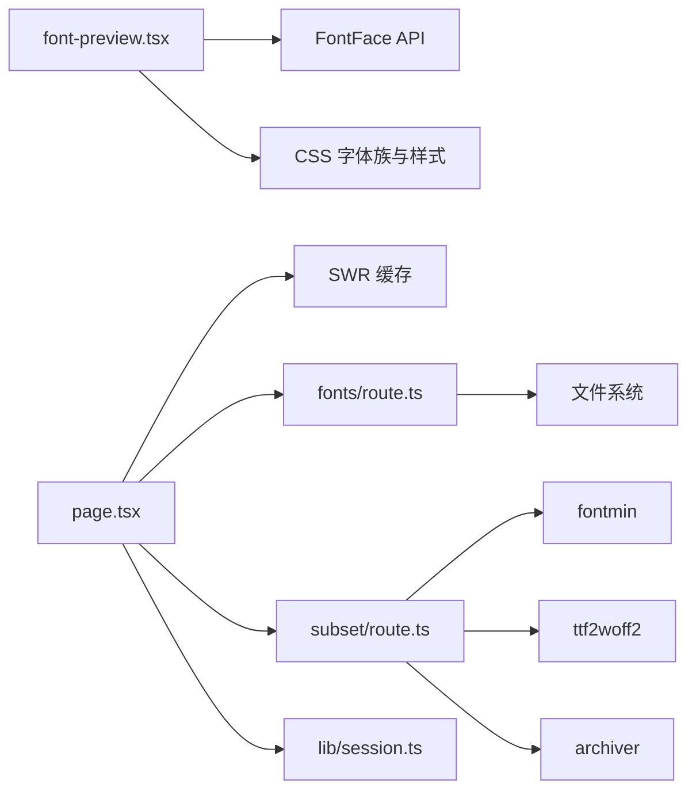

# 实时预览功能

<cite>
**本文引用的文件**
- [app/page.tsx](file://app/page.tsx)
- [components/font-preview.tsx](file://components/font-preview.tsx)
- [components/font-uploader.tsx](file://components/font-uploader.tsx)
- [components/font-list.tsx](file://components/font-list.tsx)
- [components/download-panel.tsx](file://components/download-panel.tsx)
- [app/api/fonts/route.ts](file://app/api/fonts/route.ts)
- [app/api/fonts/subset/route.ts](file://app/api/fonts/subset/route.ts)
- [lib/session.ts](file://lib/session.ts)
- [types/fontmin.d.ts](file://types/fontmin.d.ts)
- [README.md](file://README.md)
</cite>

## 目录
1. [简介](#简介)
2. [项目结构](#项目结构)
3. [核心组件](#核心组件)
4. [架构总览](#架构总览)
5. [组件详解](#组件详解)
6. [依赖关系分析](#依赖关系分析)
7. [性能考量](#性能考量)
8. [故障排查指南](#故障排查指南)
9. [结论](#结论)
10. [附录](#附录)

## 简介
本文件聚焦“实时预览”功能，系统阐述前端预览组件的实现机制、与后端上传/处理流程的集成方式、缓存与性能优化策略，以及数据传输与存储机制。重点覆盖：
- 动态字体加载与 FontFace API 使用
- 实时渲染效果与用户交互（字体大小、文本输入、样式切换）
- 预览服务工作原理与会话隔离
- 与上传、子集化处理流程的衔接
- 性能优化与兼容性处理
- 预览数据的传输与存储路径

## 项目结构
该应用采用 Next.js App Router，预览功能主要由页面容器、预览组件、上传组件、列表组件与下载面板构成；后端通过 API 路由提供上传、预览字体路径、子集化处理与下载能力。

图表来源
- [app/page.tsx](file://app/page.tsx#L1-L279)
- [components/font-preview.tsx](file://components/font-preview.tsx#L1-L123)
- [components/font-uploader.tsx](file://components/font-uploader.tsx#L1-L166)
- [components/font-list.tsx](file://components/font-list.tsx#L1-L159)
- [components/download-panel.tsx](file://components/download-panel.tsx#L1-L295)
- [lib/session.ts](file://lib/session.ts#L1-L34)
- [app/api/fonts/route.ts](file://app/api/fonts/route.ts#L1-L167)
- [app/api/fonts/subset/route.ts](file://app/api/fonts/subset/route.ts#L1-L366)

章节来源
- [app/page.tsx](file://app/page.tsx#L1-L279)
- [README.md](file://README.md#L135-L160)

## 核心组件
- 页面容器负责状态管理、调用后端 API、触发 SWR 刷新与子集化请求。
- 预览组件负责动态加载字体、实时渲染文本、提供字体大小滑条与文本输入。
- 上传组件负责拖拽/选择文件、过滤格式、触发上传。
- 字体列表负责展示已上传字体、选择/删除。
- 下载面板负责选择输出格式、触发子集化处理、展示结果与下载。
- 会话工具负责生成/持久化会话 ID，贯穿前后端请求头。

章节来源
- [app/page.tsx](file://app/page.tsx#L14-L145)
- [components/font-preview.tsx](file://components/font-preview.tsx#L1-L123)
- [components/font-uploader.tsx](file://components/font-uploader.tsx#L1-L166)
- [components/font-list.tsx](file://components/font-list.tsx#L1-L159)
- [components/download-panel.tsx](file://components/download-panel.tsx#L1-L295)
- [lib/session.ts](file://lib/session.ts#L1-L34)

## 架构总览
实时预览的端到端流程如下：

图表来源
- [app/page.tsx](file://app/page.tsx#L14-L145)
- [components/font-preview.tsx](file://components/font-preview.tsx#L34-L48)
- [app/api/fonts/route.ts](file://app/api/fonts/route.ts#L36-L69)
- [app/api/fonts/subset/route.ts](file://app/api/fonts/subset/route.ts#L164-L366)

## 组件详解

### 预览组件（动态字体加载与实时渲染）
- 动态字体加载
  - 为每个字体生成唯一的 familyName，避免冲突。
  - 使用 FontFace API 异步加载字体并加入 document.fonts，标记已加载集合，避免重复加载。
  - 加载失败时记录错误，不影响其他字体。
- 实时渲染
  - 文本输入框支持多行，预设默认文本。
  - 字体大小通过滑条控制，实时影响预览区域的字号。
  - 预览区域按字体逐项渲染，显示“已加载/加载中”状态。
- 用户交互
  - 文本输入：父级状态驱动，子组件通过回调更新。
  - 字号滑条：本地状态驱动，实时生效。
  - 样式切换：通过 CSS 变量与 Tailwind 类名组合实现，无需额外状态。

图表来源
- [components/font-preview.tsx](file://components/font-preview.tsx#L24-L48)

章节来源
- [components/font-preview.tsx](file://components/font-preview.tsx#L1-L123)

### 页面容器（状态管理与流程编排）
- 会话 ID
  - 通过会话工具生成并注入到请求头，保证用户隔离。
- 数据获取
  - 使用 SWR 获取字体列表，刷新间隔为 0，手动触发刷新。
- 上传/删除
  - 上传：构造 FormData，发送 POST 请求，成功后触发 SWR 刷新并自动选中新上传字体。
  - 删除：发送 DELETE 请求，成功后刷新列表并清除选中。
- 子集化处理
  - 发送 POST 至子集化 API，携带选中字体、文本与输出格式，返回结果或打包下载链接。

图表来源
- [app/page.tsx](file://app/page.tsx#L14-L145)
- [lib/session.ts](file://lib/session.ts#L1-L34)
- [app/api/fonts/route.ts](file://app/api/fonts/route.ts#L36-L127)
- [app/api/fonts/subset/route.ts](file://app/api/fonts/subset/route.ts#L164-L366)

章节来源
- [app/page.tsx](file://app/page.tsx#L14-L145)
- [lib/session.ts](file://lib/session.ts#L1-L34)

### 上传组件（文件选择与过滤）
- 支持拖拽与点击选择，过滤 .ttf/.otf/.woff/.woff2/.eot/.svg。
- 显示已选文件列表与大小，支持移除。
- 触发上传时清空选择列表。

章节来源
- [components/font-uploader.tsx](file://components/font-uploader.tsx#L1-L166)

### 字体列表（选择与删除）
- 展示字体名称与选中状态，支持全选/反选。
- 删除弹窗确认，仅删除当前会话目录中的文件，保留永久备份。

章节来源
- [components/font-list.tsx](file://components/font-list.tsx#L1-L159)

### 下载面板（格式选择与处理触发）
- 选择输出格式（TTF/WOFF/WOFF2/EOT/SVG），支持全选。
- 触发子集化处理，展示压缩统计与下载链接；支持单个/打包下载。

章节来源
- [components/download-panel.tsx](file://components/download-panel.tsx#L1-L295)

## 依赖关系分析
- 前端依赖
  - React Hooks（useState/useMemo/useEffect）、SWR（数据获取与缓存）、UI 组件库（Tailwind/Radix）。
  - 会话 ID 通过自定义工具生成并注入请求头。
- 后端依赖
  - 文件系统读写、路径拼接、字体处理（fontmin）、格式转换（ttf2woff2）、打包（archiver）。
- 类型定义
  - fontmin 的类型声明，明确 glyph、各格式转换插件与运行回调签名。

图表来源
- [components/font-preview.tsx](file://components/font-preview.tsx#L34-L48)
- [app/page.tsx](file://app/page.tsx#L14-L145)
- [app/api/fonts/route.ts](file://app/api/fonts/route.ts#L1-L167)
- [app/api/fonts/subset/route.ts](file://app/api/fonts/subset/route.ts#L1-L366)
- [lib/session.ts](file://lib/session.ts#L1-L34)
- [types/fontmin.d.ts](file://types/fontmin.d.ts#L1-L53)

章节来源
- [types/fontmin.d.ts](file://types/fontmin.d.ts#L1-L53)

## 性能考量
- 字体加载优化
  - 使用 document.fonts.add() 并维护已加载集合，避免重复加载。
  - 仅在字体首次出现时触发 FontFace.load()，减少网络与解析开销。
- 渲染优化
  - 预览区域使用固定最大高度与滚动，避免布局抖动。
  - 文本输入与字号变更通过本地状态即时生效，不触发后端请求。
- 请求与缓存
  - SWR 默认关闭轮询，手动刷新，降低无效请求。
  - 会话隔离目录按用户维度组织，避免跨用户干扰。
- 处理性能
  - 子集化前对输入文本去重，减少重复计算。
  - WOFF2 通过 TTF 后处理转换，避免中间文件冗余。
- 兼容性
  - 降级回退至随机 UUID 生成器，适配不支持 crypto.randomUUID 的环境。
  - 字体格式严格限制为 TTF 作为输入，确保处理稳定性。

章节来源
- [components/font-preview.tsx](file://components/font-preview.tsx#L18-L48)
- [app/page.tsx](file://app/page.tsx#L27-L52)
- [app/api/fonts/subset/route.ts](file://app/api/fonts/subset/route.ts#L215-L217)
- [lib/session.ts](file://lib/session.ts#L11-L26)

## 故障排查指南
- 预览字体不显示
  - 检查字体路径是否正确（后端返回的预览路径包含会话参数）。
  - 确认 FontFace 加载是否抛错，查看控制台日志。
  - 确保字体格式为 TTF（子集化输入要求）。
- 上传失败
  - 检查请求头是否包含正确的会话 ID。
  - 确认后端目录存在且可写。
- 子集化处理失败
  - 确认选择了有效字体与非空文本。
  - 查看后端错误响应中的 details 字段定位具体问题。
- 下载链接无效
  - 确认 mini 目录存在且文件已生成。
  - 检查会话 ID 是否匹配。

章节来源
- [app/api/fonts/route.ts](file://app/api/fonts/route.ts#L55-L61)
- [app/api/fonts/subset/route.ts](file://app/api/fonts/subset/route.ts#L195-L204)
- [components/font-preview.tsx](file://components/font-preview.tsx#L44-L46)

## 结论
实时预览功能通过前端动态字体加载与后端会话隔离机制，实现了流畅的“所见即所得”。配合上传、列表与下载面板，形成完整的字体子集化工作流。通过去重文本、按需加载与打包下载等策略，兼顾了性能与用户体验。后续可在字体缓存策略、并发加载与错误重试方面进一步优化。

## 附录
- 预览数据传输与存储机制
  - 上传：前端将文件写入用户会话目录与永久备份目录。
  - 预览：后端返回预览路径，前端通过 FontFace 加载。
  - 处理：后端读取会话目录中的 TTF，使用 fontmin 子集化并生成目标格式，保存至 mini 目录。
  - 下载：后端提供单文件与打包下载链接。
- 自定义与扩展建议
  - 自定义预览效果：在预览组件中增加样式切换（如粗细、斜体、行高等），通过 CSS 变量或类名切换。
  - 扩展预览功能：增加“样式模板”、“多语言示例”、“字符覆盖率统计”等。
  - 性能增强：引入字体缓存（IndexedDB 或内存缓存）、预加载队列、失败重试与进度提示。

章节来源
- [app/api/fonts/route.ts](file://app/api/fonts/route.ts#L93-L114)
- [app/api/fonts/subset/route.ts](file://app/api/fonts/subset/route.ts#L255-L295)
- [README.md](file://README.md#L180-L221)