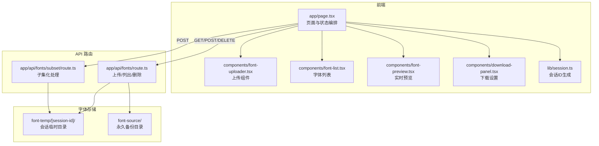
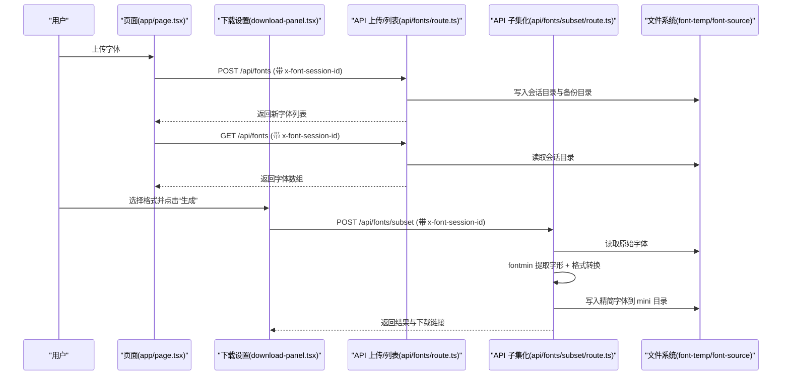
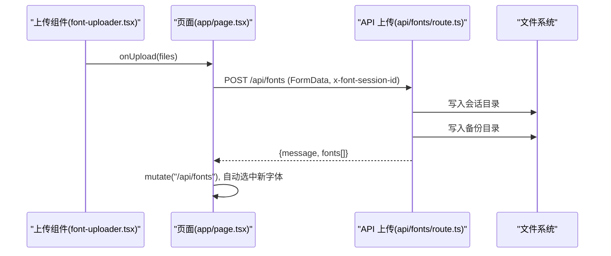
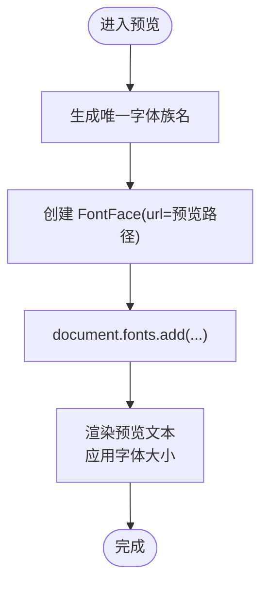
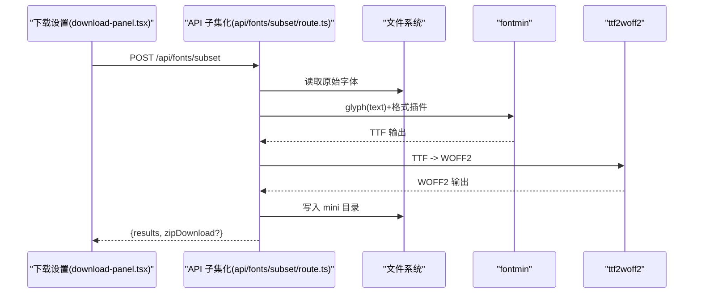
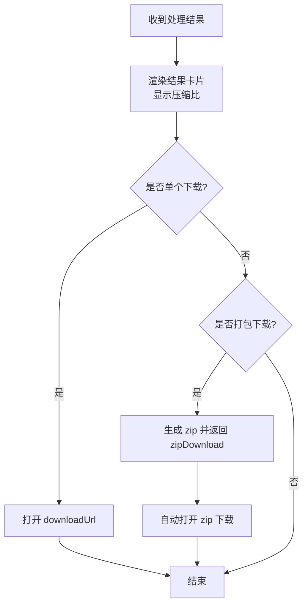
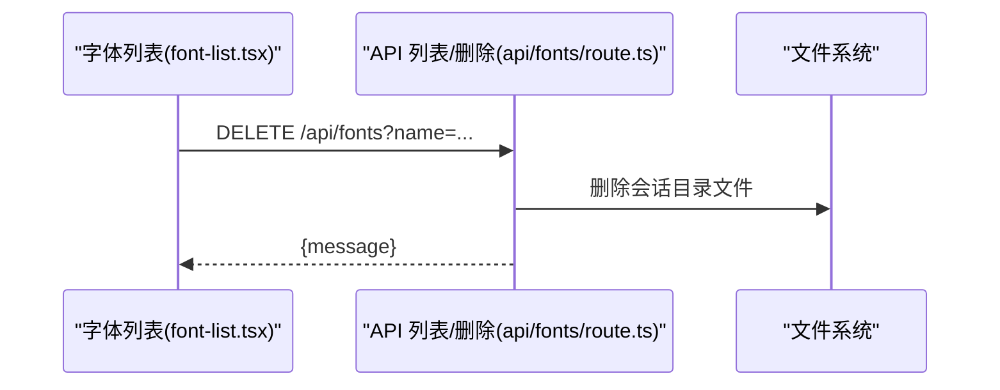
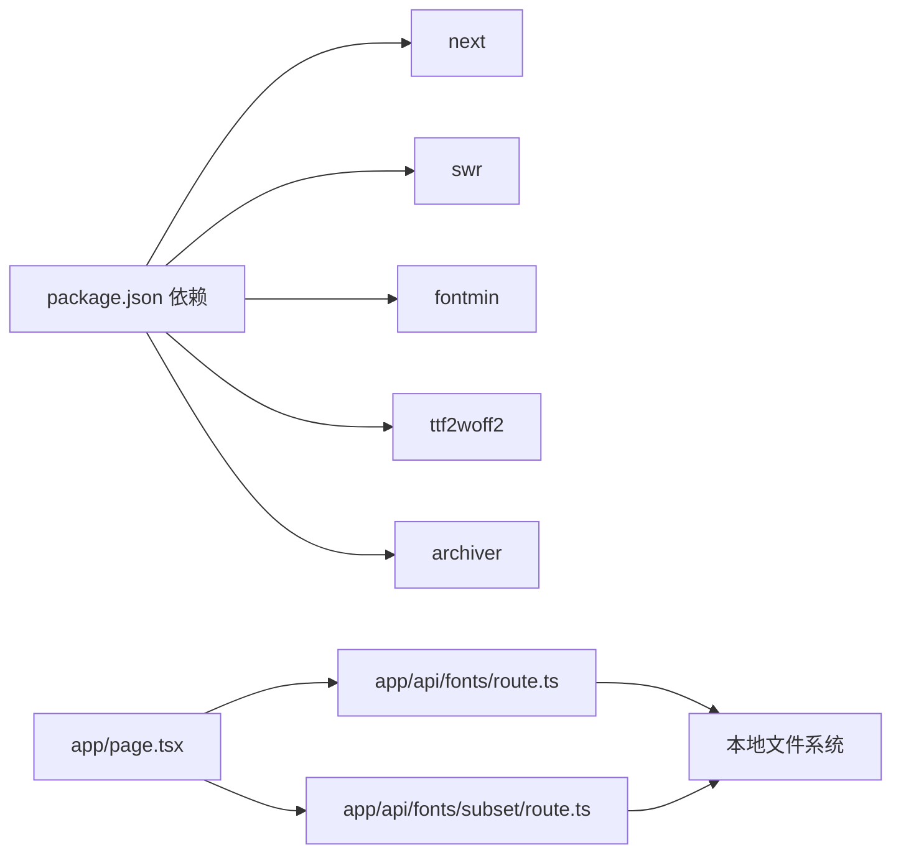

# 核心功能

<cite>
**本文引用的文件**
- [README.md](file://README.md)
- [app/page.tsx](file://app/page.tsx)
- [app/layout.tsx](file://app/layout.tsx)
- [app/api/fonts/route.ts](file://app/api/fonts/route.ts)
- [app/api/fonts/subset/route.ts](file://app/api/fonts/subset/route.ts)
- [components/font-uploader.tsx](file://components/font-uploader.tsx)
- [components/font-list.tsx](file://components/font-list.tsx)
- [components/font-preview.tsx](file://components/font-preview.tsx)
- [components/download-panel.tsx](file://components/download-panel.tsx)
- [lib/session.ts](file://lib/session.ts)
- [types/fontmin.d.ts](file://types/fontmin.d.ts)
- [package.json](file://package.json)
- [test-api.js](file://test-api.js)
</cite>

## 目录
1. [简介](#简介)
2. [项目结构](#项目结构)
3. [核心组件](#核心组件)
4. [架构总览](#架构总览)
5. [详细组件分析](#详细组件分析)
6. [依赖分析](#依赖分析)
7. [性能考虑](#性能考虑)
8. [故障排查指南](#故障排查指南)
9. [结论](#结论)
10. [附录](#附录)

## 简介
本文件面向 FontMin 字体子集化工具的核心功能，系统梳理“字体上传管理、实时预览、子集化处理、结果下载”四大模块的工作原理、技术实现与用户交互流程；解释各模块间的依赖关系与数据流转；提供使用场景、最佳实践与扩展建议。目标是让初学者能顺畅上手，同时为高级用户提供深入的技术细节。

## 项目结构
项目采用 Next.js App Router 架构，前端组件位于 components 与 app 目录，API 路由集中在 app/api 下，字体数据按会话隔离存放于 font-temp，永久备份存放于 font-source。类型声明通过 types/fontmin.d.ts 提供。

图表来源
- [app/page.tsx](file://app/page.tsx#L1-L279)
- [components/font-uploader.tsx](file://components/font-uploader.tsx#L1-L166)
- [components/font-list.tsx](file://components/font-list.tsx#L1-L159)
- [components/font-preview.tsx](file://components/font-preview.tsx#L1-L123)
- [components/download-panel.tsx](file://components/download-panel.tsx#L1-L295)
- [lib/session.ts](file://lib/session.ts#L1-L34)
- [app/api/fonts/route.ts](file://app/api/fonts/route.ts#L1-L167)
- [app/api/fonts/subset/route.ts](file://app/api/fonts/subset/route.ts#L1-L366)

章节来源
- [README.md](file://README.md#L135-L160)
- [package.json](file://package.json#L1-L78)

## 核心组件
- 页面与状态编排：负责发起上传、删除、子集化请求，维护选中字体、预览文本等状态，并通过 SWR 获取字体列表。
- 上传组件：支持拖拽/选择文件，过滤不支持格式，批量选择与移除。
- 字体列表：展示当前会话字体，支持全选、逐项选择与删除。
- 实时预览：动态加载字体路径，渲染输入文本，支持字体大小滑条。
- 下载设置：选择输出格式，触发子集化处理，展示结果与压缩比，支持单个/打包下载。
- 会话管理：生成并注入 x-font-session-id 请求头，保障数据隔离。
- API 路由：实现上传/列出/删除与子集化处理，读写本地文件系统，调用字体处理库。

章节来源
- [app/page.tsx](file://app/page.tsx#L1-L279)
- [components/font-uploader.tsx](file://components/font-uploader.tsx#L1-L166)
- [components/font-list.tsx](file://components/font-list.tsx#L1-L159)
- [components/font-preview.tsx](file://components/font-preview.tsx#L1-L123)
- [components/download-panel.tsx](file://components/download-panel.tsx#L1-L295)
- [lib/session.ts](file://lib/session.ts#L1-L34)
- [app/api/fonts/route.ts](file://app/api/fonts/route.ts#L1-L167)
- [app/api/fonts/subset/route.ts](file://app/api/fonts/subset/route.ts#L1-L366)

## 架构总览
整体采用“前端组件 + Next.js App Router API + 本地文件系统”的轻量级后端架构。前端通过 fetch 与 API 通信，API 读写本地磁盘完成字体的临时会话存储与永久备份，子集化处理基于 fontmin 与 ttf2woff2 等库完成。

图表来源
- [app/page.tsx](file://app/page.tsx#L14-L145)
- [components/download-panel.tsx](file://components/download-panel.tsx#L68-L89)
- [app/api/fonts/route.ts](file://app/api/fonts/route.ts#L72-L127)
- [app/api/fonts/subset/route.ts](file://app/api/fonts/subset/route.ts#L164-L365)

## 详细组件分析

### 字体上传管理
- 功能要点
  - 支持多种字体格式拖拽/选择上传，自动过滤不支持扩展名。
  - 上传成功后同时写入会话临时目录与永久备份目录。
  - 自动选中新上传的字体，便于后续子集化。
- 关键流程
  - 前端收集 File 列表，构造 FormData，携带 x-font-session-id 发起 POST。
  - 后端校验会话目录存在性，逐个写入用户会话目录与备份目录。
  - 返回新上传字体的元数据（含预览路径）。
- 错误处理
  - 无文件、写入失败、会话缺失等情况均返回 4xx/5xx 并提示。

图表来源
- [components/font-uploader.tsx](file://components/font-uploader.tsx#L65-L70)
- [app/page.tsx](file://app/page.tsx#L33-L65)
- [app/api/fonts/route.ts](file://app/api/fonts/route.ts#L72-L127)

章节来源
- [components/font-uploader.tsx](file://components/font-uploader.tsx#L1-L166)
- [app/page.tsx](file://app/page.tsx#L33-L65)
- [app/api/fonts/route.ts](file://app/api/fonts/route.ts#L72-L127)

### 实时预览
- 功能要点
  - 将每个字体映射为唯一的 FontFace 名称，动态加载并渲染输入文本。
  - 提供字体大小滑条，支持中英混排与多语言字符。
- 关键流程
  - 页面根据已选字体生成预览样式，逐个执行 FontFace.load() 并加入 document.fonts。
  - 文本输入变化时即时更新预览区域。
- 性能与体验
  - 仅在字体首次加载时触发 FontFace.load()，避免重复开销。
  - 预设默认文本覆盖常见中英文场景，降低用户输入成本。

图表来源
- [components/font-preview.tsx](file://components/font-preview.tsx#L24-L48)
- [components/font-preview.tsx](file://components/font-preview.tsx#L105-L114)

章节来源
- [components/font-preview.tsx](file://components/font-preview.tsx#L1-L123)
- [app/page.tsx](file://app/page.tsx#L23-L24)

### 子集化处理
- 功能要点
  - 基于 fontmin 提取指定文本的字形，支持输出 TTF、WOFF、WOFF2、EOT、SVG。
  - 对 WOFF2 采用先 TTF 再 ttf2woff2 的两阶段转换策略。
  - 将结果写入会话 mini 目录，生成下载链接；支持打包下载。
- 关键流程
  - 前端传入 selectedFonts、text、outputFormats、downloadAll。
  - 后端校验会话与字体有效性，逐字体逐格式处理，记录压缩比与下载地址。
  - 若 downloadAll 且多文件，生成 zip 并返回 zipDownload。
- 错误处理
  - 不支持格式（非 TTF）、处理失败、找不到输出文件等均返回明确错误信息。

图表来源
- [components/download-panel.tsx](file://components/download-panel.tsx#L68-L89)
- [app/api/fonts/subset/route.ts](file://app/api/fonts/subset/route.ts#L164-L365)
- [types/fontmin.d.ts](file://types/fontmin.d.ts#L1-L53)

章节来源
- [app/api/fonts/subset/route.ts](file://app/api/fonts/subset/route.ts#L1-L366)
- [types/fontmin.d.ts](file://types/fontmin.d.ts#L1-L53)

### 结果下载
- 功能要点
  - 展示每个输出文件的原大小、子集化后大小与压缩百分比。
  - 支持单个下载与“下载全部”（自动触发打包 zip）。
  - 生成的 zip 名称包含时间戳，便于区分多次处理。
- 关键流程
  - 前端接收结果后渲染卡片与操作按钮。
  - 单个下载直接打开 downloadUrl；下载全部时自动触发 zip 下载。

图表来源
- [components/download-panel.tsx](file://components/download-panel.tsx#L206-L291)
- [app/api/fonts/subset/route.ts](file://app/api/fonts/subset/route.ts#L312-L342)

章节来源
- [components/download-panel.tsx](file://components/download-panel.tsx#L1-L295)
- [app/api/fonts/subset/route.ts](file://app/api/fonts/subset/route.ts#L312-L342)

### 字体列表与删除
- 功能要点
  - 展示当前会话字体，支持全选/反选与逐项删除。
  - 删除仅影响会话目录，备份目录保留，符合隐私与数据管理策略。
- 关键流程
  - 前端调用 DELETE /api/fonts?name=...，后端仅删除会话目录对应文件。

图表来源
- [components/font-list.tsx](file://components/font-list.tsx#L49-L54)
- [app/api/fonts/route.ts](file://app/api/fonts/route.ts#L129-L166)

章节来源
- [components/font-list.tsx](file://components/font-list.tsx#L1-L159)
- [app/api/fonts/route.ts](file://app/api/fonts/route.ts#L129-L166)

## 依赖分析
- 前端依赖
  - Next.js 16、React 19、SWR、React Hook Form、Radix UI、Tailwind CSS、Lucide React、next-themes。
- 字体处理依赖
  - fontmin（字形提取与格式转换）、ttf2woff2（TTF→WOFF2）、archiver（ZIP 打包）。
- 会话与存储
  - lib/session.ts 生成 x-font-session-id，API 路由基于该会话隔离读写本地目录。

图表来源
- [package.json](file://package.json#L11-L65)
- [app/page.tsx](file://app/page.tsx#L1-L279)
- [app/api/fonts/route.ts](file://app/api/fonts/route.ts#L1-L167)
- [app/api/fonts/subset/route.ts](file://app/api/fonts/subset/route.ts#L1-L366)

章节来源
- [package.json](file://package.json#L1-L78)
- [lib/session.ts](file://lib/session.ts#L1-L34)

## 性能考虑
- 字体加载与预览
  - 仅在首次加载时执行 FontFace.load()，减少重复网络与解析开销。
  - 预览区域限制最大高度并启用滚动，避免长文本导致的重排压力。
- 子集化处理
  - 仅对 TTF 执行字形提取，其他格式需先转换为 TTF 再处理，避免不必要转换链路。
  - WOFF2 采用“TTF→WOFF2”两步法，确保兼容性与质量。
- 批量与并发
  - 当前实现逐字体逐格式顺序处理，若需提升吞吐可在服务端引入并发队列与进度反馈。
- 存储与清理
  - 临时目录按会话隔离，建议定期清理过期会话目录；备份目录建议定期归档。

## 故障排查指南
- 上传失败
  - 检查 x-font-session-id 是否正确注入；确认会话目录存在且可写；查看后端日志定位具体错误。
- 子集化失败
  - 确认上传字体为 TTF 格式；检查 text 是否为空；查看返回的错误详情与 warnings。
- 预览空白
  - 检查字体路径是否有效；确认 FontFace.load() 成功；查看浏览器控制台是否有跨域或 MIME 类型问题。
- 下载链接无效
  - 确认 mini 目录下是否存在对应文件；检查 downloadUrl 中 sessionId 参数是否匹配当前会话。

章节来源
- [app/api/fonts/route.ts](file://app/api/fonts/route.ts#L129-L166)
- [app/api/fonts/subset/route.ts](file://app/api/fonts/subset/route.ts#L297-L310)
- [components/font-preview.tsx](file://components/font-preview.tsx#L35-L48)

## 结论
本工具以简洁的前后端分离架构实现了完整的字体子集化工作流：上传、预览、处理与下载。通过会话隔离与双存储策略保障隐私与可恢复性；通过 fontmin 与 ttf2woff2 实现高质量的多格式输出。建议在生产环境配合定时清理与备份策略，并可进一步引入并发处理与进度反馈以提升用户体验。

## 附录

### API 调用方式
- 上传字体
  - 方法与路径：POST /api/fonts
  - 请求头：x-font-session-id
  - 请求体：multipart/form-data，字段名为 fonts（可多选）
  - 响应：包含 message 与 fonts 数组
- 列出字体
  - 方法与路径：GET /api/fonts
  - 请求头：x-font-session-id
  - 响应：包含 fonts 数组（含 id、name、path）
- 删除字体
  - 方法与路径：DELETE /api/fonts?name=文件名
  - 请求头：x-font-session-id
  - 响应：包含 message
- 子集化处理
  - 方法与路径：POST /api/fonts/subset
  - 请求头：x-font-session-id
  - 请求体：JSON，字段包括 fontNames、text、outputFormats、downloadAll
  - 响应：results 数组与 zipDownload（可选）

章节来源
- [app/api/fonts/route.ts](file://app/api/fonts/route.ts#L36-L127)
- [app/api/fonts/subset/route.ts](file://app/api/fonts/subset/route.ts#L164-L365)
- [test-api.js](file://test-api.js#L1-L36)

### 使用场景与最佳实践
- 场景
  - 网页字体优化：仅包含页面实际使用的字符，显著减小体积。
  - 移动应用：为 App 提供精简字体资源，缩短下载时间。
  - 电子书制作：仅导出书中出现的文字，提高分发效率。
- 最佳实践
  - 优先使用 WOFF2 作为最终输出格式以获得最佳压缩率。
  - 在预览阶段充分验证中英文混排与特殊符号的显示效果。
  - 对大批量字体处理建议分批进行，避免长时间占用 CPU。
  - 生产部署中定期清理 font-temp 过期会话目录，监控备份目录容量。

章节来源
- [README.md](file://README.md#L35-L41)
- [README.md](file://README.md#L222-L241)