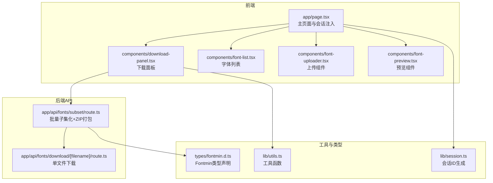
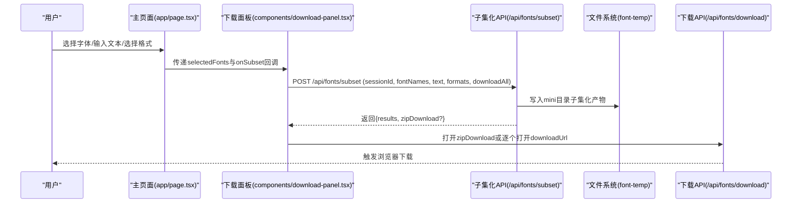
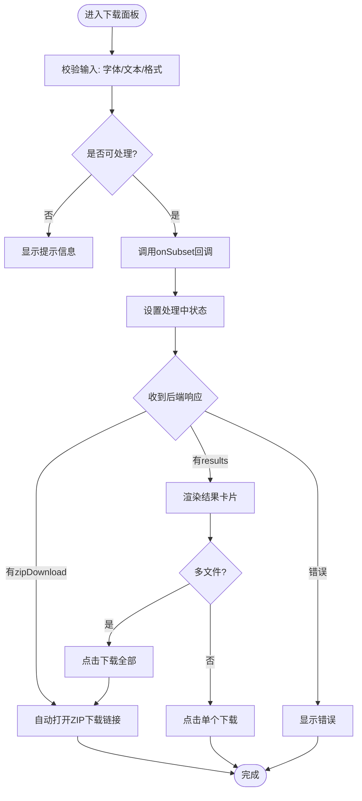
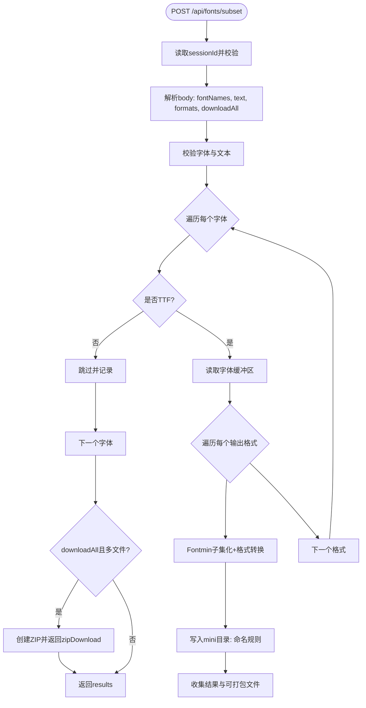
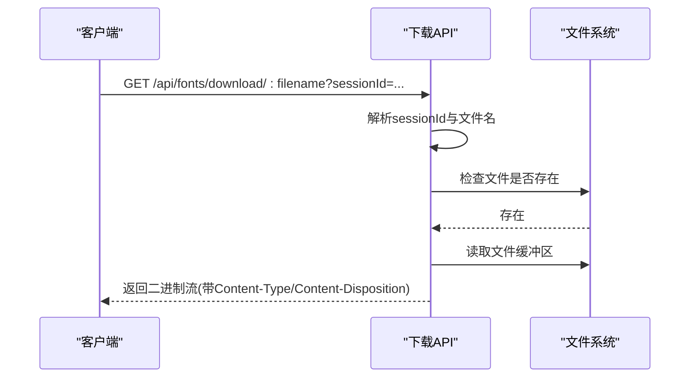
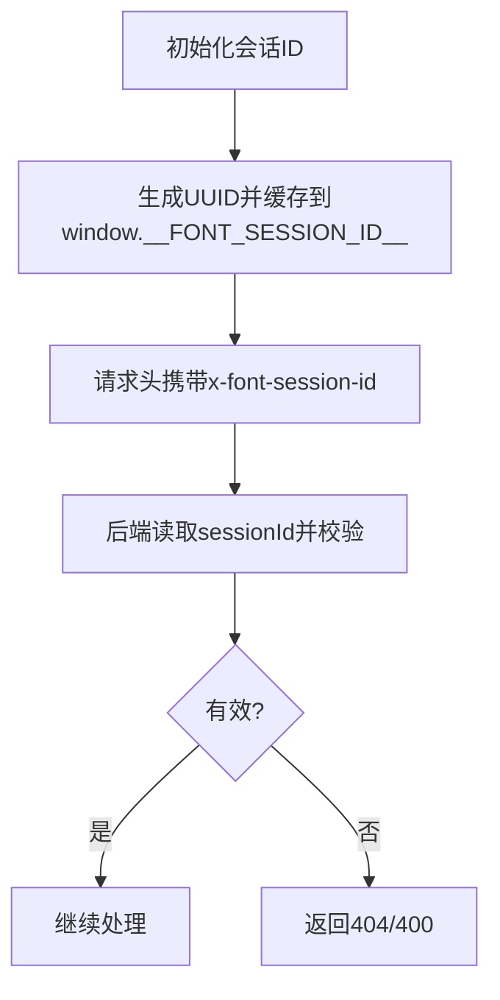
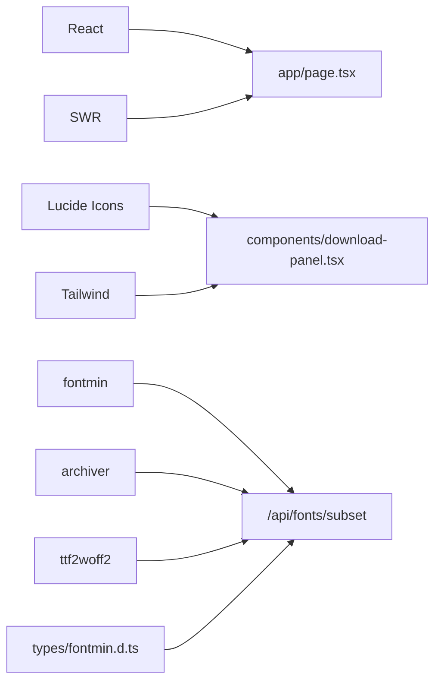

# 结果下载管理

<cite>
**本文档引用的文件**
- [app/page.tsx](file://app/page.tsx)
- [components/download-panel.tsx](file://components/download-panel.tsx)
- [app/api/fonts/subset/route.ts](file://app/api/fonts/subset/route.ts)
- [app/api/fonts/download/[filename]/route.ts](file://app/api/fonts/download/[filename]/route.ts)
- [lib/session.ts](file://lib/session.ts)
- [lib/utils.ts](file://lib/utils.ts)
- [types/fontmin.d.ts](file://types/fontmin.d.ts)
- [components/font-list.tsx](file://components/font-list.tsx)
- [components/font-uploader.tsx](file://components/font-uploader.tsx)
- [components/font-preview.tsx](file://components/font-preview.tsx)
- [hooks/use-toast.ts](file://hooks/use-toast.ts)
- [package.json](file://package.json)
</cite>

## 目录
1. [简介](#简介)
2. [项目结构](#项目结构)
3. [核心组件](#核心组件)
4. [架构总览](#架构总览)
5. [详细组件分析](#详细组件分析)
6. [依赖关系分析](#依赖关系分析)
7. [性能考虑](#性能考虑)
8. [故障排除指南](#故障排除指南)
9. [结论](#结论)
10. [附录](#附录)

## 简介
本文件系统性阐述“结果下载管理”功能的设计与实现，覆盖下载面板交互、单文件下载、批量ZIP打包、下载链接生成机制、命名规则与格式选择、压缩策略、安全与访问控制、统计信息收集与展示、临时文件生命周期管理与清理、性能优化与大文件处理策略、失败重试与错误恢复方案，以及扩展下载行为的实践指导。文档面向开发者与产品/运营人员，既提供高层概览，也给出可落地的技术细节与可视化图示。

## 项目结构
该仓库采用Next.js应用结构，下载管理相关的核心路径如下：
- 前端页面与组件：app/page.tsx、components/download-panel.tsx、components/font-list.tsx、components/font-uploader.tsx、components/font-preview.tsx
- 后端API：app/api/fonts/subset/route.ts（批量子集化与ZIP打包）、app/api/fonts/download/[filename]/route.ts（单文件下载）
- 会话与工具：lib/session.ts、lib/utils.ts
- 类型声明：types/fontmin.d.ts
- 依赖：package.json中包含fontmin、archiver、ttf2woff2等

**图表来源**
- [app/page.tsx](file://app/page.tsx#L1-L279)
- [components/download-panel.tsx](file://components/download-panel.tsx#L1-L295)
- [components/font-list.tsx](file://components/font-list.tsx#L1-L159)
- [components/font-uploader.tsx](file://components/font-uploader.tsx#L1-L166)
- [components/font-preview.tsx](file://components/font-preview.tsx#L1-L123)
- [app/api/fonts/subset/route.ts](file://app/api/fonts/subset/route.ts#L1-L366)
- [app/api/fonts/download/[filename]/route.ts](file://app/api/fonts/download/[filename]/route.ts#L1-L61)
- [lib/session.ts](file://lib/session.ts#L1-L34)
- [lib/utils.ts](file://lib/utils.ts#L1-L7)
- [types/fontmin.d.ts](file://types/fontmin.d.ts#L1-L53)

**章节来源**
- [app/page.tsx](file://app/page.tsx#L1-L279)
- [components/download-panel.tsx](file://components/download-panel.tsx#L1-L295)
- [app/api/fonts/subset/route.ts](file://app/api/fonts/subset/route.ts#L1-L366)
- [app/api/fonts/download/[filename]/route.ts](file://app/api/fonts/download/[filename]/route.ts#L1-L61)
- [lib/session.ts](file://lib/session.ts#L1-L34)
- [lib/utils.ts](file://lib/utils.ts#L1-L7)
- [types/fontmin.d.ts](file://types/fontmin.d.ts#L1-L53)

## 核心组件
- 下载面板（DownloadPanel）：负责格式选择、触发子集化、展示结果、单文件与批量下载、错误提示与处理。
- 批量子集化API（/api/fonts/subset）：接收选定字体、目标文本、输出格式与下载策略，调用Fontmin进行子集化，按需生成ZIP。
- 单文件下载API（/api/fonts/download/[filename]）：根据会话目录与文件名读取临时产物并返回二进制流。
- 主页面（app/page.tsx）：注入会话ID、协调上传/删除/预览与下载流程。
- 会话管理（lib/session.ts）：生成唯一会话ID，确保每次刷新产生新会话，避免跨页数据串扰。

**章节来源**
- [components/download-panel.tsx](file://components/download-panel.tsx#L1-L295)
- [app/api/fonts/subset/route.ts](file://app/api/fonts/subset/route.ts#L164-L366)
- [app/api/fonts/download/[filename]/route.ts](file://app/api/fonts/download/[filename]/route.ts#L1-L61)
- [app/page.tsx](file://app/page.tsx#L113-L145)
- [lib/session.ts](file://lib/session.ts#L1-L34)

## 架构总览
下载管理采用前后端分离的请求-响应模式：
- 前端通过会话头标识用户上下文，向后端发起子集化请求。
- 后端在用户专属临时目录执行字体处理，生成子集化文件或ZIP包。
- 前端通过下载链接直接触发浏览器下载，或自动触发批量下载。

**图表来源**
- [app/page.tsx](file://app/page.tsx#L113-L145)
- [components/download-panel.tsx](file://components/download-panel.tsx#L68-L100)
- [app/api/fonts/subset/route.ts](file://app/api/fonts/subset/route.ts#L164-L366)
- [app/api/fonts/download/[filename]/route.ts](file://app/api/fonts/download/[filename]/route.ts#L1-L61)

## 详细组件分析

### 下载面板（DownloadPanel）
职责与特性：
- 格式选择：支持TTF、WOFF、WOFF2、EOT、SVG；默认选中TTF；全选/反选。
- 触发处理：校验输入合法性后调用onSubset，等待后端返回结果。
- 结果展示：按原始字体分组显示每个格式的原大小、压缩后大小与节省百分比。
- 下载策略：
  - 单文件：点击任意条目触发下载。
  - 批量：当存在多个结果时，点击“下载全部”触发后端ZIP打包并自动打开下载链接。
- 错误处理：捕获异常并展示错误信息；处理中状态防止重复提交。

**图表来源**
- [components/download-panel.tsx](file://components/download-panel.tsx#L68-L100)
- [components/download-panel.tsx](file://components/download-panel.tsx#L206-L291)

**章节来源**
- [components/download-panel.tsx](file://components/download-panel.tsx#L1-L295)

### 批量子集化与ZIP打包（/api/fonts/subset）
核心逻辑：
- 会话校验：从请求头读取sessionId，若缺失则返回404。
- 输入校验：字体列表与文本非空检查。
- 文本去重：对输入文本去重以提升子集化效率。
- 格式转换：
  - 使用Fontmin对TTF进行字形子集化。
  - 对WOFF/WOFF2/EOT/SVG分别执行对应转换插件。
  - WOFF2通过先得到TTF再用ttf2woff2转换。
- 产物命名：以“基础名_Lite.格式”命名，写入用户mini目录。
- ZIP打包：当downloadAll为true且有多文件时，使用archiver创建ZIP并返回ZIP下载链接。
- 错误聚合：记录跳过的非TTF字体与各格式转换错误，统一返回。

**图表来源**
- [app/api/fonts/subset/route.ts](file://app/api/fonts/subset/route.ts#L164-L366)
- [types/fontmin.d.ts](file://types/fontmin.d.ts#L1-L53)

**章节来源**
- [app/api/fonts/subset/route.ts](file://app/api/fonts/subset/route.ts#L1-L366)
- [types/fontmin.d.ts](file://types/fontmin.d.ts#L1-L53)

### 单文件下载（/api/fonts/download/[filename]）
核心逻辑：
- 从查询参数或请求头读取sessionId，拼接用户mini目录定位文件。
- 校验文件存在性，不存在返回404。
- 根据扩展名映射MIME类型，设置Content-Disposition为附件下载，返回二进制流。

**图表来源**
- [app/api/fonts/download/[filename]/route.ts](file://app/api/fonts/download/[filename]/route.ts#L1-L61)

**章节来源**
- [app/api/fonts/download/[filename]/route.ts](file://app/api/fonts/download/[filename]/route.ts#L1-L61)

### 会话与访问控制
- 会话ID生成：在浏览器端生成UUID并缓存至window对象，确保刷新后新会话，避免跨页数据串扰。
- 访问控制：所有API均要求携带sessionId，未提供或无效将返回404/400错误，确保资源隔离与安全性。
- 资源隔离：每个sessionId对应独立的临时目录，避免并发用户互相污染。

**图表来源**
- [lib/session.ts](file://lib/session.ts#L1-L34)
- [app/api/fonts/subset/route.ts](file://app/api/fonts/subset/route.ts#L167-L175)
- [app/api/fonts/download/[filename]/route.ts](file://app/api/fonts/download/[filename]/route.ts#L15-L23)

**章节来源**
- [lib/session.ts](file://lib/session.ts#L1-L34)
- [app/api/fonts/subset/route.ts](file://app/api/fonts/subset/route.ts#L167-L175)
- [app/api/fonts/download/[filename]/route.ts](file://app/api/fonts/download/[filename]/route.ts#L15-L23)

### 命名规则、格式选择与压缩策略
- 命名规则：基础名_Lite.格式（如“MyFont_Lite.ttf”），便于识别与区分。
- 格式选择：TTF、WOFF、WOFF2、EOT、SVG五种；默认TTF，支持全选。
- 压缩策略：
  - 字形子集化：仅保留文本中出现的字形，显著减小体积。
  - WOFF2：通过ttf2woff2转换，通常获得最佳压缩率。
  - ZIP打包：当downloadAll为true且多文件时，使用archiver以最高压缩级别生成ZIP。

**章节来源**
- [components/download-panel.tsx](file://components/download-panel.tsx#L30-L36)
- [app/api/fonts/subset/route.ts](file://app/api/fonts/subset/route.ts#L266-L283)
- [app/api/fonts/subset/route.ts](file://app/api/fonts/subset/route.ts#L318-L332)

### 统计信息收集与展示
- 字符统计：下载面板顶部展示“已选字体数”和“字符数量”（去重后的唯一字符数）。
- 处理结果：每条结果展示原大小、压缩后大小与节省百分比，直观体现压缩收益。
- 文本长度：后端返回textLength，前端用于展示处理依据。

**章节来源**
- [components/download-panel.tsx](file://components/download-panel.tsx#L102-L114)
- [components/download-panel.tsx](file://components/download-panel.tsx#L249-L274)
- [app/api/fonts/subset/route.ts](file://app/api/fonts/subset/route.ts#L337-L340)

### 临时文件生命周期管理与清理
- 临时目录：font-temp/<sessionId>/mini，存放本次会话的子集化产物。
- 生成时机：子集化成功后写入；ZIP打包时临时生成ZIP文件。
- 清理策略：
  - 自动清理：当前实现未内置定时清理任务；建议在生产环境增加定期清理脚本，清理超过一定时间（如24小时）的旧会话目录。
  - 手动清理：用户可通过删除上传字体触发会话目录清理（删除接口仅清理会话目录，保留备份目录）。

**章节来源**
- [app/api/fonts/subset/route.ts](file://app/api/fonts/subset/route.ts#L177-L178)
- [app/api/fonts/subset/route.ts](file://app/api/fonts/subset/route.ts#L266-L283)
- [app/api/fonts/download/[filename]/route.ts](file://app/api/fonts/download/[filename]/route.ts#L25-L26)
- [app/api/fonts/route.ts](file://app/api/fonts/route.ts#L129-L167)

### 性能优化与大文件处理
- 前端优化：
  - 批量下载时逐个触发下载并添加短暂延迟，避免浏览器并发限制导致失败。
  - 使用去重文本减少Fontmin处理成本。
- 后端优化：
  - 使用ttf2woff2进行WOFF2转换，获得更好压缩率。
  - ZIP打包使用最高压缩级别，平衡体积与CPU消耗。
- 大文件处理建议：
  - 分批处理：对超大字体或超多格式组合，建议拆分为多次请求。
  - 流式传输：对于超大ZIP，可考虑分块传输或服务端流式输出（需额外实现）。
  - 缓存策略：对常用文本与格式组合结果进行缓存（需引入缓存层）。

**章节来源**
- [components/download-panel.tsx](file://components/download-panel.tsx#L95-L100)
- [app/api/fonts/subset/route.ts](file://app/api/fonts/subset/route.ts#L320-L332)
- [app/api/fonts/subset/route.ts](file://app/api/fonts/subset/route.ts#L88-L116)

### 失败重试与错误恢复
- 错误分类：
  - 输入错误：字体为空、文本为空、会话缺失等，返回400/404。
  - 处理错误：Fontmin转换失败、WOFF2转换失败、未找到输出文件等，返回500。
- 错误恢复：
  - 前端：捕获异常并展示错误信息；可引导用户检查输入或稍后重试。
  - 后端：聚合错误信息返回，便于前端定位问题。
- 重试建议：
  - 增加重试机制：对偶发性IO错误或网络抖动，可在前端实现指数退避重试。
  - 失败回滚：若ZIP生成失败，保留已生成的单文件以便单独下载。

**章节来源**
- [app/api/fonts/subset/route.ts](file://app/api/fonts/subset/route.ts#L195-L213)
- [app/api/fonts/subset/route.ts](file://app/api/fonts/subset/route.ts#L289-L294)
- [app/api/fonts/download/[filename]/route.ts](file://app/api/fonts/download/[filename]/route.ts#L28-L30)

### 自定义下载行为与扩展
- 自定义命名：修改产物命名规则（如加入版本号、时间戳）。
- 自定义格式：在输出格式数组中扩展更多格式（需确保Fontmin插件支持）。
- 自定义压缩：调整ZIP压缩级别或替换压缩算法。
- 自定义统计：在响应中附加更多指标（如处理耗时、字形数量）。
- 安全增强：增加IP白名单、速率限制、文件类型二次校验等。

**章节来源**
- [components/download-panel.tsx](file://components/download-panel.tsx#L30-L36)
- [app/api/fonts/subset/route.ts](file://app/api/fonts/subset/route.ts#L266-L283)
- [app/api/fonts/subset/route.ts](file://app/api/fonts/subset/route.ts#L318-L332)

## 依赖关系分析
- 前端依赖：React、SWR、Lucide图标、Tailwind样式等。
- 后端依赖：Fontmin（字形子集化）、archiver（ZIP打包）、ttf2woff2（WOFF2转换）。
- 类型声明：fontmin.d.ts提供Fontmin插件与运行时签名，确保类型安全。

**图表来源**
- [package.json](file://package.json#L11-L66)
- [types/fontmin.d.ts](file://types/fontmin.d.ts#L1-L53)
- [app/api/fonts/subset/route.ts](file://app/api/fonts/subset/route.ts#L1-L8)

**章节来源**
- [package.json](file://package.json#L11-L66)
- [types/fontmin.d.ts](file://types/fontmin.d.ts#L1-L53)

## 性能考虑
- 前端：合理使用并发与节流，避免一次性触发过多下载。
- 后端：对大字体与多格式组合进行分批处理；对频繁请求进行缓存。
- 存储：定期清理临时目录，避免磁盘占用过高。
- 网络：对ZIP下载启用Gzip压缩（需服务器配置）。

[本节为通用性能建议，不直接分析具体文件]

## 故障排除指南
- 会话缺失：检查请求头是否正确携带sessionId；刷新页面重新生成会话。
- 字体格式不支持：确保上传TTF格式；非TTF会被跳过并返回相应提示。
- 下载失败：检查文件是否存在于mini目录；确认扩展名与MIME映射正确。
- 处理异常：查看后端日志中的错误堆栈，定位具体插件或转换步骤。

**章节来源**
- [app/api/fonts/subset/route.ts](file://app/api/fonts/subset/route.ts#L170-L175)
- [app/api/fonts/subset/route.ts](file://app/api/fonts/subset/route.ts#L240-L245)
- [app/api/fonts/download/[filename]/route.ts](file://app/api/fonts/download/[filename]/route.ts#L28-L30)

## 结论
该下载管理系统通过清晰的前后端分工、严格的会话隔离与灵活的格式/压缩策略，实现了高效、易用的字体子集化与下载体验。建议在生产环境中补充定时清理、缓存与限流等机制，进一步提升稳定性与性能。

## 附录
- 会话ID生成与使用：确保每次刷新产生新会话，避免跨页数据串扰。
- 命名与格式：基础名_Lite.格式，支持TTF/WOFF/WOFF2/EOT/SVG。
- ZIP策略：多文件且downloadAll=true时生成ZIP，最高压缩级别。
- 错误处理：输入校验、格式转换与文件存在性检查贯穿全流程。

**章节来源**
- [lib/session.ts](file://lib/session.ts#L1-L34)
- [components/download-panel.tsx](file://components/download-panel.tsx#L30-L36)
- [app/api/fonts/subset/route.ts](file://app/api/fonts/subset/route.ts#L318-L332)
- [app/api/fonts/download/[filename]/route.ts](file://app/api/fonts/download/[filename]/route.ts#L35-L43)