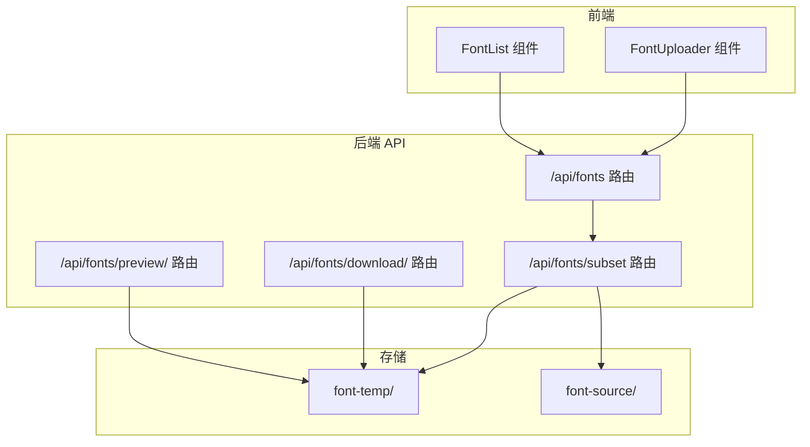
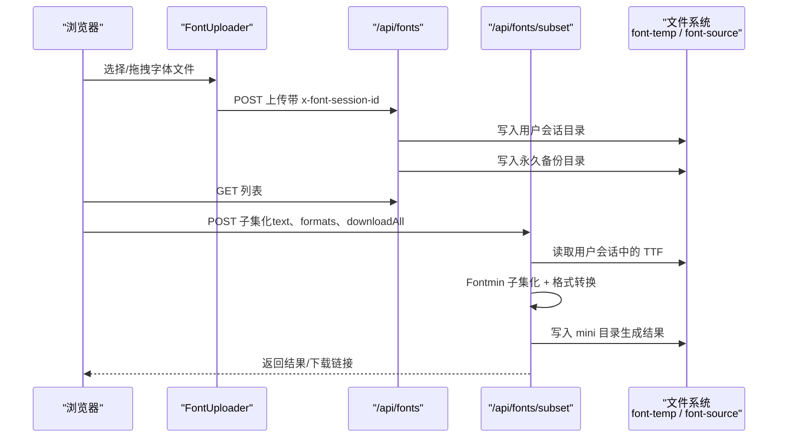
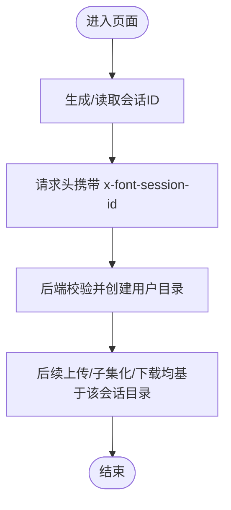
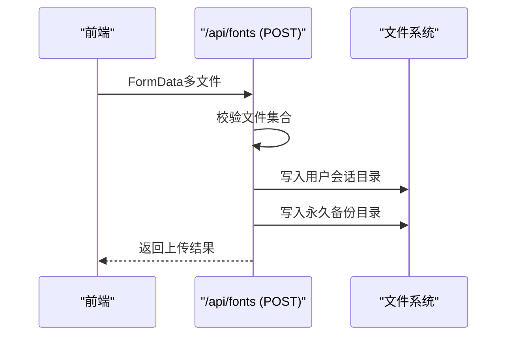
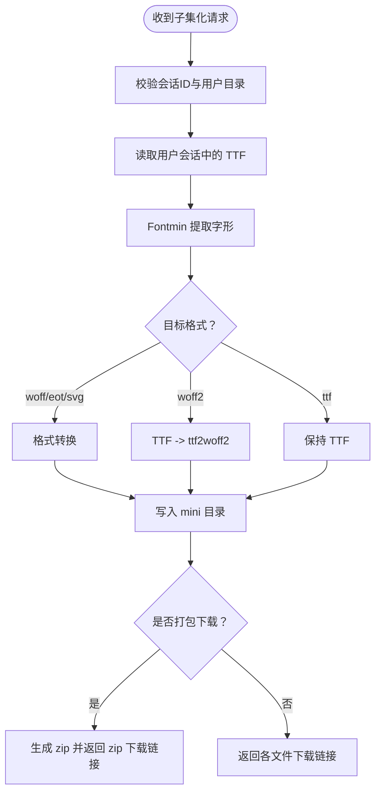
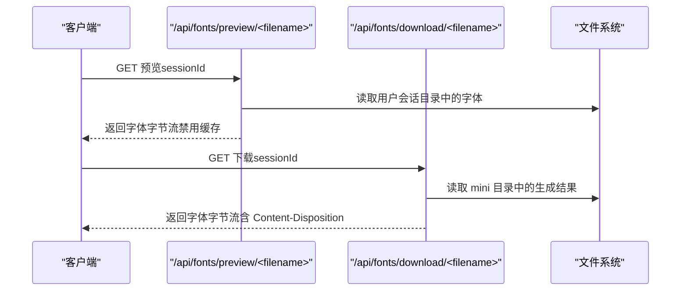
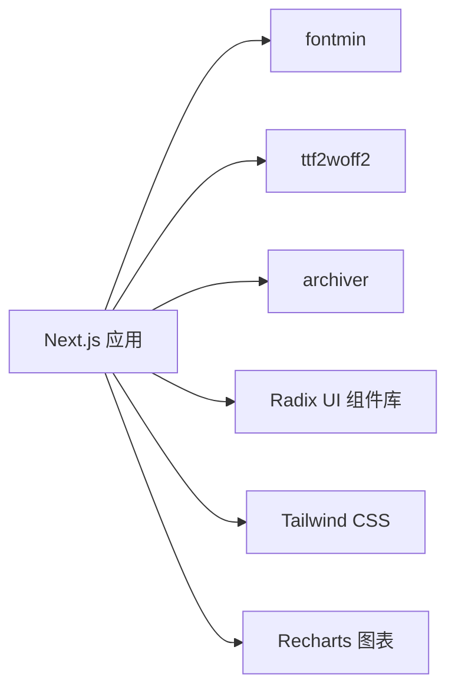

# 监控维护

<cite>
**本文引用的文件**
- [README.md](file://README.md)
- [package.json](file://package.json)
- [next.config.mjs](file://next.config.mjs)
- [deploy.sh](file://deploy.sh)
- [app/api/fonts/route.ts](file://app/api/fonts/route.ts)
- [app/api/fonts/subset/route.ts](file://app/api/fonts/subset/route.ts)
- [app/api/fonts/download/[filename]/route.ts](file://app/api/fonts/download/[filename]/route.ts)
- [app/api/fonts/preview/[filename]/route.ts](file://app/api/fonts/preview/[filename]/route.ts)
- [lib/session.ts](file://lib/session.ts)
- [components/font-uploader.tsx](file://components/font-uploader.tsx)
- [components/font-list.tsx](file://components/font-list.tsx)
- [test-api.js](file://test-api.js)
</cite>

## 目录
1. [简介](#简介)
2. [项目结构](#项目结构)
3. [核心组件](#核心组件)
4. [架构总览](#架构总览)
5. [详细组件分析](#详细组件分析)
6. [依赖关系分析](#依赖关系分析)
7. [性能考量](#性能考量)
8. [故障排除指南](#故障排除指南)
9. [结论](#结论)
10. [附录](#附录)

## 简介
本文件面向运维团队，围绕 FontMin 字体子集化工具提供一套完整的监控与维护指南。内容涵盖系统监控指标采集与分析（CPU、内存、磁盘、网络）、日志记录与分析最佳实践（访问日志、错误日志、性能日志）、API 健康检查与性能测试方法、故障排除流程、备份与恢复策略、定期维护任务与应急响应预案、容量规划与扩展策略，以及标准化操作手册与 SOP。

## 项目结构
FontMin 是基于 Next.js 16 的全栈应用，采用 App Router 结构组织 API 路由与前端组件。核心目录与职责如下：
- app/api/fonts/*：提供字体上传、列表查询、预览、子集化生成、下载等 API
- components/*：前端交互组件（上传、列表、预览、下载面板）
- lib/session.ts：会话 ID 生成逻辑（浏览器端）
- font-temp/：按会话隔离的临时目录，存放用户本次会话的字体与生成结果
- font-source/：永久备份目录，保存所有上传字体的副本
- next.config.mjs：构建配置，启用 WASM 支持与外部依赖处理
- deploy.sh：部署脚本，集成拉取、安装、构建与 PM2 重启流程

图表来源
- [app/api/fonts/route.ts](file://app/api/fonts/route.ts#L1-L167)
- [app/api/fonts/subset/route.ts](file://app/api/fonts/subset/route.ts#L1-L366)
- [app/api/fonts/download/[filename]/route.ts](file://app/api/fonts/download/[filename]/route.ts#L1-L62)
- [app/api/fonts/preview/[filename]/route.ts](file://app/api/fonts/preview/[filename]/route.ts#L1-L61)

章节来源
- [README.md](file://README.md#L135-L160)
- [next.config.mjs](file://next.config.mjs#L1-L44)

## 核心组件
- 会话与隔离
  - 会话 ID 通过浏览器端生成并随请求头传递，API 通过 x-font-session-id 获取会话标识，实现用户级数据隔离与临时目录管理。
- 字体上传与备份
  - 上传接口将文件同时写入用户会话目录与永久备份目录，保证数据可恢复与审计。
- 字体子集化与格式转换
  - 子集化流程基于 Fontmin，仅支持 TTF 输入；WOFF2 通过 TTF 再转 ttf2woff2 生成。
- 下载与预览
  - 预览与下载均校验会话有效性，并根据扩展名设置正确的 MIME 类型。

章节来源
- [lib/session.ts](file://lib/session.ts#L1-L34)
- [app/api/fonts/route.ts](file://app/api/fonts/route.ts#L16-L34)
- [app/api/fonts/subset/route.ts](file://app/api/fonts/subset/route.ts#L25-L30)
- [app/api/fonts/download/[filename]/route.ts](file://app/api/fonts/download/[filename]/route.ts#L15-L23)
- [app/api/fonts/preview/[filename]/route.ts](file://app/api/fonts/preview/[filename]/route.ts#L15-L23)

## 架构总览
下图展示从浏览器到后端 API、再到本地文件系统的调用链路与数据流向。

图表来源
- [components/font-uploader.tsx](file://components/font-uploader.tsx#L65-L70)
- [app/api/fonts/route.ts](file://app/api/fonts/route.ts#L72-L127)
- [app/api/fonts/subset/route.ts](file://app/api/fonts/subset/route.ts#L164-L366)

## 详细组件分析

### 会话与数据隔离
- 会话 ID 生成：浏览器端模块级变量保存会话 ID，刷新页面生成新 ID，满足“刷新清空”的语义。
- 会话头传递：前端在上传与子集化请求中携带 x-font-session-id，后端据此定位用户目录。
- 目录隔离：每个会话对应独立目录，避免跨用户访问；临时目录在会话过期后清理，备份目录保留历史数据。

图表来源
- [lib/session.ts](file://lib/session.ts#L1-L34)
- [app/api/fonts/route.ts](file://app/api/fonts/route.ts#L16-L34)

章节来源
- [lib/session.ts](file://lib/session.ts#L1-L34)
- [app/api/fonts/route.ts](file://app/api/fonts/route.ts#L16-L34)

### 字体上传与备份
- 功能要点
  - 读取表单数据，遍历文件数组，分别写入用户会话目录与永久备份目录。
  - 日志记录上传数量、路径与备份信息，便于审计与排障。
- 错误处理
  - 缺少文件、写入失败、目录不存在等情况统一返回 4xx/5xx 并记录错误日志。

图表来源
- [app/api/fonts/route.ts](file://app/api/fonts/route.ts#L72-L127)

章节来源
- [app/api/fonts/route.ts](file://app/api/fonts/route.ts#L72-L127)

### 字体子集化与格式转换
- 输入限制：仅支持 TTF 格式作为 Fontmin 输入；非 TTF 文件会被跳过并记录警告。
- 处理流程：
  - 对每个目标格式，先通过 Fontmin 提取字形，再按需转换为 woff/woff2/eot/svg。
  - WOFF2 通过 TTF 再转 ttf2woff2 生成二进制缓冲区。
  - 将结果写入 mini 目录，并返回下载链接。
- 归档下载：当 downloadAll 为真且存在多个文件时，打包为 zip 并返回 zip 下载链接。
- 错误处理：捕获 Fontmin 异常、转换异常、未找到输出文件等，统一记录并返回错误信息。

图表来源
- [app/api/fonts/subset/route.ts](file://app/api/fonts/subset/route.ts#L164-L366)

章节来源
- [app/api/fonts/subset/route.ts](file://app/api/fonts/subset/route.ts#L25-L30)
- [app/api/fonts/subset/route.ts](file://app/api/fonts/subset/route.ts#L164-L366)

### 下载与预览
- 预览：读取用户会话目录中的原始字体文件，设置合适的 Content-Type，禁用缓存以便实时预览。
- 下载：读取 mini 目录中的生成结果，根据扩展名设置 MIME 类型并返回二进制流。

图表来源
- [app/api/fonts/preview/[filename]/route.ts](file://app/api/fonts/preview/[filename]/route.ts#L7-L61)
- [app/api/fonts/download/[filename]/route.ts](file://app/api/fonts/download/[filename]/route.ts#L7-L62)

章节来源
- [app/api/fonts/preview/[filename]/route.ts](file://app/api/fonts/preview/[filename]/route.ts#L7-L61)
- [app/api/fonts/download/[filename]/route.ts](file://app/api/fonts/download/[filename]/route.ts#L7-L62)

## 依赖关系分析
- 外部依赖处理
  - 服务器端构建配置将 fontmin、ttf2woff2、archiver 声明为外部依赖，避免打包体积膨胀并解决 WASM 加载问题。
- 运行时依赖
  - 字体处理依赖 fontmin、ttf2woff2、archiver；前端 UI 依赖 Radix UI、Tailwind CSS、Recharts 等。

图表来源
- [next.config.mjs](file://next.config.mjs#L28-L36)
- [package.json](file://package.json#L41-L65)

章节来源
- [next.config.mjs](file://next.config.mjs#L14-L40)
- [package.json](file://package.json#L11-L66)

## 性能考量
- CPU 与内存
  - 字体子集化与格式转换为 CPU 密集型操作，建议在高配 CPU 服务器上运行，合理设置并发阈值，避免同时处理过多大字体导致内存峰值过高。
- 磁盘与 IO
  - 临时目录与备份目录频繁读写，建议使用高性能磁盘与合理的文件系统参数；定期清理 font-temp 中过期会话目录，控制磁盘占用。
- 网络
  - 大字体与 zip 包下载可能产生较高带宽消耗，建议启用 CDN 或静态资源分离，减少应用服务器压力。
- 前端体验
  - 预览接口禁用缓存，确保实时性；下载接口设置 Content-Length，提升下载稳定性。

章节来源
- [README.md](file://README.md#L222-L241)
- [app/api/fonts/subset/route.ts](file://app/api/fonts/subset/route.ts#L317-L332)

## 故障排除指南
- 常见问题与诊断
  - 会话未找到/404：检查请求头是否包含 x-font-session-id，确认会话目录是否存在。
  - 未找到上传字体：确认用户会话目录中是否存在对应文件，或是否已过期被清理。
  - 非 TTF 格式被跳过：Fontmin 仅支持 TTF 输入，需提示用户上传 TTF。
  - 转换失败：检查 Fontmin 输出文件与 ttf2woff2 转换过程的日志，定位具体环节。
- 日志分析
  - 后端 API 使用 console.log/console.error 输出关键事件与错误堆栈，便于快速定位。
  - 建议结合 PM2 日志聚合与日志切割，按时间检索错误堆栈。
- 性能瓶颈定位
  - 使用系统监控工具观察 CPU 占用与内存峰值，结合日志时间线定位耗时步骤（如子集化、转换、打包）。
  - 对大字体或大批量处理场景，评估拆分批次与限流策略。

章节来源
- [app/api/fonts/route.ts](file://app/api/fonts/route.ts#L168-L213)
- [app/api/fonts/subset/route.ts](file://app/api/fonts/subset/route.ts#L297-L310)
- [app/api/fonts/subset/route.ts](file://app/api/fonts/subset/route.ts#L351-L364)

## 结论
本指南提供了从监控、日志、健康检查到备份恢复与容量规划的完整运维实践。建议在生产环境中结合系统监控与日志平台，建立自动化告警与巡检机制，持续优化处理流程与资源配置，保障 FontMin 的稳定与高效运行。

## 附录

### 监控指标与采集
- CPU 使用率
  - Linux：top、htop、vmstat；Windows：任务管理器/资源监视器
  - Docker/K8s：容器 CPU 指标与节点资源利用率
- 内存占用
  - 观察进程 RSS/RES 与 GC 行为，关注峰值与泄漏趋势
- 磁盘空间
  - df -h 监控根分区与 font-temp/font-source 目录使用率
  - 定期清理过期会话目录，设置磁盘配额与告警阈值
- 网络流量
  - iftop、nethogs、iftop 或应用层统计（下载/上传字节数）

章节来源
- [README.md](file://README.md#L222-L241)

### 日志记录与分析最佳实践
- 访问日志
  - Nginx/PM2/应用层三段日志，统一格式化字段（时间、IP、方法、路径、状态码、耗时、会话ID）
- 错误日志
  - 分类错误类型（IO/解析/转换/权限），保留错误堆栈与上下文参数
- 性能日志
  - 关键步骤打点（读取、子集化、转换、写入、打包），计算耗时分布
- 日志管理
  - 使用 logrotate 或集中式日志平台（ELK/Fluentd/Loki），设置滚动与归档策略

[本节为通用实践说明，不直接分析具体文件]

### API 健康检查与性能测试
- 健康检查
  - GET /api/fonts?sessionId=xxx：验证会话目录可用性与列表读取
  - GET /api/fonts/preview/<file>?sessionId=xxx：验证预览可用性
- 性能测试
  - 使用自动化脚本批量发送子集化请求，记录响应时间与成功率
  - 示例脚本路径：[test-api.js](file://test-api.js#L1-L36)

章节来源
- [test-api.js](file://test-api.js#L1-L36)

### 备份策略与数据恢复
- 字体文件备份
  - 永久备份目录 font-source 作为主备份，建议定期 tar/zip 备份并异地存储
- 会话数据管理
  - 临时目录 font-temp 按会话清理，保留 1 天即可；过期目录统一删除
- 恢复流程
  - 从备份恢复 font-source，重建会话目录并验证文件完整性

章节来源
- [README.md](file://README.md#L186-L189)
- [README.md](file://README.md#L222-L241)

### 定期维护任务清单
- 每日
  - 检查 PM2 状态与日志，确认服务健康
  - 监控磁盘使用率，清理过期会话目录
- 每周
  - 备份 font-source 目录，验证备份完整性
  - 评估 CPU/内存/IO 峰值，调整限流与并发
- 每月
  - 审计日志与错误报告，识别高频问题
  - 更新依赖与补丁，回归测试

[本节为通用运维清单，不直接分析具体文件]

### 应急响应预案
- 服务不可用
  - 快速回滚至上一版本，检查 PM2 日志与系统资源
- 大量错误
  - 临时降级子集化功能，优先保证上传与预览
- 磁盘爆满
  - 立即清理 font-temp，必要时扩容磁盘并设置告警阈值
- 数据丢失
  - 从最近备份恢复 font-source，重建会话目录

[本节为通用应急预案，不直接分析具体文件]

### 容量规划与扩展策略
- 容量规划
  - 估算平均字体大小、并发请求数、生成结果占比，预留磁盘与内存冗余
- 扩展策略
  - 前端静态资源 CDN 化，后端横向扩展（多实例+负载均衡）
  - 使用容器编排（Docker/K8s）实现弹性伸缩与健康检查
  - 对热点文件启用缓存（预览/下载）与对象存储（归档备份）

[本节为通用规划建议，不直接分析具体文件]

### 标准化操作手册与 SOP
- 部署流程
  - 拉取代码 → 安装依赖 → 构建 → PM2 重启 → 校验健康检查
  - 参考脚本：[deploy.sh](file://deploy.sh#L1-L23)
- 常见操作
  - 清理过期会话目录、查看 PM2 日志、备份 font-source、扩容磁盘
- 变更管理
  - 代码变更 → 本地测试 → CI/CD → 回滚预案 → 上线验证

章节来源
- [deploy.sh](file://deploy.sh#L1-L23)