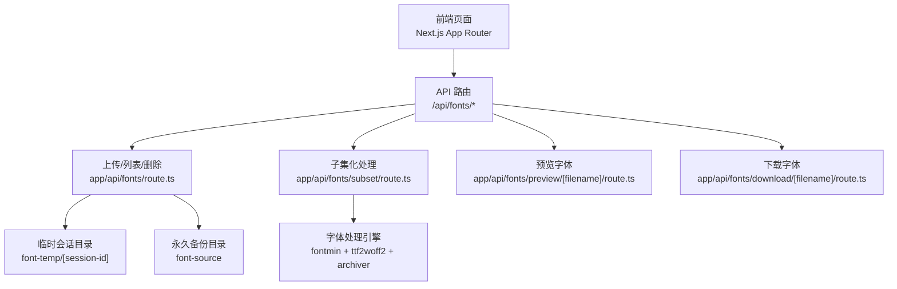
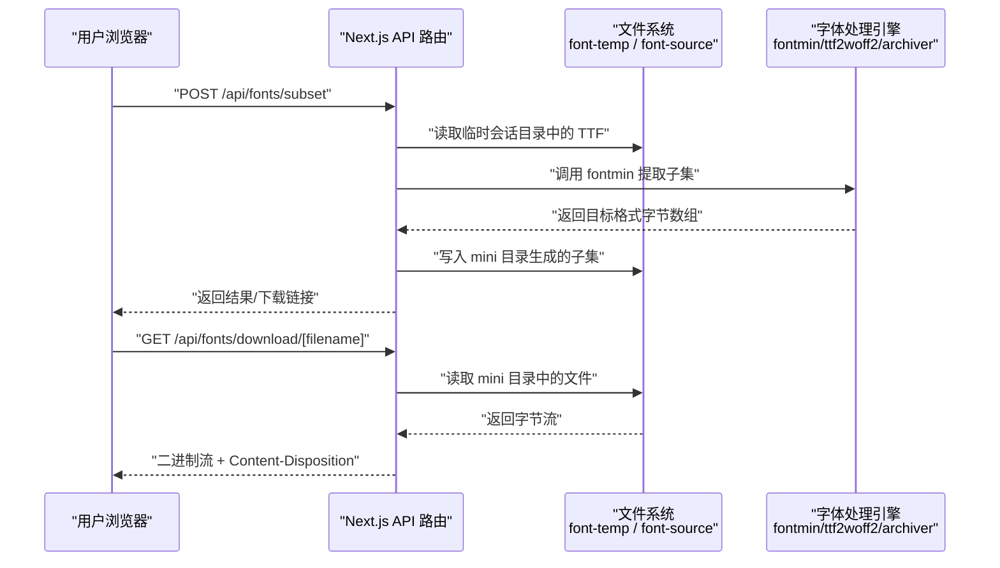
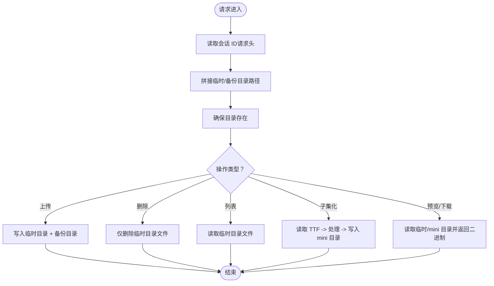
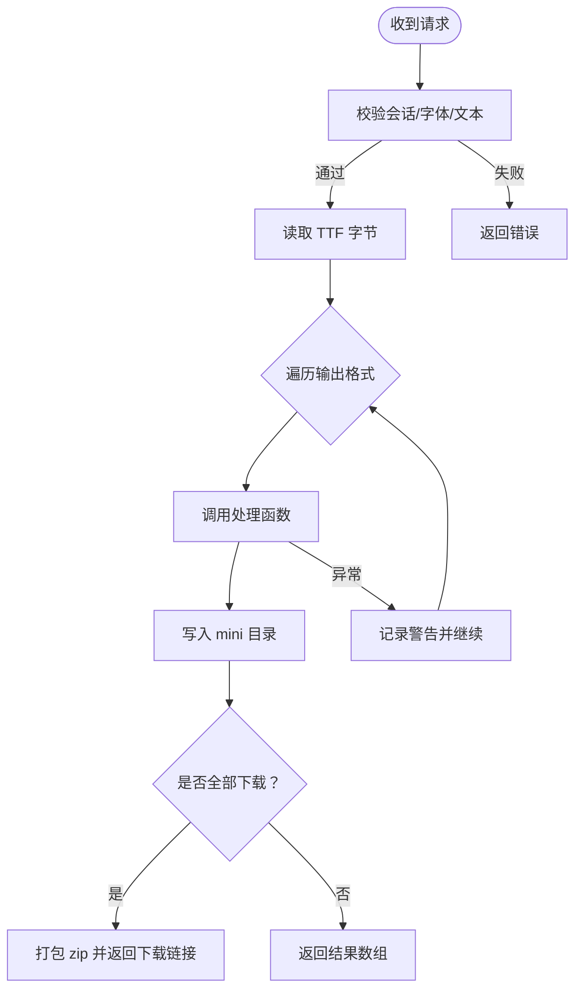
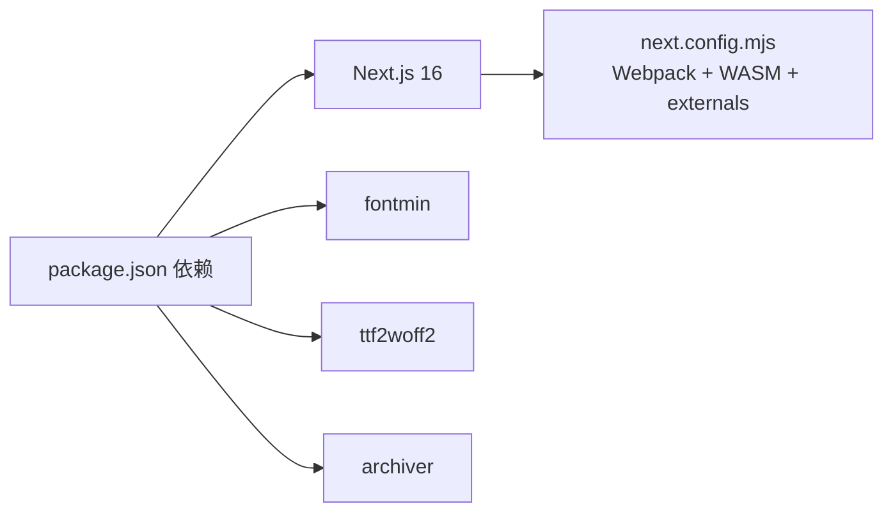

# 部署运维

<cite>
**本文引用的文件**
- [README.md](file://README.md)
- [package.json](file://package.json)
- [next.config.mjs](file://next.config.mjs)
- [deploy.sh](file://deploy.sh)
- [app/api/fonts/route.ts](file://app/api/fonts/route.ts)
- [app/api/fonts/subset/route.ts](file://app/api/fonts/subset/route.ts)
- [app/api/fonts/download/[filename]/route.ts](file://app/api/fonts/download/[filename]/route.ts)
- [app/api/fonts/preview/[filename]/route.ts](file://app/api/fonts/preview/[filename]/route.ts)
- [lib/session.ts](file://lib/session.ts)
- [test-api.js](file://test-api.js)
- [tsconfig.json](file://tsconfig.json)
</cite>

## 目录
1. [简介](#简介)
2. [项目结构](#项目结构)
3. [核心组件](#核心组件)
4. [架构总览](#架构总览)
5. [详细组件分析](#详细组件分析)
6. [依赖关系分析](#依赖关系分析)
7. [性能考虑](#性能考虑)
8. [故障排除指南](#故障排除指南)
9. [结论](#结论)
10. [附录](#附录)

## 简介
本文件面向生产环境的 FontMin 字体子集化工具部署与运维，覆盖环境准备、构建与启动、容器化与云平台部署、监控与日志、高可用与负载均衡、备份与灾备、性能指标与优化、自动化部署与 CI/CD、容量规划与扩展、以及日常运维与应急响应操作手册。内容基于仓库现有实现与配置进行提炼与扩展，确保可落地、可验证。

## 项目结构
- 前端框架：Next.js 16（App Router）
- 运行时：Node.js 18+（按 README 要求）
- 包管理：pnpm 8+
- 字体处理：fontmin、ttf2woff2、archiver
- 构建与打包：Next.js 构建链路
- 会话与数据隔离：基于会话 ID 的临时目录与永久备份目录分离

图表来源
- [app/api/fonts/route.ts](file://app/api/fonts/route.ts#L1-L167)
- [app/api/fonts/subset/route.ts](file://app/api/fonts/subset/route.ts#L1-L366)
- [app/api/fonts/preview/[filename]/route.ts](file://app/api/fonts/preview/[filename]/route.ts#L1-L61)
- [app/api/fonts/download/[filename]/route.ts](file://app/api/fonts/download/[filename]/route.ts#L1-L62)

章节来源
- [README.md](file://README.md#L135-L160)
- [package.json](file://package.json#L1-L78)
- [next.config.mjs](file://next.config.mjs#L1-L44)

## 核心组件
- 会话与目录隔离
  - 会话 ID 来源于请求头 x-font-session-id；若缺失则回退至默认值。
  - 临时会话目录：font-temp/[session-id]，用于存放用户本次会话上传与生成的字体。
  - 永久备份目录：font-source，用于存放所有上传字体的备份，删除操作不涉及此目录。
- 字体上传与管理
  - 支持多文件上传，写入临时会话目录与永久备份目录。
  - 列表接口返回当前会话内可用字体清单。
  - 删除接口仅删除临时会话目录中的文件，保留备份。
- 字体子集化处理
  - 仅支持 TTF 输入；对 WOFF2 输出先产出 TTF 再转换为 WOFF2。
  - 支持批量格式输出（ttf、woff、eot、svg、woff2），可选打包下载。
- 预览与下载
  - 预览接口返回字体二进制流，设置合适的 Content-Type 与缓存控制。
  - 下载接口返回压缩包或单个字体文件，设置 Content-Disposition。

章节来源
- [app/api/fonts/route.ts](file://app/api/fonts/route.ts#L1-L167)
- [app/api/fonts/subset/route.ts](file://app/api/fonts/subset/route.ts#L1-L366)
- [app/api/fonts/preview/[filename]/route.ts](file://app/api/fonts/preview/[filename]/route.ts#L1-L61)
- [app/api/fonts/download/[filename]/route.ts](file://app/api/fonts/download/[filename]/route.ts#L1-L62)
- [lib/session.ts](file://lib/session.ts#L1-L34)

## 架构总览
下图展示从客户端到 API、再到字体处理引擎与文件系统的交互路径，以及会话隔离与数据备份的职责边界。

图表来源
- [app/api/fonts/subset/route.ts](file://app/api/fonts/subset/route.ts#L164-L366)
- [app/api/fonts/download/[filename]/route.ts](file://app/api/fonts/download/[filename]/route.ts#L7-L62)

## 详细组件分析

### 会话与目录隔离
- 会话标识：通过请求头 x-font-session-id 获取；若缺失则使用默认值，避免跨会话污染。
- 目录策略：
  - 临时目录：按会话划分，便于过期清理与隔离。
  - 永久备份：所有上传均复制到备份目录，删除操作不触碰备份。
- 生命周期管理建议：
  - 临时目录定期清理（参考 README 的清理建议）。
  - 备份目录容量监控与定期备份。

图表来源
- [app/api/fonts/route.ts](file://app/api/fonts/route.ts#L16-L34)
- [app/api/fonts/subset/route.ts](file://app/api/fonts/subset/route.ts#L16-L23)
- [app/api/fonts/preview/[filename]/route.ts](file://app/api/fonts/preview/[filename]/route.ts#L15-L31)
- [app/api/fonts/download/[filename]/route.ts](file://app/api/fonts/download/[filename]/route.ts#L15-L30)

章节来源
- [app/api/fonts/route.ts](file://app/api/fonts/route.ts#L16-L34)
- [README.md](file://README.md#L191-L242)

### 字体子集化处理流程
- 输入校验：会话存在性、字体文件存在性、TTF 格式校验。
- 文本去重：对输入文本进行去重，减少无效重复处理。
- 处理链路：
  - 对 WOFF2：先产出 TTF，再用 ttf2woff2 转换。
  - 对其他格式：直接由 fontmin 产出对应格式。
- 批量输出与打包：当选择“全部下载”时，将多个文件打包为 zip 返回下载链接。
- 错误处理：捕获引擎异常与输出文件缺失情况，返回结构化错误信息。

图表来源
- [app/api/fonts/subset/route.ts](file://app/api/fonts/subset/route.ts#L164-L366)

章节来源
- [app/api/fonts/subset/route.ts](file://app/api/fonts/subset/route.ts#L25-L29)
- [app/api/fonts/subset/route.ts](file://app/api/fonts/subset/route.ts#L31-L162)
- [app/api/fonts/subset/route.ts](file://app/api/fonts/subset/route.ts#L255-L295)

### 预览与下载接口
- 预览接口：
  - 读取临时会话目录中的原始字体文件。
  - 设置 Content-Type 与缓存控制（no-cache）。
- 下载接口：
  - 读取 mini 目录中的子集化文件或 zip。
  - 设置 Content-Disposition 以便浏览器下载。

章节来源
- [app/api/fonts/preview/[filename]/route.ts](file://app/api/fonts/preview/[filename]/route.ts#L7-L61)
- [app/api/fonts/download/[filename]/route.ts](file://app/api/fonts/download/[filename]/route.ts#L7-L62)

### 会话 ID 生成与持久化
- 前端模块在浏览器侧生成会话 ID（支持随机 UUID 回退实现）。
- 该 ID 作为后续请求头 x-font-session-id 使用，确保服务端按会话隔离数据。

章节来源
- [lib/session.ts](file://lib/session.ts#L1-L34)

## 依赖关系分析
- 构建与运行
  - Next.js 16，启用 Webpack（非 Turbopack）以支持 WASM 加载。
  - 服务器端 externals 外置 fontmin、ttf2woff2、archiver，避免打包体积过大。
- 依赖项
  - 字体处理：fontmin、ttf2woff2、archiver。
  - 前端生态：React 19、Radix UI、Tailwind CSS 4、Recharts 等。
- 开发与类型检查
  - TypeScript 编译配置严格，忽略构建期 TS 错误开关已开启（生产构建需关注）。

图表来源
- [package.json](file://package.json#L11-L66)
- [next.config.mjs](file://next.config.mjs#L14-L40)

章节来源
- [package.json](file://package.json#L1-L78)
- [next.config.mjs](file://next.config.mjs#L1-L44)
- [tsconfig.json](file://tsconfig.json#L1-L42)

## 性能考虑
- 构建与运行
  - 使用 Webpack 模式并启用 WASM 支持，满足字体处理引擎的底层依赖。
  - 服务器端 externals 外置重型原生依赖，降低冷启动与内存占用。
- 字体处理
  - 仅支持 TTF 输入，避免重复格式转换开销。
  - WOFF2 输出采用“TTF -> ttf2woff2”两步法，确保兼容性与质量。
  - 文本去重减少重复字形提取次数。
- I/O 与缓存
  - 预览接口设置 no-cache，避免 CDN/浏览器缓存导致的预览不一致。
  - 下载接口设置 Content-Length，有利于客户端进度反馈。
- 并发与资源
  - 大文件上传与子集化处理应结合队列或限流策略，避免 CPU/磁盘争用。
  - 建议在反向代理层限制上传文件大小与并发连接数。

章节来源
- [next.config.mjs](file://next.config.mjs#L14-L40)
- [app/api/fonts/subset/route.ts](file://app/api/fonts/subset/route.ts#L215-L217)
- [app/api/fonts/preview/[filename]/route.ts](file://app/api/fonts/preview/[filename]/route.ts#L47-L52)
- [app/api/fonts/download/[filename]/route.ts](file://app/api/fonts/download/[filename]/route.ts#L47-L53)

## 故障排除指南
- 常见问题与定位
  - 会话未找到：确认请求头 x-font-session-id 是否正确传递。
  - 未找到上传字体：确认临时会话目录是否存在且包含目标文件。
  - 处理失败：查看子集化接口返回的错误详情与警告列表。
  - WOFF2 转换失败：确认 fontmin 输出包含 .ttf 文件，再由 ttf2woff2 成功转换。
- 日志与可观测性
  - 接口内部大量使用 console 输出，便于快速定位问题。
  - 建议在生产环境接入统一日志收集（如 stdout/JSON 格式），并配合告警。
- 自检脚本
  - 提供了简单的 API 测试脚本，可用于验证子集化接口连通性与基本功能。

章节来源
- [app/api/fonts/route.ts](file://app/api/fonts/route.ts#L16-L20)
- [app/api/fonts/subset/route.ts](file://app/api/fonts/subset/route.ts#L170-L213)
- [app/api/fonts/subset/route.ts](file://app/api/fonts/subset/route.ts#L297-L310)
- [test-api.js](file://test-api.js#L1-L36)

## 结论
本项目以 Next.js 为基础，结合本地文件系统实现“会话隔离 + 永久备份”的数据模型，配合 fontmin/ttf2woff2/archiver 完成高效的字体子集化与分发。生产部署建议围绕“隔离、备份、可观测、限流、缓存控制”展开，辅以自动化与容量规划，确保稳定与可扩展。

## 附录

### 生产环境配置指南
- 系统与运行时
  - Node.js 18+，pnpm 8+。
  - 服务器磁盘需预留 font-temp 与 font-source 的增长空间。
- 环境变量与安全
  - 通过反向代理注入 x-font-session-id，避免客户端伪造。
  - 限制上传文件大小与数量，防止磁盘耗尽与拒绝服务。
  - 对外暴露的域名与证书配置（HTTPS），避免混合内容问题。
- 目录权限
  - 确保运行用户对 font-temp 与 font-source 具备读写权限。
  - 备份目录可设置只读或受限写权限，降低误删风险。

章节来源
- [README.md](file://README.md#L44-L48)
- [app/api/fonts/route.ts](file://app/api/fonts/route.ts#L6-L7)

### Docker 容器化部署
- 基础镜像
  - 使用 Node.js 官方镜像作为基础，安装 pnpm。
- 构建步骤
  - 复制依赖声明与锁文件，安装依赖。
  - 复制源码，执行构建（next build）。
- 运行参数
  - 挂载 font-temp 与 font-source 目录到宿主机卷，便于持久化与备份。
  - 暴露端口（默认 6739，来自 package.json scripts）。
- 健康检查
  - 在反向代理层做健康检查，或在容器内暴露轻量级探针。
- 示例（概念性）
  - Dockerfile：安装 Node/pnpm → 安依赖 → 构建 → 运行
  - docker-compose：挂载卷 + 环境变量 + 端口映射 + 健康检查

[本节为通用容器化建议，不直接对应具体文件，故不附加图表来源]

### 云平台部署方案
- 传统虚拟机/裸金属
  - 使用 PM2 或 systemd 管理进程，结合定时任务清理临时目录。
  - 反向代理（Nginx/Tengine）前置，开启 gzip/HTTP/HTTPS。
- 容器编排（Kubernetes）
  - Deployment + PVC 持久卷，StatefulSet 适用于需要稳定存储的场景。
  - HPA/HPA 策略：CPU/内存阈值或 QPS/延迟指标。
  - Ingress 控制器 + TLS 证书管理。
- Serverless/边缘
  - 若业务规模较小，可考虑边缘计算或云函数形态，但需评估字体处理的 CPU/内存与 I/O 开销。

[本节为通用云平台建议，不直接对应具体文件，故不附加图表来源]

### 监控与日志最佳实践
- 指标
  - 请求量、成功率、P95/P99 延迟、错误码分布。
  - 字体处理耗时、输出文件大小、并发处理数。
  - 磁盘使用率（font-temp/font-source）、inode 使用率。
- 日志
  - 结构化日志（JSON），包含请求 ID、会话 ID、用户 IP、处理耗时、错误堆栈。
  - 分离访问日志与业务日志，按天轮转与保留周期。
- 告警
  - 延迟突增、错误率上升、磁盘水位告警、CPU/内存使用率阈值。

[本节为通用监控建议，不直接对应具体文件，故不附加图表来源]

### 负载均衡与高可用
- 负载均衡
  - L4/L7 负载均衡器，健康检查基于反向代理探活。
  - 会话粘性可选，但本应用按会话 ID 访问，建议保持就近访问。
- 高可用
  - 多实例部署，共享存储（NFS/S3FS）或本地卷 + 备份策略。
  - 自动扩缩容：基于 CPU/请求量/队列长度。
- 限流与熔断
  - 上传/下载速率限制，防止突发流量压垮磁盘与 CPU。

[本节为通用高可用建议，不直接对应具体文件，故不附加图表来源]

### 备份策略与灾难恢复
- 备份
  - font-source：全量备份，支持增量备份策略。
  - font-temp：短期保留，定期清理（参考 README 的清理建议）。
- 灾备
  - 异地容灾：将备份目录同步至对象存储或异地磁盘。
  - RTO/RPO：根据业务 SLA 设定恢复时间与数据间隔。
- 验证
  - 定期进行恢复演练，验证备份完整性与可恢复性。

章节来源
- [README.md](file://README.md#L222-L242)

### 性能监控指标
- 关键指标
  - QPS、错误率、P95/P99 延迟、CPU/内存/磁盘 IO。
  - 字体处理耗时分布、输出文件大小分布、并发处理峰值。
- 建议采集点
  - 反向代理层（Nginx/Tengine）访问日志与指标。
  - 应用层（Next.js）结构化日志与埋点。
  - 文件系统层（磁盘使用、IO）。

[本节为通用指标建议，不直接对应具体文件，故不附加图表来源]

### 自动化部署与 CI/CD
- 构建与发布
  - 使用 CI 工具（GitHub Actions/Jenkins）拉取代码、安装依赖、构建。
  - 产物推送至制品库或直接部署到目标机器。
- 部署脚本
  - deploy.sh 已提供基于 PM2 的一键部署流程：拉取代码、安装依赖、构建、重启服务、查看状态与日志。
- 最佳实践
  - 蓝绿/滚动发布，灰度流量。
  - 部署前健康检查，失败回滚。
  - 配置与密钥通过环境变量注入，不硬编码。

章节来源
- [deploy.sh](file://deploy.sh#L1-L23)
- [package.json](file://package.json#L5-L10)

### 容量规划与扩展策略
- 存储容量
  - 估算 font-source 与 font-temp 的增长趋势，预留 2-3 倍缓冲。
- 计算资源
  - CPU：字体处理（尤其是 WOFF2）较为耗时，建议按峰值并发配置 CPU。
  - 内存：大字体文件处理时内存占用较高，建议预留充足内存。
- 扩展方式
  - 垂直扩展：提升单实例规格。
  - 水平扩展：多实例 + 共享存储或本地卷 + 备份策略。
  - 异步化：将耗时处理放入消息队列，异步生成与通知。

[本节为通用容量规划建议，不直接对应具体文件，故不附加图表来源]

### 日常维护与应急响应操作手册
- 日常维护
  - 定期清理 font-temp 中过期会话目录（参考 README 的示例命令）。
  - 监控备份目录容量与增长趋势，必要时扩容或清理。
  - 更新依赖与 Node.js 版本，遵循最小变更原则。
- 应急响应
  - 服务不可用：检查 PM2 进程状态、日志、磁盘空间、反向代理健康检查。
  - 处理异常：查看子集化接口返回的错误详情，定位具体格式转换或文件缺失问题。
  - 数据丢失：优先从备份目录恢复，核对会话 ID 与文件名一致性。

章节来源
- [README.md](file://README.md#L222-L242)
- [app/api/fonts/subset/route.ts](file://app/api/fonts/subset/route.ts#L351-L364)