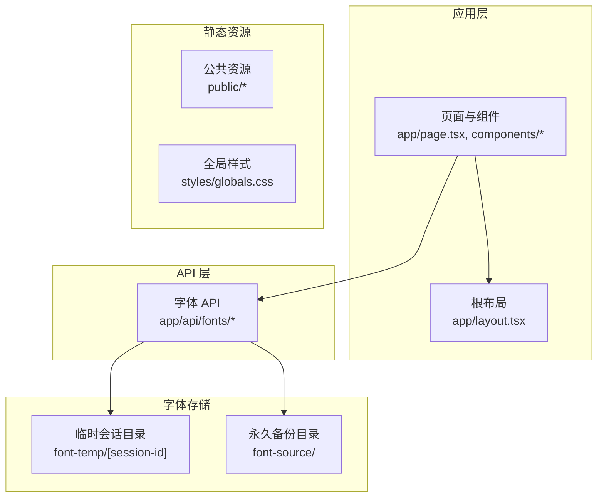
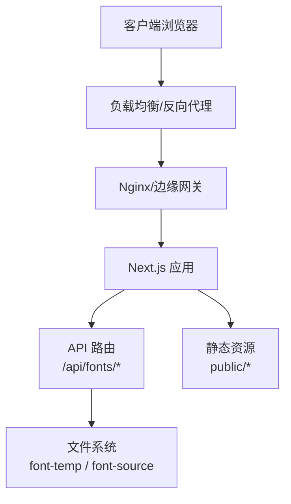
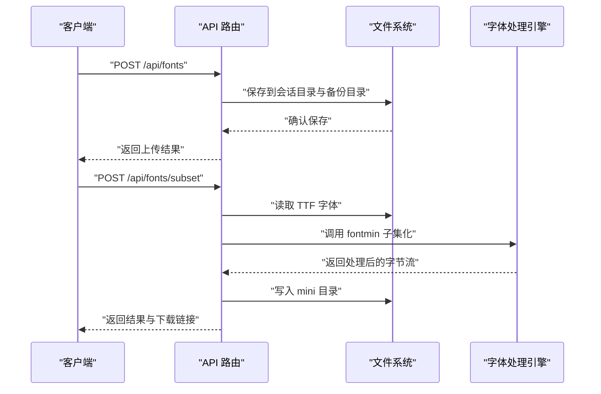
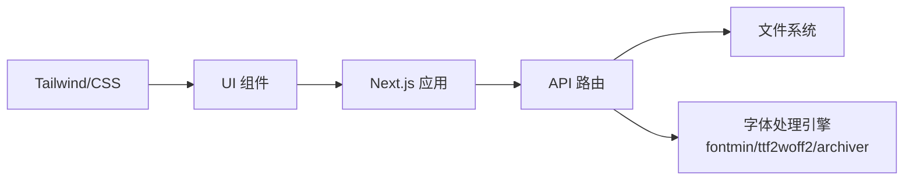

# 部署配置

<cite>
**本文引用的文件**
- [package.json](file://package.json)
- [next.config.mjs](file://next.config.mjs)
- [deploy.sh](file://deploy.sh)
- [README.md](file://README.md)
- [app/layout.tsx](file://app/layout.tsx)
- [app/api/fonts/route.ts](file://app/api/fonts/route.ts)
- [app/api/fonts/subset/route.ts](file://app/api/fonts/subset/route.ts)
- [tsconfig.json](file://tsconfig.json)
- [postcss.config.mjs](file://postcss.config.mjs)
</cite>

## 目录
1. [简介](#简介)
2. [项目结构](#项目结构)
3. [核心组件](#核心组件)
4. [架构总览](#架构总览)
5. [详细组件分析](#详细组件分析)
6. [依赖关系分析](#依赖关系分析)
7. [性能考虑](#性能考虑)
8. [故障排查指南](#故障排查指南)
9. [结论](#结论)
10. [附录](#附录)

## 简介
本文件面向生产环境部署 FontMin 字体子集化工具，覆盖服务器环境准备、依赖安装、构建配置、启动服务、PM2 进程管理、Docker 容器化与云平台部署、Next.js 生产配置、环境变量与域名绑定、SSL 证书、CI/CD 流水线与自动化脚本、缓存与 CDN、负载均衡等主题，并提供不同规模部署的配置模板与最佳实践。

## 项目结构
该项目基于 Next.js App Router，采用 App 目录组织页面与 API 路由，核心功能通过 API 路由实现字体上传、预览、子集化与下载。项目还包含前端组件、全局样式与类型定义。

图表来源
- [app/layout.tsx](file://app/layout.tsx#L1-L44)
- [app/api/fonts/route.ts](file://app/api/fonts/route.ts#L1-L167)
- [app/api/fonts/subset/route.ts](file://app/api/fonts/subset/route.ts#L1-L366)

章节来源
- [README.md](file://README.md#L135-L160)

## 核心组件
- 服务端渲染与构建：Next.js 16，Webpack 模式（启用 WASM 支持），禁用图片优化以适配静态托管。
- 字体处理：基于 fontmin、ttf2woff2、archiver 的服务端字体子集化与打包。
- 会话与存储：基于请求头 x-font-session-id 的会话隔离，临时目录与永久备份目录分离。
- 进程管理：PM2 管理生产进程，配合自动化部署脚本。
- 静态导出：当前未启用静态导出；如需静态导出，需调整构建与路由策略。

章节来源
- [package.json](file://package.json#L1-L78)
- [next.config.mjs](file://next.config.mjs#L1-L44)
- [app/api/fonts/route.ts](file://app/api/fonts/route.ts#L1-L167)
- [app/api/fonts/subset/route.ts](file://app/api/fonts/subset/route.ts#L1-L366)
- [deploy.sh](file://deploy.sh#L1-L23)

## 架构总览
下图展示生产部署的关键交互：客户端请求经由反向代理/负载均衡到达 Next.js 服务，API 路由处理字体上传、子集化与下载，临时与备份目录分别存放会话数据与永久备份。

图表来源
- [app/api/fonts/route.ts](file://app/api/fonts/route.ts#L1-L167)
- [app/api/fonts/subset/route.ts](file://app/api/fonts/subset/route.ts#L1-L366)

## 详细组件分析

### 服务器环境准备与依赖安装
- 系统要求：Node.js 18+，pnpm 8+。
- 依赖安装：使用 pnpm 安装生产依赖。
- 构建命令：使用 Next.js 构建脚本生成生产包。
- 启动命令：使用 Next.js 生产启动脚本，监听指定端口。

章节来源
- [README.md](file://README.md#L44-L79)
- [package.json](file://package.json#L5-L10)

### PM2 进程管理器配置与使用
- 使用 PM2 管理 Next.js 进程，部署脚本通过 pm2 restart 重启服务，并输出状态与日志。
- 建议在 PM2 中设置名称、日志路径、环境变量与自动重启策略，结合系统服务开机自启。

章节来源
- [deploy.sh](file://deploy.sh#L16-L22)

### Docker 容器化部署方案
- 基础镜像：选择官方 Node.js LTS 镜像作为基础。
- 工作目录：设置应用工作目录，复制依赖与源码。
- 安装依赖：使用 pnpm 安装依赖。
- 构建应用：执行构建脚本生成生产包。
- 启动服务：使用 PM2 启动 Next.js 应用。
- 卷挂载：挂载 font-temp 与 font-source 目录以持久化会话与备份数据。
- 端口暴露：暴露应用监听端口。
- 健康检查：添加健康检查以支持编排平台。

章节来源
- [package.json](file://package.json#L5-L10)
- [next.config.mjs](file://next.config.mjs#L1-L44)
- [deploy.sh](file://deploy.sh#L1-L23)

### 云平台部署指南
- 通用步骤：准备容器镜像，推送至镜像仓库，配置容器编排（Kubernetes/Docker Swarm/ECS/GAE 等），设置环境变量与持久卷，配置负载均衡与域名解析。
- 域名与 SSL：在云平台或边缘网关处配置域名与自动证书签发（ACME），或使用平台提供的证书管理服务。
- 自动化：结合 CI/CD 平台触发镜像构建与部署。

章节来源
- [README.md](file://README.md#L222-L241)

### Next.js 生产配置
- 禁用图片优化：出于静态托管与 CDN 场景考虑，关闭图片优化。
- Webpack 配置：启用 WASM 支持与 layers，处理 .wasm 文件，服务端外部化 fontmin、ttf2woff2、archiver。
- TypeScript：忽略构建错误以避免 CI 失败。
- 静态导出：当前未启用静态导出；如需静态导出，需评估 API 路由与动态行为对静态化的影响。

章节来源
- [next.config.mjs](file://next.config.mjs#L7-L40)
- [tsconfig.json](file://tsconfig.json#L1-L42)

### API 路由与数据流
- 上传与备份：接收表单数据，保存到用户会话目录与永久备份目录。
- 子集化处理：读取用户上传的 TTF 字体，调用 fontmin 提取字形，按需转换为目标格式，写入 mini 目录。
- 下载与打包：支持单文件下载与多文件打包下载。
- 错误处理：对缺失参数、格式不支持、处理失败等情况返回明确错误信息。

图表来源
- [app/api/fonts/route.ts](file://app/api/fonts/route.ts#L71-L127)
- [app/api/fonts/subset/route.ts](file://app/api/fonts/subset/route.ts#L164-L365)

章节来源
- [app/api/fonts/route.ts](file://app/api/fonts/route.ts#L1-L167)
- [app/api/fonts/subset/route.ts](file://app/api/fonts/subset/route.ts#L1-L366)

### 缓存策略、CDN 与负载均衡
- 缓存策略：静态资源通过 CDN 缓存；API 返回的下载链接可利用 CDN 加速。
- CDN：将 public/* 与生成的 mini 字体文件托管至 CDN，配置缓存头与回源规则。
- 负载均衡：使用 Nginx/HAProxy/LBaaS 分发请求，配置健康检查与会话保持（如需）。

章节来源
- [next.config.mjs](file://next.config.mjs#L11-L13)

### 环境变量、域名绑定与 SSL
- 环境变量：通过 PM2 或容器环境注入端口、会话标识头、存储路径等配置。
- 域名绑定：在反向代理或云平台配置域名解析与路由转发。
- SSL 证书：在边缘网关或平台证书管理服务签发与续期证书。

章节来源
- [app/api/fonts/route.ts](file://app/api/fonts/route.ts#L16-L20)
- [app/layout.tsx](file://app/layout.tsx#L10-L31)

### CI/CD 流水线与自动化部署
- 构建阶段：拉取代码、安装依赖、执行构建。
- 部署阶段：重启 PM2 进程、查看状态与日志。
- 建议：在 CI 中缓存 pnpm 依赖，使用多阶段 Docker 构建，分环境配置与灰度发布。

章节来源
- [deploy.sh](file://deploy.sh#L1-L23)
- [package.json](file://package.json#L5-L10)

## 依赖关系分析
- 外部依赖：Next.js、React、Radix UI、Tailwind CSS、fontmin、ttf2woff2、archiver、SWR 等。
- Webpack 外部化：服务端外部化 fontmin、ttf2woff2、archiver，避免打包进服务端产物。
- TypeScript 与 PostCSS：TS 编译配置与 Tailwind PostCSS 插件。

图表来源
- [package.json](file://package.json#L11-L65)
- [next.config.mjs](file://next.config.mjs#L28-L36)
- [postcss.config.mjs](file://postcss.config.mjs#L1-L9)

章节来源
- [package.json](file://package.json#L11-L65)
- [next.config.mjs](file://next.config.mjs#L14-L40)
- [postcss.config.mjs](file://postcss.config.mjs#L1-L9)

## 性能考虑
- 构建与运行：使用 Next.js 生产构建，避免 Turbopack 对 WASM 的限制。
- 字体处理：合理控制并发与内存，避免大字体文件导致 OOM；必要时拆分任务队列。
- 静态资源：CDN 缓存与压缩，减少带宽与延迟。
- 会话清理：定期清理 font-temp 中过期会话目录，避免磁盘膨胀。

章节来源
- [README.md](file://README.md#L222-L241)
- [next.config.mjs](file://next.config.mjs#L14-L26)

## 故障排查指南
- 会话缺失：检查请求头是否包含 x-font-session-id，确认会话目录是否存在。
- 格式不支持：Fontmin 仅支持 TTF 输入，非 TTF 文件会被跳过并返回提示。
- 处理失败：查看 API 返回的错误详情与堆栈，定位具体格式转换或文件读写问题。
- 日志与状态：通过 PM2 查看日志与状态，确认进程健康。

章节来源
- [app/api/fonts/route.ts](file://app/api/fonts/route.ts#L16-L20)
- [app/api/fonts/subset/route.ts](file://app/api/fonts/subset/route.ts#L170-L213)
- [deploy.sh](file://deploy.sh#L20-L22)

## 结论
本部署配置文档围绕 Next.js 16 与 PM2 的生产部署展开，结合字体处理的特殊需求（WASM、服务端外部化、会话与存储），提供了从环境准备、构建启动、进程管理、容器化与云平台部署，到性能优化、缓存与 CDN、负载均衡、域名与 SSL、CI/CD 自动化的完整方案。建议根据业务规模选择合适的部署形态，并持续优化缓存与监控体系。

## 附录

### 部署清单（生产）
- 服务器：Ubuntu/CentOS，Node.js 18+，pnpm 8+
- 依赖：pnpm install
- 构建：pnpm build
- 启动：pm2 start 或 pnpm start
- 存储：挂载 font-temp 与 font-source
- 反向代理：Nginx/边缘网关，配置域名与 SSL
- 监控：PM2 日志、系统监控、应用指标

章节来源
- [README.md](file://README.md#L44-L79)
- [deploy.sh](file://deploy.sh#L1-L23)