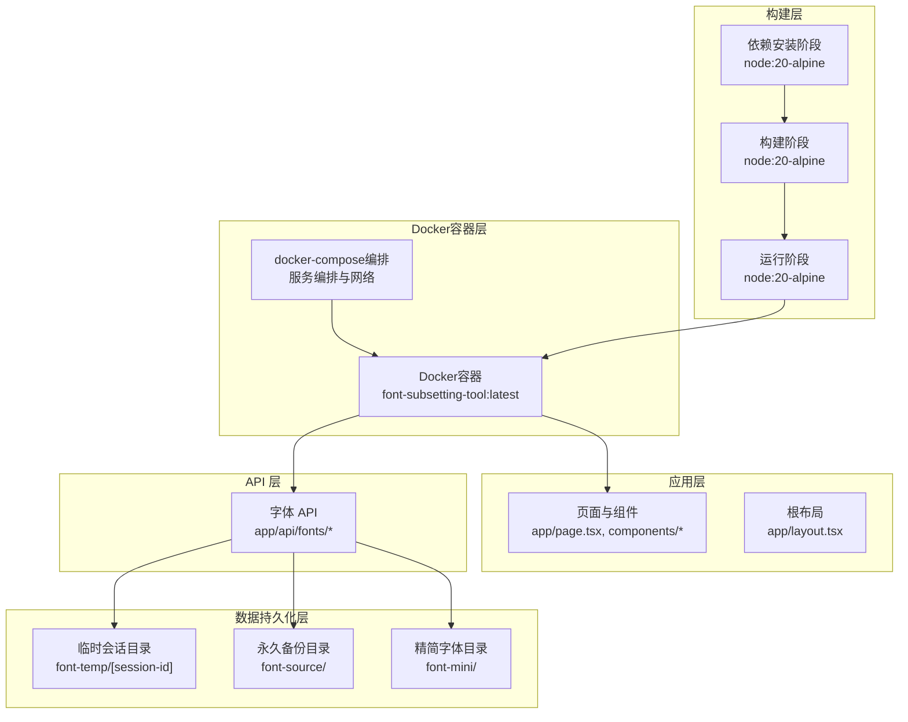
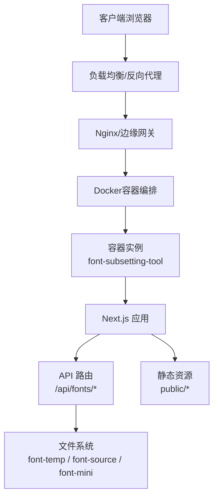
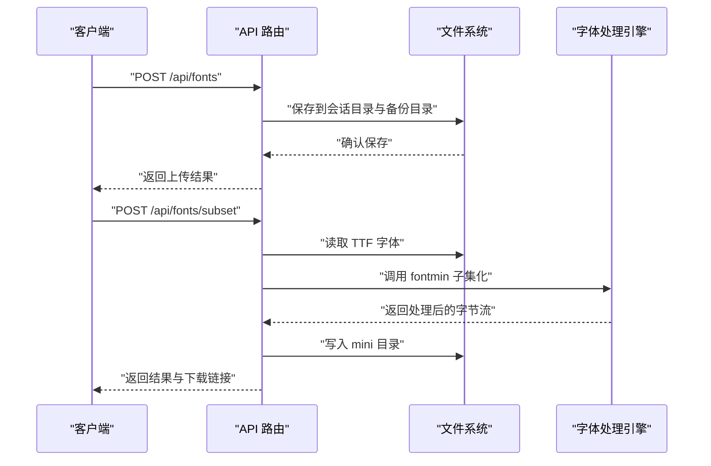
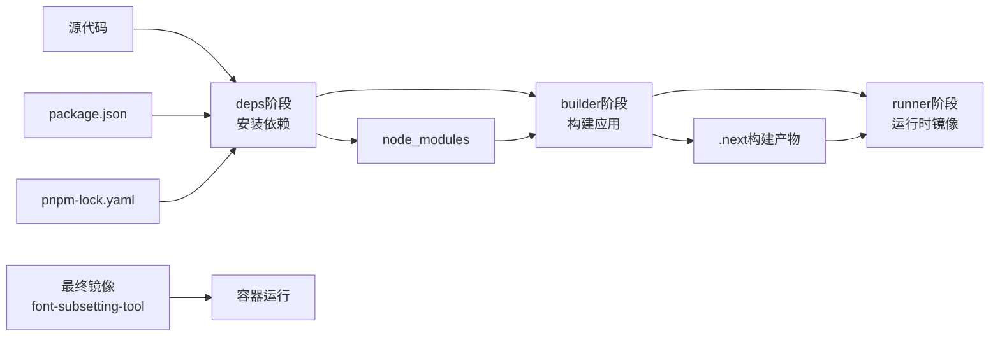
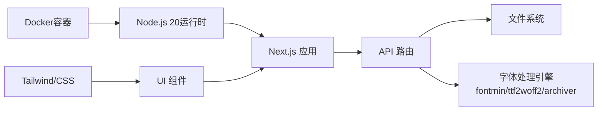

# 部署配置

<cite>
**本文引用的文件**
- [package.json](file://package.json)
- [next.config.mjs](file://next.config.mjs)
- [Dockerfile](file://Dockerfile)
- [docker-compose.yml](file://docker-compose.yml)
- [DOCKER_DEPLOY.md](file://DOCKER_DEPLOY.md)
- [.dockerignore](file://.dockerignore)
- [.dockerbuildconfig](file://.dockerbuildconfig)
- [docker-build.sh](file://docker-build.sh)
- [docker-deploy.sh](file://docker-deploy.sh)
- [docker-build.bat](file://docker-build.bat)
- [docker-deploy.bat](file://docker-deploy.bat)
- [docker-build.ps1](file://docker-build.ps1)
- [docker-deploy.ps1](file://docker-deploy.ps1)
- [deploy.sh](file://deploy.sh)
- [README.md](file://README.md)
- [app/layout.tsx](file://app/layout.tsx)
- [app/api/fonts/route.ts](file://app/api/fonts/route.ts)
- [app/api/fonts/subset/route.ts](file://app/api/fonts/subset/route.ts)
- [tsconfig.json](file://tsconfig.json)
- [postcss.config.mjs](file://postcss.config.mjs)
</cite>

## 更新摘要
**所做更改**
- 新增完整的Docker容器化部署基础设施章节
- 更新部署方式：从PM2部署迁移到Docker容器化部署
- 新增多阶段Dockerfile、docker-compose配置和跨平台部署脚本
- 移除PM2进程管理相关内容
- 更新架构图以反映Docker容器化架构
- 新增Docker部署最佳实践和故障排除指南

## 目录
1. [简介](#简介)
2. [项目结构](#项目结构)
3. [核心组件](#核心组件)
4. [架构总览](#架构总览)
5. [详细组件分析](#详细组件分析)
6. [Docker容器化部署](#docker容器化部署)
7. [依赖关系分析](#依赖关系分析)
8. [性能考虑](#性能考虑)
9. [故障排查指南](#故障排查指南)
10. [结论](#结论)
11. [附录](#附录)

## 简介
本文件面向生产环境部署 FontMin 字体子集化工具，覆盖Docker容器化部署、多阶段构建、docker-compose编排、跨平台部署脚本、环境准备、依赖安装、构建配置、启动服务、容器编排与云平台部署、Next.js 生产配置、环境变量与域名绑定、SSL 证书、CI/CD 流水线与自动化脚本、缓存与 CDN、负载均衡等主题，并提供不同规模部署的配置模板与最佳实践。

**更新** 本版本完全重构了部署方式，从传统的PM2进程管理迁移到现代化的Docker容器化部署，提供更稳定、可移植的生产环境解决方案。

## 项目结构
该项目基于 Next.js App Router，采用 App 目录组织页面与 API 路由，核心功能通过 API 路由实现字体上传、预览、子集化与下载。项目还包含前端组件、全局样式与类型定义。Docker部署架构通过多阶段构建优化镜像体积，支持跨平台部署。

**图表来源**
- [Dockerfile](file://Dockerfile#L1-L60)
- [docker-compose.yml](file://docker-compose.yml#L1-L34)
- [app/layout.tsx](file://app/layout.tsx#L1-L44)
- [app/api/fonts/route.ts](file://app/api/fonts/route.ts#L1-L167)
- [app/api/fonts/subset/route.ts](file://app/api/fonts/subset/route.ts#L1-L366)

**章节来源**
- [README.md](file://README.md#L135-L160)

## 核心组件
- **容器化运行时**：基于Alpine Linux的轻量级Node.js运行环境，多阶段构建优化镜像体积。
- **服务端渲染与构建**：Next.js 16，Webpack 模式（启用 WASM 支持），禁用图片优化以适配静态托管。
- **字体处理**：基于 fontmin、ttf2woff2、archiver 的服务端字体子集化与打包。
- **会话与存储**：基于请求头 x-font-session-id 的会话隔离，临时目录与永久备份目录分离。
- **容器编排**：使用docker-compose进行服务编排，支持健康检查、日志管理和资源限制。
- **跨平台支持**：提供Windows PowerShell、CMD和Linux/macOS Bash三种部署脚本。

**更新** 核心组件已完全重构为Docker容器化架构，移除了PM2进程管理，采用原生Docker容器运行模式。

**章节来源**
- [Dockerfile](file://Dockerfile#L1-L60)
- [docker-compose.yml](file://docker-compose.yml#L1-L34)
- [package.json](file://package.json#L1-L78)
- [next.config.mjs](file://next.config.mjs#L1-L44)
- [app/api/fonts/route.ts](file://app/api/fonts/route.ts#L1-L167)
- [app/api/fonts/subset/route.ts](file://app/api/fonts/subset/route.ts#L1-L366)

## 架构总览
下图展示Docker容器化生产部署的关键交互：客户端请求经由反向代理/负载均衡到达Docker容器中的Next.js服务，API路由处理字体上传、子集化与下载，容器内的临时与备份目录分别存放会话数据与永久备份。

**图表来源**
- [Dockerfile](file://Dockerfile#L32-L60)
- [docker-compose.yml](file://docker-compose.yml#L4-L34)
- [app/api/fonts/route.ts](file://app/api/fonts/route.ts#L1-L167)
- [app/api/fonts/subset/route.ts](file://app/api/fonts/subset/route.ts#L1-L366)

## 详细组件分析

### 服务器环境准备与依赖安装
- **系统要求**：Docker 20.10+，Docker Compose 2.0+。
- **依赖安装**：Docker镜像构建过程中自动安装pnpm和项目依赖。
- **构建命令**：使用Next.js构建脚本生成生产包，多阶段构建优化。
- **启动命令**：容器内直接启动Next.js应用，监听6739端口。

**更新** 环境准备简化为Docker和Docker Compose的安装，移除了手动Node.js和pnpm安装步骤。

**章节来源**
- [DOCKER_DEPLOY.md](file://DOCKER_DEPLOY.md#L5-L8)
- [Dockerfile](file://Dockerfile#L1-L60)
- [package.json](file://package.json#L5-L10)

### Docker容器化部署方案
- **多阶段构建**：deps阶段安装依赖，builder阶段构建应用，runner阶段创建最小化运行时镜像。
- **基础镜像**：使用官方Node.js 20 Alpine Linux镜像，减小镜像体积并提高安全性。
- **工作目录**：设置/app为工作目录，复制依赖与源码进行构建。
- **构建优化**：使用BuildKit加速构建，设置并行构建层数。
- **运行时配置**：非root用户运行，创建必要的字体目录并设置权限。
- **端口暴露**：暴露6739端口，支持自定义端口映射。
- **健康检查**：内置健康检查机制，支持容器编排平台的自动恢复。

**更新** 新增完整的Docker容器化部署方案，替代了原有的PM2部署方式。

**章节来源**
- [Dockerfile](file://Dockerfile#L1-L60)
- [.dockerbuildconfig](file://.dockerbuildconfig#L1-L12)
- [docker-compose.yml](file://docker-compose.yml#L1-L34)

### docker-compose编排配置
- **服务定义**：单容器服务配置，包含端口映射、卷挂载和环境变量。
- **数据持久化**：自动挂载font-source、font-mini、font-temp目录到宿主机。
- **日志管理**：配置JSON文件驱动的日志轮转，限制单个日志文件大小和数量。
- **健康检查**：HTTP健康检查，支持容器编排平台的自动恢复机制。
- **网络配置**：创建独立的Docker网络，便于服务发现和通信。

**更新** 新增docker-compose编排配置，提供生产级的服务编排能力。

**章节来源**
- [docker-compose.yml](file://docker-compose.yml#L1-L34)

### 跨平台部署脚本
- **Bash脚本**：Linux/macOS环境下的完整部署脚本，支持构建、启动、停止、重启、查看日志和清理。
- **PowerShell脚本**：Windows环境下的现代化脚本，提供彩色输出和错误处理。
- **批处理脚本**：Windows CMD环境下的传统脚本，兼容性更好。
- **一键部署**：提供快速部署选项，支持一键构建和启动。
- **手动部署**：提供详细的分步部署指南，适合学习和调试。

**更新** 新增完整的跨平台部署脚本套件，支持Windows、Linux和macOS三种操作系统。

**章节来源**
- [docker-build.sh](file://docker-build.sh#L1-L65)
- [docker-deploy.sh](file://docker-deploy.sh#L1-L80)
- [docker-build.bat](file://docker-build.bat#L1-L64)
- [docker-deploy.bat](file://docker-deploy.bat#L1-L120)
- [docker-build.ps1](file://docker-build.ps1#L1-L67)
- [docker-deploy.ps1](file://docker-deploy.ps1#L1-L107)

### Next.js 生产配置
- **静态导出**：配置为standalone模式，支持独立运行。
- **禁用图片优化**：出于静态托管与 CDN 场景考虑，关闭图片优化。
- **Webpack 配置**：启用 WASM 支持与 layers，处理 .wasm 文件，服务端外部化 fontmin、ttf2woff2、archiver。
- **TypeScript**：忽略构建错误以避免 CI 失败。
- **容器优化**：配置适合容器环境的运行参数。

**更新** Next.js配置已适配容器化部署，支持standalone模式和容器环境。

**章节来源**
- [next.config.mjs](file://next.config.mjs#L1-L45)
- [tsconfig.json](file://tsconfig.json#L1-L42)

### API 路由与数据流
- **上传与备份**：接收表单数据，保存到用户会话目录与永久备份目录。
- **子集化处理**：读取用户上传的 TTF 字体，调用 fontmin 提取字形，按需转换为目标格式，写入 mini 目录。
- **下载与打包**：支持单文件下载与多文件打包下载。
- **错误处理**：对缺失参数、格式不支持、处理失败等情况返回明确错误信息。

**图表来源**
- [app/api/fonts/route.ts](file://app/api/fonts/route.ts#L71-L127)
- [app/api/fonts/subset/route.ts](file://app/api/fonts/subset/route.ts#L164-L365)

**章节来源**
- [app/api/fonts/route.ts](file://app/api/fonts/route.ts#L1-L167)
- [app/api/fonts/subset/route.ts](file://app/api/fonts/subset/route.ts#L1-L366)

### 缓存策略、CDN 与负载均衡
- **缓存策略**：静态资源通过 CDN 缓存；API 返回的下载链接可利用 CDN 加速。
- **CDN**：将 public/* 与生成的 mini 字体文件托管至 CDN，配置缓存头与回源规则。
- **负载均衡**：使用 Nginx/HAProxy/LBaaS 分发请求，配置健康检查与会话保持（如需）。
- **容器扩展**：支持docker-compose scale进行水平扩展。

**更新** 新增容器化环境下的负载均衡和扩展策略。

**章节来源**
- [next.config.mjs](file://next.config.mjs#L11-L13)
- [docker-compose.yml](file://docker-compose.yml#L23-L27)

### 环境变量、域名绑定与 SSL
- **环境变量**：通过docker-compose配置NODE_ENV、PORT、HOSTNAME等环境变量。
- **域名绑定**：在反向代理或云平台配置域名解析与路由转发。
- **SSL 证书**：在边缘网关或平台证书管理服务签发与续期证书。
- **容器网络**：使用Docker网络进行服务间通信。

**更新** 环境变量配置已适配Docker容器环境。

**章节来源**
- [docker-compose.yml](file://docker-compose.yml#L14-L17)
- [app/api/fonts/route.ts](file://app/api/fonts/route.ts#L16-L20)
- [app/layout.tsx](file://app/layout.tsx#L10-L31)

### CI/CD 流水线与自动化部署
- **构建阶段**：拉取代码、安装依赖、执行构建、构建Docker镜像。
- **部署阶段**：推送镜像到镜像仓库、拉取镜像、启动容器服务。
- **自动化**：结合CI/CD平台触发镜像构建与部署，支持多环境配置。
- **版本管理**：支持镜像标签管理和版本回滚。

**更新** CI/CD流程已完全适配Docker容器化部署。

**章节来源**
- [Dockerfile](file://Dockerfile#L1-L60)
- [docker-compose.yml](file://docker-compose.yml#L1-L34)

## Docker容器化部署

### 多阶段Dockerfile架构
Dockerfile采用三阶段构建模式，确保最终镜像的最小化和安全性：

1. **deps阶段**：安装系统依赖和pnpm，复制package.json和lockfile，安装项目依赖
2. **builder阶段**：复制依赖，设置环境变量，执行Next.js构建
3. **runner阶段**：创建非root用户，复制构建产物，设置权限和环境变量

**图表来源**
- [Dockerfile](file://Dockerfile#L1-L60)

### docker-compose编排配置详解
docker-compose.yml提供完整的服务编排配置：

- **端口映射**：默认6739端口映射到容器内部端口
- **卷挂载**：自动挂载三个字体相关目录到宿主机
- **环境变量**：配置NODE_ENV、PORT、HOSTNAME等关键参数
- **健康检查**：HTTP健康检查确保服务可用性
- **日志配置**：JSON文件驱动的日志轮转机制

### 跨平台部署脚本套件
提供三种操作系统下的完整部署解决方案：

#### Bash脚本（Linux/macOS）
- 功能完整：支持构建、启动、停止、重启、查看日志、清理
- 彩色输出：提供友好的用户界面
- 自动化：支持一键部署和批量操作

#### PowerShell脚本（Windows）
- 现代化界面：支持彩色输出和错误处理
- 兼容性好：支持多种Windows版本
- 交互式菜单：提供直观的操作界面

#### 批处理脚本（Windows）
- 兼容性强：支持所有Windows系统
- 简单可靠：无依赖关系，稳定性高

### Docker构建优化配置
.dockerbuildconfig文件提供构建时的优化选项：

- **BuildKit加速**：启用Docker BuildKit提升构建速度
- **构建缓存**：配置构建缓存策略
- **并行构建**：设置并行构建层数优化性能

### 数据持久化策略
Docker部署自动处理数据持久化：

- **font-source**：永久备份目录，保存所有上传的原始字体
- **font-mini**：精简字体目录，保存处理后的字体文件
- **font-temp**：临时会话目录，保存用户会话期间的临时文件

### 健康检查与监控
容器内置健康检查机制：

- **HTTP健康检查**：定期检查应用响应状态
- **日志监控**：配置日志轮转，便于问题排查
- **资源限制**：可配置内存限制防止资源滥用

**章节来源**
- [Dockerfile](file://Dockerfile#L1-L60)
- [docker-compose.yml](file://docker-compose.yml#L1-L34)
- [.dockerbuildconfig](file://.dockerbuildconfig#L1-L12)
- [.dockerignore](file://.dockerignore#L1-L59)
- [docker-build.sh](file://docker-build.sh#L1-L65)
- [docker-deploy.sh](file://docker-deploy.sh#L1-L80)
- [docker-build.bat](file://docker-build.bat#L1-L64)
- [docker-deploy.bat](file://docker-deploy.bat#L1-L120)
- [docker-build.ps1](file://docker-build.ps1#L1-L67)
- [docker-deploy.ps1](file://docker-deploy.ps1#L1-L107)

## 依赖关系分析
- **外部依赖**：Next.js、React、Radix UI、Tailwind CSS、fontmin、ttf2woff2、archiver、SWR 等。
- **容器依赖**：Alpine Linux基础镜像、Node.js 20运行时、pnpm包管理器。
- **Docker依赖**：Docker引擎、Docker Compose、BuildKit构建工具。
- **Webpack 外部化**：服务端外部化 fontmin、ttf2woff2、archiver，避免打包进服务端产物。
- **TypeScript 与 PostCSS**：TS 编译配置与 Tailwind PostCSS 插件。

**图表来源**
- [Dockerfile](file://Dockerfile#L32-L60)
- [package.json](file://package.json#L11-L65)
- [next.config.mjs](file://next.config.mjs#L28-L36)
- [postcss.config.mjs](file://postcss.config.mjs#L1-L9)

**章节来源**
- [Dockerfile](file://Dockerfile#L1-L60)
- [package.json](file://package.json#L11-L65)
- [next.config.mjs](file://next.config.mjs#L14-L40)
- [postcss.config.mjs](file://postcss.config.mjs#L1-L9)

## 性能考虑
- **镜像优化**：多阶段构建减小最终镜像体积，使用Alpine Linux基础镜像。
- **运行时优化**：非root用户运行，减少安全风险和权限问题。
- **构建优化**：启用BuildKit加速构建，配置并行构建层数。
- **容器资源**：支持内存限制，防止资源滥用。
- **字体处理**：合理控制并发与内存，避免大字体文件导致 OOM；必要时拆分任务队列。
- **静态资源**：CDN 缓存与压缩，减少带宽与延迟。
- **会话清理**：定期清理 font-temp 中过期会话目录，避免磁盘膨胀。

**更新** 性能优化已全面适配Docker容器化部署，包括镜像优化、运行时优化和容器资源管理。

**章节来源**
- [Dockerfile](file://Dockerfile#L11-L12)
- [docker-compose.yml](file://docker-compose.yml#L148-L154)
- [DOCKER_DEPLOY.md](file://DOCKER_DEPLOY.md#L115-L118)
- [next.config.mjs](file://next.config.mjs#L14-L26)

## 故障排查指南
- **容器启动失败**：检查Docker守护进程状态，验证镜像构建是否成功，查看容器日志。
- **端口冲突**：修改docker-compose.yml中的端口映射，确保端口未被其他服务占用。
- **权限问题**：确认宿主机目录权限，确保Docker用户具有读写权限。
- **内存不足**：配置容器内存限制，检查系统可用内存，优化字体处理任务。
- **健康检查失败**：检查应用日志，验证API路由是否正常响应。
- **数据丢失**：确认卷挂载配置，检查宿主机目录权限和磁盘空间。
- **网络连接问题**：检查Docker网络配置，验证容器间通信。

**更新** 故障排查指南已完全适配Docker容器化部署，涵盖容器特有的问题和解决方案。

**章节来源**
- [DOCKER_DEPLOY.md](file://DOCKER_DEPLOY.md#L120-L154)
- [docker-compose.yml](file://docker-compose.yml#L23-L27)
- [docker-deploy.sh](file://docker-deploy.sh#L15-L25)

## 结论
本部署配置文档围绕Docker容器化部署展开，完全替代了原有的PM2部署方式。新架构提供了更稳定、可移植、易维护的生产环境解决方案。通过多阶段Dockerfile、docker-compose编排、跨平台部署脚本和完整的监控告警机制，实现了从开发到生产的无缝衔接。建议根据业务规模选择合适的部署形态，并持续优化容器资源配置和监控体系。

**更新** 本版本完全重构为Docker容器化部署，提供现代化、标准化的生产环境解决方案。

## 附录

### Docker部署清单（生产）
- **服务器**：Ubuntu/CentOS，Docker 20.10+，Docker Compose 2.0+
- **镜像构建**：docker build或使用提供的部署脚本
- **服务启动**：docker-compose up -d 或使用部署脚本
- **数据持久化**：自动挂载font-source、font-mini、font-temp目录
- **反向代理**：Nginx/边缘网关，配置域名与 SSL
- **监控**：容器日志、系统监控、应用指标

**更新** 部署清单已完全适配Docker容器化部署。

**章节来源**
- [DOCKER_DEPLOY.md](file://DOCKER_DEPLOY.md#L5-L8)
- [docker-compose.yml](file://docker-compose.yml#L1-L34)
- [docker-deploy.sh](file://docker-deploy.sh#L1-L80)

### Docker部署最佳实践
- **镜像优化**：使用多阶段构建，最小化最终镜像体积
- **安全配置**：非root用户运行，限制容器权限
- **资源管理**：配置内存和CPU限制，防止资源滥用
- **日志管理**：配置日志轮转，便于问题排查
- **健康检查**：启用健康检查，支持自动恢复
- **数据备份**：定期备份字体数据，确保数据安全
- **监控告警**：配置容器监控和告警机制

**更新** 新增Docker部署最佳实践指南。

**章节来源**
- [Dockerfile](file://Dockerfile#L39-L52)
- [docker-compose.yml](file://docker-compose.yml#L18-L27)
- [DOCKER_DEPLOY.md](file://DOCKER_DEPLOY.md#L156-L200)