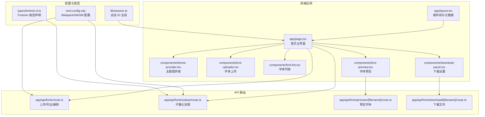
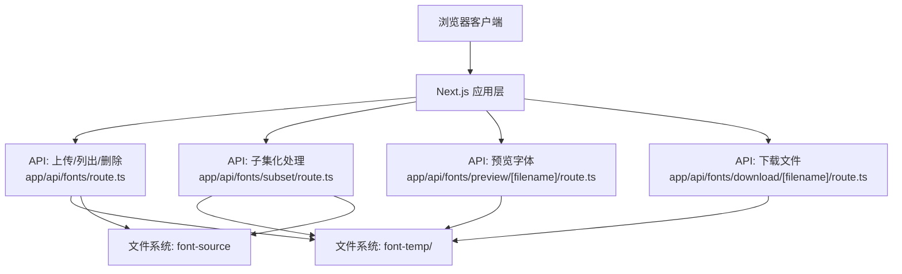
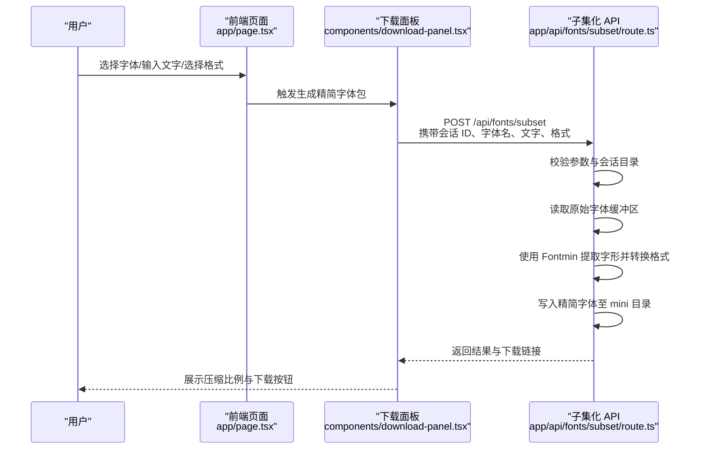
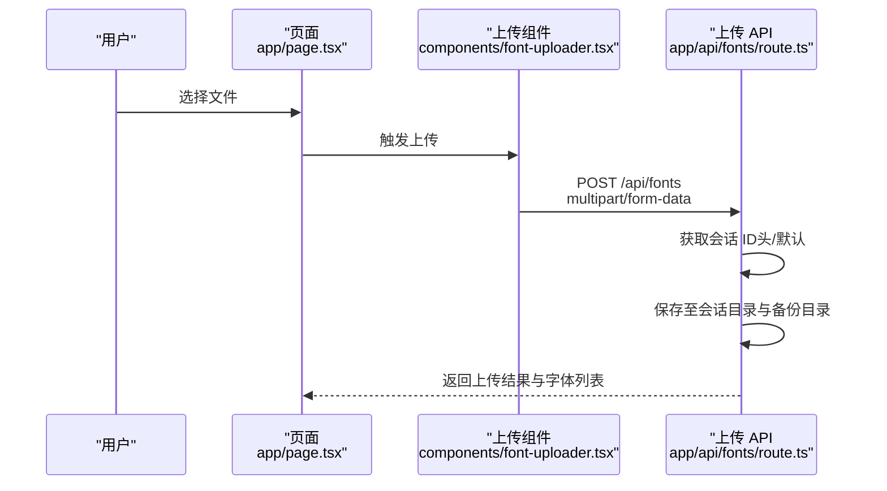
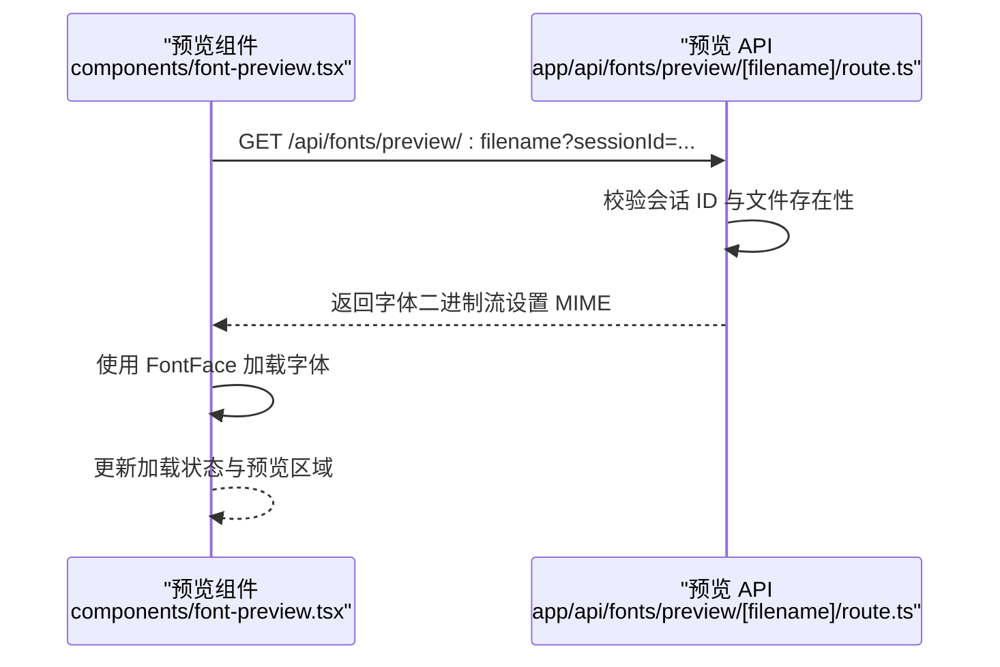
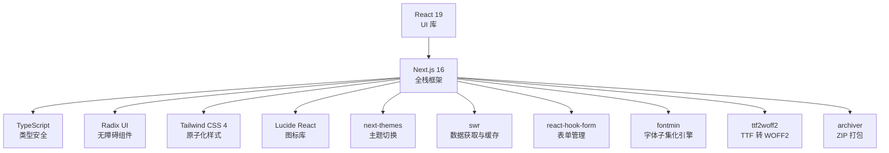

# 项目概述

<cite>
**本文档引用的文件**
- [README.md](file://README.md)
- [package.json](file://package.json)
- [next.config.mjs](file://next.config.mjs)
- [app/layout.tsx](file://app/layout.tsx)
- [app/page.tsx](file://app/page.tsx)
- [types/fontmin.d.ts](file://types/fontmin.d.ts)
- [lib/session.ts](file://lib/session.ts)
- [components/theme-provider.tsx](file://components/theme-provider.tsx)
- [components/font-uploader.tsx](file://components/font-uploader.tsx)
- [components/font-list.tsx](file://components/font-list.tsx)
- [components/font-preview.tsx](file://components/font-preview.tsx)
- [components/download-panel.tsx](file://components/download-panel.tsx)
- [app/api/fonts/route.ts](file://app/api/fonts/route.ts)
- [app/api/fonts/subset/route.ts](file://app/api/fonts/subset/route.ts)
- [app/api/fonts/download/[filename]/route.ts](file://app/api/fonts/download/[filename]/route.ts)
- [app/api/fonts/preview/[filename]/route.ts](file://app/api/fonts/preview/[filename]/route.ts)
</cite>

## 目录
1. [引言](#引言)
2. [项目结构](#项目结构)
3. [核心组件](#核心组件)
4. [架构总览](#架构总览)
5. [详细组件分析](#详细组件分析)
6. [依赖关系分析](#依赖关系分析)
7. [性能考量](#性能考量)
8. [故障排除指南](#故障排除指南)
9. [结论](#结论)

## 引言
FontMin 是一款现代化的字体子集化工具，旨在帮助用户从完整字体中提取所需字符，生成体积更小的精简字体包。项目通过直观的拖拽上传、实时预览与多格式导出，显著降低网页字体体积，提升加载性能，并在隐私保护、批量处理与压缩统计等方面提供完善的用户体验。

- 核心价值与目标
  - 简化字体子集化流程：用户只需上传字体、输入目标文字、选择输出格式，即可一键生成精简字体包。
  - 提升性能与兼容性：支持多种字体格式输出，推荐 WOFF2 以获得最佳压缩率；基于 Next.js 16 构建，提供流畅的前端体验。
  - 隐私与隔离：采用基于会话的隔离机制，确保不同用户数据完全隔离，临时会话目录按 24 小时策略清理，保障用户隐私。
  - 批量处理与统计：支持批量处理多个字体，直观展示压缩前后文件大小对比，便于评估收益。

- 字体子集化技术简介
  - 字体子集化是根据指定字符集对字体文件进行裁剪，仅保留必要的字形与元数据，从而大幅减小文件体积。该技术广泛应用于网页字体优化、移动端应用与电子书制作等领域，能有效减少带宽占用并提升渲染效率。

- 应用场景
  - 网页字体优化：针对特定语言或内容提取字符，避免加载整套字体。
  - 移动应用：为 App 提供精简字体资源，降低安装包体积。
  - 电子书与设计项目：导出仅包含项目所需文字的字体文件，便于分发与管理。

**章节来源**
- file://README.md#L1-L265

## 项目结构
项目采用 Next.js App Router 的组织方式，前端组件与 API 路由清晰分离，配合类型声明与配置文件，形成模块化、可维护的架构。

**图表来源**
- [app/layout.tsx](file://app/layout.tsx#L1-L44)
- [app/page.tsx](file://app/page.tsx#L1-L279)
- [components/theme-provider.tsx](file://components/theme-provider.tsx#L1-L12)
- [components/font-uploader.tsx](file://components/font-uploader.tsx#L1-L166)
- [components/font-list.tsx](file://components/font-list.tsx#L1-L159)
- [components/font-preview.tsx](file://components/font-preview.tsx#L1-L123)
- [components/download-panel.tsx](file://components/download-panel.tsx#L1-L295)
- [app/api/fonts/route.ts](file://app/api/fonts/route.ts#L1-L167)
- [app/api/fonts/subset/route.ts](file://app/api/fonts/subset/route.ts#L1-L366)
- [app/api/fonts/preview/[filename]/route.ts](file://app/api/fonts/preview/[filename]/route.ts#L1-L61)
- [app/api/fonts/download/[filename]/route.ts](file://app/api/fonts/download/[filename]/route.ts#L1-L62)
- [next.config.mjs](file://next.config.mjs#L1-L44)
- [lib/session.ts](file://lib/session.ts#L1-L34)
- [types/fontmin.d.ts](file://types/fontmin.d.ts#L1-L53)

**章节来源**
- file://README.md#L135-L160
- file://package.json#L1-L78

## 核心组件
- 会话与隐私
  - 会话隔离：通过会话 ID 对用户数据进行隔离，临时目录按 24 小时策略清理，确保不同用户与浏览器标签页的数据互不干扰。
  - 双重存储：上传的字体同时保存至临时会话目录与永久备份目录，删除操作仅影响会话目录，备份得以保留。
  - 客户端会话生成：在浏览器端生成随机会话 ID，保证刷新页面后会话数据可按策略保留或清空。

- 字体上传与管理
  - 支持多种字体格式的上传，前端进行格式过滤与拖拽交互，后端统一保存至会话目录与备份目录。
  - 字体列表支持全选、逐项删除与状态反馈，删除操作不影响备份目录。

- 实时预览
  - 基于 FontFace 动态加载字体，支持实时调整预览文字与字号，直观展示子集化效果。

- 子集化与导出
  - 支持 TTF、WOFF、WOFF2、EOT、SVG 多格式输出；推荐 WOFF2 以获得最佳压缩率。
  - 提供单文件下载与打包下载功能，直观展示压缩比例与文件大小对比。

**章节来源**
- file://lib/session.ts#L1-L34
- file://app/api/fonts/route.ts#L1-L167
- file://components/font-uploader.tsx#L1-L166
- file://components/font-list.tsx#L1-L159
- file://components/font-preview.tsx#L1-L123
- file://components/download-panel.tsx#L1-L295
- file://README.md#L191-L242

## 架构总览
系统采用前后端分离的 API 路由设计，前端负责交互与状态管理，后端负责文件存储、子集化处理与格式转换。会话机制贯穿始终，确保数据隔离与隐私保护。

**图表来源**
- [app/page.tsx](file://app/page.tsx#L1-L279)
- [app/api/fonts/route.ts](file://app/api/fonts/route.ts#L1-L167)
- [app/api/fonts/subset/route.ts](file://app/api/fonts/subset/route.ts#L1-L366)
- [app/api/fonts/preview/[filename]/route.ts](file://app/api/fonts/preview/[filename]/route.ts#L1-L61)
- [app/api/fonts/download/[filename]/route.ts](file://app/api/fonts/download/[filename]/route.ts#L1-L62)

## 详细组件分析

### 字体子集化处理流程
该流程展示了从前端发起请求到后端完成子集化与导出的关键步骤。

**图表来源**
- [app/page.tsx](file://app/page.tsx#L113-L145)
- [components/download-panel.tsx](file://components/download-panel.tsx#L68-L89)
- [app/api/fonts/subset/route.ts](file://app/api/fonts/subset/route.ts#L164-L366)

**章节来源**
- file://app/api/fonts/subset/route.ts#L1-L366
- file://types/fontmin.d.ts#L1-L53

### 字体上传与会话管理
该流程展示了上传过程中的会话生成、文件保存与备份策略。

**图表来源**
- [app/page.tsx](file://app/page.tsx#L33-L65)
- [components/font-uploader.tsx](file://components/font-uploader.tsx#L65-L70)
- [app/api/fonts/route.ts](file://app/api/fonts/route.ts#L71-L127)

**章节来源**
- file://app/api/fonts/route.ts#L1-L167
- file://lib/session.ts#L1-L34

### 字体预览与实时加载
该流程展示了预览字体的动态加载与状态反馈。

**图表来源**
- [components/font-preview.tsx](file://components/font-preview.tsx#L34-L48)
- [app/api/fonts/preview/[filename]/route.ts](file://app/api/fonts/preview/[filename]/route.ts#L7-L61)

**章节来源**
- file://components/font-preview.tsx#L1-L123
- file://app/api/fonts/preview/[filename]/route.ts#L1-L61

### 字体子集化算法要点
- 输入约束：Fontmin 仅支持 TTF 格式作为输入进行字形提取，非 TTF 文件会被跳过并提示。
- 字符去重：对输入文字进行去重处理，仅保留唯一字符集合，提高子集化效率。
- 格式转换：除 WOFF2 外，其他格式直接由 Fontmin 输出；WOFF2 通过 TTF 转换为 WOFF2 再输出。
- 错误处理：对缺失会话、无效字体、转换失败等情况进行分类错误响应，便于前端提示。

**章节来源**
- file://app/api/fonts/subset/route.ts#L25-L162
- file://app/api/fonts/subset/route.ts#L215-L295

## 依赖关系分析
项目技术栈围绕 Next.js 16、React 19 与 TypeScript 构建，结合 Radix UI、Tailwind CSS 与 Lucide React 等生态组件，形成现代、可维护的前端体系；后端通过 Fontmin、ttf2woff2、archiver 等库实现字体处理与格式转换。

**图表来源**
- [package.json](file://package.json#L11-L66)
- [next.config.mjs](file://next.config.mjs#L14-L39)

**章节来源**
- file://package.json#L1-L78
- file://next.config.mjs#L1-L44

## 性能考量
- 前端性能
  - 使用 Next.js 16 与 React 19，结合 SWR 进行数据缓存与并发控制，减少重复请求。
  - Tailwind CSS 4 与原子化类名提升样式构建效率，避免运行时样式计算开销。
  - 主题切换采用 next-themes，支持深色/浅色自动切换，兼顾可用性与性能。

- 字体处理性能
  - 字体子集化采用 Fontmin 与 ttf2woff2，针对 WOFF2 采用 TTF 中转转换，平衡兼容性与压缩率。
  - 支持批量处理与打包下载，减少多次网络往返，提升用户体验。

- 隐私与数据生命周期
  - 会话隔离与临时目录清理策略，避免长期数据积累带来的存储压力。
  - 双重存储机制确保备份数据可恢复，同时删除操作不影响备份。

**章节来源**
- file://README.md#L24-L34
- file://README.md#L191-L242
- file://next.config.mjs#L14-L39

## 故障排除指南
- 上传失败
  - 检查会话 ID 是否正确传递（请求头 x-font-session-id）。
  - 确认上传文件格式符合要求（TTF/OTF/WOFF/WOFF2/EOT/SVG）。
  - 查看后端日志定位具体错误原因。

- 子集化失败
  - 确认输入文字非空且包含有效字符。
  - 检查字体是否为 TTF 格式（Fontmin 仅支持 TTF 输入）。
  - 若出现转换错误，查看后端错误响应中的详细信息。

- 预览与下载异常
  - 确认会话 ID 与文件路径匹配，检查文件是否存在。
  - 对于预览接口，注意缓存控制与跨域设置。

- 会话与数据清理
  - 如遇数据残留，可手动清理 font-temp 目录下超期会话。
  - 定期备份 font-source 目录，确保数据安全。

**章节来源**
- file://app/api/fonts/route.ts#L71-L127
- file://app/api/fonts/subset/route.ts#L164-L366
- file://app/api/fonts/preview/[filename]/route.ts#L7-L61
- file://app/api/fonts/download/[filename]/route.ts#L7-L62
- file://README.md#L222-L242

## 结论
FontMin 通过现代化技术栈与严谨的隐私保护机制，为用户提供高效、便捷的字体子集化服务。其清晰的架构设计、完善的错误处理与性能优化策略，使其在实际应用中具备良好的可扩展性与稳定性。未来可在更多字体格式支持、批量处理优化与可视化统计方面持续迭代，进一步提升用户体验与处理效率。